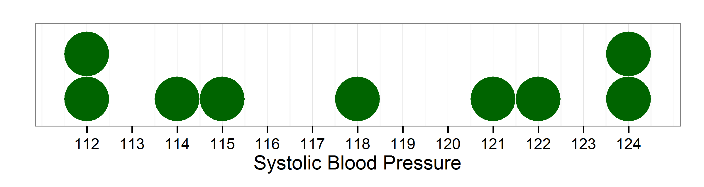
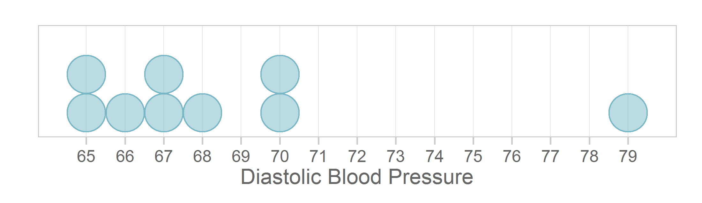
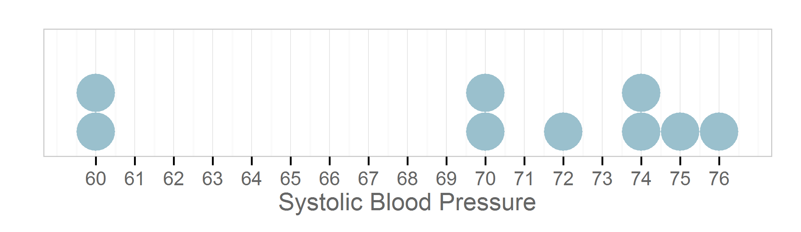

Chapter 02 Graphs
=================================================
This report creates the chapter graphs.

<!--  Set the working directory to the repository's base directory; this assumes the report is nested inside of only one directory.-->


<!-- Set the report-wide options, and point to the external code file. -->


<!-- Load the packages.  Suppress the output when loading packages. --> 


<!-- Load any Global functions and variables declared in the R file.  Suppress the output. --> 


<!-- Declare any global functions specific to a Rmd output.  Suppress the output. --> 


<!-- Load the datasets.   -->


<!-- Tweak the datasets.   -->


## Figure 2-1



## Figure 2-2



## Figure 2-3



## Session Info
For the sake of documentation and reproducibility, the current report was build on a system using the following software.


```
Report created by Will at 2014-04-10, 17:12 Central Daylight Time
```

```
R version 3.0.3 Patched (2014-03-06 r65320)
Platform: x86_64-w64-mingw32/x64 (64-bit)

locale:
[1] LC_COLLATE=English_United States.1252  LC_CTYPE=English_United States.1252    LC_MONETARY=English_United States.1252
[4] LC_NUMERIC=C                           LC_TIME=English_United States.1252    

attached base packages:
[1] grid      stats     graphics  grDevices utils     datasets  methods   base     

other attached packages:
[1] RColorBrewer_1.0-5 dichromat_2.0-0    extrafont_0.16     wesanderson_0.3.2  ggplot2_0.9.3.1    knitr_1.5         

loaded via a namespace (and not attached):
 [1] colorspace_1.2-4 digest_0.6.4     evaluate_0.5.3   extrafontdb_1.0  formatR_0.10     gtable_0.1.2    
 [7] labeling_0.2     MASS_7.3-31      munsell_0.4.2    plyr_1.8.1       proto_0.3-10     Rcpp_0.11.1     
[13] reshape2_1.2.2   Rttf2pt1_1.3     scales_0.2.3     stringr_0.6.2    tools_3.0.3     
```


## License

<a rel="license" href="http://creativecommons.org/licenses/by/3.0/"></a><br />This work is licensed under a <a rel="license" href="http://creativecommons.org/licenses/by/3.0/">Creative Commons Attribution 3.0 Unported License</a>.
