Chapter 03 Graphs
=================================================
This report creates the chapter graphs.

<!--  Set the working directory to the repository's base directory; this assumes the report is nested inside of only one directory.-->

```r
opts_knit$set(root.dir = "../")  #Don't combine this call with any other chunk -especially one that uses file paths.
```


<!-- Set the report-wide options, and point to the external code file. -->

```r
require(knitr)
opts_chunk$set(
  results='show', 
  message = TRUE,
  comment = NA, 
  tidy = FALSE,
  fig.height = 4, 
  fig.width = 5.5, 
  out.width = "550px",
  fig.path = 'figure_rmd/',     
  dev = "png",
#   fig.path = 'figure_pdf/',     
#   dev = "pdf",
  dpi = 400
)
echoChunks <- FALSE
options(width=120) #So the output is 50% wider than the default.
read_chunk("./Chapter03/Chapter03.R") 
```

<!-- Load the packages.  Suppress the output when loading packages. --> 


<!-- Load any Global functions and variables declared in the R file.  Suppress the output. --> 


<!-- Declare any global functions specific to a Rmd output.  Suppress the output. --> 


<!-- Load the datasets.   -->


<!-- Tweak the datasets.   -->


## Figure 3-1
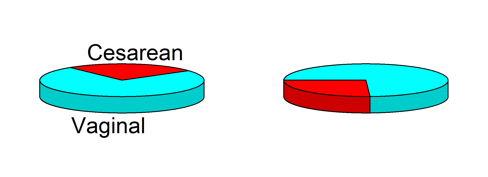


## Figure 3-2
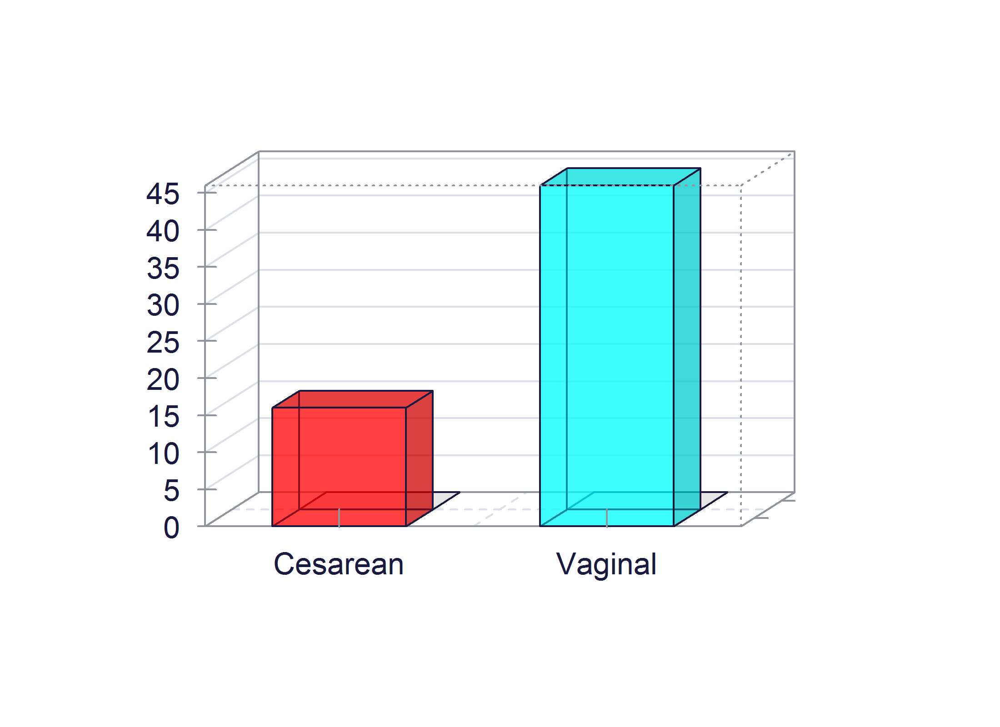


## Figure 3-3
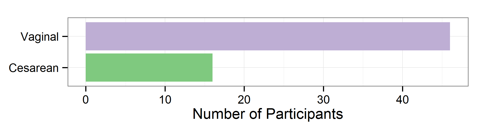


## Figure 3-4
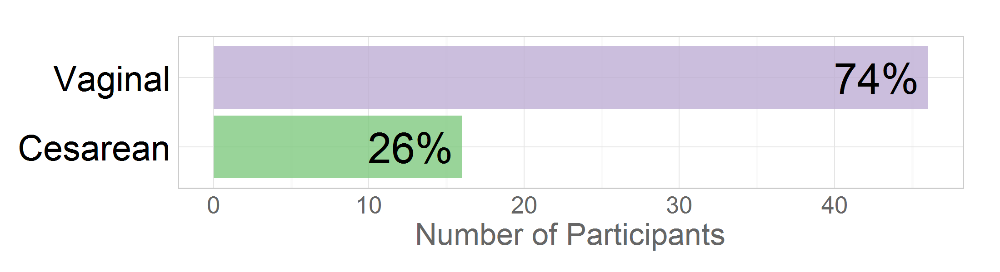


## Figure 3-5
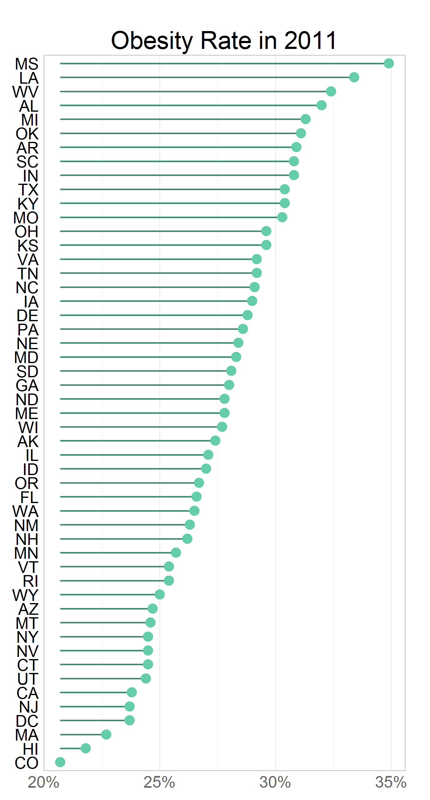


## Figure 3-6


## Figure 3-7
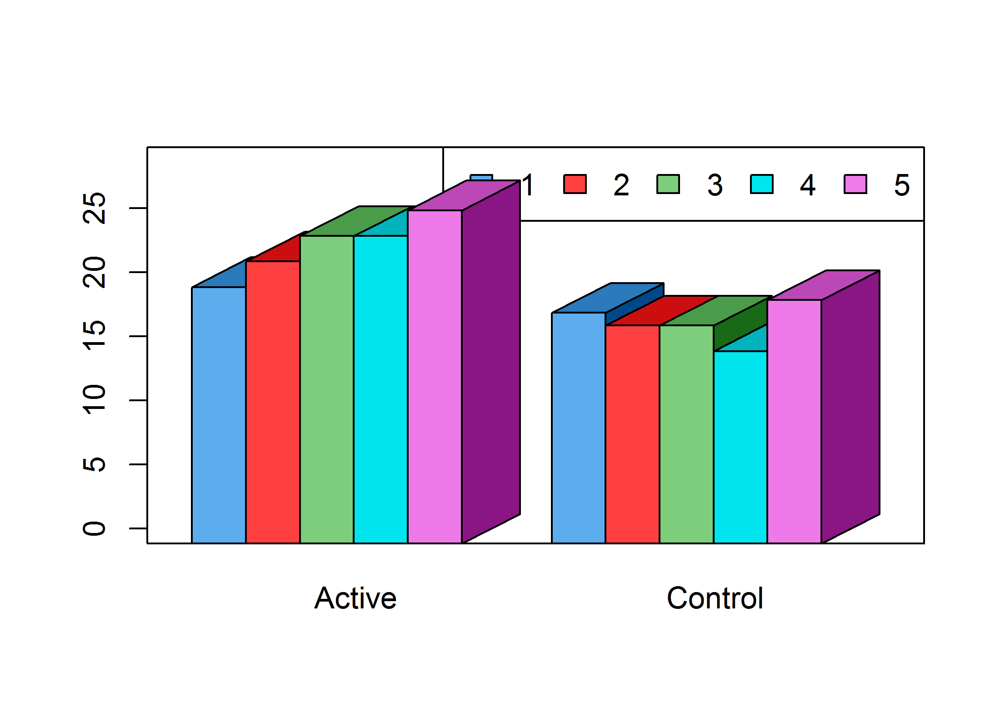


## Figure 3-8
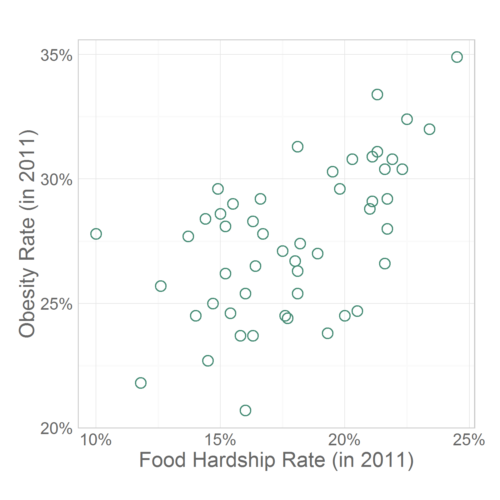


## Figure 3-9


## Figure 3-10
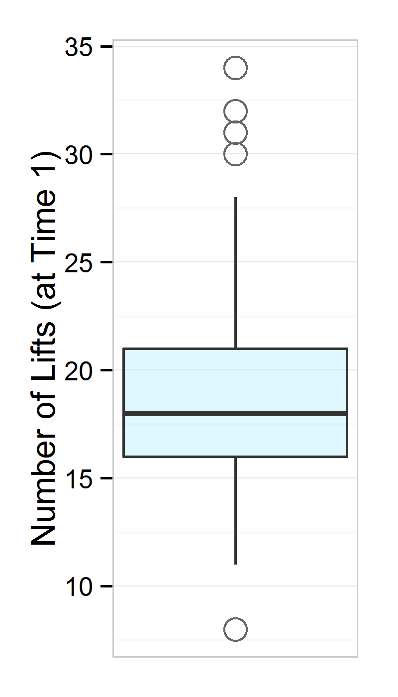


## Figure 3-11
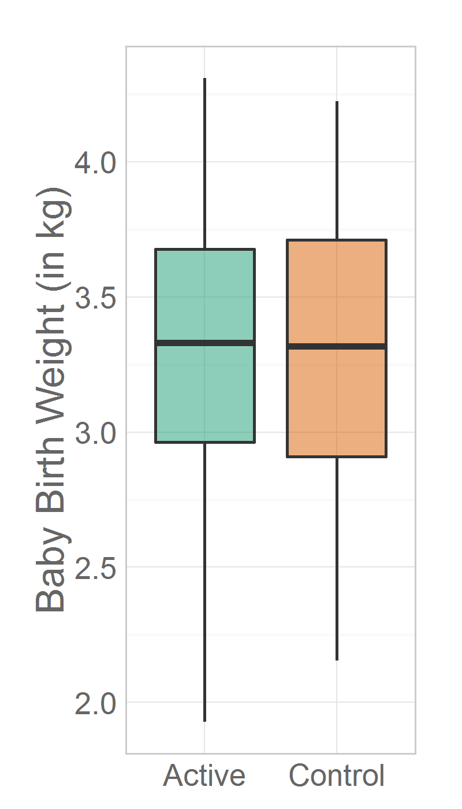


## Figure 3-12
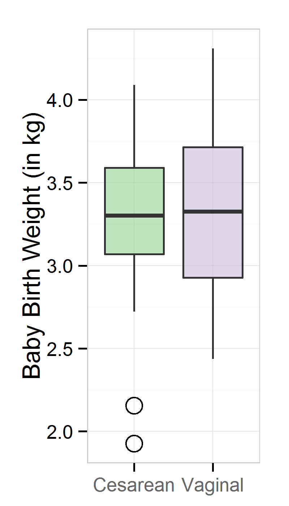


## Figure 3-13
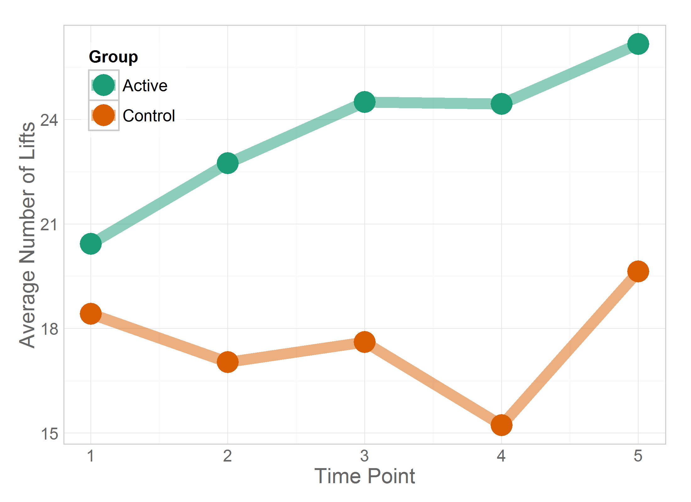


## Figure 3-14

```
Warning: Removed 17 rows containing missing values (geom_path).
```

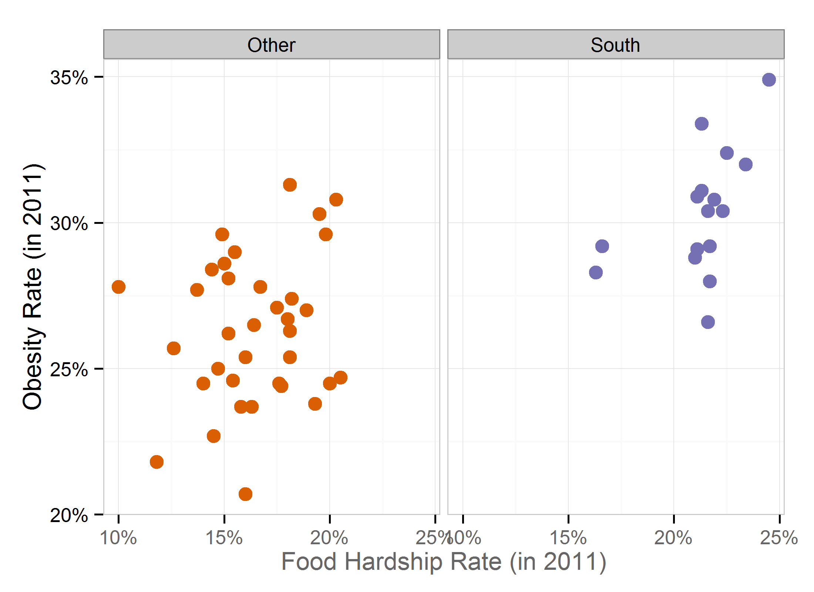


## Figure 3-15
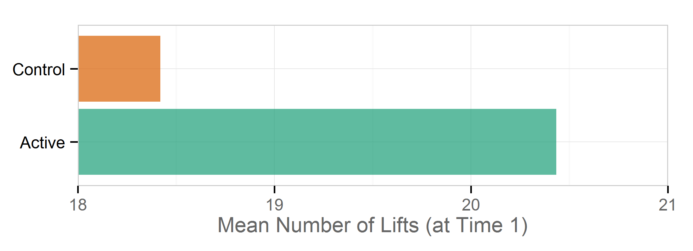


## Figure 3-16
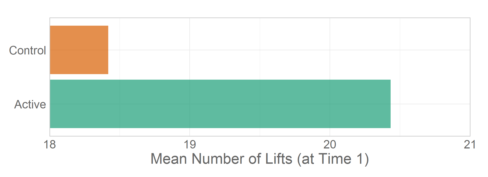


## Figure 3-17
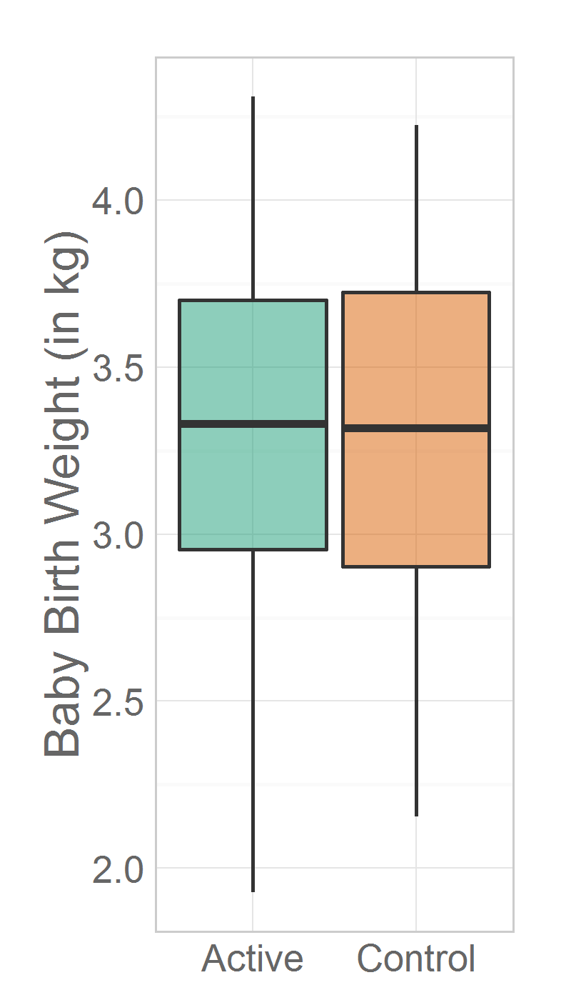


## Figure 3-18
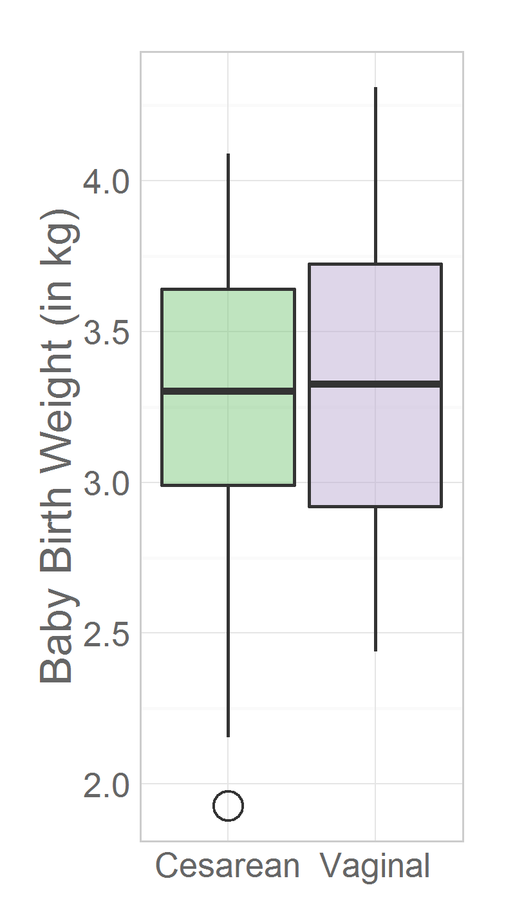


## Figure 3-19


## Figure 3-20
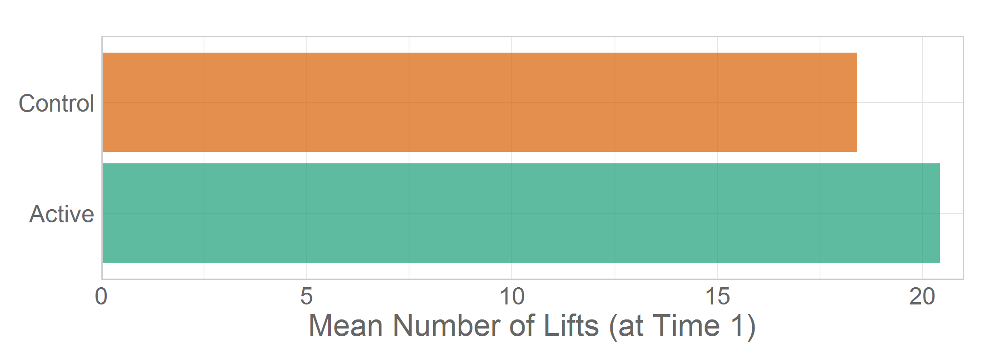


## Figure 3-21


## Figure 3-22
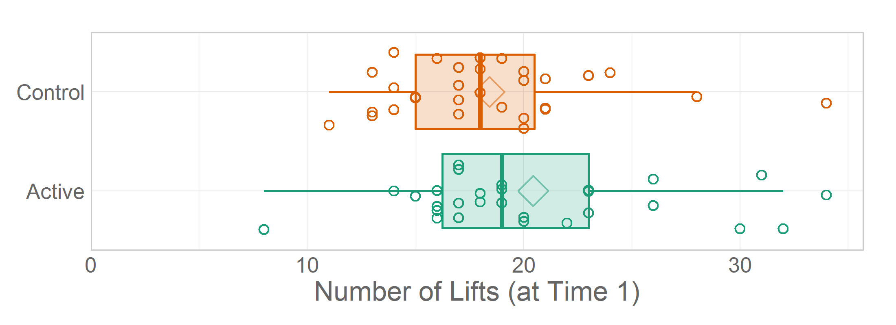


## Figure 3-23

```
Warning: Removed 1 rows containing missing values (stat_summary).
```

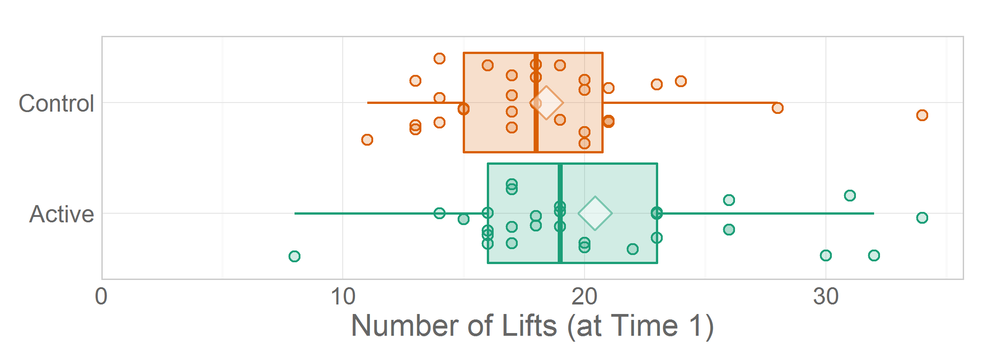


## Session Info
For the sake of documentation and reproducibility, the current report was build on a system using the following software.


```
Report created by Will at 2014-04-15, 21:39 -0500
```

```
R version 3.1.0 Patched (2014-04-10 r65396)
Platform: x86_64-w64-mingw32/x64 (64-bit)

locale:
[1] LC_COLLATE=English_United States.1252  LC_CTYPE=English_United States.1252    LC_MONETARY=English_United States.1252
[4] LC_NUMERIC=C                           LC_TIME=English_United States.1252    

attached base packages:
[1] grid      stats     graphics  grDevices utils     datasets  methods   base     

other attached packages:
 [1] dichromat_2.0-0    extrafont_0.16     epade_0.3.8        plotrix_3.5-5      reshape2_1.2.2     ggplot2_0.9.3.1   
 [7] scales_0.2.3       plyr_1.8.1         RColorBrewer_1.0-5 knitr_1.5         

loaded via a namespace (and not attached):
 [1] colorspace_1.2-4 digest_0.6.4     evaluate_0.5.3   extrafontdb_1.0  formatR_0.10     gtable_0.1.2    
 [7] labeling_0.2     MASS_7.3-31      munsell_0.4.2    proto_0.3-10     Rcpp_0.11.1      Rttf2pt1_1.3    
[13] stringr_0.6.2    tools_3.1.0     
```


## License

<a rel="license" href="http://creativecommons.org/licenses/by/3.0/"></a><br />This work is licensed under a <a rel="license" href="http://creativecommons.org/licenses/by/3.0/">Creative Commons Attribution 3.0 Unported License</a>.
