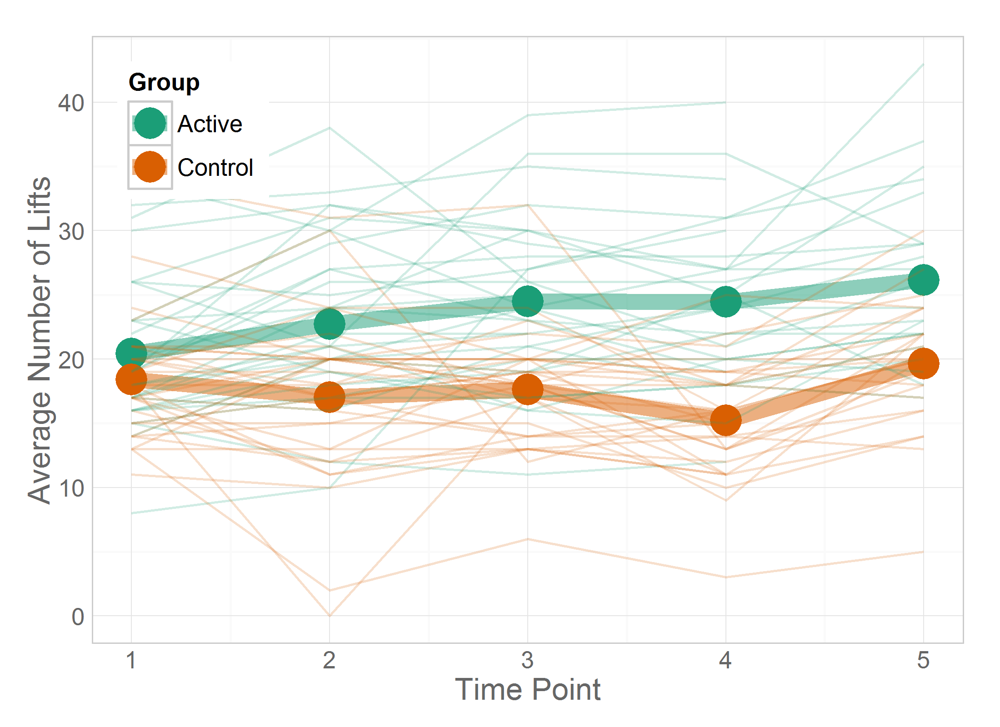

Chapter 03 Graphs
=================================================
This report creates the chapter graphs.

<!--  Set the working directory to the repository's base directory; this assumes the report is nested inside of only one directory.-->


<!-- Set the report-wide options, and point to the external code file. -->


<!-- Load the packages.  Suppress the output when loading packages. --> 


<!-- Load any Global functions and variables declared in the R file.  Suppress the output. --> 


<!-- Declare any global functions specific to a Rmd output.  Suppress the output. --> 


<!-- Load the datasets.   -->


<!-- Tweak the datasets.   -->

```
         [,1]
Cesarean   16
Vaginal    46
```


## Figure 3-1

```r
oldPar <- par(mfrow=c(1, 2)) #par(mfrow=c(1, 1))
#Left Panel
pie3D(x=dsPregnancySummarized$Count, labels=dsPregnancySummarized$DeliveryMethod, 
      edges=1000, start=pi*1/5, theta=pi/10, mar=c(0, 0, 0, 0))
#Right Panel
pie3D(x=dsPregnancySummarized$Count, labels=NULL, #dsPregnancySummarized$DeliveryMethod, 
      edges=1000, start=pi*5/5, theta=pi/10, mar=c(0, 0, 0, 0))
```


```r
par(oldPar)

#####################################
```


## Figure 3-2

```r
dsPregnancy$Dummy <- factor(1, levels=c(1,2))
epade::bar3d.ade(x=dsPregnancy$DeliveryMethod, y=dsPregnancy$Dummy, 
                 xlab="", zticks=c("", ""), zlab="", 
                 col=c("red", NA, "cyan", NA),
                 wall=2)
```


```r

dsPregnancy$Dummy <- NULL
#####################################
```


## Figure 3-3

```r
barChartPalette <- adjustcolor(brewer.pal(3, "Accent"), alpha.f=.8)[1:2]
g3_3 <- ggplot(dsPregnancySummarized, aes(x=DeliveryMethod, y=Count, fill=DeliveryMethod, label=Percentage)) +
  geom_bar(stat="identity") +
  scale_fill_manual(values=barChartPalette) +
  coord_flip() +
  theme_bw() +
  labs(x=NULL, y="Number of Participants")
g3_3 
```


```r

#####################################
```


## Figure 3-4

```r
g3_3 + 
  geom_text(stat="identity", size=6, hjust=1.1)  +
  chapterTheme +
  theme(legend.position = "none") +
  theme(axis.text.y=element_text(size=14)) +
  theme(axis.ticks.length = grid::unit(0, "cm")) +
  labs(x=NULL, y="Number of Participants")
```


```r

rm(g3_3)

#####################################
```


## Figure 3-5

```r
#Refer to Recipe 3.10 ("Making a Cleveland Dot Plot") in Winston Chang's *R Graphics Cookbook* (2013).
stateOrder <- dsObesity$State[order(dsObesity$ObesityRate)]
dsObesity$State <- factor(dsObesity$State, levels=stateOrder)

ggplot(dsObesity, aes(x=ObesityRate, y=State)) +
  geom_segment(aes(yend=State, xend=min(ObesityRate)), color="gray70") +
  geom_point(size=3, color="blue2") +
  scale_x_continuous(label=scales::percent) + #, expand=c(0,.005)) +
  chapterTheme +
  theme(axis.ticks.length = grid::unit(0, "cm")) +
  theme(panel.grid.major.y= element_blank()) +
  labs(title="Obesity Rate in 2011", x=NULL, y=NULL)
```


```r

#####################################
```


## Figure 3-6

```r
ggplot(dsPregnancy, aes(x=T1Lifts)) +
  geom_histogram(binwidth=2.5, fill="turquoise4", color="gray80", alpha=.8) +
  chapterTheme +
  labs(x="Number of Lifts in 1 min (at Time 1)", y="Number of Participants")
```


```r

ggplot(dsPregnancy, aes(x=T5Lifts)) +
  geom_histogram(binwidth=2.5, fill="turquoise4", color="gray80", alpha=.8) +
  chapterTheme +
  labs(x="Number of Lifts in 1 min (at Time 5)", y="Number of Participants", title="WARNING: This doesn't match. I don't know what the right variable is")
```


```r

#####################################
```


## Figure 3-7

```r
# dsPregnancy$Dummy <- factor(1, levels=c(1,2))
# epade::bar3d.ade(x=dsPregnancyLong$DeliveryMethod, y=dsPregnancy$Dummy, 
#                  xlab="", zticks=c("", ""), zlab="", 
#                  col=c("red", NA, "cyan", NA),
#                  wall=2)


#####################################
```


## Figure 3-8

```r
g3_08 <- ggplot(dsPregnancyLongSummarized, aes(x=TimePoint, y=CountMean, color=Group)) +
  geom_line(size=3) +
  geom_point(size=6) +
  chapterTheme +
  scale_color_brewer(palette="Dark2") +
  theme(legend.position=c(0, 1), legend.justification=c(0, 1)) +
  labs(x="Time", y="Average Number of Lifts")
g3_08
```


```r

g3_08 + geom_line(data=dsPregnancyLong, mapping=aes(x=TimePoint, y=LiftCount,  group=SubjectID), alpha=.9) 
```

```
Warning: Removed 17 rows containing missing values (geom_path).
```



```r
  #+ scale_color_brewer(palette="Dark2", alpha=.3)

#####################################
```


## Figure 3-9

```r
#Note the approach to labeling outliers will fail if there are duplicated values. See http://stackoverflow.com/questions/15181086/labeling-outliers-on-boxplot-in-r
outlierPrevelances <- graphics::boxplot(dsSmoking$AdultCigaretteUse, plot=F)$out
outlierLabels <- dsSmoking$State[which( dsSmoking$AdultCigaretteUse == outlierPrevelances, arr.ind=TRUE)]

ggplot(dsSmoking, aes(x=1, y=AdultCigaretteUse)) +
  geom_boxplot(fill="lightblue1", outlier.shape=1, outlier.size=4, outlier.colour="gray40", alpha=.5) +  
  scale_x_continuous(breaks=NULL) +
  scale_y_continuous(label=scales::percent) +
  annotate(geom="text", x=1L, y=outlierPrevelances, label=outlierLabels, hjust=-.6, color="gray40") +
  chapterTheme +
  theme(legend.position=c(0, 1), legend.justification=c(0, 1)) +
  labs(x=NULL, y="Adult Smoking Prevalence (in 2009)")
```


```r

#####################################
```


## Figure 3-10

```r
ggplot(dsPregnancy, aes(x=Group, y=BabyWeightInKG)) +
  geom_boxplot(fill="lightblue1", outlier.shape=1, outlier.size=4, outlier.colour="gray40", alpha=.5) +  
  chapterTheme +
  labs(x=NULL, y="Baby Birth Weight (in kg)")
```


```r

#####################################
```


## Figure 3-11

```r
ggplot(dsPregnancy, aes(x=DeliveryMethod, y=BabyWeightInKG)) +
  geom_boxplot(fill="lightblue1", outlier.shape=1, outlier.size=4, outlier.colour="gray40", alpha=.5) +  
  chapterTheme +
  labs(x=NULL, y="Baby Birth Weight (in kg)")
```


```r

#####################################
# TODO: 
# 1. Pie chart needs a legend
# 2. Ask Lise what data was used for Fig 3-7
```


## Session Info
For the sake of documentation and reproducibility, the current report was build on a system using the following software.


```
Report created by Will at 2014-01-15, 01:37:08 -0600
```

```
R Under development (unstable) (2014-01-13 r64761)
Platform: x86_64-w64-mingw32/x64 (64-bit)

locale:
[1] LC_COLLATE=English_United States.1252  LC_CTYPE=English_United States.1252    LC_MONETARY=English_United States.1252
[4] LC_NUMERIC=C                           LC_TIME=English_United States.1252    

attached base packages:
[1] stats     graphics  grDevices utils     datasets  methods   base     

other attached packages:
[1] extrafont_0.16     epade_0.3.8        plotrix_3.5-2      reshape2_1.2.2     ggplot2_0.9.3.1    scales_0.2.3      
[7] plyr_1.8.0.99      RColorBrewer_1.0-5 knitr_1.5         

loaded via a namespace (and not attached):
 [1] colorspace_1.2-4 dichromat_2.0-0  digest_0.6.4     evaluate_0.5.1   extrafontdb_1.0  formatR_0.10    
 [7] grid_3.1.0       gtable_0.1.2     labeling_0.2     MASS_7.3-29      munsell_0.4.2    proto_0.3-10    
[13] Rcpp_0.10.6      Rttf2pt1_1.2     stringr_0.6.2    tools_3.1.0     
```

