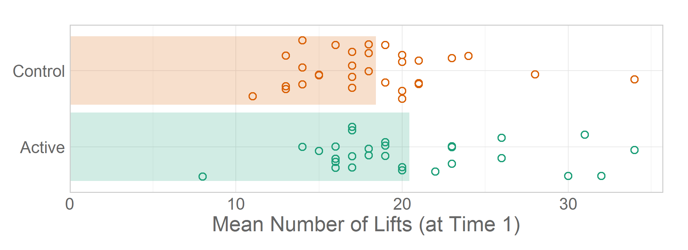

Chapter 03 Graphs
=================================================
This report creates the chapter graphs.

<!--  Set the working directory to the repository's base directory; this assumes the report is nested inside of only one directory.-->

```r
opts_knit$set(root.dir = "../")  #Don't combine this call with any other chunk -espeically one that uses file paths.
```


<!-- Set the report-wide options, and point to the external code file. -->

```r
require(knitr)
opts_chunk$set(
    results='show', 
    comment = NA, 
    tidy = FALSE,
    fig.width = 5.5, 
    fig.height = 4, 
    out.width = "600px", #This affects only the markdown, not the underlying png file.  The height will be scaled appropriately.
    fig.path = 'figure_rmd/',     
    dev = "png",
#     dev = "pdf",
    dpi = 400
)
options(width=120) #So the output is 50% wider than the default.
read_chunk("./Chapter03/Chapter03.R") 
```

<!-- Load the packages.  Suppress the output when loading packages. --> 

```r
require(knitr)
require(RColorBrewer)
require(plyr)
require(scales) #For formating values in graphs
require(ggplot2)
require(reshape2) #For convertin wide to long
require(plotrix) #For the 3D pie chart (Please notice that this package includes much more than this feature.)
require(epade) #For the 3D bar chart (Please notice that this package includes more than this feature.)

#####################################
```


<!-- Load any Global functions and variables declared in the R file.  Suppress the output. --> 

```r
source("./CommonCode/BookTheme.R")

chapterTheme <- BookTheme  + 
  theme(axis.ticks.length = grid::unit(0, "cm"))
# chapterThemeBar <- chapterTheme
# chapterThemeBox <- chapterTheme + 
#   theme(axis.ticks.x.length = grid::unit(0, "cm"))
#####################################
```


<!-- Declare any global functions specific to a Rmd output.  Suppress the output. --> 


<!-- Load the datasets.   -->

```r
# 'ds' stands for 'datasets'
dsPregnancy <- read.csv("./Data/ExercisePregnancy.csv")
dsObesity <- read.csv("./Data/FoodHardshipObesity.csv")
dsSmoking <- read.csv("./Data/SmokingTax.csv")
#####################################
```


<!-- Tweak the datasets.   -->

```r
dsPregnancy$BabyWeightInKG <- dsPregnancy$BabyWeightInG / 1000

dsPregnancySummarized <- ddply(dsPregnancy, .variables="DeliveryMethod", summarize, Count=length(SubjectID))
dsPregnancySummarized$Proportion = dsPregnancySummarized$Count/sum(dsPregnancySummarized$Count)
dsPregnancySummarized$Percentage <- paste0(round(dsPregnancySummarized$Proportion*100), "%")
dsPregnancySummarized$Dummy <- c(1,1)

matPregnancy <- as.matrix((table(dsPregnancy$DeliveryMethod)))
# dsPregnancyMatrix <- cbind(dsPregnancyMatrix, c(1, 2), c(1,1))[, c(2,3,1)]
# matPregnancy

dsPregnancyLong <- reshape2::melt(dsPregnancy, id.vars=c("SubjectID", "Group"), 
                                  measure.vars=paste0("T", 1:5, "Lifts"), 
                                  variable.name="TimePoint", value.name="LiftCount")
#                                   dsPregnancy$SubjectID
dsPregnancyLong$TimePoint <- as.integer(gsub(pattern="T(\\d)Lifts", "\\1", dsPregnancyLong$TimePoint, perl=T))

dsPregnancyLongSummarized <- plyr::ddply(dsPregnancyLong, .variables=c("TimePoint", "Group"), summarize, CountMean=mean(LiftCount, na.rm=T))
#####################################
```


## Figure 3-1

```r
oldPar <- par(mfrow=c(1, 2)) #par(mfrow=c(1, 1))
#Left Panel
pie3D(x=dsPregnancySummarized$Count, labels=dsPregnancySummarized$DeliveryMethod, height=.5,
      edges=1000, start=pi*1/5, theta=pi/10, mar=c(0, 0, 0, 0))
#Right Panel
pie3D(x=dsPregnancySummarized$Count, labels=NULL, height=.5, 
      edges=1000, start=pi*5/5, theta=pi/10, mar=c(0, 0, 0, 0))
```


```r
par(oldPar)
#####################################
```


## Figure 3-2

```r
dsPregnancy$Dummy <- factor(1, levels=c(1,2))
epade::bar3d.ade(x=dsPregnancy$DeliveryMethod, y=dsPregnancy$Dummy, 
                 xlab="", zticks=c("", ""), zlab="", 
                 col=c("red", NA, "cyan", NA), wall=2)
```


```r
dsPregnancy$Dummy <- NULL
#####################################
```


## Figure 3-3

```r
ggplot(dsPregnancySummarized, aes(x=DeliveryMethod, y=Count, fill=DeliveryMethod, label=Percentage)) +
  geom_bar(stat="identity") +
  scale_fill_manual(values=palettePregancyDelivery) +
  coord_flip() +
  theme_bw() +
  theme(legend.position = "none") +
  labs(x=NULL, y="Number of Participants")
```


```r
#####################################
```


## Figure 3-4

```r
ggplot(dsPregnancySummarized, aes(x=DeliveryMethod, y=Count, fill=DeliveryMethod, label=Percentage)) +
  geom_bar(stat="identity", alpha=.6) +
  geom_text(stat="identity", size=6, hjust=1.1)  +
  scale_fill_manual(values=palettePregancyDelivery) +
  coord_flip(ylim = c(0, 1.05*max(dsPregnancySummarized$Count, na.rm=T))) +
  chapterTheme +
  theme(legend.position = "none") +
  theme(axis.text.y=element_text(size=14)) +
  labs(x=NULL, y="Number of Participants")
```


```r
#####################################
```


## Figure 3-5

```r
#Refer to Recipe 3.10 ("Making a Cleveland Dot Plot") in Winston Chang's *R Graphics Cookbook* (2013).
stateOrder <- dsObesity$State[order(dsObesity$ObesityRate)]
dsObesity$State <- factor(dsObesity$State, levels=stateOrder)

ggplot(dsObesity, aes(x=ObesityRate, y=State)) +
  geom_segment(aes(yend=State, xend=min(ObesityRate)), color="aquamarine4") +
  geom_point(size=3, color="aquamarine3") +
  scale_x_continuous(label=scales::percent) + 
  chapterTheme +
  theme(panel.grid.major.y= element_blank()) +
  labs(title="Obesity Rate in 2011", x=NULL, y=NULL)
```


```r
#####################################
```


```r
ggplot(dsObesity[dsObesity$Location=="South", ], aes(x=ObesityRate, y=State)) +
  geom_segment(aes(yend=State, xend=min(ObesityRate)), color=paletteObesityState[2]) +
  geom_point(size=3, color=paletteObesityState[2]) +
  scale_x_continuous(label=scales::percent) + 
  chapterTheme +
  theme(panel.grid.major.y= element_blank()) +
  labs(title="Obesity Rate in 2011", x=NULL, y=NULL)
```


```r

ggplot(dsObesity[dsObesity$Location=="South", ], aes(x=ObesityRate, y=State)) +
  geom_segment(aes(yend=State, xend=min(ObesityRate)), color=adjustcolor(paletteObesityState[2], .5)) +
  geom_point(size=3, shape=19, color=paletteObesityState[2]) +
  scale_x_continuous(label=scales::percent) + 
  chapterTheme +
  theme(panel.grid.major.y= element_blank()) +
  labs(title="Obesity Rate in 2011", x=NULL, y=NULL)
```


```r
#####################################
```


## Figure 3-6

```r
ggplot(dsPregnancy, aes(x=T5Lifts)) +
  geom_histogram(binwidth=2.5, fill="coral4", color="gray95", alpha=.6) + #Be a little darker than the previous boxplot
  chapterTheme +
  labs(x="Number of Lifts in 1 min (at Time 5)", y="Number of Participants")
```


```r

ggplot(dsObesity, aes(x=ObesityRate)) +
  geom_histogram(binwidth=.01, fill="coral4", color="gray95", alpha=.6) + #Be a little darker than the previous boxplot
  chapterTheme +
  labs(x="Obesity Rate (in 2011)", y="Number of Participants")
```


```r
#####################################
```


## Figure 3-7

```r
CreateFakeMeans <- function( d ) {
  data.frame(
    TimePoint = rep(d$TimePoint, times=d$CountMean), 
    Group = rep(d$Group, times=d$CountMean)
)}
dsPregnancyLongSummarizedFakeTable <- ddply(dsPregnancyLongSummarized, .variables=c("TimePoint", "Group"), CreateFakeMeans)
bar.plot.ade(x="TimePoint", y="Group", data=dsPregnancyLongSummarizedFakeTable, form="c", b2=3)
```


```r
#####################################
```


## Figure 3-8

```r
gLongitudinalLifts <- ggplot(dsPregnancyLongSummarized, aes(x=TimePoint, y=CountMean, color=Group)) +
  geom_line(size=3, alpha=.5) +
  geom_point(size=6) +
  scale_color_manual(values=palettePregancyGroup) +
  chapterTheme +
  theme(legend.position=c(0, 1), legend.justification=c(0, 1)) +
  labs(x="Time", y="Average Number of Lifts")
gLongitudinalLifts
```


```r
#####################################
```


## Figure 3-9

```r
#Note the approach to labeling outliers will fail if there are duplicated values. See http://stackoverflow.com/questions/15181086/labeling-outliers-on-boxplot-in-r
#See Chang (2013), Recipe 6.6.  We added (arbitrary) x-axis limits to force the box narrower. 
outlierPrevelances <- graphics::boxplot(dsSmoking$AdultCigaretteUse, plot=F)$out
outlierLabels <- dsSmoking$State[which( dsSmoking$AdultCigaretteUse == outlierPrevelances, arr.ind=TRUE)]

ggplot(dsSmoking, aes(x=1, y=AdultCigaretteUse)) +
  geom_boxplot(width=.5, fill="royalblue1", outlier.shape=1, outlier.size=4, outlier.colour="gray40", alpha=.5) +  
  scale_x_continuous(breaks=NULL, limits=c(.5, 1.5)) +
  scale_y_continuous(label=scales::percent) +
  annotate(geom="text", x=1L, y=outlierPrevelances, label=outlierLabels, hjust=-.6, color="gray40") +
  chapterTheme +
  theme(legend.position=c(0, 1), legend.justification=c(0, 1)) +
  labs(x=NULL, y="Adult Smoking Prevalence (in 2009)")
```


```r
#####################################
```


## Figure 3-10

```r
ggplot(dsPregnancy, aes(x=1, y=T1Lifts)) +
  geom_boxplot(width=.5,fill="royalblue4", outlier.shape=1, outlier.size=4, outlier.colour="gray40", alpha=.5, na.rm=T) +
  scale_x_continuous(breaks=NULL, limits=c(.5, 1.5)) +
  chapterTheme +
  theme(legend.position=c(0, 1), legend.justification=c(0, 1)) +
  labs(x=NULL, y="Number of Lifts (at Time 1)")
```


```r
#####################################
```


## Figure 3-11

```r
ggplot(dsPregnancy, aes(x=Group, y=BabyWeightInKG, fill=Group)) +
  geom_boxplot( outlier.shape=1, outlier.size=4, outlier.colour="gray40", alpha=.5) +  
  scale_fill_manual(values=palettePregancyGroup) +
  chapterTheme +
  theme(legend.position="none") + 
  labs(x=NULL, y="Baby Birth Weight (in kg)")
```


```r
#####################################
```


## Figure 3-12

```r
g <- ggplot(dsPregnancy, aes(x=DeliveryMethod, y=BabyWeightInKG, fill=DeliveryMethod)) +
  geom_boxplot(outlier.shape=1, outlier.size=4,  alpha=.5, type=1) +  
  scale_fill_manual(values=palettePregancyDelivery) +
  chapterTheme +
  theme(legend.position="none") + labs(x=NULL, y="Baby Birth Weight (in kg)")
g
```


```r

greenScores <- sort(dsPregnancy[dsPregnancy$DeliveryMethod=="Cesarean", "BabyWeightInKG"])
greenScores
```

```
 [1] 1.928 2.155 2.722 2.835 3.147 3.202 3.232 3.289 3.317 3.402 3.487 3.540 3.742 3.770 4.082 4.090
```

```r
(approach1 <- quantile(greenScores))
```

```
   0%   25%   50%   75%  100% 
1.928 3.069 3.303 3.591 4.090 
```

```r
(approach2 <- fivenum(greenScores))
```

```
[1] 1.928 2.991 3.303 3.641 4.090
```

```r

quantile(greenScores, type=3)
```

```
   0%   25%   50%   75%  100% 
1.928 2.835 3.289 3.540 4.090 
```

```r
(approach3 <- quantile(greenScores, type=5))
```

```
   0%   25%   50%   75%  100% 
1.928 2.991 3.303 3.641 4.090 
```

```r
(approach4 <- quantile(greenScores, type=6))
```

```
   0%   25%   50%   75%  100% 
1.928 2.913 3.303 3.691 4.090 
```

```r

#TODO: Remove this graph.  It's just for our exploration.
g + annotate(geom="text", x=1, y=approach1, label=round(approach1, 3), hjust=-.1, color="tomato")
```


```r

#TODO: Remove this graph.  It's just for our exploration.
g + annotate(geom="text", x=1, y=approach2, label=round(approach2, 3), hjust=-.1, color="tomato")
```


```r

rm(g)
#####################################
```


## Figure 3-13

```r
ggplot(dsObesity, aes(x=FoodHardshipRate, y=ObesityRate)) +
  geom_point(shape=1, size=3, color="aquamarine4") + #This color should match the obesity Cleveland dot plot
  scale_x_continuous(label=scales::percent) +
  scale_y_continuous(label=scales::percent) +
  coord_fixed() + 
  chapterTheme +
  labs(x="Food Hardship Rate (in 2011)", y="Obesity Rate (in 2011)")
```


```r
#####################################
```


## Figure 3-14

```r
ggplot(dsObesity, aes(x=FoodHardshipRate, y=ObesityRate, label=State, color=Location)) +
  geom_text(size=3, alpha=1) +
  scale_x_continuous(label=scales::percent) +
  scale_y_continuous(label=scales::percent) +
  scale_color_manual(values=paletteObesityState) +
  coord_fixed() + 
  chapterTheme +
  theme(legend.position=c(0, 1), legend.justification=c(0, 1)) +
  labs(x="Food Hardship Rate (in 2011)", y="Obesity Rate (in 2011)")
```


```r
#####################################
```


## Figure 3-15

```r
g03_14 <- ggplot(dsPregnancy, aes(x=Group, y=T1Lifts, fill=Group)) +
  geom_bar(stat="summary", fun.y="mean", na.rm=T, alpha=.7 ) +
#   scale_y_continuous(limits = c(18, 21)) +
  scale_fill_manual(values=palettePregancyGroup) +
  chapterTheme +
  theme(legend.position="none") +
  labs(x=NULL, y="Mean Number of Lifts (at Time 1)")

g03_14 + coord_flip(ylim = c(18, 21))
```


```r
#####################################
```


## Figure 3-16

```r
g03_14 + coord_flip(ylim = c(0, 21))
```


```r

### Possible Narration:
### Add observed data to the existing statistical summary (ie, the bar of means).
### This makes it obvious how the variability dwarfs the difference.
### This could be a possible callback in a later chapter: the t's denominator dwarfs the numerator.

set.seed(seed=789) #Set a seed so the jittered graphs are consistent across renders.
ggplot(dsPregnancy, aes(x=Group, y=T1Lifts, fill=Group, color=Group)) +
  geom_bar(stat="summary", fun.y="mean", na.rm=T, alpha=.2, color=NA ) +
  geom_point(position=position_jitter(w = 0.4, h = 0), na.rm=T, size=2, shape=1) +
  scale_color_manual(values=palettePregancyGroup) +
  scale_fill_manual(values=palettePregancyGroup) +
  coord_flip(ylim = c(0, 1.05*max(dsPregnancy$T1Lifts, na.rm=T))) +
  chapterTheme +
  theme(legend.position="none") +
  labs(x=NULL, y="Mean Number of Lifts (at Time 1)")
```



```r

### Possible Narration:
### Layering summarized and observed data can help cognitively reinforce the patterns in the data.
### Variability/spread is represented by both the box and the points.

set.seed(seed=789) #Set a seed so the jittered graphs are consistent across renders.
ggplot(dsPregnancy, aes(x=Group, y=T1Lifts, fill=Group, color=Group)) +
  geom_boxplot(na.rm=T, alpha=.2, outlier.shape=NA ) +
  geom_point(position=position_jitter(w = 0.4, h = 0), na.rm=T, size=2, shape=1) +
  scale_color_manual(values=palettePregancyGroup) +
  scale_fill_manual(values=palettePregancyGroup) +
  coord_flip(ylim = c(0, 1.05*max(dsPregnancy$T1Lifts, na.rm=T))) +
  chapterTheme +
  theme(legend.position="none") +
  labs(x=NULL, y="Mean Number of Lifts (at Time 1)")
```

```
Warning: Removed 1 rows containing missing values (geom_point).
Warning: Removed 1 rows containing missing values (geom_point).
```


```r

### Possible Narration:
### The number of summary layers doesn't need to stop at two.  
### A diamond below represent the group's mean.

ggplot(dsPregnancy, aes(x=Group, y=T1Lifts, fill=Group, color=Group)) +
  stat_summary(fun.y="mean", geom="point", shape=23, size=5, fill="white", alpha=.5, na.rm=T) + #See Chang (2013), Recipe 6.8.
  geom_boxplot( alpha=.2, outlier.shape=NA, na.rm=T) +
  geom_point(position=position_jitter(w = 0.4, h = 0), size=2, shape=1, na.rm=T) +
  scale_color_manual(values=palettePregancyGroup) +
  scale_fill_manual(values=palettePregancyGroup) +
  coord_flip(ylim = c(0, 1.05*max(dsPregnancy$T1Lifts, na.rm=T))) +
  chapterTheme +
  theme(legend.position="none") +
  labs(x=NULL, y="Mean Number of Lifts (at Time 1)")
```

```
Warning: Removed 1 rows containing missing values (stat_summary).
Warning: Removed 1 rows containing missing values (geom_point).
Warning: Removed 1 rows containing missing values (geom_point).
```


```r
  
### Possible Narration:
### Compare this with Fig 3-13 (ie the second bar chart in this section).  These two small diamonds represent *every piece of information* in the bar chart.
### Consider all the rich information missing from the graph below.  
### If the graph is constructed sensibly, your brain can manage a more complexity that two summary points.  And so can your audience.
### Both you and your audience will be benefit from a more complete representation of your study's results.

ggplot(dsPregnancy, aes(x=Group, y=T1Lifts, fill=Group, color=Group)) +
  geom_bar(stat="summary", fun.y="mean", na.rm=T, alpha=.2, color=NA ) +
  stat_summary(fun.y="mean", geom="point", shape=23, size=5, fill="white", alpha=1, na.rm=T) +
  scale_color_manual(values=palettePregancyGroup) +
  scale_fill_manual(values=palettePregancyGroup) +
  coord_flip(ylim = c(0, 1.05*max(dsPregnancy$T1Lifts, na.rm=T))) +
  chapterTheme +
  theme(legend.position="none") +
  labs(x=NULL, y="Mean Number of Lifts (at Time 1)")
```

```
Warning: Removed 1 rows containing missing values (stat_summary).
```


```r
#####################################
```


## Figure 3-17

```r
### Possible Narration:
### Consider your audience's starting point.  DOn't just throw a bunch of layers and expect they'll understand the conventions you've chosen.
### Clearly identify the elements containedin each layer, and what concept/summary/observation each layer is representing.

gLongitudinalLifts + geom_line(data=dsPregnancyLong, mapping=aes(x=TimePoint, y=LiftCount,  group=SubjectID), alpha=.2, na.rm=T) 
```

```
Warning: Removed 17 rows containing missing values (geom_path).
```


```r

### Possible Narration:
### We expect that interactive graphics will become more common in the health sciences, and that the tools will become
### easier for more people to use.  We don't think they tools are ready for intro stat students yet.
### Once you're more comfortable with the statistical concepts and programming required of this course, we
### encourage you to investigate if interactive graphics would contribute towards communicating your research results.

### Possible Narration:
### Choose colors consistently for the same variable *sets*, and contrastingly for different variables.
### Think of the cognitive distance between variable *sets* (which is different that between factor levels, or between variables).

#####################################
# TODO: 
# 1. Find D3 for health data
```


## Session Info
For the sake of documentation and reproducibility, the current report was build on a system using the following software.


```
Report created by Will at 2014-01-17, 10:52:50 -0600
```

```
R Under development (unstable) (2014-01-15 r64790)
Platform: x86_64-w64-mingw32/x64 (64-bit)

locale:
[1] LC_COLLATE=English_United States.1252  LC_CTYPE=English_United States.1252    LC_MONETARY=English_United States.1252
[4] LC_NUMERIC=C                           LC_TIME=English_United States.1252    

attached base packages:
[1] stats     graphics  grDevices utils     datasets  methods   base     

other attached packages:
[1] extrafont_0.16     epade_0.3.8        plotrix_3.5-2      reshape2_1.2.2     ggplot2_0.9.3.1    scales_0.2.3      
[7] plyr_1.8.0.99      RColorBrewer_1.0-5 knitr_1.5         

loaded via a namespace (and not attached):
 [1] colorspace_1.2-4 dichromat_2.0-0  digest_0.6.4     evaluate_0.5.1   extrafontdb_1.0  formatR_0.10    
 [7] grid_3.1.0       gtable_0.1.2     labeling_0.2     MASS_7.3-29      munsell_0.4.2    proto_0.3-10    
[13] Rcpp_0.10.6      Rttf2pt1_1.2     stringr_0.6.2    tools_3.1.0     
```

