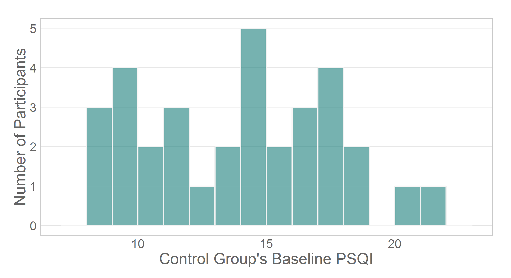
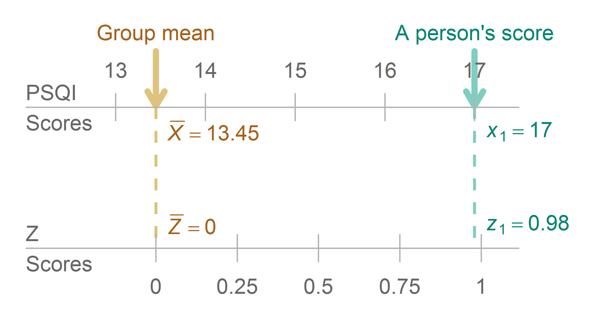
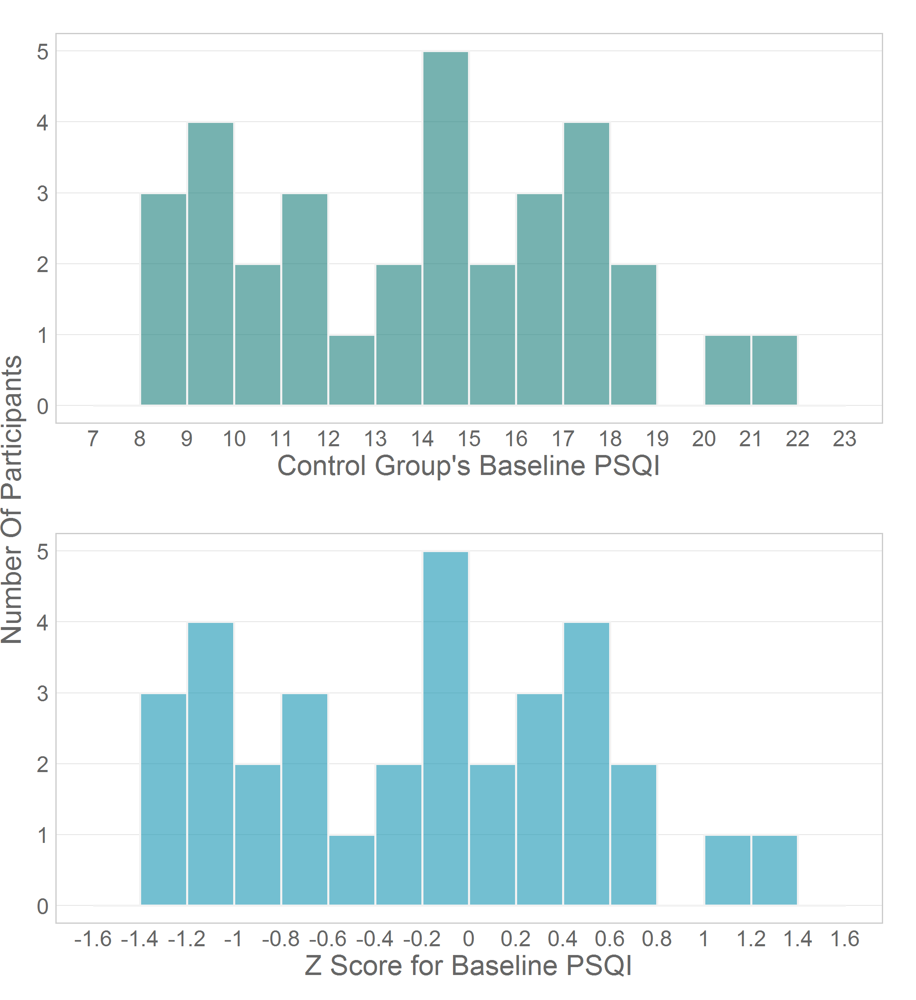
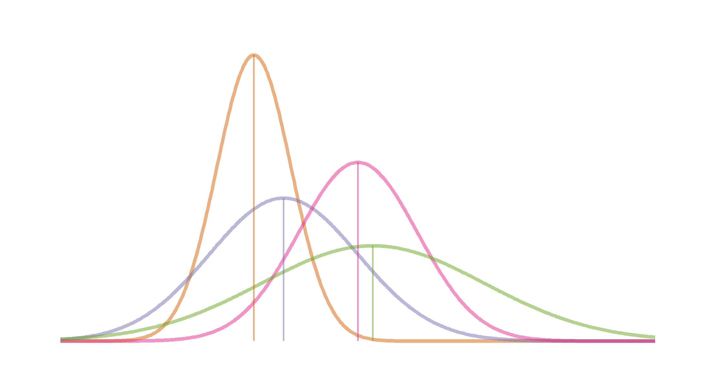
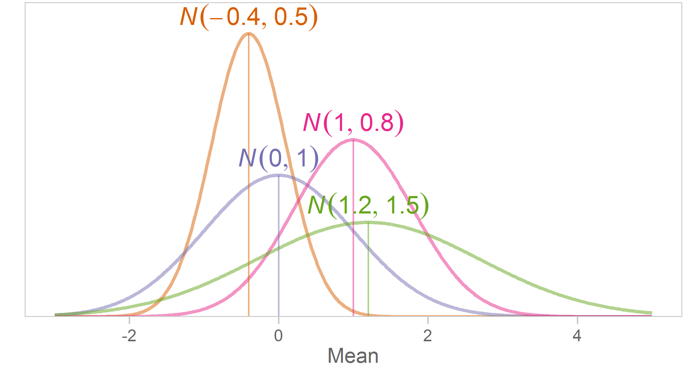
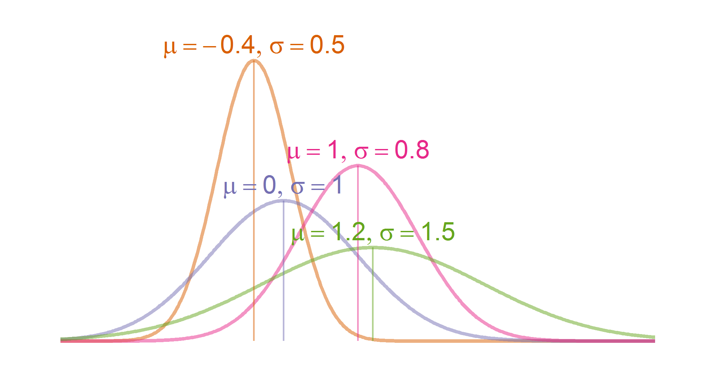
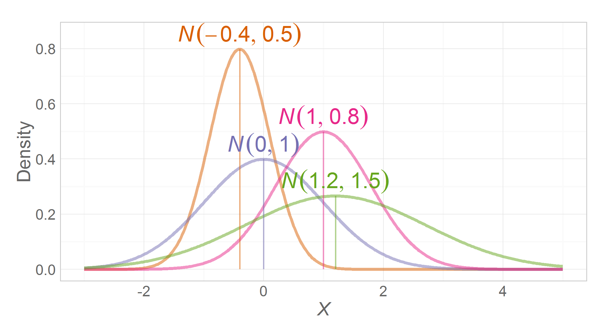
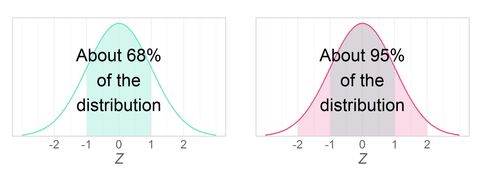
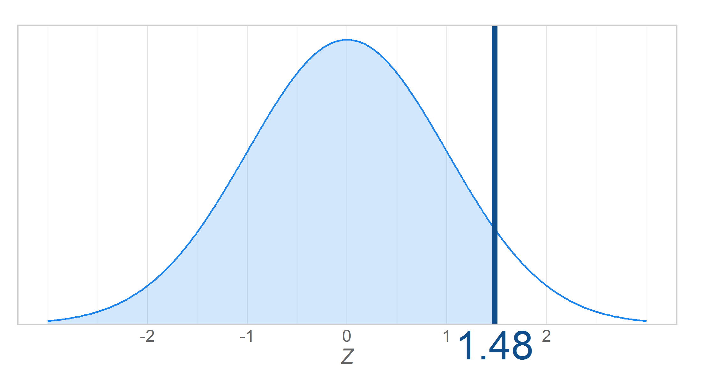

Chapter 04 Graphs
=================================================
This report creates the chapter graphs.

<!--  Set the working directory to the repository's base directory; this assumes the report is nested inside of only one directory.-->

```r
opts_knit$set(root.dir = "../")  #Don't combine this call with any other chunk -espeically one that uses file paths.
```


<!-- Set the report-wide options, and point to the external code file. -->

```r
require(knitr)
opts_chunk$set(
    results='show', 
    comment = NA, 
    tidy = FALSE,
    fig.width = 5.5, 
    fig.height = 4, 
    out.width = "600px", #This affects only the markdown, not the underlying png file.  The height will be scaled appropriately.
    fig.path = 'figure_rmd/',     
    dev = "png",
#     dev = "pdf",
    dpi = 400
)
echoChunks <- FALSE
options(width=120) #So the output is 50% wider than the default.
read_chunk("./Chapter04/Chapter04.R") 
```

<!-- Load the packages.  Suppress the output when loading packages. --> 


<!-- Load any Global functions and variables declared in the R file.  Suppress the output. --> 


<!-- Declare any global functions specific to a Rmd output.  Suppress the output. --> 


<!-- Load the datasets.   -->


<!-- Tweak the datasets.   -->


## Figure 4-1



## Figure 4-2



## Figure 4-3


## Figure 4-4


## Figure 4-5


## Figure 4-6

```
Lise, Let's talk about this one first.
```

## Figure 4-7

```
Lise, Let's talk about this one first.
```

## Figure 4-8



## Session Info
For the sake of documentation and reproducibility, the current report was build on a system using the following software.


```
Report created by Will at 2014-01-19, 15:58:55 -0600
```

```
R Under development (unstable) (2014-01-16 r64804)
Platform: x86_64-w64-mingw32/x64 (64-bit)

locale:
[1] LC_COLLATE=English_United States.1252  LC_CTYPE=English_United States.1252    LC_MONETARY=English_United States.1252
[4] LC_NUMERIC=C                           LC_TIME=English_United States.1252    

attached base packages:
[1] grid      stats     graphics  grDevices utils     datasets  methods   base     

other attached packages:
[1] extrafont_0.16     reshape2_1.2.2     ggthemes_1.6.0     ggplot2_0.9.3.1    gridExtra_0.9.1    scales_0.2.3      
[7] plyr_1.8.0.99      RColorBrewer_1.0-5 knitr_1.5         

loaded via a namespace (and not attached):
 [1] colorspace_1.2-4 dichromat_2.0-0  digest_0.6.4     evaluate_0.5.1   extrafontdb_1.0  formatR_0.10    
 [7] gtable_0.1.2     labeling_0.2     MASS_7.3-29      munsell_0.4.2    proto_0.3-10     Rcpp_0.10.6     
[13] Rttf2pt1_1.2     stringr_0.6.2    tools_3.1.0     
```

