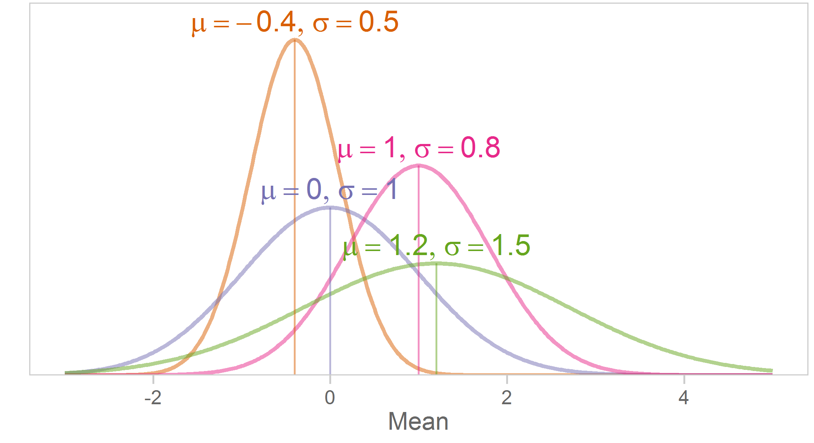

Chapter 04 Graphs
=================================================
This report creates the chapter graphs.

<!--  Set the working directory to the repository's base directory; this assumes the report is nested inside of only one directory.-->

```r
opts_knit$set(root.dir='../')  #Don't combine this call with any other chunk -especially one that uses file paths.
```

<!-- Set the report-wide options, and point to the external code file. -->

```r
require(knitr)
opts_chunk$set(
  results = 'show', 
  message = TRUE,
  comment = NA, 
  tidy = FALSE,
  fig.height = 4, 
  fig.width = 5.5, 
  out.width = "550px", #This affects only the markdown, not the underlying png file.  The height will be scaled appropriately.
  fig.path = 'figure_rmd/',     
  dev = "png",
#   fig.path = 'figure_pdf/',     
#   dev = "pdf",
  dpi = 400
)
echoChunks <- FALSE
options(width=120) #So the output is 50% wider than the default.
read_chunk("./Chapter04/Chapter04.R") 
```
<!-- Load the packages.  Suppress the output when loading packages. --> 


<!-- Load any Global functions and variables declared in the R file.  Suppress the output. --> 


<!-- Declare any global functions specific to a Rmd output.  Suppress the output. --> 


<!-- Load the datasets.   -->


<!-- Tweak the datasets.   -->


## Figure 4-1

## Figure 4-2

## Figure 4-3

## Figure 4-4

## Figure 4-5

## Figure 4-6

|Z    |Inside |Outside |Z    |Inside |Outside |Z    |Inside |Outside |Z    |Inside |Outside |Z    |Inside |Outside |Z    |Inside |Outside |Z    |Inside |Outside |Z    |Inside |Outside |Z    |Inside |Outside |
|:----|:------|:-------|:----|:------|:-------|:----|:------|:-------|:----|:------|:-------|:----|:------|:-------|:----|:------|:-------|:----|:------|:-------|:----|:------|:-------|:----|:------|:-------|
|0.00 |.0000  |.5000   |0.38 |.1480  |.3520   |0.76 |.2764  |.2236   |1.14 |.3729  |.1271   |1.52 |.4357  |.0643   |1.90 |.4713  |.0287   |2.28 |.4887  |.0113   |2.66 |.4961  |.0039   |3.04 |.4988  |.0012   |
|0.01 |.0040  |.4960   |0.39 |.1517  |.3483   |0.77 |.2794  |.2206   |1.15 |.3749  |.1251   |1.53 |.4370  |.0630   |1.91 |.4719  |.0281   |2.29 |.4890  |.0110   |2.67 |.4962  |.0038   |3.05 |.4989  |.0011   |
|0.02 |.0080  |.4920   |0.40 |.1554  |.3446   |0.78 |.2823  |.2177   |1.16 |.3770  |.1230   |1.54 |.4382  |.0618   |1.92 |.4726  |.0274   |2.30 |.4893  |.0107   |2.68 |.4963  |.0037   |3.06 |.4989  |.0011   |
|0.03 |.0120  |.4880   |0.41 |.1591  |.3409   |0.79 |.2852  |.2148   |1.17 |.3790  |.1210   |1.55 |.4394  |.0606   |1.93 |.4732  |.0268   |2.31 |.4896  |.0104   |2.69 |.4964  |.0036   |3.07 |.4989  |.0011   |
|0.04 |.0160  |.4840   |0.42 |.1628  |.3372   |0.80 |.2881  |.2119   |1.18 |.3810  |.1190   |1.56 |.4406  |.0594   |1.94 |.4738  |.0262   |2.32 |.4898  |.0102   |2.70 |.4965  |.0035   |3.08 |.4990  |.0010   |
|0.05 |.0199  |.4801   |0.43 |.1664  |.3336   |0.81 |.2910  |.2090   |1.19 |.3830  |.1170   |1.57 |.4418  |.0582   |1.95 |.4744  |.0256   |2.33 |.4901  |.0099   |2.71 |.4966  |.0034   |3.09 |.4990  |.0010   |
|0.06 |.0239  |.4761   |0.44 |.1700  |.3300   |0.82 |.2939  |.2061   |1.20 |.3849  |.1151   |1.58 |.4429  |.0571   |1.96 |.4750  |.0250   |2.34 |.4904  |.0096   |2.72 |.4967  |.0033   |3.10 |.4990  |.0010   |
|0.07 |.0279  |.4721   |0.45 |.1736  |.3264   |0.83 |.2967  |.2033   |1.21 |.3869  |.1131   |1.59 |.4441  |.0559   |1.97 |.4756  |.0244   |2.35 |.4906  |.0094   |2.73 |.4968  |.0032   |3.11 |.4991  |.0009   |
|0.08 |.0319  |.4681   |0.46 |.1772  |.3228   |0.84 |.2995  |.2005   |1.22 |.3888  |.1112   |1.60 |.4452  |.0548   |1.98 |.4761  |.0239   |2.36 |.4909  |.0091   |2.74 |.4969  |.0031   |3.12 |.4991  |.0009   |
|0.09 |.0359  |.4641   |0.47 |.1808  |.3192   |0.85 |.3023  |.1977   |1.23 |.3907  |.1093   |1.61 |.4463  |.0537   |1.99 |.4767  |.0233   |2.37 |.4911  |.0089   |2.75 |.4970  |.0030   |3.13 |.4991  |.0009   |
|0.10 |.0398  |.4602   |0.48 |.1844  |.3156   |0.86 |.3051  |.1949   |1.24 |.3925  |.1075   |1.62 |.4474  |.0526   |2.00 |.4772  |.0228   |2.38 |.4913  |.0087   |2.76 |.4971  |.0029   |3.14 |.4992  |.0008   |
|0.11 |.0438  |.4562   |0.49 |.1879  |.3121   |0.87 |.3078  |.1922   |1.25 |.3944  |.1056   |1.63 |.4484  |.0516   |2.01 |.4778  |.0222   |2.39 |.4916  |.0084   |2.77 |.4972  |.0028   |3.15 |.4992  |.0008   |
|0.12 |.0478  |.4522   |0.50 |.1915  |.3085   |0.88 |.3106  |.1894   |1.26 |.3962  |.1038   |1.64 |.4495  |.0505   |2.02 |.4783  |.0217   |2.40 |.4918  |.0082   |2.78 |.4973  |.0027   |3.16 |.4992  |.0008   |
|0.13 |.0517  |.4483   |0.51 |.1950  |.3050   |0.89 |.3133  |.1867   |1.27 |.3980  |.1020   |1.65 |.4505  |.0495   |2.03 |.4788  |.0212   |2.41 |.4920  |.0080   |2.79 |.4974  |.0026   |3.17 |.4992  |.0008   |
|0.14 |.0557  |.4443   |0.52 |.1985  |.3015   |0.90 |.3159  |.1841   |1.28 |.3997  |.1003   |1.66 |.4515  |.0485   |2.04 |.4793  |.0207   |2.42 |.4922  |.0078   |2.80 |.4974  |.0026   |3.18 |.4993  |.0007   |
|0.15 |.0596  |.4404   |0.53 |.2019  |.2981   |0.91 |.3186  |.1814   |1.29 |.4015  |.0985   |1.67 |.4525  |.0475   |2.05 |.4798  |.0202   |2.43 |.4925  |.0075   |2.81 |.4975  |.0025   |3.19 |.4993  |.0007   |
|0.16 |.0636  |.4364   |0.54 |.2054  |.2946   |0.92 |.3212  |.1788   |1.30 |.4032  |.0968   |1.68 |.4535  |.0465   |2.06 |.4803  |.0197   |2.44 |.4927  |.0073   |2.82 |.4976  |.0024   |3.20 |.4993  |.0007   |
|0.17 |.0675  |.4325   |0.55 |.2088  |.2912   |0.93 |.3238  |.1762   |1.31 |.4049  |.0951   |1.69 |.4545  |.0455   |2.07 |.4808  |.0192   |2.45 |.4929  |.0071   |2.83 |.4977  |.0023   |3.21 |.4993  |.0007   |
|0.18 |.0714  |.4286   |0.56 |.2123  |.2877   |0.94 |.3264  |.1736   |1.32 |.4066  |.0934   |1.70 |.4554  |.0446   |2.08 |.4812  |.0188   |2.46 |.4931  |.0069   |2.84 |.4977  |.0023   |3.22 |.4994  |.0006   |
|0.19 |.0753  |.4247   |0.57 |.2157  |.2843   |0.95 |.3289  |.1711   |1.33 |.4082  |.0918   |1.71 |.4564  |.0436   |2.09 |.4817  |.0183   |2.47 |.4932  |.0068   |2.85 |.4978  |.0022   |3.23 |.4994  |.0006   |
|0.20 |.0793  |.4207   |0.58 |.2190  |.2810   |0.96 |.3315  |.1685   |1.34 |.4099  |.0901   |1.72 |.4573  |.0427   |2.10 |.4821  |.0179   |2.48 |.4934  |.0066   |2.86 |.4979  |.0021   |3.24 |.4994  |.0006   |
|0.21 |.0832  |.4168   |0.59 |.2224  |.2776   |0.97 |.3340  |.1660   |1.35 |.4115  |.0885   |1.73 |.4582  |.0418   |2.11 |.4826  |.0174   |2.49 |.4936  |.0064   |2.87 |.4979  |.0021   |3.25 |.4994  |.0006   |
|0.22 |.0871  |.4129   |0.60 |.2257  |.2743   |0.98 |.3365  |.1635   |1.36 |.4131  |.0869   |1.74 |.4591  |.0409   |2.12 |.4830  |.0170   |2.50 |.4938  |.0062   |2.88 |.4980  |.0020   |3.30 |.4995  |.00048  |
|0.23 |.0910  |.4090   |0.61 |.2291  |.2709   |0.99 |.3389  |.1611   |1.37 |.4147  |.0853   |1.75 |.4599  |.0401   |2.13 |.4834  |.0166   |2.51 |.4940  |.0060   |2.89 |.4981  |.0019   |3.35 |.4996  |.00040  |
|0.24 |.0948  |.4052   |0.62 |.2324  |.2676   |1.00 |.3413  |.1587   |1.38 |.4162  |.0838   |1.76 |.4608  |.0392   |2.14 |.4838  |.0162   |2.52 |.4941  |.0059   |2.90 |.4981  |.0019   |3.40 |.4997  |.00034  |
|0.25 |.0987  |.4013   |0.63 |.2357  |.2643   |1.01 |.3438  |.1562   |1.39 |.4177  |.0823   |1.77 |.4616  |.0384   |2.15 |.4842  |.0158   |2.53 |.4943  |.0057   |2.91 |.4982  |.0018   |3.45 |.4997  |.00028  |
|0.26 |.1026  |.3974   |0.64 |.2389  |.2611   |1.02 |.3461  |.1539   |1.40 |.4192  |.0808   |1.78 |.4625  |.0375   |2.16 |.4846  |.0154   |2.54 |.4945  |.0055   |2.92 |.4982  |.0018   |3.50 |.4998  |.00023  |
|0.27 |.1064  |.3936   |0.65 |.2422  |.2578   |1.03 |.3485  |.1515   |1.41 |.4207  |.0793   |1.79 |.4633  |.0367   |2.17 |.4850  |.0150   |2.55 |.4946  |.0054   |2.93 |.4983  |.0017   |3.60 |.4998  |.00016  |
|0.28 |.1103  |.3897   |0.66 |.2454  |.2546   |1.04 |.3508  |.1492   |1.42 |.4222  |.0778   |1.80 |.4641  |.0359   |2.18 |.4854  |.0146   |2.56 |.4948  |.0052   |2.94 |.4984  |.0016   |3.70 |.4999  |.00011  |
|0.29 |.1141  |.3859   |0.67 |.2486  |.2514   |1.05 |.3531  |.1469   |1.43 |.4236  |.0764   |1.81 |.4649  |.0351   |2.19 |.4857  |.0143   |2.57 |.4949  |.0051   |2.95 |.4984  |.0016   |3.80 |.4999  |.00007  |
|0.30 |.1179  |.3821   |0.68 |.2517  |.2483   |1.06 |.3554  |.1446   |1.44 |.4251  |.0749   |1.82 |.4656  |.0344   |2.20 |.4861  |.0139   |2.58 |.4951  |.0049   |2.96 |.4985  |.0015   |3.90 |.5000  |.00005  |
|0.31 |.1217  |.3783   |0.69 |.2549  |.2451   |1.07 |.3577  |.1423   |1.45 |.4265  |.0735   |1.83 |.4664  |.0336   |2.21 |.4864  |.0136   |2.59 |.4952  |.0048   |2.97 |.4985  |.0015   |4.00 |.5000  |.00003  |
|0.32 |.1255  |.3745   |0.70 |.2580  |.2420   |1.08 |.3599  |.1401   |1.46 |.4279  |.0721   |1.84 |.4671  |.0329   |2.22 |.4868  |.0132   |2.60 |.4953  |.0047   |2.98 |.4986  |.0014   |     |       |        |
|0.33 |.1293  |.3707   |0.71 |.2611  |.2389   |1.09 |.3621  |.1379   |1.47 |.4292  |.0708   |1.85 |.4678  |.0322   |2.23 |.4871  |.0129   |2.61 |.4955  |.0045   |2.99 |.4986  |.0014   |     |       |        |
|0.34 |.1331  |.3669   |0.72 |.2642  |.2358   |1.10 |.3643  |.1357   |1.48 |.4306  |.0694   |1.86 |.4686  |.0314   |2.24 |.4875  |.0125   |2.62 |.4956  |.0044   |3.00 |.4987  |.0013   |     |       |        |
|0.35 |.1368  |.3632   |0.73 |.2673  |.2327   |1.11 |.3665  |.1335   |1.49 |.4319  |.0681   |1.87 |.4693  |.0307   |2.25 |.4878  |.0122   |2.63 |.4957  |.0043   |3.01 |.4987  |.0013   |     |       |        |
|0.36 |.1406  |.3594   |0.74 |.2704  |.2296   |1.12 |.3686  |.1314   |1.50 |.4332  |.0668   |1.88 |.4699  |.0301   |2.26 |.4881  |.0119   |2.64 |.4959  |.0041   |3.02 |.4987  |.0013   |     |       |        |
|0.37 |.1443  |.3557   |0.75 |.2734  |.2266   |1.13 |.3708  |.1292   |1.51 |.4345  |.0655   |1.89 |.4706  |.0294   |2.27 |.4884  |.0116   |2.65 |.4960  |.0040   |3.03 |.4988  |.0012   |     |       |        |
## Figures4-7

## Figure 4-8

## Figure 4-9


## Unused Graphics



## Session Info
For the sake of documentation and reproducibility, the current report was build on a system using the following software.


```
Report created by Will at 2014-06-02, 09:31 -0500
```

```
R version 3.1.0 Patched (2014-05-24 r65737)
Platform: x86_64-w64-mingw32/x64 (64-bit)

locale:
[1] LC_COLLATE=English_United States.1252  LC_CTYPE=English_United States.1252    LC_MONETARY=English_United States.1252
[4] LC_NUMERIC=C                           LC_TIME=English_United States.1252    

attached base packages:
[1] grid      stats     graphics  grDevices utils     datasets  methods   base     

other attached packages:
 [1] dichromat_2.0-0    extrafont_0.16     reshape2_1.4       ggthemes_1.7.0     ggplot2_1.0.0      gridExtra_0.9.1   
 [7] scales_0.2.4       plyr_1.8.1         RColorBrewer_1.0-5 knitr_1.6         

loaded via a namespace (and not attached):
 [1] colorspace_1.2-4 digest_0.6.4     evaluate_0.5.5   extrafontdb_1.0  formatR_0.10     gtable_0.1.2    
 [7] labeling_0.2     MASS_7.3-33      munsell_0.4.2    proto_0.3-10     Rcpp_0.11.1      Rttf2pt1_1.3    
[13] stringr_0.6.2    tools_3.1.0     
```

## License

<a rel="license" href="http://creativecommons.org/licenses/by/3.0/"></a><br />This work is licensed under a <a rel="license" href="http://creativecommons.org/licenses/by/3.0/">Creative Commons Attribution 3.0 Unported License</a>.
