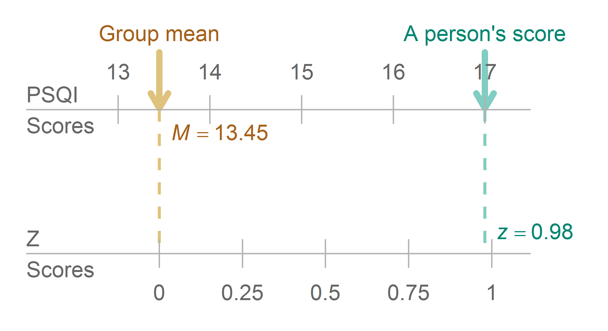
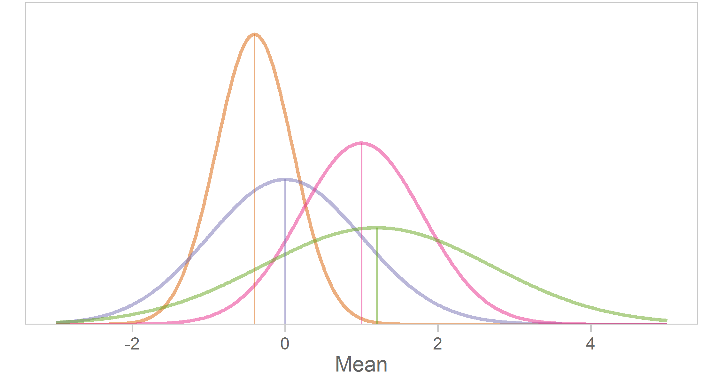
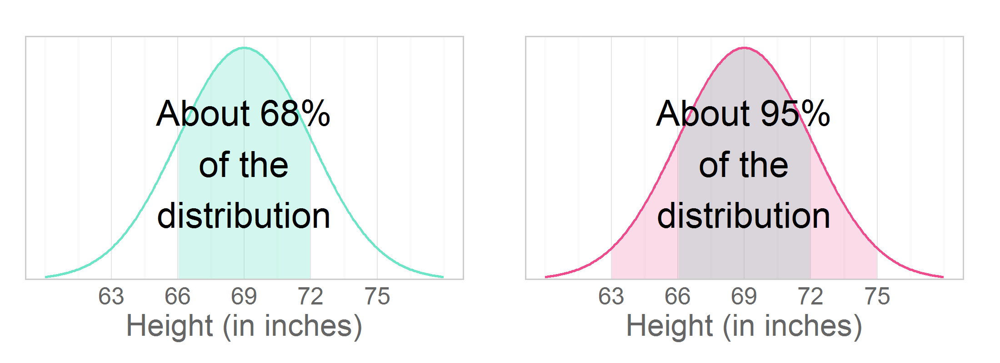
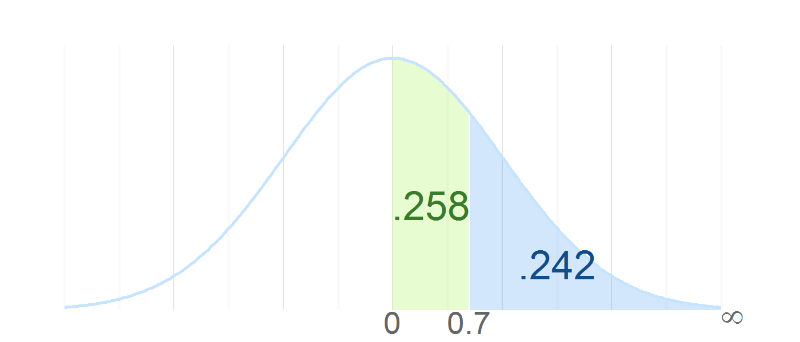

Chapter 04 Graphs
=================================================
This report creates the chapter graphs.

<!--  Set the working directory to the repository's base directory; this assumes the report is nested inside of only one directory.-->

```r
opts_knit$set(root.dir='../')  #Don't combine this call with any other chunk -especially one that uses file paths.
```

<!-- Set the report-wide options, and point to the external code file. -->

```r
require(knitr)
opts_chunk$set(
  results = 'show', 
  message = TRUE,
  comment = NA, 
  tidy = FALSE,
  fig.height = 4, 
  fig.width = 5.5, 
  out.width = "550px", #This affects only the markdown, not the underlying png file.  The height will be scaled appropriately.
  fig.path = 'figure_rmd/',     
  dev = "png",
#   fig.path = 'figure_pdf/',     
#   dev = "pdf",
  dpi = 400
)
echoChunks <- FALSE
options(width=120) #So the output is 50% wider than the default.
read_chunk("./Chapter04/Chapter04.R") 
```
<!-- Load the packages.  Suppress the output when loading packages. --> 


<!-- Load any Global functions and variables declared in the R file.  Suppress the output. --> 


<!-- Declare any global functions specific to a Rmd output.  Suppress the output. --> 


<!-- Load the datasets.   -->


<!-- Tweak the datasets.   -->


## Figure 4-1

## Figure 4-2

## Figure 4-3

## Figure 4-4

## Figure 4-5

## Figure 4-6

|Z     |Inside |Outside |Z     |Inside |Outside |Z     |Inside |Outside |Z     |Inside |Outside |Z     |Inside |Outside |Z     |Inside |Outside |Z     |Inside |Outside |Z     |Inside |Outside |Z     |Inside |Outside |
|:-----|:------|:-------|:-----|:------|:-------|:-----|:------|:-------|:-----|:------|:-------|:-----|:------|:-------|:-----|:------|:-------|:-----|:------|:-------|:-----|:------|:-------|:-----|:------|:-------|
|0.000 |.0000  |.5000   |0.380 |.1480  |.3520   |0.760 |.2764  |.2236   |1.140 |.3729  |.1271   |1.520 |.4357  |.0643   |1.890 |.4706  |.0294   |2.270 |.4884  |.0116   |2.650 |.4960  |.0040   |3.030 |.4988  |.0012   |
|0.010 |.0040  |.4960   |0.390 |.1517  |.3483   |0.770 |.2794  |.2206   |1.150 |.3749  |.1251   |1.530 |.4370  |.0630   |1.900 |.4713  |.0287   |2.280 |.4887  |.0113   |2.660 |.4961  |.0039   |3.040 |.4988  |.0012   |
|0.020 |.0080  |.4920   |0.400 |.1554  |.3446   |0.780 |.2823  |.2177   |1.160 |.3770  |.1230   |1.540 |.4382  |.0618   |1.910 |.4719  |.0281   |2.290 |.4890  |.0110   |2.670 |.4962  |.0038   |3.050 |.4989  |.0011   |
|0.030 |.0120  |.4880   |0.410 |.1591  |.3409   |0.790 |.2852  |.2148   |1.170 |.3790  |.1210   |1.550 |.4394  |.0606   |1.920 |.4726  |.0274   |2.300 |.4893  |.0107   |2.680 |.4963  |.0037   |3.060 |.4989  |.0011   |
|0.040 |.0160  |.4840   |0.420 |.1628  |.3372   |0.800 |.2881  |.2119   |1.180 |.3810  |.1190   |1.560 |.4406  |.0594   |1.930 |.4732  |.0268   |2.310 |.4896  |.0104   |2.690 |.4964  |.0036   |3.070 |.4989  |.0011   |
|0.050 |.0199  |.4801   |0.430 |.1664  |.3336   |0.810 |.2910  |.2090   |1.190 |.3830  |.1170   |1.570 |.4418  |.0582   |1.940 |.4738  |.0262   |2.320 |.4898  |.0102   |2.700 |.4965  |.0035   |3.080 |.4990  |.0010   |
|0.060 |.0239  |.4761   |0.440 |.1700  |.3300   |0.820 |.2939  |.2061   |1.200 |.3849  |.1151   |1.580 |.4429  |.0571   |1.950 |.4744  |.0256   |2.330 |.4901  |.0099   |2.710 |.4966  |.0034   |3.090 |.4990  |.0010   |
|0.070 |.0279  |.4721   |0.450 |.1736  |.3264   |0.830 |.2967  |.2033   |1.210 |.3869  |.1131   |1.590 |.4441  |.0559   |1.960 |.4750  |.0250   |2.340 |.4904  |.0096   |2.720 |.4967  |.0033   |3.100 |.4990  |.0010   |
|0.080 |.0319  |.4681   |0.460 |.1772  |.3228   |0.840 |.2995  |.2005   |1.220 |.3888  |.1112   |1.600 |.4452  |.0548   |1.970 |.4756  |.0244   |2.350 |.4906  |.0094   |2.730 |.4968  |.0032   |3.110 |.4991  |.0009   |
|0.090 |.0359  |.4641   |0.470 |.1808  |.3192   |0.850 |.3023  |.1977   |1.230 |.3907  |.1093   |1.610 |.4463  |.0537   |1.980 |.4761  |.0239   |2.360 |.4909  |.0091   |2.740 |.4969  |.0031   |3.120 |.4991  |.0009   |
|0.100 |.0398  |.4602   |0.480 |.1844  |.3156   |0.860 |.3051  |.1949   |1.240 |.3925  |.1075   |1.620 |.4474  |.0526   |1.990 |.4767  |.0233   |2.370 |.4911  |.0089   |2.750 |.4970  |.0030   |3.130 |.4991  |.0009   |
|0.110 |.0438  |.4562   |0.490 |.1879  |.3121   |0.870 |.3078  |.1922   |1.250 |.3944  |.1056   |1.630 |.4484  |.0516   |2.000 |.4772  |.0228   |2.380 |.4913  |.0087   |2.760 |.4971  |.0029   |3.140 |.4992  |.0008   |
|0.120 |.0478  |.4522   |0.500 |.1915  |.3085   |0.880 |.3106  |.1894   |1.260 |.3962  |.1038   |1.640 |.4495  |.0505   |2.010 |.4778  |.0222   |2.390 |.4916  |.0084   |2.770 |.4972  |.0028   |3.150 |.4992  |.0008   |
|0.130 |.0517  |.4483   |0.510 |.1950  |.3050   |0.890 |.3133  |.1867   |1.270 |.3980  |.1020   |1.645 |.4500  |.0500   |2.020 |.4783  |.0217   |2.400 |.4918  |.0082   |2.780 |.4973  |.0027   |3.160 |.4992  |.0008   |
|0.140 |.0557  |.4443   |0.520 |.1985  |.3015   |0.900 |.3159  |.1841   |1.280 |.3997  |.1003   |1.650 |.4505  |.0495   |2.030 |.4788  |.0212   |2.410 |.4920  |.0080   |2.790 |.4974  |.0026   |3.170 |.4992  |.0008   |
|0.150 |.0596  |.4404   |0.530 |.2019  |.2981   |0.910 |.3186  |.1814   |1.290 |.4015  |.0985   |1.660 |.4515  |.0485   |2.040 |.4793  |.0207   |2.420 |.4922  |.0078   |2.800 |.4974  |.0026   |3.180 |.4993  |.0007   |
|0.160 |.0636  |.4364   |0.540 |.2054  |.2946   |0.920 |.3212  |.1788   |1.300 |.4032  |.0968   |1.670 |.4525  |.0475   |2.050 |.4798  |.0202   |2.430 |.4925  |.0075   |2.810 |.4975  |.0025   |3.190 |.4993  |.0007   |
|0.170 |.0675  |.4325   |0.550 |.2088  |.2912   |0.930 |.3238  |.1762   |1.310 |.4049  |.0951   |1.680 |.4535  |.0465   |2.060 |.4803  |.0197   |2.440 |.4927  |.0073   |2.820 |.4976  |.0024   |3.200 |.4993  |.0007   |
|0.180 |.0714  |.4286   |0.560 |.2123  |.2877   |0.940 |.3264  |.1736   |1.320 |.4066  |.0934   |1.690 |.4545  |.0455   |2.070 |.4808  |.0192   |2.450 |.4929  |.0071   |2.830 |.4977  |.0023   |3.210 |.4993  |.0007   |
|0.190 |.0753  |.4247   |0.570 |.2157  |.2843   |0.950 |.3289  |.1711   |1.330 |.4082  |.0918   |1.700 |.4554  |.0446   |2.080 |.4812  |.0188   |2.460 |.4931  |.0069   |2.840 |.4977  |.0023   |3.220 |.4994  |.0006   |
|0.200 |.0793  |.4207   |0.580 |.2190  |.2810   |0.960 |.3315  |.1685   |1.340 |.4099  |.0901   |1.710 |.4564  |.0436   |2.090 |.4817  |.0183   |2.470 |.4932  |.0068   |2.850 |.4978  |.0022   |3.230 |.4994  |.0006   |
|0.210 |.0832  |.4168   |0.590 |.2224  |.2776   |0.970 |.3340  |.1660   |1.350 |.4115  |.0885   |1.720 |.4573  |.0427   |2.100 |.4821  |.0179   |2.480 |.4934  |.0066   |2.860 |.4979  |.0021   |3.240 |.4994  |.0006   |
|0.220 |.0871  |.4129   |0.600 |.2257  |.2743   |0.980 |.3365  |.1635   |1.360 |.4131  |.0869   |1.730 |.4582  |.0418   |2.110 |.4826  |.0174   |2.490 |.4936  |.0064   |2.870 |.4979  |.0021   |3.250 |.4994  |.0006   |
|0.230 |.0910  |.4090   |0.610 |.2291  |.2709   |0.990 |.3389  |.1611   |1.370 |.4147  |.0853   |1.740 |.4591  |.0409   |2.120 |.4830  |.0170   |2.500 |.4938  |.0062   |2.880 |.4980  |.0020   |3.300 |.4995  |.00048  |
|0.240 |.0948  |.4052   |0.620 |.2324  |.2676   |1.000 |.3413  |.1587   |1.380 |.4162  |.0838   |1.750 |.4599  |.0401   |2.130 |.4834  |.0166   |2.510 |.4940  |.0060   |2.890 |.4981  |.0019   |3.350 |.4996  |.00040  |
|0.250 |.0987  |.4013   |0.630 |.2357  |.2643   |1.010 |.3438  |.1562   |1.390 |.4177  |.0823   |1.760 |.4608  |.0392   |2.140 |.4838  |.0162   |2.520 |.4941  |.0059   |2.900 |.4981  |.0019   |3.400 |.4997  |.00034  |
|0.260 |.1026  |.3974   |0.640 |.2389  |.2611   |1.020 |.3461  |.1539   |1.400 |.4192  |.0808   |1.770 |.4616  |.0384   |2.150 |.4842  |.0158   |2.530 |.4943  |.0057   |2.910 |.4982  |.0018   |3.450 |.4997  |.00028  |
|0.270 |.1064  |.3936   |0.650 |.2422  |.2578   |1.030 |.3485  |.1515   |1.410 |.4207  |.0793   |1.780 |.4625  |.0375   |2.160 |.4846  |.0154   |2.540 |.4945  |.0055   |2.920 |.4982  |.0018   |3.500 |.4998  |.00023  |
|0.280 |.1103  |.3897   |0.660 |.2454  |.2546   |1.040 |.3508  |.1492   |1.420 |.4222  |.0778   |1.790 |.4633  |.0367   |2.170 |.4850  |.0150   |2.550 |.4946  |.0054   |2.930 |.4983  |.0017   |3.600 |.4998  |.00016  |
|0.290 |.1141  |.3859   |0.670 |.2486  |.2514   |1.050 |.3531  |.1469   |1.430 |.4236  |.0764   |1.800 |.4641  |.0359   |2.180 |.4854  |.0146   |2.560 |.4948  |.0052   |2.940 |.4984  |.0016   |3.700 |.4999  |.00011  |
|0.300 |.1179  |.3821   |0.680 |.2517  |.2483   |1.060 |.3554  |.1446   |1.440 |.4251  |.0749   |1.810 |.4649  |.0351   |2.190 |.4857  |.0143   |2.570 |.4949  |.0051   |2.950 |.4984  |.0016   |3.800 |.4999  |.00007  |
|0.310 |.1217  |.3783   |0.690 |.2549  |.2451   |1.070 |.3577  |.1423   |1.450 |.4265  |.0735   |1.820 |.4656  |.0344   |2.200 |.4861  |.0139   |2.580 |.4951  |.0049   |2.960 |.4985  |.0015   |3.900 |.5000  |.00005  |
|0.320 |.1255  |.3745   |0.700 |.2580  |.2420   |1.080 |.3599  |.1401   |1.460 |.4279  |.0721   |1.830 |.4664  |.0336   |2.210 |.4864  |.0136   |2.590 |.4952  |.0048   |2.970 |.4985  |.0015   |4.000 |.5000  |.00003  |
|0.330 |.1293  |.3707   |0.710 |.2611  |.2389   |1.090 |.3621  |.1379   |1.470 |.4292  |.0708   |1.840 |.4671  |.0329   |2.220 |.4868  |.0132   |2.600 |.4953  |.0047   |2.980 |.4986  |.0014   |      |       |        |
|0.340 |.1331  |.3669   |0.720 |.2642  |.2358   |1.100 |.3643  |.1357   |1.480 |.4306  |.0694   |1.850 |.4678  |.0322   |2.230 |.4871  |.0129   |2.610 |.4955  |.0045   |2.990 |.4986  |.0014   |      |       |        |
|0.350 |.1368  |.3632   |0.730 |.2673  |.2327   |1.110 |.3665  |.1335   |1.490 |.4319  |.0681   |1.860 |.4686  |.0314   |2.240 |.4875  |.0125   |2.620 |.4956  |.0044   |3.000 |.4987  |.0013   |      |       |        |
|0.360 |.1406  |.3594   |0.740 |.2704  |.2296   |1.120 |.3686  |.1314   |1.500 |.4332  |.0668   |1.870 |.4693  |.0307   |2.250 |.4878  |.0122   |2.630 |.4957  |.0043   |3.010 |.4987  |.0013   |      |       |        |
|0.370 |.1443  |.3557   |0.750 |.2734  |.2266   |1.130 |.3708  |.1292   |1.510 |.4345  |.0655   |1.880 |.4699  |.0301   |2.260 |.4881  |.0119   |2.640 |.4959  |.0041   |3.020 |.4987  |.0013   |      |       |        |
## Figures4-7

## Figure 4-8

## Figure 4-9


## Unused Graphics


## Session Info
For the sake of documentation and reproducibility, the current report was build on a system using the following software.


```
Report created by wibeasley at 2014-06-08, 10:02 -0500
```

```
R version 3.1.0 (2014-04-10)
Platform: x86_64-pc-linux-gnu (64-bit)

locale:
 [1] LC_CTYPE=en_US.UTF-8       LC_NUMERIC=C               LC_TIME=en_US.UTF-8        LC_COLLATE=en_US.UTF-8    
 [5] LC_MONETARY=en_US.UTF-8    LC_MESSAGES=en_US.UTF-8    LC_PAPER=en_US.UTF-8       LC_NAME=C                 
 [9] LC_ADDRESS=C               LC_TELEPHONE=C             LC_MEASUREMENT=en_US.UTF-8 LC_IDENTIFICATION=C       

attached base packages:
[1] grid      stats     graphics  grDevices utils     datasets  methods   base     

other attached packages:
 [1] dichromat_2.0-0    extrafont_0.16     reshape2_1.4       ggthemes_1.7.0     ggplot2_1.0.0      gridExtra_0.9.1   
 [7] scales_0.2.4       plyr_1.8.1         RColorBrewer_1.0-5 knitr_1.6         

loaded via a namespace (and not attached):
 [1] colorspace_1.2-4 digest_0.6.4     evaluate_0.5.5   extrafontdb_1.0  formatR_0.10     gtable_0.1.2    
 [7] labeling_0.2     MASS_7.3-33      munsell_0.4.2    proto_0.3-10     Rcpp_0.11.1      Rttf2pt1_1.3    
[13] stringr_0.6.2    tools_3.1.0     
```

## License

<a rel="license" href="http://creativecommons.org/licenses/by/3.0/"></a><br />This work is licensed under a <a rel="license" href="http://creativecommons.org/licenses/by/3.0/">Creative Commons Attribution 3.0 Unported License</a>.
