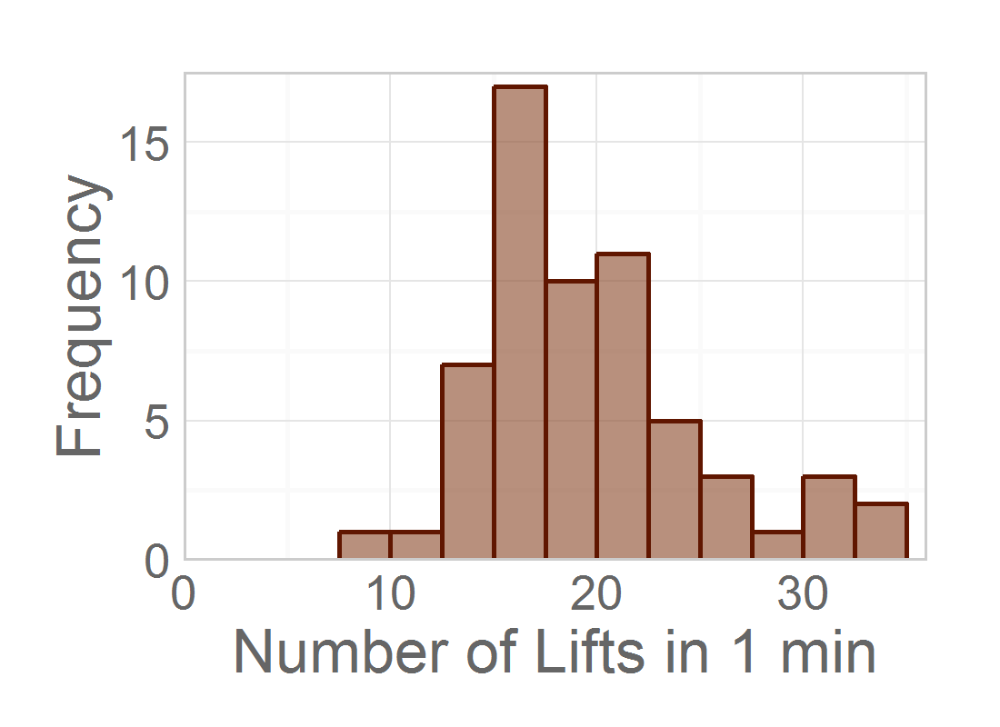
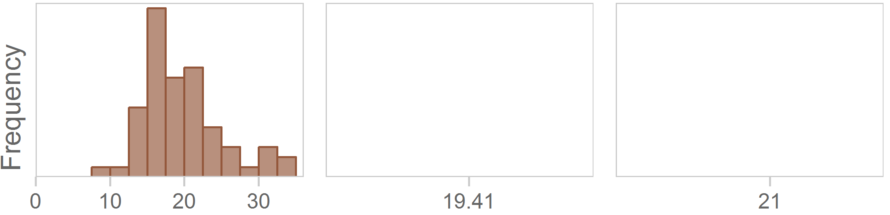
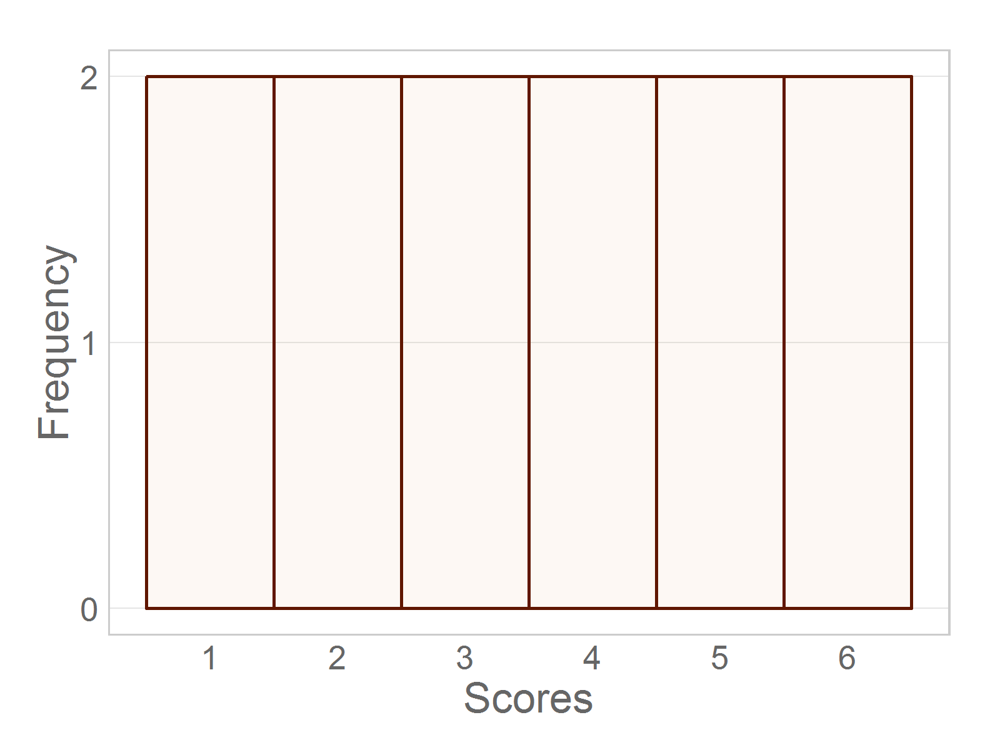
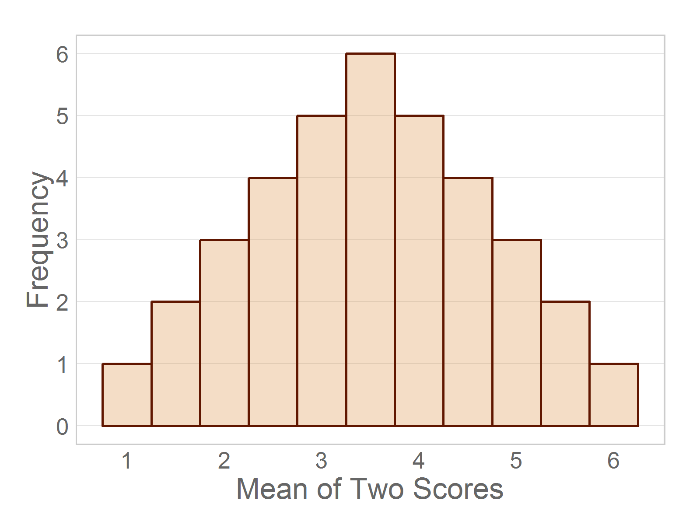

Chapter 07 Graphs
=================================================
This report creates the chapter graphs.

<!--  Set the working directory to the repository's base directory; this assumes the report is nested inside of only one directory.-->

```r
opts_knit$set(root.dir = "../")  #Don't combine this call with any other chunk -especially one that uses file paths.
```


<!-- Set the report-wide options, and point to the external code file. -->

```r
require(knitr)
opts_chunk$set(
  results='show', 
  message = TRUE,
  comment = NA, 
  tidy = FALSE,
  fig.width = 5.5/2, 
  fig.height = 4/2, 
  out.width = "275px", #This affects only the markdown, not the underlying png file.  The height will be scaled appropriately.
  fig.path = 'figure_rmd/',     
  dev = "png",
  #     dev = "pdf",
  dpi = 400
)
echoChunks <- FALSE
options(width=120) #So the output is 50% wider than the default.
read_chunk("./Chapter07/Chapter07.R") 
```

<!-- Load the packages.  Suppress the output when loading packages. --> 


<!-- Load any Global functions and variables declared in the R file.  Suppress the output. --> 


<!-- Declare any global functions specific to a Rmd output.  Suppress the output. --> 


<!-- Load the datasets. -->


<!-- Tweak the datasets. -->


## Figure 7-1


## Figure 7-2


## Figure 7-3


## Figure 7-4

```
Reminder, the publisher needs to add the title `Population of 12 Scores`.
```



## Figure 7-5

```
Reminder, the publisher needs to add the title `All Possible Means (N=2) from Limited Population`, where the `N` is italicized.
```



## Figure 7-6


## Session Info
For the sake of documentation and reproducibility, the current report was build on a system using the following software.


```
Report created by Will at 2014-04-10, 17:14 Central Daylight Time
```

```
R version 3.0.3 Patched (2014-03-06 r65320)
Platform: x86_64-w64-mingw32/x64 (64-bit)

locale:
[1] LC_COLLATE=English_United States.1252  LC_CTYPE=English_United States.1252    LC_MONETARY=English_United States.1252
[4] LC_NUMERIC=C                           LC_TIME=English_United States.1252    

attached base packages:
[1] grid      stats     graphics  grDevices utils     datasets  methods   base     

other attached packages:
 [1] dichromat_2.0-0    extrafont_0.16     reshape2_1.2.2     ggthemes_1.6.0     ggplot2_0.9.3.1    gridExtra_0.9.1   
 [7] scales_0.2.3       plyr_1.8.1         RColorBrewer_1.0-5 knitr_1.5         

loaded via a namespace (and not attached):
 [1] colorspace_1.2-4 digest_0.6.4     evaluate_0.5.3   extrafontdb_1.0  formatR_0.10     gtable_0.1.2    
 [7] labeling_0.2     MASS_7.3-31      munsell_0.4.2    proto_0.3-10     Rcpp_0.11.1      Rttf2pt1_1.3    
[13] stringr_0.6.2    tools_3.0.3     
```


## License

<a rel="license" href="http://creativecommons.org/licenses/by/3.0/"></a><br />This work is licensed under a <a rel="license" href="http://creativecommons.org/licenses/by/3.0/">Creative Commons Attribution 3.0 Unported License</a>.
