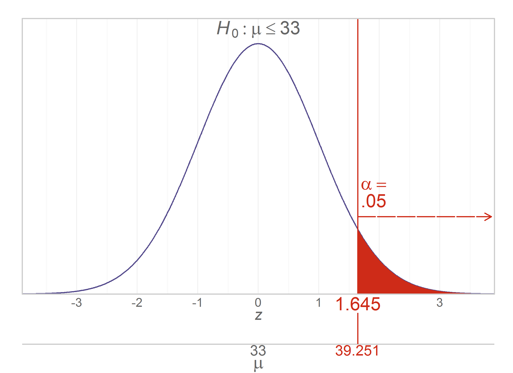

Chapter 09 Graphs
=================================================
This report creates the chapter graphs.

<!--  Set the working directory to the repository's base directory; this assumes the report is nested inside of only one directory.-->
```{r, echo=TRUE, message=F} 
opts_knit$set(root.dir='../')  #Don't combine this call with any other chunk -especially one that uses file paths.
```

<!-- Set the report-wide options, and point to the external code file. -->
```{r set_options, echo=TRUE}
require(knitr)
opts_chunk$set(
  results = 'show',
  message = TRUE,
  comment = NA, 
  tidy = FALSE,
  fig.width = 5.5, 
  fig.height = 4, 
  out.width = "550px", #This affects only the markdown, not the underlying png file.  The height will be scaled appropriately.
  fig.path = 'figure_rmd/',     
  dev = "png",
#     dev = "pdf",
  dpi = 400
)
echoChunks <- FALSE
options(width=120) #So the output is 50% wider than the default.
read_chunk("./Chapter09/Chapter09.R") 
```
<!-- Load the packages.  Suppress the output when loading packages. --> 
```{r LoadPackages, echo=echoChunks, message=FALSE}
```

<!-- Load any Global functions and variables declared in the R file.  Suppress the output. --> 
```{r DeclareGlobals, echo=echoChunks, message=FALSE}
```

<!-- Declare any global functions specific to a Rmd output.  Suppress the output. --> 
```{r, echo=echoChunks, message=FALSE}
```

<!-- Load the datasets. -->
```{r LoadDatasets, echo=echoChunks, message=FALSE}
```

<!-- Tweak the datasets. -->
```{r TweakDatasets, echo=echoChunks, message=FALSE}
```

## Figure 9-1
```{r Figure09_01, echo=echoChunks}
```

## Figure 9-2
```{r Figure09_02, echo=echoChunks}
```

## Figure 9-3
```{r Figure09_03, echo=echoChunks}
```

## Figure 9-4
```{r Figure09_04, echo=echoChunks}
```

## Figure 9-5
```{r Figure09_05, echo=echoChunks}
```

## Figure 9-6
```{r Figure09_06, echo=echoChunks}
```

## Figure 9-7


## Figure 9-8


## Figure 9-9
Lise, instead of side-by-side graphs, how do you feel about overlaying Figure 9-02 & 9-03, similar to what we did with [Figure 12-08](https://github.com/OuhscBbmc/DeSheaToothakerIntroStats/blob/master/Chapter12/figure_rmd/Figure12_08.png) for the *F* distribution?  If so, do you want to keep the gray horiztonal lines that say .95 and .99?

## Figure 9-10
```{r Figure09_10, echo=echoChunks}
```

## Figure 9-11
```{r Figure09_11, echo=echoChunks, fig.height=1.5}
```

## Session Info
For the sake of documentation and reproducibility, the current report was build on a system using the following software.

```{r session_info, echo=FALSE}
cat("Report created by", Sys.info()["user"], "at", strftime(Sys.time(), "%Y-%m-%d, %H:%M %z"))
sessionInfo()
```
