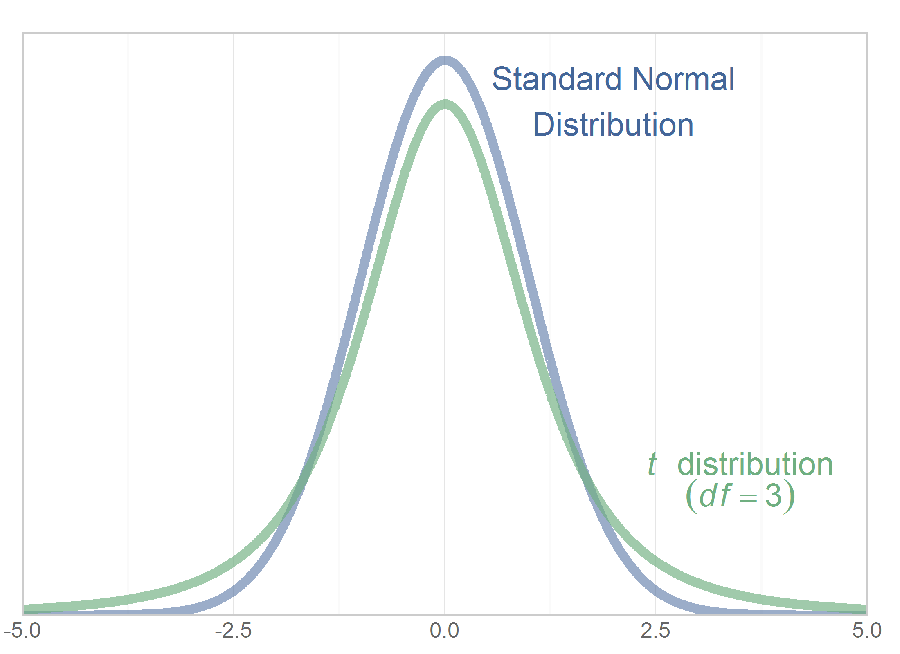
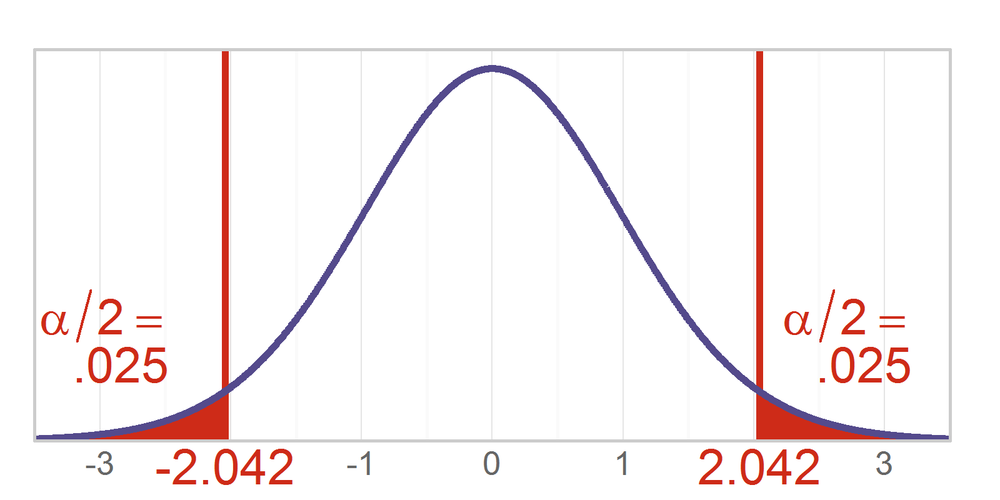
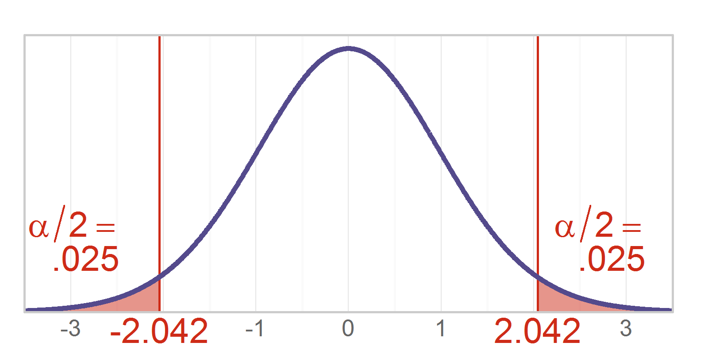

Chapter 10 Graphs
=================================================
This report creates the chapter graphs.

<!--  Set the working directory to the repository's base directory; this assumes the report is nested inside of only one directory.-->

```r
opts_knit$set(root.dir = "../")  #Don't combine this call with any other chunk -especially one that uses file paths.
```


<!-- Set the report-wide options, and point to the external code file. -->

```r
require(knitr)
opts_chunk$set(
  results = 'show', 
  message=TRUE,
  comment = NA, 
  tidy = FALSE,
  fig.width = 4, 
  fig.height = 2, 
  out.width = "400px", #This affects only the markdown, not the underlying png file.  The height will be scaled appropriately.
  fig.path = 'figure_rmd/',     
  dev = "png",
  dpi = 400
  #dev = "pdf"
)
echoChunks <- FALSE
options(width=120) #So the output is 50% wider than the default.
read_chunk("./Chapter10/Chapter10.R") 
```

<!-- Load the packages.  Suppress the output when loading packages. --> 


<!-- Load any Global functions and variables declared in the R file.  Suppress the output. --> 


<!-- Declare any global functions specific to a Rmd output.  Suppress the output. --> 


<!-- Load the datasets. -->


<!-- Tweak the datasets. -->


## Figure 10-1



## Figure 10-2



## Figure 10-3


```

Call:
lm(formula = FiqT2 ~ 1 + Group, data = dsTaiChi)

Residuals:
   Min     1Q Median     3Q    Max 
-36.66 -14.79   2.18  15.34  34.72 

Coefficients:
               Estimate Std. Error t value Pr(>|t|)    
(Intercept)       58.60       3.16   18.53  < 2e-16 ***
GroupTreatment   -23.50       4.47   -5.25  1.8e-06 ***
---
Signif. codes:  0 '***' 0.001 '**' 0.01 '*' 0.05 '.' 0.1 ' ' 1

Residual standard error: 18.2 on 64 degrees of freedom
Multiple R-squared:  0.301,	Adjusted R-squared:  0.29 
F-statistic: 27.6 on 1 and 64 DF,  p-value: 1.82e-06
```

```
      Group    M    SD Count    SE  Crit Upper Lower
1   Control 58.6 17.56    33 3.056 2.037 64.83 52.38
2 Treatment 35.1 18.76    33 3.266 2.037 41.76 28.45
```


## Session Info
For the sake of documentation and reproducibility, the current report was build on a system using the following software.


```
Report created by Will at 2014-04-07, 22:41 Central Daylight Time
```

```
R version 3.0.3 Patched (2014-03-06 r65320)
Platform: x86_64-w64-mingw32/x64 (64-bit)

locale:
[1] LC_COLLATE=English_United States.1252  LC_CTYPE=English_United States.1252    LC_MONETARY=English_United States.1252
[4] LC_NUMERIC=C                           LC_TIME=English_United States.1252    

attached base packages:
[1] grid      stats     graphics  grDevices utils     datasets  methods   base     

other attached packages:
[1] RColorBrewer_1.0-5 dichromat_2.0-0    extrafont_0.16     ggplot2_0.9.3.1    scales_0.2.3       plyr_1.8.1        
[7] knitr_1.5         

loaded via a namespace (and not attached):
 [1] colorspace_1.2-4 digest_0.6.4     evaluate_0.5.3   extrafontdb_1.0  formatR_0.10     gtable_0.1.2    
 [7] labeling_0.2     MASS_7.3-29      munsell_0.4.2    proto_0.3-10     Rcpp_0.11.1      reshape2_1.2.2  
[13] Rttf2pt1_1.3     stringr_0.6.2    tools_3.0.3     
```

