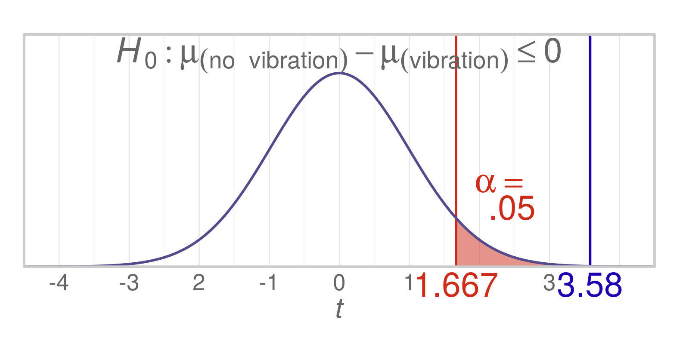
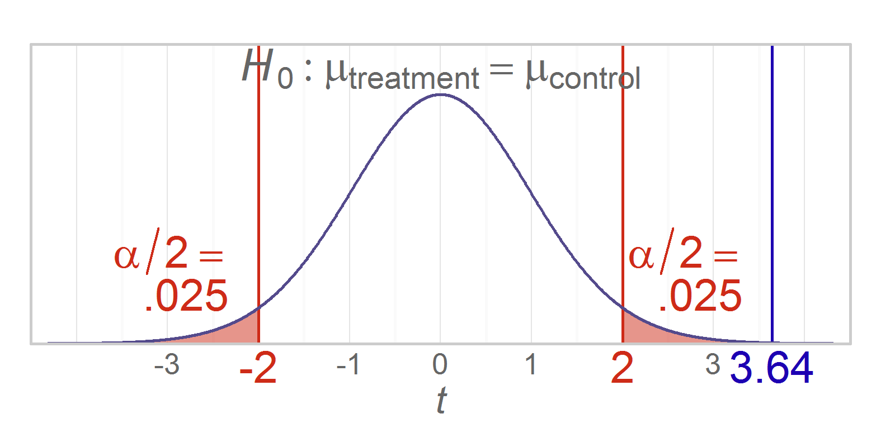
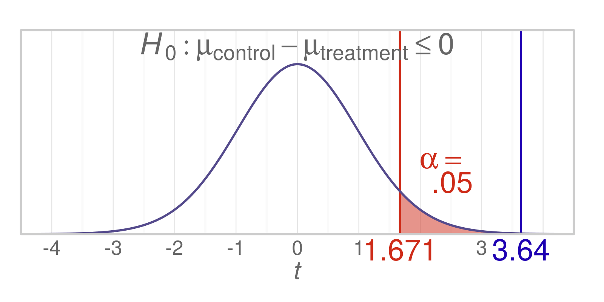

Chapter 11 Graphs
=================================================
This report creates the chapter graphs.

<!--  Set the working directory to the repository's base directory; this assumes the report is nested inside of only one directory.-->

```r
knitr::opts_knit$set(root.dir='../')  #Don't combine this call with any other chunk -especially one that uses file paths.
```

<!-- Set the report-wide options, and point to the external code file. -->

```r
require(knitr)
```

```
## Loading required package: knitr
```

```r
opts_chunk$set(
  results = 'show', 
  message = TRUE,
  comment = NA, 
  tidy = FALSE,
  fig.height = 2,
  fig.width = 4,  
  out.width = "400px", #This affects only the markdown, not the underlying png file.  The height will be scaled appropriately.
  fig.path = 'figure_rmd/',     
  dev = "png",
  dpi = 400
  # fig.path = 'figure_pdf/',     
  # dev = "pdf"
)
echoChunks <- FALSE
options(width=120) #So the output is 50% wider than the default.
read_chunk("./Chapter11/Chapter11.R") 
```
<!-- Load the packages.  Suppress the output when loading packages. --> 


<!-- Load any Global functions and variables declared in the R file.  Suppress the output. --> 


<!-- Declare any global functions specific to a Rmd output.  Suppress the output. --> 


<!-- Load the datasets. -->


<!-- Tweak the datasets. -->


## Figure 11-1


## Figure 11-2


## Figure 11-3


## Session Info
For the sake of documentation and reproducibility, the current report was build on a system using the following software.


```
Report created by wbeasley at 2014-11-17, 11:30 -0600
```

```
R version 3.1.2 Patched (2014-10-31 r66921)
Platform: x86_64-w64-mingw32/x64 (64-bit)

locale:
[1] LC_COLLATE=English_United States.1252  LC_CTYPE=English_United States.1252    LC_MONETARY=English_United States.1252
[4] LC_NUMERIC=C                           LC_TIME=English_United States.1252    

attached base packages:
[1] grid      stats     graphics  grDevices utils     datasets  methods   base     

other attached packages:
[1] RColorBrewer_1.0-5 dichromat_2.0-0    extrafont_0.16     ggplot2_1.0.0      scales_0.2.4       plyr_1.8.1        
[7] knitr_1.8         

loaded via a namespace (and not attached):
 [1] colorspace_1.2-4 digest_0.6.4     evaluate_0.5.5   extrafontdb_1.0  formatR_1.0      gtable_0.1.2    
 [7] htmltools_0.2.6  MASS_7.3-35      munsell_0.4.2    proto_0.3-10     Rcpp_0.11.3      reshape2_1.4    
[13] rmarkdown_0.3.10 Rttf2pt1_1.3.2   stringr_0.6.2    tools_3.1.2      yaml_2.1.13     
```

## License

<a rel="license" href="http://creativecommons.org/licenses/by/3.0/"></a><br />This work is licensed under a <a rel="license" href="http://creativecommons.org/licenses/by/3.0/">Creative Commons Attribution 3.0 Unported License</a>.
