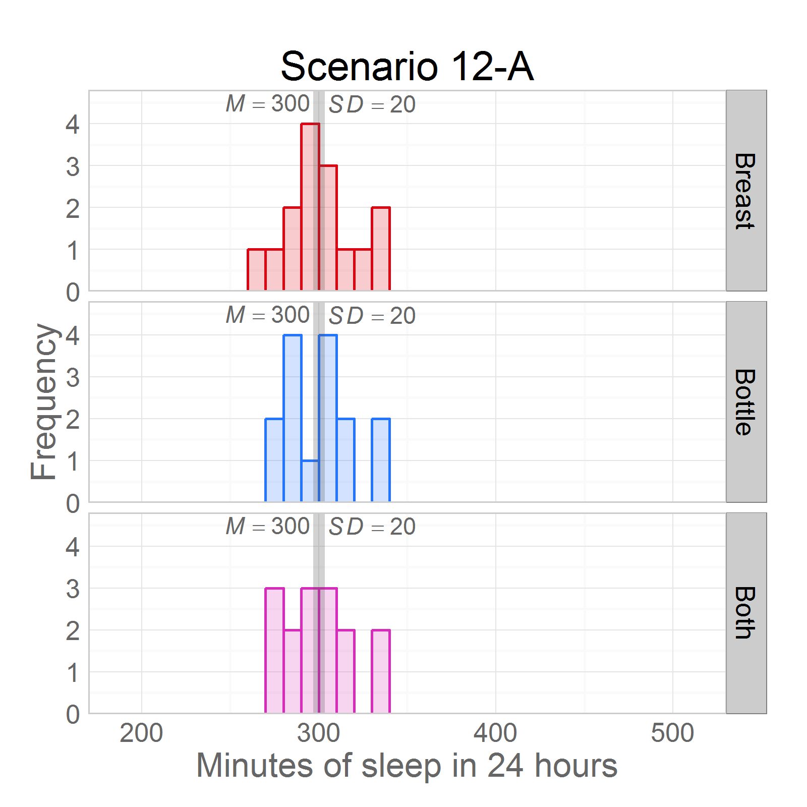
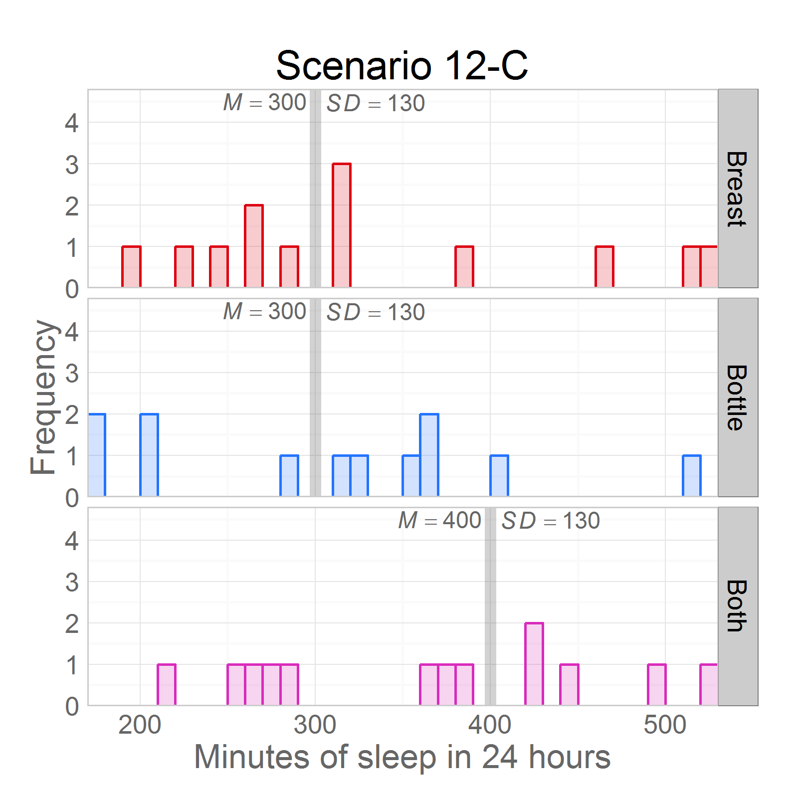
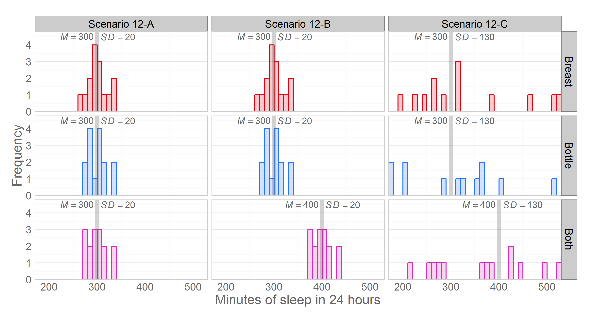
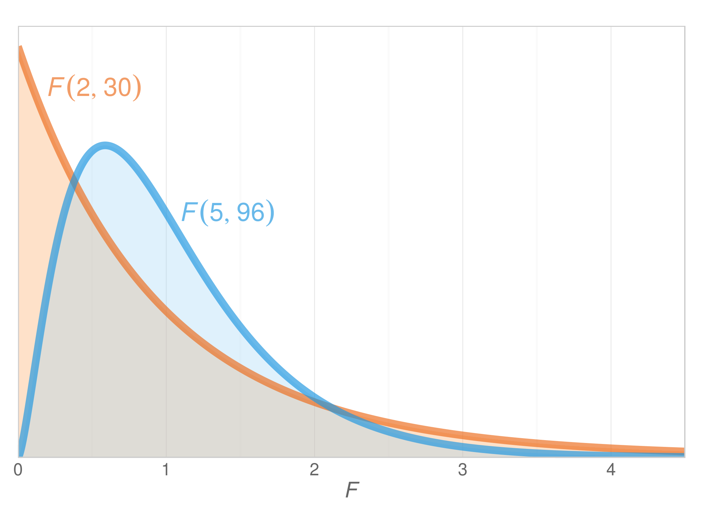
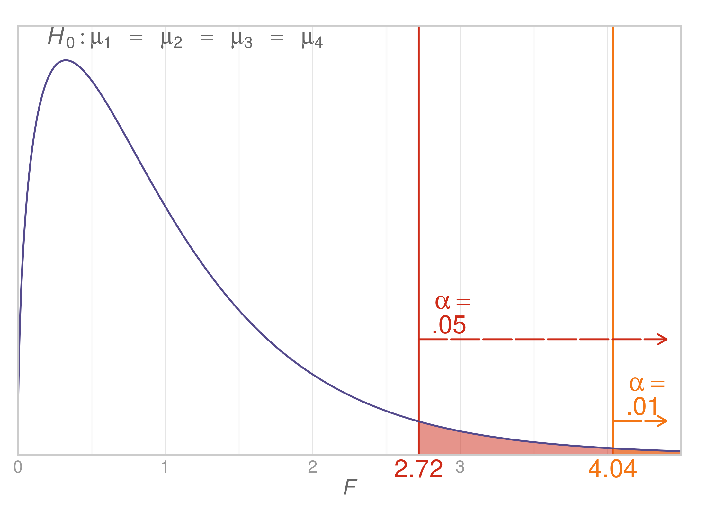
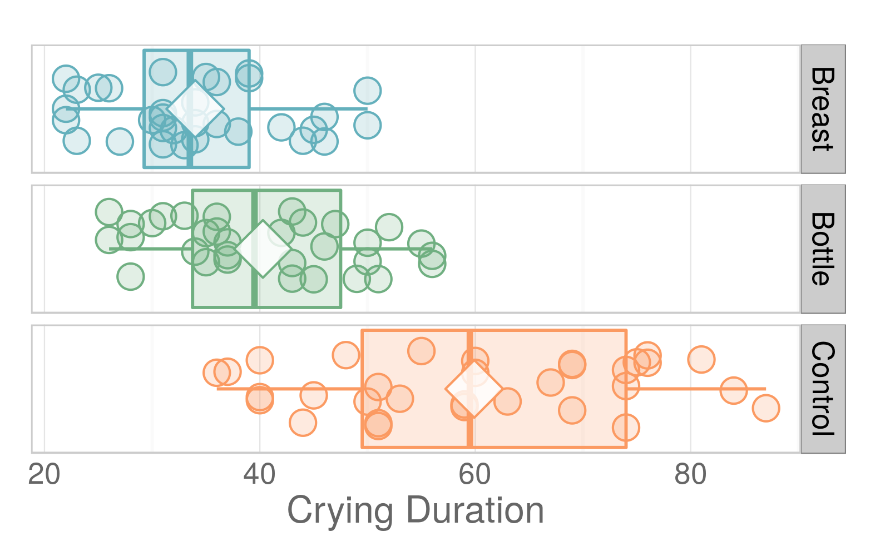
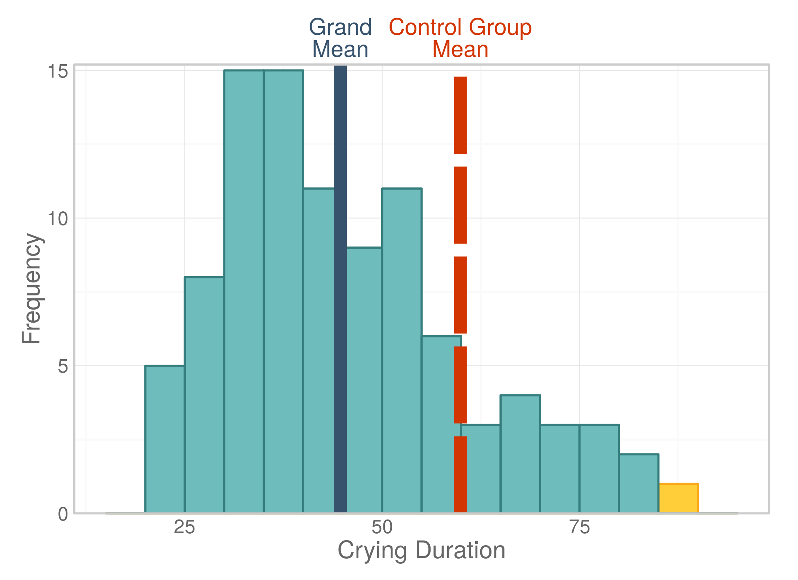
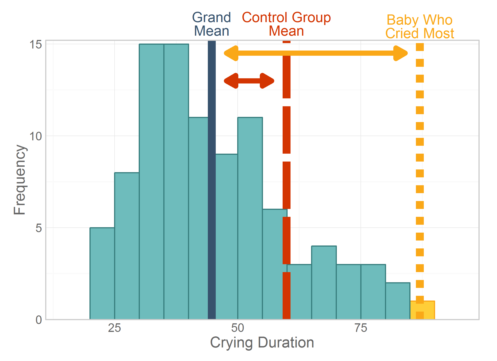
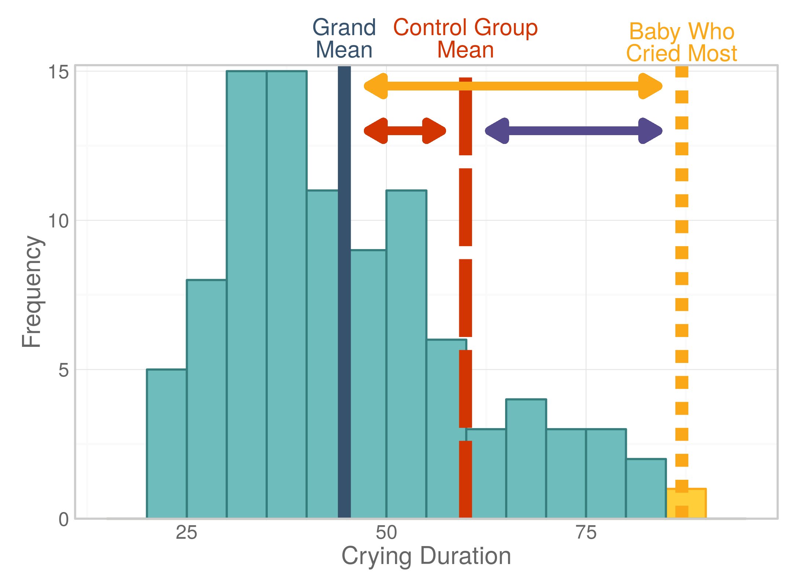
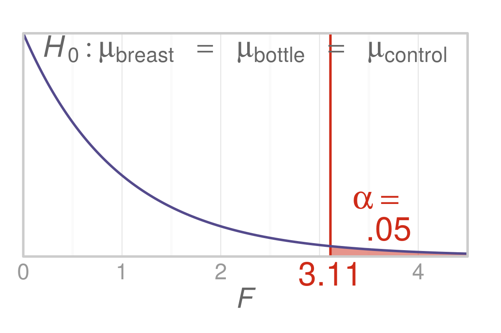

Chapter 12 Graphs
=================================================
This report creates the chapter graphs.

<!--  Set the working directory to the repository's base directory; this assumes the report is nested inside of only one directory.-->

```r
knitr::opts_knit$set(root.dir='../')  #Don't combine this call with any other chunk -especially one that uses file paths.
```

<!-- Set the report-wide options, and point to the external code file. -->

```r
require(knitr)
opts_chunk$set(
  results = 'show', 
  message = TRUE,
  comment = NA, 
  tidy = FALSE,
  fig.width = 5.5, 
  fig.height = 4, 
  out.width = "550px", #This affects only the markdown, not the underlying png file.  The height will be scaled appropriately.
  fig.path = 'figure_rmd/',     
  dev = "png",
  dpi = 400
  # fig.path = 'figure_pdf/',     
  # dev = "pdf"
)
echoChunks <- FALSE
options(width=120) #So the output is 50% wider than the default.
read_chunk("./Chapter12/Chapter12.R") 
```
<!-- Load the packages.  Suppress the output when loading packages. --> 


<!-- Load any Global functions and variables declared in the R file.  Suppress the output. --> 


<!-- Declare any global functions specific to a Rmd output.  Suppress the output. --> 


<!-- Load the datasets. -->


<!-- Tweak the datasets. -->

```
#####  ANOVAs for Feeding dataset #####
```

```

Call:
lm(formula = Sleep ~ 1 + Feeding, data = dsFeed[dsFeed$ScenarioID == 
    1, ])

Residuals:
    Min      1Q  Median      3Q     Max 
-32.952 -16.747  -1.703  10.159  37.141 

Coefficients:
                Estimate Std. Error t value Pr(>|t|)    
(Intercept)    3.000e+02  5.164e+00   58.09   <2e-16 ***
FeedingBottle -1.036e-13  7.303e+00    0.00        1    
FeedingBoth   -1.017e-13  7.303e+00    0.00        1    
---
Signif. codes:  0 '***' 0.001 '**' 0.01 '*' 0.05 '.' 0.1 ' ' 1

Residual standard error: 20 on 42 degrees of freedom
Multiple R-squared:  2.712e-29,	Adjusted R-squared:  -0.04762 
F-statistic: 5.695e-28 on 2 and 42 DF,  p-value: 1
```

```

Call:
lm(formula = Sleep ~ 1 + Feeding, data = dsFeed[dsFeed$ScenarioID == 
    2, ])

Residuals:
    Min      1Q  Median      3Q     Max 
-32.952 -16.747  -1.703  10.159  37.141 

Coefficients:
                Estimate Std. Error t value Pr(>|t|)    
(Intercept)    3.000e+02  5.164e+00   58.09   <2e-16 ***
FeedingBottle -1.348e-13  7.303e+00    0.00        1    
FeedingBoth    1.000e+02  7.303e+00   13.69   <2e-16 ***
---
Signif. codes:  0 '***' 0.001 '**' 0.01 '*' 0.05 '.' 0.1 ' ' 1

Residual standard error: 20 on 42 degrees of freedom
Multiple R-squared:  0.8562,	Adjusted R-squared:  0.8493 
F-statistic:   125 on 2 and 42 DF,  p-value: < 2.2e-16
```

```

Call:
lm(formula = Sleep ~ 1 + Feeding, data = dsFeed[dsFeed$ScenarioID == 
    3, ])

Residuals:
    Min      1Q  Median      3Q     Max 
-214.19 -108.86  -11.07   66.03  241.42 

Coefficients:
               Estimate Std. Error t value Pr(>|t|)    
(Intercept)   3.000e+02  3.357e+01   8.938 2.87e-11 ***
FeedingBottle 6.291e-14  4.747e+01   0.000   1.0000    
FeedingBoth   1.000e+02  4.747e+01   2.107   0.0412 *  
---
Signif. codes:  0 '***' 0.001 '**' 0.01 '*' 0.05 '.' 0.1 ' ' 1

Residual standard error: 130 on 42 degrees of freedom
Multiple R-squared:  0.1235,	Adjusted R-squared:  0.08175 
F-statistic: 2.959 on 2 and 42 DF,  p-value: 0.06279
```

```
##### ANOVAs for Crying dataset #####
```

```

Call:
lm(formula = CryingDuration ~ 1 + Group, data = dsCry)

Residuals:
     Min       1Q   Median       3Q      Max 
-23.9062  -8.9062  -0.4531   9.0938  27.0938 

Coefficients:
             Estimate Std. Error t value Pr(>|t|)    
(Intercept)    34.000      1.962  17.333  < 2e-16 ***
GroupBottle     6.281      2.774   2.264   0.0259 *  
GroupControl   25.906      2.774   9.339 5.13e-15 ***
---
Signif. codes:  0 '***' 0.001 '**' 0.01 '*' 0.05 '.' 0.1 ' ' 1

Residual standard error: 11.1 on 93 degrees of freedom
Multiple R-squared:  0.5051,	Adjusted R-squared:  0.4945 
F-statistic: 47.46 on 2 and 93 DF,  p-value: 6.231e-15
```

## Figure 12-1
This figure will be typeset by the publisher.

## Figure 12-2


## Figure 12-3


## Figure 12-4



## Figure 12-5


## Figure 12-6


## Figure 12-7
Table of Critical *F* values.  Will be produced by publisher.

## Figure 12-8


## Figure 12-9


## Figure 12-10


## Figure 12-11


## Figure 12-12


## Figure 12-13


## Figure 12-14


## Session Info
For the sake of documentation and reproducibility, the current report was build on a system using the following software.


```
Report created by wibeasley at 2014-11-19, 00:45 -0600
```

```
R version 3.1.2 (2014-10-31)
Platform: x86_64-pc-linux-gnu (64-bit)

locale:
 [1] LC_CTYPE=en_US.UTF-8       LC_NUMERIC=C               LC_TIME=en_US.UTF-8        LC_COLLATE=en_US.UTF-8    
 [5] LC_MONETARY=en_US.UTF-8    LC_MESSAGES=en_US.UTF-8    LC_PAPER=en_US.UTF-8       LC_NAME=C                 
 [9] LC_ADDRESS=C               LC_TELEPHONE=C             LC_MEASUREMENT=en_US.UTF-8 LC_IDENTIFICATION=C       

attached base packages:
[1] grid      stats     graphics  grDevices utils     datasets  methods   base     

other attached packages:
 [1] ggthemes_1.7.0     gridExtra_0.9.1    epade_0.3.8        plotrix_3.5-10     reshape2_1.4       scales_0.2.4      
 [7] plyr_1.8.1         RColorBrewer_1.0-5 dichromat_2.0-0    extrafont_0.16     wesanderson_0.3    ggplot2_1.0.0     
[13] knitr_1.8         

loaded via a namespace (and not attached):
 [1] colorspace_1.2-4 digest_0.6.4     evaluate_0.5.5   extrafontdb_1.0  formatR_1.0      gtable_0.1.2    
 [7] htmltools_0.2.6  labeling_0.3     MASS_7.3-35      munsell_0.4.2    proto_0.3-10     Rcpp_0.11.3     
[13] rmarkdown_0.3.3  Rttf2pt1_1.3.2   stringr_0.6.2    tools_3.1.2      yaml_2.1.13     
```

## License

<a rel="license" href="http://creativecommons.org/licenses/by/3.0/"></a><br />This work is licensed under a <a rel="license" href="http://creativecommons.org/licenses/by/3.0/">Creative Commons Attribution 3.0 Unported License</a>.
