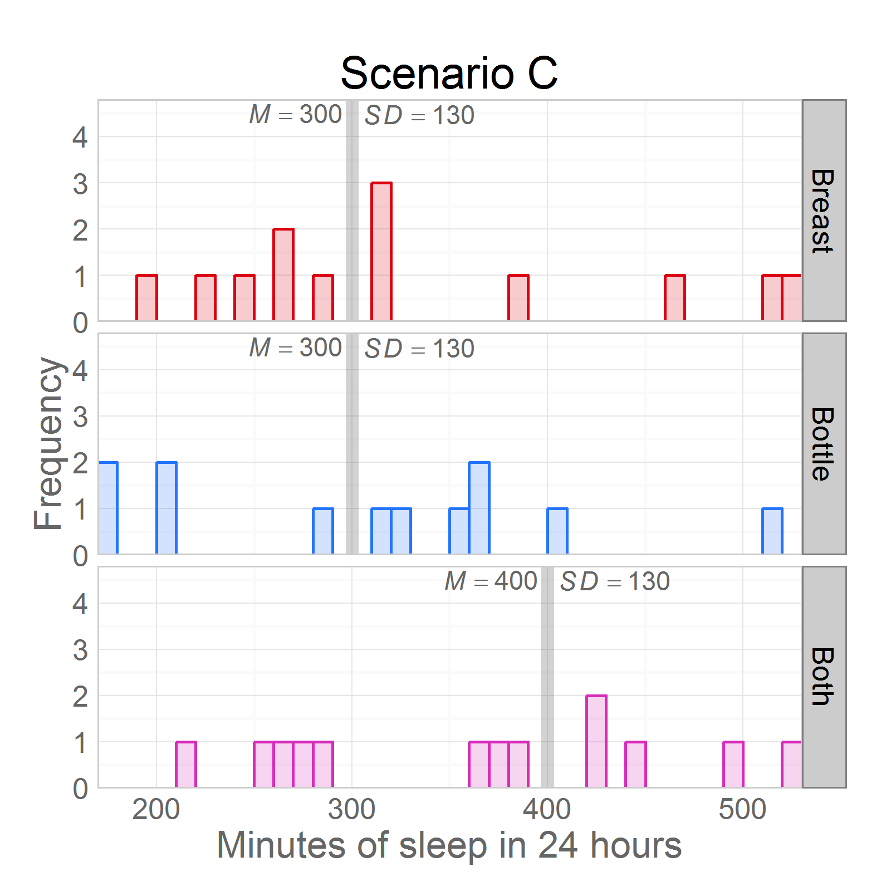
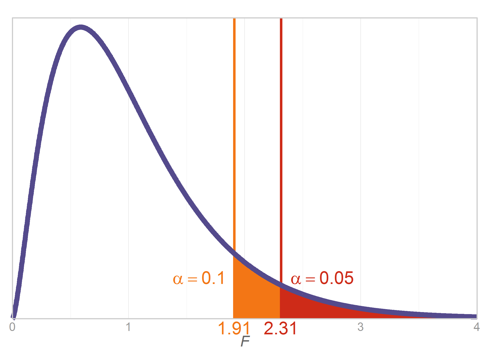
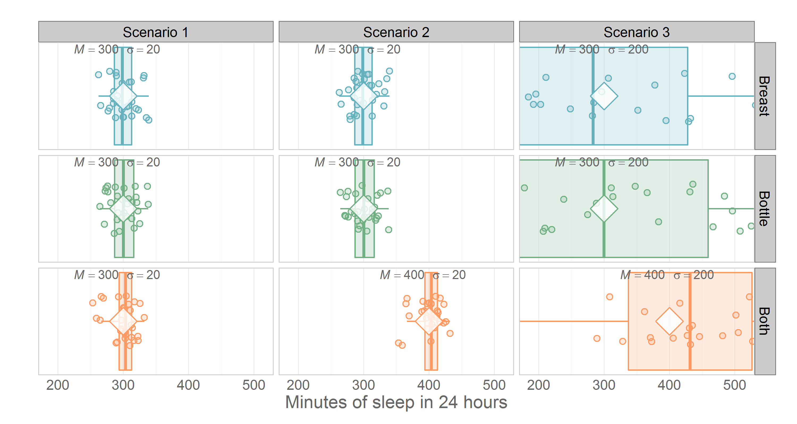
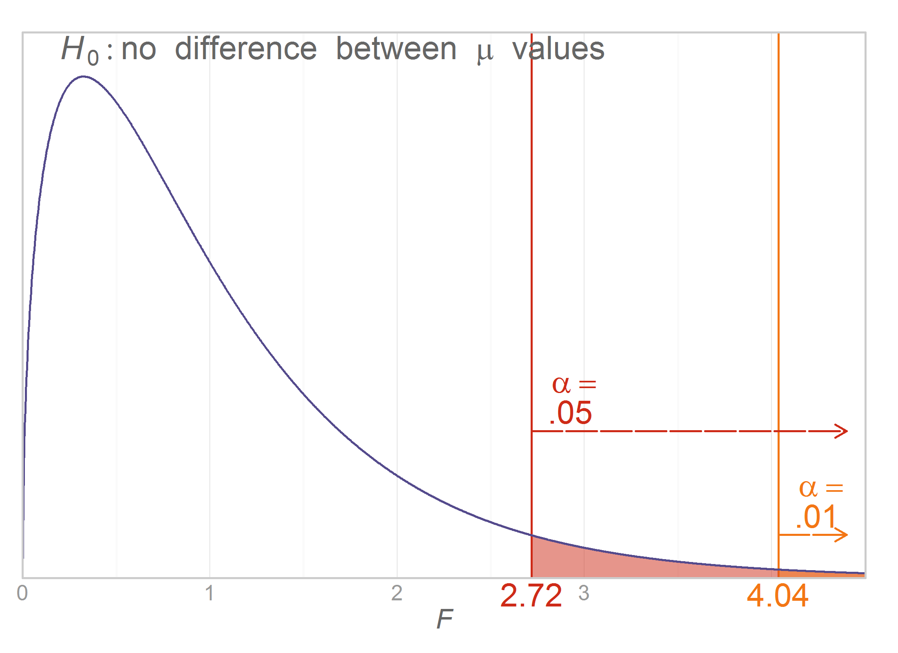

Chapter 12 Graphs
=================================================
This report creates the chapter graphs.

<!--  Set the working directory to the repository's base directory; this assumes the report is nested inside of only one directory.-->

```r
opts_knit$set(root.dir = "../")  #Don't combine this call with any other chunk -especially one that uses file paths.
```


<!-- Set the report-wide options, and point to the external code file. -->

```r
require(knitr)
opts_chunk$set(
    results='show', 
    comment = NA, 
    tidy = FALSE,
    fig.width = 5.5, 
    fig.height = 4, 
    out.width = "600px", #This affects only the markdown, not the underlying png file.  The height will be scaled appropriately.
    fig.path = 'figure_rmd/',     
    dev = "png",
    dpi = 400
    #dev = "pdf"
)
echoChunks <- FALSE
options(width=120) #So the output is 50% wider than the default.
read_chunk("./Chapter12/Chapter12.R") 
```

<!-- Load the packages.  Suppress the output when loading packages. --> 


<!-- Load any Global functions and variables declared in the R file.  Suppress the output. --> 


<!-- Declare any global functions specific to a Rmd output.  Suppress the output. --> 


<!-- Load the datasets. -->


<!-- Tweak the datasets. -->

```

Call:
lm(formula = Sleep ~ 1 + Feeding, data = dsFeed[dsFeed$ScenarioID == 
    1, ])

Residuals:
   Min     1Q Median     3Q    Max 
 -33.0  -16.8   -1.7   10.2   37.1 

Coefficients:
               Estimate Std. Error t value Pr(>|t|)    
(Intercept)    3.00e+02   5.16e+00    58.1   <2e-16 ***
FeedingBottle -1.03e-13   7.30e+00     0.0        1    
FeedingBoth   -9.75e-14   7.30e+00     0.0        1    
---
Signif. codes:  0 '***' 0.001 '**' 0.01 '*' 0.05 '.' 0.1 ' ' 1

Residual standard error: 20 on 42 degrees of freedom
Multiple R-squared:  2.67e-29,	Adjusted R-squared:  -0.0476 
F-statistic: 5.61e-28 on 2 and 42 DF,  p-value: 1
```

```

Call:
lm(formula = Sleep ~ 1 + Feeding, data = dsFeed[dsFeed$ScenarioID == 
    2, ])

Residuals:
   Min     1Q Median     3Q    Max 
 -33.0  -16.8   -1.7   10.2   37.1 

Coefficients:
               Estimate Std. Error t value Pr(>|t|)    
(Intercept)    3.00e+02   5.16e+00    58.1   <2e-16 ***
FeedingBottle -9.89e-14   7.30e+00     0.0        1    
FeedingBoth    1.00e+02   7.30e+00    13.7   <2e-16 ***
---
Signif. codes:  0 '***' 0.001 '**' 0.01 '*' 0.05 '.' 0.1 ' ' 1

Residual standard error: 20 on 42 degrees of freedom
Multiple R-squared:  0.856,	Adjusted R-squared:  0.849 
F-statistic:  125 on 2 and 42 DF,  p-value: <2e-16
```

```

Call:
lm(formula = Sleep ~ 1 + Feeding, data = dsFeed[dsFeed$ScenarioID == 
    3, ])

Residuals:
   Min     1Q Median     3Q    Max 
-214.2 -108.8  -11.1   66.0  241.4 

Coefficients:
              Estimate Std. Error t value Pr(>|t|)    
(Intercept)   3.00e+02   3.36e+01    8.94  2.9e-11 ***
FeedingBottle 7.19e-14   4.75e+01    0.00    1.000    
FeedingBoth   1.00e+02   4.75e+01    2.11    0.041 *  
---
Signif. codes:  0 '***' 0.001 '**' 0.01 '*' 0.05 '.' 0.1 ' ' 1

Residual standard error: 130 on 42 degrees of freedom
Multiple R-squared:  0.123,	Adjusted R-squared:  0.0817 
F-statistic: 2.96 on 2 and 42 DF,  p-value: 0.0628
```

```

Call:
lm(formula = Sleep ~ 0 + Feeding, data = dsFeed[dsFeed$ScenarioID == 
    2, ])

Residuals:
   Min     1Q Median     3Q    Max 
 -33.0  -16.8   -1.7   10.2   37.1 

Coefficients:
              Estimate Std. Error t value Pr(>|t|)    
FeedingBreast   300.00       5.16    58.1   <2e-16 ***
FeedingBottle   300.00       5.16    58.1   <2e-16 ***
FeedingBoth     400.00       5.16    77.5   <2e-16 ***
---
Signif. codes:  0 '***' 0.001 '**' 0.01 '*' 0.05 '.' 0.1 ' ' 1

Residual standard error: 20 on 42 degrees of freedom
Multiple R-squared:  0.997,	Adjusted R-squared:  0.996 
F-statistic: 4.25e+03 on 3 and 42 DF,  p-value: <2e-16
```


## Figure 12-1
Consider if you want the publisher to construct this as a table, but still label it as a figure.  It will be easier to have the size and fonts match the text.

## Figure 12-2


## Figure 12-3


## Figure 12-4
Text describes an F dist with 1, 30 and another F dist with 2, 93***
 * Will: I am flexible on this figure – if different combinations of df would better illustrate differences in F distributions.
 * Feel free to use different df and let me know
 * We also could have two side-by-side F distributions (separate graphs) instead of overlaying the two distributions in one graph


```
Lise, I increased the dfModel.  I don't like df=1 for this, because it asymptotes and never intersects the y-axis.

    I increased the second F so the students would see an F with hump.
```




## Figure 12-5
Table of Critical *F* values.  Will be produced by publisher.

## Figure 12-6
 * Will:  See the two sentences (immediately above) for a description and the note below:
 * Let’s make the two distributions the same color, but use different colors for .05 vs. .01
 * I think it will be clearer to the student if separate graphs are used instead of trying to put everyone onto one F distribution


```
Lise, what do you think about combining them like this?
I think it's more clear how the areas relate to each other.
```




## Figure 12-7



## Figure 12-8 through 12-11

```
Lise, once we get this figure settled, I'll create Figs 12-08 through 12-10 by removing elements
```




## Figure 12-12
Lise, let's talk about this one on the phone before I get into it.


## Session Info
For the sake of documentation and reproducibility, the current report was build on a system using the following software.


```
Report created by Will at 2014-02-19, 01:16:27 -0600
```

```
R Under development (unstable) (2014-02-10 r64961)
Platform: x86_64-w64-mingw32/x64 (64-bit)

locale:
[1] LC_COLLATE=English_United States.1252  LC_CTYPE=English_United States.1252    LC_MONETARY=English_United States.1252
[4] LC_NUMERIC=C                           LC_TIME=English_United States.1252    

attached base packages:
[1] grid      stats     graphics  grDevices utils     datasets  methods   base     

other attached packages:
[1] RColorBrewer_1.0-5 dichromat_2.0-0    extrafont_0.16     ggplot2_0.9.3.1    scales_0.2.3       plyr_1.8.0.99     
[7] knitr_1.5         

loaded via a namespace (and not attached):
 [1] colorspace_1.2-4 digest_0.6.4     evaluate_0.5.1   extrafontdb_1.0  formatR_0.10     gtable_0.1.2    
 [7] labeling_0.2     MASS_7.3-29      munsell_0.4.2    proto_0.3-10     Rcpp_0.11.0      reshape2_1.2.2  
[13] Rttf2pt1_1.2     stringr_0.6.2    tools_3.1.0     
```

