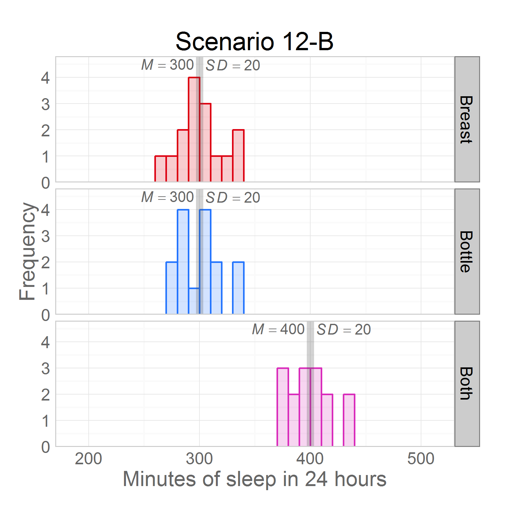
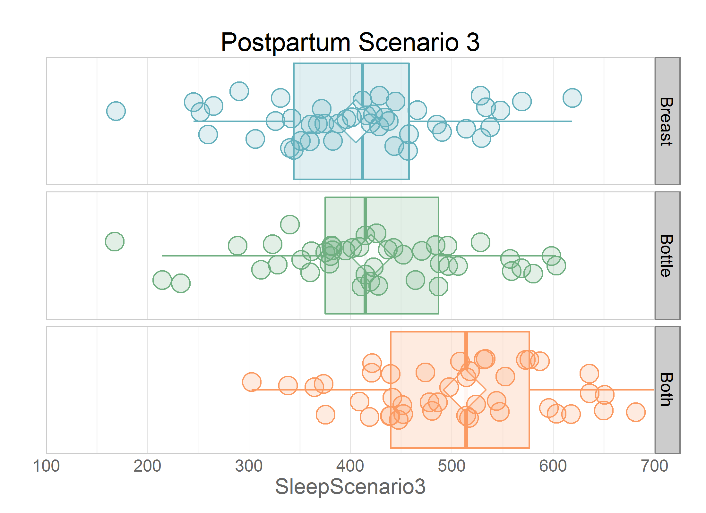

Chapter 12 Graphs
=================================================
This report creates the chapter graphs.

<!--  Set the working directory to the repository's base directory; this assumes the report is nested inside of only one directory.-->

```r
opts_knit$set(root.dir = "../")  #Don't combine this call with any other chunk -especially one that uses file paths.
```


<!-- Set the report-wide options, and point to the external code file. -->

```r
require(knitr)
opts_chunk$set(
    results='show', 
    comment = NA, 
    tidy = FALSE,
    fig.width = 5.5, 
    fig.height = 4, 
    out.width = "600px", #This affects only the markdown, not the underlying png file.  The height will be scaled appropriately.
    fig.path = 'figure_rmd/',     
    dev = "png",
    dpi = 400
    #dev = "pdf"
)
echoChunks <- FALSE
options(width=120) #So the output is 50% wider than the default.
read_chunk("./Chapter12/Chapter12.R") 
```

<!-- Load the packages.  Suppress the output when loading packages. --> 


<!-- Load any Global functions and variables declared in the R file.  Suppress the output. --> 


<!-- Declare any global functions specific to a Rmd output.  Suppress the output. --> 


<!-- Load the datasets. -->


<!-- Tweak the datasets. -->

```

Call:
lm(formula = SleepScenario1 ~ 1 + Feeding, data = ds)

Residuals:
   Min     1Q Median     3Q    Max 
-42.04 -14.02   1.04  14.12  48.66 

Coefficients:
              Estimate Std. Error t value Pr(>|t|)    
(Intercept)     403.72       2.98  135.57   <2e-16 ***
FeedingBottle    -2.27       4.21   -0.54     0.59    
FeedingBoth      -6.40       4.21   -1.52     0.13    
---
Signif. codes:  0 '***' 0.001 '**' 0.01 '*' 0.05 '.' 0.1 ' ' 1

Residual standard error: 20 on 132 degrees of freedom
Multiple R-squared:  0.0177,	Adjusted R-squared:  0.00277 
F-statistic: 1.19 on 2 and 132 DF,  p-value: 0.309
```

```

Call:
lm(formula = SleepScenario2 ~ 1 + Feeding, data = ds)

Residuals:
   Min     1Q Median     3Q    Max 
-49.56 -12.65  -1.47  13.14  44.48 

Coefficients:
              Estimate Std. Error t value Pr(>|t|)    
(Intercept)     401.40       2.77  145.16   <2e-16 ***
FeedingBottle    -1.93       3.91   -0.49     0.62    
FeedingBoth      99.59       3.91   25.47   <2e-16 ***
---
Signif. codes:  0 '***' 0.001 '**' 0.01 '*' 0.05 '.' 0.1 ' ' 1

Residual standard error: 18.6 on 132 degrees of freedom
Multiple R-squared:  0.87,	Adjusted R-squared:  0.868 
F-statistic:  441 on 2 and 132 DF,  p-value: <2e-16
```

```
  Feeding MeanScenario1 MeanScenario2
1  Breast         403.7         401.4
2  Bottle         401.4         399.5
3    Both         397.3         501.0
```


## Figure 12-1
Consider if you want the publisher to construct this as a table, but still label it as a figure.  It will be easier to have the size and fonts match the text.

## Figure 12-2

```
Error: object 'MeanScenario1' not found
```


## Figure 12-3



## Figure 12-4
Text describes an F dist with 1, 30 and another F dist with 2, 93***
 * Will: I am flexible on this figure – if different combinations of df would better illustrate differences in F distributions.
 * Feel free to use different df and let me know
 * We also could have two side-by-side F distributions (separate graphs) instead of overlaying the two distributions in one graph

## Figure 12-5
Table of Critical *F* values.  Will be produced by publisher.

## Figure 12-6
 * Will:  See the two sentences (immediately above) for a description and the note below:
 * Let’s make the two distributions the same color, but use different colors for .05 vs. .01
 * I think it will be clearer to the student if separate graphs are used instead of trying to put everyone onto one F distribution

## Figure 12-7



## Session Info
For the sake of documentation and reproducibility, the current report was build on a system using the following software.


```
Report created by Will at 2014-02-18, 15:10:06 -0600
```

```
R Under development (unstable) (2014-02-10 r64961)
Platform: x86_64-w64-mingw32/x64 (64-bit)

locale:
[1] LC_COLLATE=English_United States.1252  LC_CTYPE=English_United States.1252    LC_MONETARY=English_United States.1252
[4] LC_NUMERIC=C                           LC_TIME=English_United States.1252    

attached base packages:
[1] grid      stats     graphics  grDevices utils     datasets  methods   base     

other attached packages:
[1] RColorBrewer_1.0-5 dichromat_2.0-0    extrafont_0.16     ggplot2_0.9.3.1    scales_0.2.3       plyr_1.8.0.99     
[7] knitr_1.5         

loaded via a namespace (and not attached):
 [1] colorspace_1.2-4 digest_0.6.4     evaluate_0.5.1   extrafontdb_1.0  formatR_0.10     gtable_0.1.2    
 [7] labeling_0.2     MASS_7.3-29      munsell_0.4.2    proto_0.3-10     Rcpp_0.11.0      reshape2_1.2.2  
[13] Rttf2pt1_1.2     stringr_0.6.2    tools_3.1.0     
```

