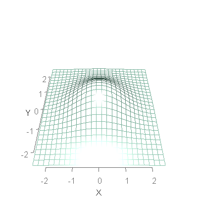

Chapter 13 Graphs
=================================================
This report creates the chapter graphs.

<!--  Set the working directory to the repository's base directory; this assumes the report is nested inside of only one directory.-->

```r
opts_knit$set(root.dir = "../")  #Don't combine this call with any other chunk -especially one that uses file paths.
```


<!-- Set the report-wide options, and point to the external code file. -->

```r
require(knitr)
opts_chunk$set(
    results='show', 
    comment = NA, 
    tidy = FALSE,
    fig.width = 5.5, 
    fig.height = 4, 
    out.width = "600px", #This affects only the markdown, not the underlying png file.  The height will be scaled appropriately.
    fig.path = 'figure_rmd/',     
    dpi = 400,
    dev = "png"
#     dev = "pdf"
)
knit_hooks$set(webgl = hook_webgl)

echoChunks <- FALSE
options(width=120) #So the output is 50% wider than the default.
read_chunk("./Chapter13/Chapter13.R") 
```

<!-- Load the packages.  Suppress the output when loading packages. --> 


<!-- Load any Global functions and variables declared in the R file.  Suppress the output. --> 


<!-- Declare any global functions specific to a Rmd output.  Suppress the output. --> 


<!-- Load the datasets. -->


<!-- Tweak the datasets. -->


## Figure 13-1


## Figure 13-2


```
Lise, would you like to keep the critical values, or hide them?
```


## Figure 13-3

<script src="CanvasMatrix.js" type="text/javascript"></script>
<canvas id="Figure13_03textureCanvas" style="display: none;" width="256" height="256">
<br>
	Your browser does not support the HTML5 canvas element.</canvas>
<!-- ****** surface object 9 ****** -->
<script id="Figure13_03vshader9" type="x-shader/x-vertex">
	attribute vec3 aPos;
	attribute vec4 aCol;
	uniform mat4 mvMatrix;
	uniform mat4 prMatrix;
	varying vec4 vCol;
	varying vec4 vPosition;
	attribute vec3 aNorm;
	uniform mat4 normMatrix;
	varying vec3 vNormal;
	void main(void) {
	  vPosition = mvMatrix * vec4(aPos, 1.);
	  gl_Position = prMatrix * vPosition;
	  vCol = aCol;
	  vNormal = normalize((normMatrix * vec4(aNorm, 1.)).xyz);
	}
</script>
<script id="Figure13_03fshader9" type="x-shader/x-fragment"> 
	#ifdef GL_ES
	precision highp float;
	#endif
	varying vec4 vCol; // carries alpha
	varying vec4 vPosition;
	varying vec3 vNormal;
	void main(void) {
	  vec3 eye = normalize(-vPosition.xyz);
	  const vec3 emission = vec3(0., 0., 0.);
	  const vec3 ambient1 = vec3(0., 0., 0.);
	  const vec3 specular1 = vec3(1., 1., 1.);// light*material
	  const float shininess1 = 50.;
	  vec4 colDiff1 = vec4(vCol.rgb * vec3(1., 1., 1.), vCol.a);
	  const vec3 lightDir1 = vec3(0., 0.258819, 0.9659258);
	  vec3 halfVec1 = normalize(lightDir1 + eye);
      vec4 lighteffect = vec4(emission, 0.);
	  vec3 n = normalize(vNormal);
	  n = -faceforward(n, n, eye);
	  vec3 col1 = ambient1;
	  float nDotL1 = dot(n, lightDir1);
	  col1 = col1 + max(nDotL1, 0.) * colDiff1.rgb;
	  col1 = col1 + pow(max(dot(halfVec1, n), 0.), shininess1) * specular1;
	  lighteffect = lighteffect + vec4(col1, colDiff1.a);
	  gl_FragColor = lighteffect;
	}
</script> 
<!-- ****** lines object 10 ****** -->
<script id="Figure13_03vshader10" type="x-shader/x-vertex">
	attribute vec3 aPos;
	attribute vec4 aCol;
	uniform mat4 mvMatrix;
	uniform mat4 prMatrix;
	varying vec4 vCol;
	varying vec4 vPosition;
	void main(void) {
	  vPosition = mvMatrix * vec4(aPos, 1.);
	  gl_Position = prMatrix * vPosition;
	  vCol = aCol;
	}
</script>
<script id="Figure13_03fshader10" type="x-shader/x-fragment"> 
	#ifdef GL_ES
	precision highp float;
	#endif
	varying vec4 vCol; // carries alpha
	varying vec4 vPosition;
	void main(void) {
      vec4 colDiff = vCol;
	  vec4 lighteffect = colDiff;
	  gl_FragColor = lighteffect;
	}
</script> 
<!-- ****** text object 11 ****** -->
<script id="Figure13_03vshader11" type="x-shader/x-vertex">
	attribute vec3 aPos;
	attribute vec4 aCol;
	uniform mat4 mvMatrix;
	uniform mat4 prMatrix;
	varying vec4 vCol;
	varying vec4 vPosition;
	attribute vec2 aTexcoord;
	varying vec2 vTexcoord;
	attribute vec2 aOfs;
	void main(void) {
	  vCol = aCol;
	  vTexcoord = aTexcoord;
	  vec4 pos = prMatrix * mvMatrix * vec4(aPos, 1.);
	  pos = pos/pos.w;
	  gl_Position = pos + vec4(aOfs, 0.,0.);
	}
</script>
<script id="Figure13_03fshader11" type="x-shader/x-fragment"> 
	#ifdef GL_ES
	precision highp float;
	#endif
	varying vec4 vCol; // carries alpha
	varying vec4 vPosition;
	varying vec2 vTexcoord;
	uniform sampler2D uSampler;
	void main(void) {
      vec4 colDiff = vCol;
	  vec4 lighteffect = colDiff;
	  vec4 textureColor = lighteffect*texture2D(uSampler, vTexcoord);
	  if (textureColor.a < 0.1)
	    discard;
	  else
	    gl_FragColor = textureColor;
	}
</script> 
<!-- ****** lines object 12 ****** -->
<script id="Figure13_03vshader12" type="x-shader/x-vertex">
	attribute vec3 aPos;
	attribute vec4 aCol;
	uniform mat4 mvMatrix;
	uniform mat4 prMatrix;
	varying vec4 vCol;
	varying vec4 vPosition;
	void main(void) {
	  vPosition = mvMatrix * vec4(aPos, 1.);
	  gl_Position = prMatrix * vPosition;
	  vCol = aCol;
	}
</script>
<script id="Figure13_03fshader12" type="x-shader/x-fragment"> 
	#ifdef GL_ES
	precision highp float;
	#endif
	varying vec4 vCol; // carries alpha
	varying vec4 vPosition;
	void main(void) {
      vec4 colDiff = vCol;
	  vec4 lighteffect = colDiff;
	  gl_FragColor = lighteffect;
	}
</script> 
<!-- ****** text object 13 ****** -->
<script id="Figure13_03vshader13" type="x-shader/x-vertex">
	attribute vec3 aPos;
	attribute vec4 aCol;
	uniform mat4 mvMatrix;
	uniform mat4 prMatrix;
	varying vec4 vCol;
	varying vec4 vPosition;
	attribute vec2 aTexcoord;
	varying vec2 vTexcoord;
	attribute vec2 aOfs;
	void main(void) {
	  vCol = aCol;
	  vTexcoord = aTexcoord;
	  vec4 pos = prMatrix * mvMatrix * vec4(aPos, 1.);
	  pos = pos/pos.w;
	  gl_Position = pos + vec4(aOfs, 0.,0.);
	}
</script>
<script id="Figure13_03fshader13" type="x-shader/x-fragment"> 
	#ifdef GL_ES
	precision highp float;
	#endif
	varying vec4 vCol; // carries alpha
	varying vec4 vPosition;
	varying vec2 vTexcoord;
	uniform sampler2D uSampler;
	void main(void) {
      vec4 colDiff = vCol;
	  vec4 lighteffect = colDiff;
	  vec4 textureColor = lighteffect*texture2D(uSampler, vTexcoord);
	  if (textureColor.a < 0.1)
	    discard;
	  else
	    gl_FragColor = textureColor;
	}
</script> 
<!-- ****** text object 14 ****** -->
<script id="Figure13_03vshader14" type="x-shader/x-vertex">
	attribute vec3 aPos;
	attribute vec4 aCol;
	uniform mat4 mvMatrix;
	uniform mat4 prMatrix;
	varying vec4 vCol;
	varying vec4 vPosition;
	attribute vec2 aTexcoord;
	varying vec2 vTexcoord;
	attribute vec2 aOfs;
	void main(void) {
	  vCol = aCol;
	  vTexcoord = aTexcoord;
	  vec4 pos = prMatrix * mvMatrix * vec4(aPos, 1.);
	  pos = pos/pos.w;
	  gl_Position = pos + vec4(aOfs, 0.,0.);
	}
</script>
<script id="Figure13_03fshader14" type="x-shader/x-fragment"> 
	#ifdef GL_ES
	precision highp float;
	#endif
	varying vec4 vCol; // carries alpha
	varying vec4 vPosition;
	varying vec2 vTexcoord;
	uniform sampler2D uSampler;
	void main(void) {
      vec4 colDiff = vCol;
	  vec4 lighteffect = colDiff;
	  vec4 textureColor = lighteffect*texture2D(uSampler, vTexcoord);
	  if (textureColor.a < 0.1)
	    discard;
	  else
	    gl_FragColor = textureColor;
	}
</script> 
<!-- ****** text object 15 ****** -->
<script id="Figure13_03vshader15" type="x-shader/x-vertex">
	attribute vec3 aPos;
	attribute vec4 aCol;
	uniform mat4 mvMatrix;
	uniform mat4 prMatrix;
	varying vec4 vCol;
	varying vec4 vPosition;
	attribute vec2 aTexcoord;
	varying vec2 vTexcoord;
	attribute vec2 aOfs;
	void main(void) {
	  vCol = aCol;
	  vTexcoord = aTexcoord;
	  vec4 pos = prMatrix * mvMatrix * vec4(aPos, 1.);
	  pos = pos/pos.w;
	  gl_Position = pos + vec4(aOfs, 0.,0.);
	}
</script>
<script id="Figure13_03fshader15" type="x-shader/x-fragment"> 
	#ifdef GL_ES
	precision highp float;
	#endif
	varying vec4 vCol; // carries alpha
	varying vec4 vPosition;
	varying vec2 vTexcoord;
	uniform sampler2D uSampler;
	void main(void) {
      vec4 colDiff = vCol;
	  vec4 lighteffect = colDiff;
	  vec4 textureColor = lighteffect*texture2D(uSampler, vTexcoord);
	  if (textureColor.a < 0.1)
	    discard;
	  else
	    gl_FragColor = textureColor;
	}
</script> 
<!-- ****** lines object 16 ****** -->
<script id="Figure13_03vshader16" type="x-shader/x-vertex">
	attribute vec3 aPos;
	attribute vec4 aCol;
	uniform mat4 mvMatrix;
	uniform mat4 prMatrix;
	varying vec4 vCol;
	varying vec4 vPosition;
	void main(void) {
	  vPosition = mvMatrix * vec4(aPos, 1.);
	  gl_Position = prMatrix * vPosition;
	  vCol = aCol;
	}
</script>
<script id="Figure13_03fshader16" type="x-shader/x-fragment"> 
	#ifdef GL_ES
	precision highp float;
	#endif
	varying vec4 vCol; // carries alpha
	varying vec4 vPosition;
	void main(void) {
      vec4 colDiff = vCol;
	  vec4 lighteffect = colDiff;
	  gl_FragColor = lighteffect;
	}
</script> 
<!-- ****** lines object 17 ****** -->
<script id="Figure13_03vshader17" type="x-shader/x-vertex">
	attribute vec3 aPos;
	attribute vec4 aCol;
	uniform mat4 mvMatrix;
	uniform mat4 prMatrix;
	varying vec4 vCol;
	varying vec4 vPosition;
	void main(void) {
	  vPosition = mvMatrix * vec4(aPos, 1.);
	  gl_Position = prMatrix * vPosition;
	  vCol = aCol;
	}
</script>
<script id="Figure13_03fshader17" type="x-shader/x-fragment"> 
	#ifdef GL_ES
	precision highp float;
	#endif
	varying vec4 vCol; // carries alpha
	varying vec4 vPosition;
	void main(void) {
      vec4 colDiff = vCol;
	  vec4 lighteffect = colDiff;
	  gl_FragColor = lighteffect;
	}
</script> 
<script type="text/javascript"> 
	function getShader ( gl, id ){
	   var shaderScript = document.getElementById ( id );
	   var str = "";
	   var k = shaderScript.firstChild;
	   while ( k ){
	     if ( k.nodeType == 3 ) str += k.textContent;
	     k = k.nextSibling;
	   }
	   var shader;
	   if ( shaderScript.type == "x-shader/x-fragment" )
             shader = gl.createShader ( gl.FRAGMENT_SHADER );
	   else if ( shaderScript.type == "x-shader/x-vertex" )
             shader = gl.createShader(gl.VERTEX_SHADER);
	   else return null;
	   gl.shaderSource(shader, str);
	   gl.compileShader(shader);
	   if (gl.getShaderParameter(shader, gl.COMPILE_STATUS) == 0)
	     alert(gl.getShaderInfoLog(shader));
	   return shader;
	}
	var min = Math.min;
	var max = Math.max;
	var sqrt = Math.sqrt;
	var sin = Math.sin;
	var acos = Math.acos;
	var tan = Math.tan;
	var SQRT2 = Math.SQRT2;
	var PI = Math.PI;
	var log = Math.log;
	var exp = Math.exp;
	function Figure13_03webGLStart() {
	   var debug = function(msg) {
	     document.getElementById("Figure13_03debug").innerHTML = msg;
	   }
	   debug("");
	   var canvas = document.getElementById("Figure13_03canvas");
	   if (!window.WebGLRenderingContext){
	     debug("<br> Your browser does not support WebGL. See <a href=\"http://get.webgl.org\">http://get.webgl.org</a>");
	     return;
	   }
	   var gl;
	   try {
	     // Try to grab the standard context. If it fails, fallback to experimental.
	     gl = canvas.getContext("webgl") 
	       || canvas.getContext("experimental-webgl");
	   }
	   catch(e) {}
	   if ( !gl ) {
	     debug("<br> Your browser appears to support WebGL, but did not create a WebGL context.  See <a href=\"http://get.webgl.org\">http://get.webgl.org</a>");
	     return;
	   }
	   var width = 401;  var height = 401;
	   canvas.width = width;   canvas.height = height;
	   gl.viewport(0, 0, width, height);
	   var prMatrix = new CanvasMatrix4();
	   var mvMatrix = new CanvasMatrix4();
	   var normMatrix = new CanvasMatrix4();
	   var saveMat = new CanvasMatrix4();
	   saveMat.makeIdentity();
	   var distance;
	   var posLoc = 0;
	   var colLoc = 1;
	   var zoom = 1;
	   var fov = 60;
	   var userMatrix = new CanvasMatrix4();
	   userMatrix.load([
	    1, 0, 0, 0,
	    0, 0.8191521, -0.5735765, 0,
	    0, 0.5735765, 0.8191521, 0,
	    0, 0, 0, 1
		]);
	   function getPowerOfTwo(value) {
	     var pow = 1;
	     while(pow<value) {
	       pow *= 2;
	     }
	     return pow;
	   }
	   function handleLoadedTexture(texture, textureCanvas) {
	     gl.pixelStorei(gl.UNPACK_FLIP_Y_WEBGL, true);
	     gl.bindTexture(gl.TEXTURE_2D, texture);
	     gl.texImage2D(gl.TEXTURE_2D, 0, gl.RGBA, gl.RGBA, gl.UNSIGNED_BYTE, textureCanvas);
	     gl.texParameteri(gl.TEXTURE_2D, gl.TEXTURE_MAG_FILTER, gl.LINEAR);
	     gl.texParameteri(gl.TEXTURE_2D, gl.TEXTURE_MIN_FILTER, gl.LINEAR_MIPMAP_NEAREST);
	     gl.generateMipmap(gl.TEXTURE_2D);
	     gl.bindTexture(gl.TEXTURE_2D, null);
	   }
	   function loadImageToTexture(filename, texture) {   
	     var canvas = document.getElementById("Figure13_03textureCanvas");
	     var ctx = canvas.getContext("2d");
	     var image = new Image();
	     image.onload = function() {
	       var w = image.width;
	       var h = image.height;
	       var canvasX = getPowerOfTwo(w);
	       var canvasY = getPowerOfTwo(h);
	       canvas.width = canvasX;
	       canvas.height = canvasY;
	       ctx.imageSmoothingEnabled = true;
	       ctx.drawImage(image, 0, 0, canvasX, canvasY);
	       handleLoadedTexture(texture, canvas);
   	       drawScene();
	     }
	     image.src = filename;
	   }  	   
	   function drawTextToCanvas(text, cex) {
	     var canvasX, canvasY;
	     var textX, textY;
	     var textHeight = 20 * cex;
	     var textColour = "white";
	     var fontFamily = "Arial";
	     var backgroundColour = "rgba(0,0,0,0)";
	     var canvas = document.getElementById("Figure13_03textureCanvas");
	     var ctx = canvas.getContext("2d");
	     ctx.font = textHeight+"px "+fontFamily;
             canvasX = 1;
             var widths = [];
	     for (var i = 0; i < text.length; i++)  {
	       widths[i] = ctx.measureText(text[i]).width;
	       canvasX = (widths[i] > canvasX) ? widths[i] : canvasX;
	     }	  
	     canvasX = getPowerOfTwo(canvasX);
	     var offset = 2*textHeight; // offset to first baseline
	     var skip = 2*textHeight;   // skip between baselines	  
	     canvasY = getPowerOfTwo(offset + text.length*skip);
	     canvas.width = canvasX;
	     canvas.height = canvasY;
	     ctx.fillStyle = backgroundColour;
	     ctx.fillRect(0, 0, ctx.canvas.width, ctx.canvas.height);
	     ctx.fillStyle = textColour;
	     ctx.textAlign = "left";
	     ctx.textBaseline = "alphabetic";
	     ctx.font = textHeight+"px "+fontFamily;
	     for(var i = 0; i < text.length; i++) {
	       textY = i*skip + offset;
	       ctx.fillText(text[i], 0,  textY);
	     }
	     return {canvasX:canvasX, canvasY:canvasY,
	             widths:widths, textHeight:textHeight,
	             offset:offset, skip:skip};
	   }
	   // ****** surface object 9 ******
	   var prog9  = gl.createProgram();
	   gl.attachShader(prog9, getShader( gl, "Figure13_03vshader9" ));
	   gl.attachShader(prog9, getShader( gl, "Figure13_03fshader9" ));
	   //  Force aPos to location 0, aCol to location 1 
	   gl.bindAttribLocation(prog9, 0, "aPos");
	   gl.bindAttribLocation(prog9, 1, "aCol");
	   gl.linkProgram(prog9);
	   var v=new Float32Array([
	    -2.5, -2.5, 0.0400191, -0.08170025, -0.08170025, 0.9933027,
	    -2.3, -2.5, 0.0530167, -0.08321579, -0.1003649, 0.9914646,
	    -2.1, -2.5, 0.06598035, -0.08086298, -0.1400083, 0.9868429,
	    -1.9, -2.5, 0.07713883, -0.06735425, -0.1817743, 0.9810308,
	    -1.7, -2.5, 0.08472044, -0.04337254, -0.2201561, 0.9744999,
	    -1.5, -2.5, 0.08740975, -0.01231521, -0.2493374, 0.9683384,
	    -1.3, -2.5, 0.08472044, 0.02057427, -0.2647177, 0.9641065,
	    -1.1, -2.5, 0.07713883, 0.0497273, -0.2640356, 0.9632302,
	    -0.9, -2.5, 0.06598035, 0.07071532, -0.2477209, 0.9662472,
	    -0.7, -2.5, 0.0530167, 0.08118381, -0.2186014, 0.9724312,
	    -0.5, -2.5, 0.0400191, 0.0811582, -0.1812342, 0.9800855,
	    -0.3, -2.5, 0.02837779, 0.07275047, -0.1409591, 0.9873389,
	    -0.1, -2.5, 0.01890368, 0.05932711, -0.1027499, 0.9929364,
	    0.1, -2.5, 0.01182962, 0.04439642, -0.07018287, 0.9965457,
	    0.3, -2.5, 0.006954277, 0.03067035, -0.04494208, 0.9985186,
	    0.5, -2.5, 0.003840517, 0.01964531, -0.02700026, 0.9994424,
	    0.7, -2.5, 0.001992434, 0.01170417, -0.01522865, 0.9998155,
	    0.9, -2.5, 0.0009710346, 0.006500428, -0.008067385, 0.9999464,
	    1.1, -2.5, 0.000444572, 0.00337103, -0.004015149, 0.9999863,
	    1.3, -2.5, 0.0001912081, 0.001634233, -0.001877745, 0.999997,
	    1.5, -2.5, 7.725504e-05, 0.0007412796, -0.0008252396, 0.9999994,
	    1.7, -2.5, 2.932271e-05, 0.0003148254, -0.0003408472, 0.9999999,
	    1.9, -2.5, 1.045533e-05, 0.0001252616, -0.0001323111, 1,
	    2.1, -2.5, 3.502098e-06, 4.671135e-05, -4.827311e-05, 1,
	    2.3, -2.5, 1.101984e-06, 1.633219e-05, -1.655383e-05, 1,
	    2.5, -2.5, 3.257458e-07, 8.162518e-06, -8.162518e-06, 1,
	    -2.5, -2.3, 0.0530167, -0.1003649, -0.08321578, 0.9914646,
	    -2.3, -2.3, 0.07291956, -0.1042133, -0.1042133, 0.98908,
	    -2.1, -2.3, 0.09421758, -0.1055509, -0.1497724, 0.9830704,
	    -1.9, -2.3, 0.1143606, -0.09323941, -0.1998527, 0.9753795,
	    -1.7, -2.3, 0.1304, -0.06704241, -0.2482876, 0.9663635,
	    -1.5, -2.3, 0.1396804, -0.03023438, -0.2880022, 0.9571523,
	    -1.3, -2.3, 0.1405561, 0.01113677, -0.3129143, 0.9497161,
	    -1.1, -2.3, 0.1328681, 0.05006823, -0.3194918, 0.9462654,
	    -0.9, -2.3, 0.1179908, 0.08054563, -0.3072916, 0.9482005,
	    -0.7, -2.3, 0.0984311, 0.09880764, -0.2786236, 0.9553041,
	    -0.5, -2.3, 0.07713883, 0.1038201, -0.2378935, 0.9657267,
	    -0.3, -2.3, 0.05678981, 0.09716535, -0.1908437, 0.9767997,
	    -0.1, -2.3, 0.03927573, 0.08240166, -0.1435335, 0.986209,
	    0.1, -2.3, 0.02551731, 0.0639197, -0.1010841, 0.9928223,
	    0.3, -2.3, 0.01557406, 0.04564656, -0.06666129, 0.996731,
	    0.5, -2.3, 0.008929469, 0.03015985, -0.04119922, 0.9986957,
	    0.7, -2.3, 0.004809566, 0.01850891, -0.02388811, 0.9995433,
	    0.9, -2.3, 0.002433564, 0.01058035, -0.01300525, 0.9998595,
	    1.1, -2.3, 0.001156741, 0.005644943, -0.006651738, 0.999962,
	    1.3, -2.3, 0.000516519, 0.002814964, -0.003197138, 0.9999909,
	    1.5, -2.3, 0.0002166671, 0.001313358, -0.001444334, 0.9999982,
	    1.7, -2.3, 8.538002e-05, 0.0005737527, -0.0006133292, 0.9999996,
	    1.9, -2.3, 3.160648e-05, 0.0002348334, -0.0002448301, 1,
	    2.1, -2.3, 1.099139e-05, 9.009437e-05, -9.187538e-05, 1,
	    2.3, -2.3, 3.590754e-06, 3.241228e-05, -3.241228e-05, 1,
	    2.5, -2.3, 1.101984e-06, 1.655383e-05, -1.633219e-05, 1,
	    -2.5, -2.1, 0.06598035, -0.1400083, -0.08086298, 0.9868429,
	    -2.3, -2.1, 0.09421758, -0.1497724, -0.1055509, 0.9830704,
	    -2.1, -2.1, 0.126388, -0.1612448, -0.1612448, 0.973653,
	    -1.9, -2.1, 0.159271, -0.1542225, -0.2269913, 0.9616082,
	    -1.7, -2.1, 0.1885488, -0.1259012, -0.2957505, 0.9469322,
	    -1.5, -2.1, 0.2096851, -0.07859768, -0.3579884, 0.9304121,
	    -1.3, -2.1, 0.2190624, -0.01966324, -0.4043304, 0.9144017,
	    -1.1, -2.1, 0.2149933, 0.04084006, -0.4283973, 0.902667,
	    -0.9, -2.1, 0.1982159, 0.09338348, -0.4280474, 0.8989187,
	    -0.7, -2.1, 0.1716756, 0.1311705, -0.4046955, 0.9049949,
	    -0.5, -2.1, 0.1396804, 0.1507734, -0.3620866, 0.91987,
	    -0.3, -2.1, 0.1067625, 0.1520463, -0.3056764, 0.9399169,
	    -0.1, -2.1, 0.07665822, 0.1379115, -0.2423861, 0.9603277,
	    0.1, -2.1, 0.05170771, 0.1137252, -0.1798004, 0.9771072,
	    0.3, -2.1, 0.03276487, 0.08581216, -0.1245186, 0.9884996,
	    0.5, -2.1, 0.01950375, 0.05957992, -0.08052979, 0.99497,
	    0.7, -2.1, 0.01090648, 0.0382605, -0.04871635, 0.9980795,
	    0.9, -2.1, 0.005729377, 0.022822, -0.02761821, 0.999358,
	    1.1, -2.1, 0.002827398, 0.01268408, -0.01469339, 0.9998116,
	    1.3, -2.1, 0.00131076, 0.006582275, -0.007341927, 0.9999515,
	    1.5, -2.1, 0.0005708418, 0.003193819, -0.003447005, 0.999989,
	    1.7, -2.1, 0.000233542, 0.001450382, -0.001520922, 0.9999978,
	    1.9, -2.1, 8.975755e-05, 0.0006168818, -0.0006307439, 0.9999996,
	    2.1, -2.1, 3.24066e-05, 0.0002458724, -0.0002458724, 1,
	    2.3, -2.1, 1.099139e-05, 9.187538e-05, -9.009438e-05, 1,
	    2.5, -2.1, 3.502098e-06, 4.827311e-05, -4.671136e-05, 1,
	    -2.5, -1.9, 0.07713883, -0.1817743, -0.06735425, 0.9810309,
	    -2.3, -1.9, 0.1143606, -0.1998527, -0.0932394, 0.9753795,
	    -2.1, -1.9, 0.159271, -0.2269913, -0.1542225, 0.9616082,
	    -1.9, -1.9, 0.2083786, -0.2318086, -0.2318086, 0.9447379,
	    -1.7, -1.9, 0.25611, -0.2075297, -0.3194511, 0.9245985,
	    -1.5, -1.9, 0.2957034, -0.1536335, -0.4058562, 0.9009315,
	    -1.3, -1.9, 0.3207323, -0.07743916, -0.4777662, 0.8750672,
	    -1.1, -1.9, 0.3268028, 0.007769198, -0.5246679, 0.8512715,
	    -0.9, -1.9, 0.3128134, 0.08780041, -0.542147, 0.8356839,
	    -0.7, -1.9, 0.2812818, 0.1520117, -0.5312786, 0.8334479,
	    -0.5, -1.9, 0.2376043, 0.1944284, -0.4957321, 0.8464321,
	    -0.3, -1.9, 0.1885488, 0.2128172, -0.439907, 0.8724623,
	    -0.1, -1.9, 0.1405561, 0.208023, -0.3691391, 0.905794,
	    0.1, -1.9, 0.0984311, 0.184138, -0.2906689, 0.9389381,
	    0.3, -1.9, 0.06475474, 0.1483449, -0.2133858, 0.9656399,
	    0.5, -1.9, 0.0400191, 0.1091909, -0.1456153, 0.9832973,
	    0.7, -1.9, 0.02323377, 0.0738179, -0.09244516, 0.9929777,
	    0.9, -1.9, 0.01267152, 0.04610604, -0.05476099, 0.9974344,
	    1.1, -1.9, 0.006492235, 0.02674094, -0.0303586, 0.9991813,
	    1.3, -1.9, 0.003124758, 0.01445342, -0.01578442, 0.9997711,
	    1.5, -1.9, 0.001412847, 0.007296602, -0.007705718, 0.9999438,
	    1.7, -1.9, 0.0006001095, 0.003445372, -0.003534053, 0.9999878,
	    1.9, -1.9, 0.0002394542, 0.001523062, -0.001523062, 0.9999977,
	    2.1, -1.9, 8.975755e-05, 0.0006307439, -0.0006168818, 0.9999996,
	    2.3, -1.9, 3.160648e-05, 0.0002448301, -0.0002348334, 1,
	    2.5, -1.9, 1.045533e-05, 0.0001323111, -0.0001252616, 1,
	    -2.5, -1.7, 0.08472044, -0.2201561, -0.04337254, 0.9744999,
	    -2.3, -1.7, 0.1304, -0.2482876, -0.06704241, 0.9663635,
	    -2.1, -1.7, 0.1885488, -0.2957504, -0.1259012, 0.9469322,
	    -1.9, -1.7, 0.25611, -0.3194511, -0.2075297, 0.9245985,
	    -1.7, -1.7, 0.3268028, -0.3079591, -0.3079591, 0.9001791,
	    -1.5, -1.7, 0.3917433, -0.2557613, -0.4163765, 0.8724774,
	    -1.3, -1.7, 0.4411376, -0.1670537, -0.5161979, 0.8400195,
	    -1.1, -1.7, 0.4666628, -0.05680585, -0.5907292, 0.8048677,
	    -0.9, -1.7, 0.4637552, 0.05467631, -0.6307182, 0.7740834,
	    -0.7, -1.7, 0.4329433, 0.1506452, -0.6365829, 0.7563519,
	    -0.5, -1.7, 0.3796906, 0.2219719, -0.6137847, 0.7576258,
	    -0.3, -1.7, 0.3128134, 0.265236, -0.567652, 0.7793722,
	    -0.1, -1.7, 0.2421014, 0.279825, -0.5019217, 0.8183963,
	    0.1, -1.7, 0.1760216, 0.2671901, -0.4204883, 0.8670633,
	    0.3, -1.7, 0.120224, 0.2320635, -0.3299864, 0.9150167,
	    0.5, -1.7, 0.07713883, 0.1832863, -0.2403329, 0.9532294,
	    0.7, -1.7, 0.04649556, 0.1318571, -0.1618099, 0.977973,
	    0.9, -1.7, 0.02632731, 0.08687374, -0.1008869, 0.9910977,
	    1.1, -1.7, 0.01400419, 0.05279557, -0.05852374, 0.9968891,
	    1.3, -1.7, 0.006997877, 0.02977999, -0.0317278, 0.9990528,
	    1.5, -1.7, 0.003284968, 0.01565593, -0.0161221, 0.9997475,
	    1.7, -1.7, 0.001448613, 0.007689964, -0.007689964, 0.9999409,
	    1.9, -1.7, 0.0006001095, 0.003534053, -0.003445371, 0.9999878,
	    2.1, -1.7, 0.000233542, 0.001520922, -0.001450382, 0.9999978,
	    2.3, -1.7, 8.538002e-05, 0.0006133292, -0.0005737527, 0.9999996,
	    2.5, -1.7, 2.932271e-05, 0.0003408472, -0.0003148254, 0.9999999,
	    -2.5, -1.5, 0.08740975, -0.2493374, -0.01231521, 0.9683384,
	    -2.3, -1.5, 0.1396804, -0.2880022, -0.03023438, 0.9571523,
	    -2.1, -1.5, 0.2096851, -0.3579884, -0.07859767, 0.9304121,
	    -1.9, -1.5, 0.2957034, -0.4058561, -0.1536335, 0.9009314,
	    -1.7, -1.5, 0.3917433, -0.4163765, -0.2557613, 0.8724774,
	    -1.5, -1.5, 0.4875325, -0.3783431, -0.3783431, 0.8448154,
	    -1.3, -1.5, 0.5699832, -0.2887506, -0.5051506, 0.8132933,
	    -1.1, -1.5, 0.626004, -0.1586814, -0.6129417, 0.7740301,
	    -0.9, -1.5, 0.6458756, -0.0134473, -0.6824878, 0.7307733,
	    -0.7, -1.5, 0.626004, 0.1197996, -0.7092651, 0.6946877,
	    -0.5, -1.5, 0.5699832, 0.2250587, -0.7009876, 0.6767312,
	    -0.3, -1.5, 0.4875325, 0.2976636, -0.6672763, 0.6827435,
	    -0.1, -1.5, 0.3917433, 0.3378152, -0.6137793, 0.7135515,
	    0.1, -1.5, 0.2957034, 0.3463385, -0.5424036, 0.765407,
	    0.3, -1.5, 0.2096851, 0.3246322, -0.4547439, 0.8293502,
	    0.5, -1.5, 0.1396804, 0.2774657, -0.3562225, 0.8922547,
	    0.7, -1.5, 0.08740975, 0.2151642, -0.2575568, 0.9420025,
	    0.9, -1.5, 0.05138554, 0.15136, -0.1710765, 0.973562,
	    1.1, -1.5, 0.02837779, 0.09718756, -0.1047183, 0.9897417,
	    1.3, -1.5, 0.0147222, 0.05746612, -0.05947132, 0.9965745,
	    1.5, -1.5, 0.007175029, 0.03152556, -0.03152556, 0.9990056,
	    1.7, -1.5, 0.003284968, 0.0161221, -0.01565593, 0.9997475,
	    1.9, -1.5, 0.001412847, 0.007705718, -0.007296602, 0.9999437,
	    2.1, -1.5, 0.0005708418, 0.003447005, -0.003193819, 0.999989,
	    2.3, -1.5, 0.0002166671, 0.001444334, -0.001313358, 0.9999982,
	    2.5, -1.5, 7.725504e-05, 0.0008252395, -0.0007412796, 0.9999994,
	    -2.5, -1.3, 0.08472044, -0.2647177, 0.02057427, 0.9641064,
	    -2.3, -1.3, 0.1405561, -0.3129143, 0.01113677, 0.9497161,
	    -2.1, -1.3, 0.2190624, -0.4043304, -0.01966325, 0.9144017,
	    -1.9, -1.3, 0.3207323, -0.4777662, -0.07743916, 0.8750672,
	    -1.7, -1.3, 0.4411376, -0.5161979, -0.1670537, 0.8400195,
	    -1.5, -1.3, 0.5699832, -0.5051506, -0.2887507, 0.8132933,
	    -1.3, -1.3, 0.6918415, -0.4333251, -0.4333251, 0.7902269,
	    -1.1, -1.3, 0.7888742, -0.299606, -0.5770825, 0.7597448,
	    -0.9, -1.3, 0.8450171, -0.1246192, -0.6878839, 0.7150426,
	    -0.7, -1.3, 0.850315, 0.05248361, -0.7458455, 0.6640482,
	    -0.5, -1.3, 0.8038051, 0.1995955, -0.7556086, 0.6238729,
	    -0.3, -1.3, 0.7138029, 0.3061328, -0.7333874, 0.6069807,
	    -0.1, -1.3, 0.5954735, 0.3741917, -0.6913362, 0.6180897,
	    0.1, -1.3, 0.4666628, 0.4076429, -0.6339036, 0.6572621,
	    0.3, -1.3, 0.3435583, 0.4080894, -0.5605361, 0.7205986,
	    0.5, -1.3, 0.2376043, 0.3762288, -0.4703477, 0.7982637,
	    0.7, -1.3, 0.1543707, 0.3165058, -0.3674635, 0.8745255,
	    0.9, -1.3, 0.09421758, 0.240769, -0.2633578, 0.9341697,
	    1.1, -1.3, 0.05402014, 0.165421, -0.1723018, 0.971055,
	    1.3, -1.3, 0.02909618, 0.1034206, -0.1034206, 0.9892463,
	    1.5, -1.3, 0.0147222, 0.05947133, -0.05746612, 0.9965745,
	    1.7, -1.3, 0.006997877, 0.0317278, -0.02977998, 0.9990528,
	    1.9, -1.3, 0.003124758, 0.01578442, -0.01445342, 0.999771,
	    2.1, -1.3, 0.00131076, 0.007341926, -0.006582274, 0.9999515,
	    2.3, -1.3, 0.000516519, 0.003197138, -0.002814964, 0.9999909,
	    2.5, -1.3, 0.0001912081, 0.001877745, -0.001634232, 0.9999969,
	    -2.5, -1.1, 0.07713883, -0.2640356, 0.0497273, 0.9632301,
	    -2.3, -1.1, 0.1328681, -0.3194918, 0.05006823, 0.9462654,
	    -2.1, -1.1, 0.2149933, -0.4283974, 0.04084007, 0.9026671,
	    -1.9, -1.1, 0.3268028, -0.5246679, 0.007769195, 0.8512716,
	    -1.7, -1.1, 0.4666628, -0.5907292, -0.05680585, 0.8048677,
	    -1.5, -1.1, 0.626004, -0.6129417, -0.1586814, 0.7740301,
	    -1.3, -1.1, 0.7888742, -0.5770825, -0.299606, 0.7597448,
	    -1.1, -1.1, 0.9338883, -0.4679014, -0.4679014, 0.7497576,
	    -0.9, -1.1, 1.038577, -0.28469, -0.6287592, 0.7236114,
	    -0.7, -1.1, 1.085023, -0.06311883, -0.7379777, 0.6718667,
	    -0.5, -1.1, 1.064869, 0.139108, -0.778975, 0.6114303,
	    -0.3, -1.1, 0.9817698, 0.2899163, -0.7706702, 0.5674645,
	    -0.1, -1.1, 0.850315, 0.3896459, -0.7369466, 0.5523458,
	    0.1, -1.1, 0.6918415, 0.4480821, -0.6898715, 0.5685944,
	    0.3, -1.1, 0.5287982, 0.4717967, -0.6314391, 0.6153799,
	    0.5, -1.1, 0.3796906, 0.4622293, -0.5585437, 0.6887473,
	    0.7, -1.1, 0.25611, 0.418916, -0.468197, 0.7780108,
	    0.9, -1.1, 0.1622855, 0.3460636, -0.3636817, 0.8648558,
	    1.1, -1.1, 0.09660272, 0.2574565, -0.2574565, 0.9313604,
	    1.3, -1.1, 0.05402014, 0.1723019, -0.165421, 0.9710551,
	    1.5, -1.1, 0.02837779, 0.1047183, -0.09718757, 0.9897417,
	    1.7, -1.1, 0.01400419, 0.05852373, -0.05279557, 0.9968891,
	    1.9, -1.1, 0.006492235, 0.0303586, -0.02674094, 0.9991813,
	    2.1, -1.1, 0.002827398, 0.01469339, -0.01268408, 0.9998117,
	    2.3, -1.1, 0.001156741, 0.006651738, -0.005644943, 0.999962,
	    2.5, -1.1, 0.000444572, 0.004015149, -0.00337103, 0.9999863,
	    -2.5, -0.9, 0.06598035, -0.247721, 0.07071531, 0.9662472,
	    -2.3, -0.9, 0.1179908, -0.3072916, 0.08054563, 0.9482005,
	    -2.1, -0.9, 0.1982159, -0.4280475, 0.09338347, 0.8989187,
	    -1.9, -0.9, 0.3128134, -0.542147, 0.08780042, 0.835684,
	    -1.7, -0.9, 0.4637552, -0.6307182, 0.0546763, 0.7740834,
	    -1.5, -0.9, 0.6458756, -0.6824878, -0.0134473, 0.7307733,
	    -1.3, -0.9, 0.8450171, -0.6878839, -0.1246192, 0.7150425,
	    -1.1, -0.9, 1.038577, -0.6287592, -0.28469, 0.7236114,
	    -0.9, -0.9, 1.199136, -0.4798579, -0.4798578, 0.7344881,
	    -0.7, -0.9, 1.300634, -0.2405578, -0.6585366, 0.713065,
	    -0.5, -0.9, 1.325251, 0.02734732, -0.7609409, 0.6482446,
	    -0.3, -0.9, 1.268521, 0.2435298, -0.7813291, 0.5746459,
	    -0.1, -0.9, 1.140654, 0.3863292, -0.7571005, 0.5268288,
	    0.1, -0.9, 0.9635331, 0.4719559, -0.7161989, 0.5141174,
	    0.3, -0.9, 0.7646031, 0.5167854, -0.6677495, 0.5357646,
	    0.5, -0.9, 0.5699832, 0.5282907, -0.6106568, 0.5899215,
	    0.7, -0.9, 0.3991578, 0.506723, -0.5396188, 0.6723417,
	    0.9, -0.9, 0.2625934, 0.450306, -0.450306, 0.7710052,
	    1.1, -0.9, 0.1622855, 0.3636817, -0.3460636, 0.8648558,
	    1.3, -0.9, 0.09421758, 0.2633578, -0.2407689, 0.9341697,
	    1.5, -0.9, 0.05138554, 0.1710765, -0.15136, 0.9735621,
	    1.7, -0.9, 0.02632731, 0.1008869, -0.08687373, 0.9910977,
	    1.9, -0.9, 0.01267152, 0.05476099, -0.04610604, 0.9974344,
	    2.1, -0.9, 0.005729377, 0.02761822, -0.022822, 0.999358,
	    2.3, -0.9, 0.002433564, 0.01300525, -0.01058035, 0.9998595,
	    2.5, -0.9, 0.0009710346, 0.008067385, -0.006500428, 0.9999464,
	    -2.5, -0.7, 0.0530167, -0.2186013, 0.08118382, 0.9724313,
	    -2.3, -0.7, 0.0984311, -0.2786236, 0.09880765, 0.9553041,
	    -2.1, -0.7, 0.1716756, -0.4046955, 0.1311705, 0.9049949,
	    -1.9, -0.7, 0.2812818, -0.5312786, 0.1520117, 0.8334479,
	    -1.7, -0.7, 0.4329433, -0.6365828, 0.1506452, 0.7563519,
	    -1.5, -0.7, 0.626004, -0.7092651, 0.1197996, 0.6946877,
	    -1.3, -0.7, 0.850315, -0.7458455, 0.0524836, 0.6640481,
	    -1.1, -0.7, 1.085023, -0.7379777, -0.06311883, 0.6718667,
	    -0.9, -0.7, 1.300634, -0.6585366, -0.2405578, 0.713065,
	    -0.7, -0.7, 1.464628, -0.4652951, -0.4652951, 0.7529946,
	    -0.5, -0.7, 1.549375, -0.1607691, -0.6612591, 0.7327276,
	    -0.3, -0.7, 1.539721, 0.1478526, -0.7512564, 0.6432366,
	    -0.1, -0.7, 1.437423, 0.3608641, -0.7516321, 0.5521109,
	    0.1, -0.7, 1.260617, 0.4836378, -0.7176783, 0.5010314,
	    0.3, -0.7, 1.038577, 0.5495096, -0.6754416, 0.4917497,
	    0.5, -0.7, 0.8038051, 0.5780082, -0.6292895, 0.51952,
	    0.7, -0.7, 0.5844124, 0.5753071, -0.5753071, 0.5814151,
	    0.9, -0.7, 0.3991578, 0.5396188, -0.506723, 0.6723418,
	    1.1, -0.7, 0.25611, 0.468197, -0.418916, 0.7780108,
	    1.3, -0.7, 0.1543707, 0.3674636, -0.3165058, 0.8745254,
	    1.5, -0.7, 0.08740975, 0.2575568, -0.2151642, 0.9420026,
	    1.7, -0.7, 0.04649556, 0.1618099, -0.1318571, 0.977973,
	    1.9, -0.7, 0.02323377, 0.09244516, -0.07381791, 0.9929777,
	    2.1, -0.7, 0.01090648, 0.04871636, -0.0382605, 0.9980795,
	    2.3, -0.7, 0.004809566, 0.02388811, -0.01850891, 0.9995432,
	    2.5, -0.7, 0.001992434, 0.01522865, -0.01170417, 0.9998156,
	    -2.5, -0.5, 0.0400191, -0.1812342, 0.0811582, 0.9800855,
	    -2.3, -0.5, 0.07713883, -0.2378934, 0.10382, 0.9657267,
	    -2.1, -0.5, 0.1396804, -0.3620866, 0.1507733, 0.91987,
	    -1.9, -0.5, 0.2376043, -0.4957321, 0.1944284, 0.8464321,
	    -1.7, -0.5, 0.3796906, -0.6137847, 0.221972, 0.7576258,
	    -1.5, -0.5, 0.5699832, -0.7009875, 0.2250588, 0.6767312,
	    -1.3, -0.5, 0.8038051, -0.7556086, 0.1995955, 0.6238729,
	    -1.1, -0.5, 1.064869, -0.778975, 0.139108, 0.6114303,
	    -0.9, -0.5, 1.325251, -0.7609408, 0.02734732, 0.6482446,
	    -0.7, -0.5, 1.549375, -0.6612591, -0.1607691, 0.7327276,
	    -0.5, -0.5, 1.701656, -0.4134172, -0.4134172, 0.8112783,
	    -0.3, -0.5, 1.755672, -0.03511818, -0.6230516, 0.781392,
	    -0.1, -0.5, 1.701656, 0.2951411, -0.6994217, 0.6509232,
	    0.1, -0.5, 1.549375, 0.4825993, -0.6890239, 0.5406885,
	    0.3, -0.5, 1.325251, 0.5756399, -0.6556652, 0.4886121,
	    0.5, -0.5, 1.064869, 0.6186059, -0.6186059, 0.4844105,
	    0.7, -0.5, 0.8038051, 0.6292896, -0.5780082, 0.51952,
	    0.9, -0.5, 0.5699832, 0.6106568, -0.5282906, 0.5899215,
	    1.1, -0.5, 0.3796906, 0.5585438, -0.4622294, 0.6887473,
	    1.3, -0.5, 0.2376043, 0.4703477, -0.3762289, 0.7982637,
	    1.5, -0.5, 0.1396804, 0.3562225, -0.2774658, 0.8922547,
	    1.7, -0.5, 0.07713883, 0.2403328, -0.1832862, 0.9532294,
	    1.9, -0.5, 0.0400191, 0.1456153, -0.1091909, 0.9832973,
	    2.1, -0.5, 0.01950375, 0.0805298, -0.05957992, 0.99497,
	    2.3, -0.5, 0.008929469, 0.04119922, -0.03015984, 0.9986957,
	    2.5, -0.5, 0.003840517, 0.02700025, -0.01964532, 0.9994425,
	    -2.5, -0.3, 0.02837779, -0.1409591, 0.07275047, 0.9873389,
	    -2.3, -0.3, 0.05678981, -0.1908437, 0.09716535, 0.9767996,
	    -2.1, -0.3, 0.1067625, -0.3056765, 0.1520463, 0.9399169,
	    -1.9, -0.3, 0.1885488, -0.439907, 0.2128173, 0.8724625,
	    -1.7, -0.3, 0.3128134, -0.567652, 0.265236, 0.7793722,
	    -1.5, -0.3, 0.4875325, -0.6672763, 0.2976636, 0.6827435,
	    -1.3, -0.3, 0.7138029, -0.7333874, 0.3061328, 0.6069806,
	    -1.1, -0.3, 0.9817698, -0.7706702, 0.2899163, 0.5674645,
	    -0.9, -0.3, 1.268521, -0.7813292, 0.2435299, 0.5746459,
	    -0.7, -0.3, 1.539721, -0.7512564, 0.1478526, 0.6432367,
	    -0.5, -0.3, 1.755672, -0.6230515, -0.03511818, 0.781392,
	    -0.3, -0.3, 1.88062, -0.3027624, -0.3027624, 0.9036978,
	    -0.1, -0.3, 1.892411, 0.1423321, -0.5214079, 0.8413533,
	    0.1, -0.3, 1.788901, 0.4545149, -0.5980022, 0.6601588,
	    0.3, -0.3, 1.588598, 0.596361, -0.596361, 0.5373148,
	    0.5, -0.3, 1.325251, 0.6556653, -0.5756399, 0.4886121,
	    0.7, -0.3, 1.038577, 0.6754415, -0.5495096, 0.4917497,
	    0.9, -0.3, 0.7646031, 0.6677495, -0.5167854, 0.5357646,
	    1.1, -0.3, 0.5287982, 0.6314391, -0.4717967, 0.6153799,
	    1.3, -0.3, 0.3435583, 0.560536, -0.4080893, 0.7205987,
	    1.5, -0.3, 0.2096851, 0.4547439, -0.3246322, 0.8293503,
	    1.7, -0.3, 0.120224, 0.3299864, -0.2320635, 0.9150167,
	    1.9, -0.3, 0.06475474, 0.2133858, -0.1483449, 0.9656398,
	    2.1, -0.3, 0.03276487, 0.1245186, -0.08581214, 0.9884996,
	    2.3, -0.3, 0.01557406, 0.06666128, -0.04564655, 0.9967309,
	    2.5, -0.3, 0.006954277, 0.04494208, -0.03067035, 0.9985186,
	    -2.5, -0.1, 0.01890368, -0.1027499, 0.05932711, 0.9929364,
	    -2.3, -0.1, 0.03927573, -0.1435335, 0.08240167, 0.986209,
	    -2.1, -0.1, 0.07665822, -0.2423861, 0.1379115, 0.9603277,
	    -1.9, -0.1, 0.1405561, -0.3691391, 0.208023, 0.905794,
	    -1.7, -0.1, 0.2421014, -0.5019217, 0.279825, 0.8183963,
	    -1.5, -0.1, 0.3917433, -0.6137793, 0.3378152, 0.7135516,
	    -1.3, -0.1, 0.5954735, -0.6913362, 0.3741917, 0.6180897,
	    -1.1, -0.1, 0.850315, -0.7369466, 0.3896459, 0.5523458,
	    -0.9, -0.1, 1.140654, -0.7571005, 0.3863292, 0.5268289,
	    -0.7, -0.1, 1.437423, -0.7516321, 0.3608641, 0.5521109,
	    -0.5, -0.1, 1.701656, -0.6994216, 0.2951411, 0.6509232,
	    -0.3, -0.1, 1.892411, -0.5214079, 0.1423321, 0.8413533,
	    -0.1, -0.1, 1.977042, -0.1149449, -0.1149449, 0.9866992,
	    0.1, -0.1, 1.940317, 0.3478764, -0.3478764, 0.8706113,
	    0.3, -0.1, 1.788901, 0.5980022, -0.454515, 0.6601588,
	    0.5, -0.1, 1.549375, 0.6890238, -0.4825994, 0.5406885,
	    0.7, -0.1, 1.260617, 0.7176783, -0.4836378, 0.5010313,
	    0.9, -0.1, 0.9635331, 0.7161989, -0.4719559, 0.5141174,
	    1.1, -0.1, 0.6918415, 0.6898715, -0.4480822, 0.5685944,
	    1.3, -0.1, 0.4666628, 0.6339036, -0.4076429, 0.6572621,
	    1.5, -0.1, 0.2957034, 0.5424036, -0.3463385, 0.7654071,
	    1.7, -0.1, 0.1760216, 0.4204883, -0.2671901, 0.8670633,
	    1.9, -0.1, 0.0984311, 0.2906689, -0.184138, 0.9389381,
	    2.1, -0.1, 0.05170771, 0.1798004, -0.1137252, 0.9771072,
	    2.3, -0.1, 0.02551731, 0.1010841, -0.0639197, 0.9928223,
	    2.5, -0.1, 0.01182962, 0.07018287, -0.04439642, 0.9965457,
	    -2.5, 0.1, 0.01182962, -0.07018287, 0.04439642, 0.9965457,
	    -2.3, 0.1, 0.02551731, -0.1010841, 0.0639197, 0.9928224,
	    -2.1, 0.1, 0.05170771, -0.1798004, 0.1137252, 0.9771071,
	    -1.9, 0.1, 0.0984311, -0.2906688, 0.1841379, 0.9389381,
	    -1.7, 0.1, 0.1760216, -0.4204882, 0.2671901, 0.8670634,
	    -1.5, 0.1, 0.2957034, -0.5424036, 0.3463385, 0.765407,
	    -1.3, 0.1, 0.4666628, -0.6339036, 0.4076429, 0.6572621,
	    -1.1, 0.1, 0.6918415, -0.6898715, 0.4480821, 0.5685943,
	    -0.9, 0.1, 0.9635331, -0.7161989, 0.4719559, 0.5141174,
	    -0.7, 0.1, 1.260617, -0.7176783, 0.4836378, 0.5010314,
	    -0.5, 0.1, 1.549375, -0.6890239, 0.4825993, 0.5406885,
	    -0.3, 0.1, 1.788901, -0.5980023, 0.4545149, 0.6601588,
	    -0.1, 0.1, 1.940317, -0.3478764, 0.3478764, 0.8706113,
	    0.1, 0.1, 1.977042, 0.1149449, 0.1149449, 0.9866992,
	    0.3, 0.1, 1.892411, 0.5214078, -0.1423321, 0.8413533,
	    0.5, 0.1, 1.701656, 0.6994217, -0.2951411, 0.6509232,
	    0.7, 0.1, 1.437423, 0.7516321, -0.360864, 0.5521109,
	    0.9, 0.1, 1.140654, 0.7571005, -0.3863292, 0.5268289,
	    1.1, 0.1, 0.850315, 0.7369466, -0.3896459, 0.5523457,
	    1.3, 0.1, 0.5954735, 0.6913362, -0.3741917, 0.6180897,
	    1.5, 0.1, 0.3917433, 0.6137794, -0.3378152, 0.7135516,
	    1.7, 0.1, 0.2421014, 0.5019217, -0.279825, 0.8183963,
	    1.9, 0.1, 0.1405561, 0.3691392, -0.208023, 0.905794,
	    2.1, 0.1, 0.07665822, 0.2423861, -0.1379115, 0.9603277,
	    2.3, 0.1, 0.03927573, 0.1435335, -0.08240167, 0.986209,
	    2.5, 0.1, 0.01890368, 0.1027499, -0.05932711, 0.9929364,
	    -2.5, 0.3, 0.006954277, -0.04494208, 0.03067035, 0.9985186,
	    -2.3, 0.3, 0.01557406, -0.06666129, 0.04564656, 0.996731,
	    -2.1, 0.3, 0.03276487, -0.1245186, 0.08581216, 0.9884996,
	    -1.9, 0.3, 0.06475474, -0.2133858, 0.148345, 0.9656398,
	    -1.7, 0.3, 0.120224, -0.3299863, 0.2320635, 0.9150167,
	    -1.5, 0.3, 0.2096851, -0.4547439, 0.3246322, 0.8293503,
	    -1.3, 0.3, 0.3435583, -0.5605361, 0.4080893, 0.7205986,
	    -1.1, 0.3, 0.5287982, -0.6314391, 0.4717967, 0.6153799,
	    -0.9, 0.3, 0.7646031, -0.6677494, 0.5167854, 0.5357646,
	    -0.7, 0.3, 1.038577, -0.6754415, 0.5495096, 0.4917497,
	    -0.5, 0.3, 1.325251, -0.6556652, 0.5756399, 0.4886121,
	    -0.3, 0.3, 1.588598, -0.596361, 0.596361, 0.5373148,
	    -0.1, 0.3, 1.788901, -0.454515, 0.5980022, 0.6601588,
	    0.1, 0.3, 1.892411, -0.1423321, 0.5214078, 0.8413533,
	    0.3, 0.3, 1.88062, 0.3027624, 0.3027624, 0.9036979,
	    0.5, 0.3, 1.755672, 0.6230515, 0.03511817, 0.781392,
	    0.7, 0.3, 1.539721, 0.7512563, -0.1478526, 0.6432367,
	    0.9, 0.3, 1.268521, 0.7813292, -0.2435298, 0.5746459,
	    1.1, 0.3, 0.9817698, 0.7706702, -0.2899163, 0.5674646,
	    1.3, 0.3, 0.7138029, 0.7333875, -0.3061328, 0.6069807,
	    1.5, 0.3, 0.4875325, 0.6672763, -0.2976637, 0.6827435,
	    1.7, 0.3, 0.3128134, 0.567652, -0.265236, 0.7793722,
	    1.9, 0.3, 0.1885488, 0.439907, -0.2128173, 0.8724624,
	    2.1, 0.3, 0.1067625, 0.3056764, -0.1520463, 0.9399169,
	    2.3, 0.3, 0.05678981, 0.1908437, -0.09716535, 0.9767997,
	    2.5, 0.3, 0.02837779, 0.1409591, -0.07275046, 0.9873388,
	    -2.5, 0.5, 0.003840517, -0.02700026, 0.01964532, 0.9994424,
	    -2.3, 0.5, 0.008929469, -0.04119922, 0.03015985, 0.9986957,
	    -2.1, 0.5, 0.01950375, -0.08052981, 0.05957992, 0.99497,
	    -1.9, 0.5, 0.0400191, -0.1456153, 0.1091909, 0.9832973,
	    -1.7, 0.5, 0.07713883, -0.2403329, 0.1832863, 0.9532294,
	    -1.5, 0.5, 0.1396804, -0.3562225, 0.2774657, 0.8922546,
	    -1.3, 0.5, 0.2376043, -0.4703477, 0.3762288, 0.7982637,
	    -1.1, 0.5, 0.3796906, -0.5585437, 0.4622293, 0.6887473,
	    -0.9, 0.5, 0.5699832, -0.6106567, 0.5282906, 0.5899215,
	    -0.7, 0.5, 0.8038051, -0.6292896, 0.5780082, 0.51952,
	    -0.5, 0.5, 1.064869, -0.6186059, 0.6186059, 0.4844105,
	    -0.3, 0.5, 1.325251, -0.5756399, 0.6556653, 0.4886121,
	    -0.1, 0.5, 1.549375, -0.4825994, 0.6890239, 0.5406885,
	    0.1, 0.5, 1.701656, -0.2951412, 0.6994217, 0.6509233,
	    0.3, 0.5, 1.755672, 0.03511817, 0.6230516, 0.781392,
	    0.5, 0.5, 1.701656, 0.4134172, 0.4134172, 0.8112783,
	    0.7, 0.5, 1.549375, 0.6612591, 0.1607691, 0.7327276,
	    0.9, 0.5, 1.325251, 0.760941, -0.02734732, 0.6482446,
	    1.1, 0.5, 1.064869, 0.778975, -0.139108, 0.6114303,
	    1.3, 0.5, 0.8038051, 0.7556086, -0.1995955, 0.6238729,
	    1.5, 0.5, 0.5699832, 0.7009876, -0.2250587, 0.6767312,
	    1.7, 0.5, 0.3796906, 0.6137847, -0.2219719, 0.7576258,
	    1.9, 0.5, 0.2376043, 0.4957321, -0.1944284, 0.8464321,
	    2.1, 0.5, 0.1396804, 0.3620866, -0.1507733, 0.91987,
	    2.3, 0.5, 0.07713883, 0.2378934, -0.10382, 0.9657267,
	    2.5, 0.5, 0.0400191, 0.1812342, -0.08115819, 0.9800855,
	    -2.5, 0.7, 0.001992434, -0.01522865, 0.01170417, 0.9998155,
	    -2.3, 0.7, 0.004809566, -0.02388811, 0.01850891, 0.9995432,
	    -2.1, 0.7, 0.01090648, -0.04871635, 0.0382605, 0.9980795,
	    -1.9, 0.7, 0.02323377, -0.09244517, 0.0738179, 0.9929777,
	    -1.7, 0.7, 0.04649556, -0.1618099, 0.1318571, 0.977973,
	    -1.5, 0.7, 0.08740975, -0.2575568, 0.2151642, 0.9420026,
	    -1.3, 0.7, 0.1543707, -0.3674635, 0.3165058, 0.8745255,
	    -1.1, 0.7, 0.25611, -0.468197, 0.418916, 0.7780109,
	    -0.9, 0.7, 0.3991578, -0.5396188, 0.506723, 0.6723417,
	    -0.7, 0.7, 0.5844124, -0.5753071, 0.5753071, 0.5814151,
	    -0.5, 0.7, 0.8038051, -0.5780082, 0.6292895, 0.51952,
	    -0.3, 0.7, 1.038577, -0.5495095, 0.6754416, 0.4917497,
	    -0.1, 0.7, 1.260617, -0.4836378, 0.7176784, 0.5010314,
	    0.1, 0.7, 1.437423, -0.3608641, 0.7516321, 0.5521109,
	    0.3, 0.7, 1.539721, -0.1478526, 0.7512564, 0.6432366,
	    0.5, 0.7, 1.549375, 0.160769, 0.661259, 0.7327277,
	    0.7, 0.7, 1.464628, 0.4652951, 0.4652952, 0.7529947,
	    0.9, 0.7, 1.300634, 0.6585365, 0.2405578, 0.713065,
	    1.1, 0.7, 1.085023, 0.7379776, 0.06311883, 0.6718667,
	    1.3, 0.7, 0.850315, 0.7458454, -0.0524836, 0.6640481,
	    1.5, 0.7, 0.626004, 0.7092651, -0.1197996, 0.6946877,
	    1.7, 0.7, 0.4329433, 0.6365829, -0.1506452, 0.7563519,
	    1.9, 0.7, 0.2812818, 0.5312787, -0.1520117, 0.8334479,
	    2.1, 0.7, 0.1716756, 0.4046955, -0.1311705, 0.9049949,
	    2.3, 0.7, 0.0984311, 0.2786236, -0.09880765, 0.9553041,
	    2.5, 0.7, 0.0530167, 0.2186014, -0.08118382, 0.9724312,
	    -2.5, 0.9, 0.0009710346, -0.008067385, 0.006500428, 0.9999464,
	    -2.3, 0.9, 0.002433564, -0.01300525, 0.01058035, 0.9998595,
	    -2.1, 0.9, 0.005729377, -0.02761821, 0.02282199, 0.9993579,
	    -1.9, 0.9, 0.01267152, -0.05476099, 0.04610604, 0.9974344,
	    -1.7, 0.9, 0.02632731, -0.1008869, 0.08687374, 0.9910977,
	    -1.5, 0.9, 0.05138554, -0.1710765, 0.15136, 0.9735621,
	    -1.3, 0.9, 0.09421758, -0.2633578, 0.2407689, 0.9341697,
	    -1.1, 0.9, 0.1622855, -0.3636817, 0.3460636, 0.8648558,
	    -0.9, 0.9, 0.2625934, -0.450306, 0.450306, 0.7710052,
	    -0.7, 0.9, 0.3991578, -0.506723, 0.5396188, 0.6723417,
	    -0.5, 0.9, 0.5699832, -0.5282906, 0.6106568, 0.5899215,
	    -0.3, 0.9, 0.7646031, -0.5167853, 0.6677495, 0.5357645,
	    -0.1, 0.9, 0.9635331, -0.471956, 0.7161989, 0.5141174,
	    0.1, 0.9, 1.140654, -0.3863292, 0.7571005, 0.5268289,
	    0.3, 0.9, 1.268521, -0.2435298, 0.7813291, 0.5746459,
	    0.5, 0.9, 1.325251, -0.02734732, 0.7609408, 0.6482446,
	    0.7, 0.9, 1.300634, 0.2405578, 0.6585365, 0.713065,
	    0.9, 0.9, 1.199136, 0.4798579, 0.4798579, 0.7344881,
	    1.1, 0.9, 1.038577, 0.6287592, 0.2846901, 0.7236114,
	    1.3, 0.9, 0.8450171, 0.6878839, 0.1246192, 0.7150426,
	    1.5, 0.9, 0.6458756, 0.6824878, 0.0134473, 0.7307733,
	    1.7, 0.9, 0.4637552, 0.6307181, -0.0546763, 0.7740833,
	    1.9, 0.9, 0.3128134, 0.542147, -0.08780043, 0.835684,
	    2.1, 0.9, 0.1982159, 0.4280475, -0.09338346, 0.8989187,
	    2.3, 0.9, 0.1179908, 0.3072916, -0.08054563, 0.9482006,
	    2.5, 0.9, 0.06598035, 0.2477209, -0.07071531, 0.9662472,
	    -2.5, 1.1, 0.000444572, -0.004015149, 0.00337103, 0.9999863,
	    -2.3, 1.1, 0.001156741, -0.006651737, 0.005644943, 0.999962,
	    -2.1, 1.1, 0.002827398, -0.01469339, 0.01268408, 0.9998117,
	    -1.9, 1.1, 0.006492235, -0.0303586, 0.02674094, 0.9991814,
	    -1.7, 1.1, 0.01400419, -0.05852373, 0.05279556, 0.996889,
	    -1.5, 1.1, 0.02837779, -0.1047183, 0.09718757, 0.9897417,
	    -1.3, 1.1, 0.05402014, -0.1723019, 0.165421, 0.9710551,
	    -1.1, 1.1, 0.09660272, -0.2574565, 0.2574565, 0.9313604,
	    -0.9, 1.1, 0.1622855, -0.3460636, 0.3636817, 0.8648558,
	    -0.7, 1.1, 0.25611, -0.418916, 0.468197, 0.7780108,
	    -0.5, 1.1, 0.3796906, -0.4622294, 0.5585438, 0.6887473,
	    -0.3, 1.1, 0.5287982, -0.4717967, 0.6314391, 0.6153799,
	    -0.1, 1.1, 0.6918415, -0.4480822, 0.6898716, 0.5685943,
	    0.1, 1.1, 0.850315, -0.3896459, 0.7369466, 0.5523457,
	    0.3, 1.1, 0.9817698, -0.2899164, 0.7706702, 0.5674646,
	    0.5, 1.1, 1.064869, -0.1391081, 0.778975, 0.6114303,
	    0.7, 1.1, 1.085023, 0.06311883, 0.7379776, 0.6718667,
	    0.9, 1.1, 1.038577, 0.28469, 0.6287592, 0.7236114,
	    1.1, 1.1, 0.9338883, 0.4679014, 0.4679014, 0.7497576,
	    1.3, 1.1, 0.7888742, 0.5770825, 0.299606, 0.7597448,
	    1.5, 1.1, 0.626004, 0.6129417, 0.1586814, 0.7740301,
	    1.7, 1.1, 0.4666628, 0.5907292, 0.05680585, 0.8048677,
	    1.9, 1.1, 0.3268028, 0.5246679, -0.007769196, 0.8512715,
	    2.1, 1.1, 0.2149933, 0.4283973, -0.04084007, 0.902667,
	    2.3, 1.1, 0.1328681, 0.3194918, -0.05006823, 0.9462654,
	    2.5, 1.1, 0.07713883, 0.2640356, -0.0497273, 0.9632301,
	    -2.5, 1.3, 0.0001912081, -0.001877745, 0.001634232, 0.9999969,
	    -2.3, 1.3, 0.000516519, -0.003197138, 0.002814964, 0.9999909,
	    -2.1, 1.3, 0.00131076, -0.007341926, 0.006582275, 0.9999514,
	    -1.9, 1.3, 0.003124758, -0.01578442, 0.01445342, 0.9997711,
	    -1.7, 1.3, 0.006997877, -0.0317278, 0.02977998, 0.9990528,
	    -1.5, 1.3, 0.0147222, -0.05947134, 0.05746612, 0.9965745,
	    -1.3, 1.3, 0.02909618, -0.1034206, 0.1034206, 0.9892464,
	    -1.1, 1.3, 0.05402014, -0.165421, 0.1723019, 0.9710551,
	    -0.9, 1.3, 0.09421758, -0.2407689, 0.2633578, 0.9341697,
	    -0.7, 1.3, 0.1543707, -0.3165058, 0.3674636, 0.8745254,
	    -0.5, 1.3, 0.2376043, -0.3762289, 0.4703477, 0.7982637,
	    -0.3, 1.3, 0.3435583, -0.4080893, 0.560536, 0.7205986,
	    -0.1, 1.3, 0.4666628, -0.4076429, 0.6339036, 0.6572621,
	    0.1, 1.3, 0.5954735, -0.3741917, 0.6913362, 0.6180897,
	    0.3, 1.3, 0.7138029, -0.3061328, 0.7333874, 0.6069806,
	    0.5, 1.3, 0.8038051, -0.1995955, 0.7556086, 0.6238729,
	    0.7, 1.3, 0.850315, -0.05248361, 0.7458455, 0.6640481,
	    0.9, 1.3, 0.8450171, 0.1246192, 0.6878839, 0.7150425,
	    1.1, 1.3, 0.7888742, 0.299606, 0.5770825, 0.7597448,
	    1.3, 1.3, 0.6918415, 0.4333251, 0.4333251, 0.7902269,
	    1.5, 1.3, 0.5699832, 0.5051506, 0.2887506, 0.8132933,
	    1.7, 1.3, 0.4411376, 0.5161979, 0.1670536, 0.8400195,
	    1.9, 1.3, 0.3207323, 0.4777661, 0.07743915, 0.8750672,
	    2.1, 1.3, 0.2190624, 0.4043304, 0.01966325, 0.9144017,
	    2.3, 1.3, 0.1405561, 0.3129143, -0.01113677, 0.9497162,
	    2.5, 1.3, 0.08472044, 0.2647177, -0.02057427, 0.9641065,
	    -2.5, 1.5, 7.725504e-05, -0.0008252395, 0.0007412796, 0.9999994,
	    -2.3, 1.5, 0.0002166671, -0.001444334, 0.001313358, 0.9999982,
	    -2.1, 1.5, 0.0005708418, -0.003447005, 0.003193819, 0.999989,
	    -1.9, 1.5, 0.001412847, -0.007705719, 0.007296602, 0.9999438,
	    -1.7, 1.5, 0.003284968, -0.0161221, 0.01565593, 0.9997475,
	    -1.5, 1.5, 0.007175029, -0.03152556, 0.03152556, 0.9990056,
	    -1.3, 1.5, 0.0147222, -0.05746612, 0.05947133, 0.9965745,
	    -1.1, 1.5, 0.02837779, -0.09718756, 0.1047183, 0.9897417,
	    -0.9, 1.5, 0.05138554, -0.15136, 0.1710765, 0.9735621,
	    -0.7, 1.5, 0.08740975, -0.2151642, 0.2575568, 0.9420025,
	    -0.5, 1.5, 0.1396804, -0.2774657, 0.3562225, 0.8922546,
	    -0.3, 1.5, 0.2096851, -0.3246322, 0.4547439, 0.8293504,
	    -0.1, 1.5, 0.2957034, -0.3463385, 0.5424036, 0.7654071,
	    0.1, 1.5, 0.3917433, -0.3378152, 0.6137793, 0.7135516,
	    0.3, 1.5, 0.4875325, -0.2976636, 0.6672763, 0.6827435,
	    0.5, 1.5, 0.5699832, -0.2250587, 0.7009876, 0.6767311,
	    0.7, 1.5, 0.626004, -0.1197996, 0.7092651, 0.6946877,
	    0.9, 1.5, 0.6458756, 0.0134473, 0.6824878, 0.7307733,
	    1.1, 1.5, 0.626004, 0.1586814, 0.6129417, 0.7740301,
	    1.3, 1.5, 0.5699832, 0.2887507, 0.5051506, 0.8132932,
	    1.5, 1.5, 0.4875325, 0.3783431, 0.3783431, 0.8448154,
	    1.7, 1.5, 0.3917433, 0.4163765, 0.2557612, 0.8724774,
	    1.9, 1.5, 0.2957034, 0.4058561, 0.1536334, 0.9009314,
	    2.1, 1.5, 0.2096851, 0.3579884, 0.07859768, 0.9304121,
	    2.3, 1.5, 0.1396804, 0.2880022, 0.03023438, 0.9571523,
	    2.5, 1.5, 0.08740975, 0.2493374, 0.01231521, 0.9683384,
	    -2.5, 1.7, 2.932271e-05, -0.0003408472, 0.0003148254, 0.9999999,
	    -2.3, 1.7, 8.538002e-05, -0.0006133291, 0.0005737528, 0.9999996,
	    -2.1, 1.7, 0.000233542, -0.001520922, 0.001450382, 0.9999979,
	    -1.9, 1.7, 0.0006001095, -0.003534053, 0.003445372, 0.9999878,
	    -1.7, 1.7, 0.001448613, -0.007689963, 0.007689963, 0.9999409,
	    -1.5, 1.7, 0.003284968, -0.01565593, 0.0161221, 0.9997475,
	    -1.3, 1.7, 0.006997877, -0.02977998, 0.0317278, 0.9990528,
	    -1.1, 1.7, 0.01400419, -0.05279557, 0.05852374, 0.9968891,
	    -0.9, 1.7, 0.02632731, -0.08687373, 0.1008869, 0.9910977,
	    -0.7, 1.7, 0.04649556, -0.1318571, 0.1618099, 0.977973,
	    -0.5, 1.7, 0.07713883, -0.1832863, 0.2403329, 0.9532294,
	    -0.3, 1.7, 0.120224, -0.2320635, 0.3299864, 0.9150167,
	    -0.1, 1.7, 0.1760216, -0.2671901, 0.4204883, 0.8670634,
	    0.1, 1.7, 0.2421014, -0.279825, 0.5019218, 0.8183963,
	    0.3, 1.7, 0.3128134, -0.265236, 0.567652, 0.7793722,
	    0.5, 1.7, 0.3796906, -0.221972, 0.6137847, 0.7576258,
	    0.7, 1.7, 0.4329433, -0.1506452, 0.6365828, 0.7563519,
	    0.9, 1.7, 0.4637552, -0.05467631, 0.6307181, 0.7740833,
	    1.1, 1.7, 0.4666628, 0.05680585, 0.5907292, 0.8048676,
	    1.3, 1.7, 0.4411376, 0.1670537, 0.516198, 0.8400195,
	    1.5, 1.7, 0.3917433, 0.2557613, 0.4163765, 0.8724774,
	    1.7, 1.7, 0.3268028, 0.3079591, 0.3079591, 0.9001791,
	    1.9, 1.7, 0.25611, 0.3194511, 0.2075297, 0.9245985,
	    2.1, 1.7, 0.1885488, 0.2957504, 0.1259012, 0.9469321,
	    2.3, 1.7, 0.1304, 0.2482875, 0.0670424, 0.9663635,
	    2.5, 1.7, 0.08472044, 0.2201561, 0.04337254, 0.9744999,
	    -2.5, 1.9, 1.045533e-05, -0.0001323111, 0.0001252616, 1,
	    -2.3, 1.9, 3.160648e-05, -0.0002448301, 0.0002348334, 0.9999999,
	    -2.1, 1.9, 8.975755e-05, -0.0006307439, 0.0006168818, 0.9999996,
	    -1.9, 1.9, 0.0002394542, -0.001523062, 0.001523062, 0.9999977,
	    -1.7, 1.9, 0.0006001095, -0.003445372, 0.003534053, 0.9999878,
	    -1.5, 1.9, 0.001412847, -0.007296602, 0.007705719, 0.9999437,
	    -1.3, 1.9, 0.003124758, -0.01445342, 0.01578442, 0.9997711,
	    -1.1, 1.9, 0.006492235, -0.02674094, 0.0303586, 0.9991814,
	    -0.9, 1.9, 0.01267152, -0.04610604, 0.05476099, 0.9974344,
	    -0.7, 1.9, 0.02323377, -0.0738179, 0.09244515, 0.9929777,
	    -0.5, 1.9, 0.0400191, -0.1091909, 0.1456153, 0.9832973,
	    -0.3, 1.9, 0.06475474, -0.1483449, 0.2133858, 0.9656399,
	    -0.1, 1.9, 0.0984311, -0.184138, 0.2906689, 0.9389381,
	    0.1, 1.9, 0.1405561, -0.208023, 0.3691392, 0.905794,
	    0.3, 1.9, 0.1885488, -0.2128173, 0.4399069, 0.8724624,
	    0.5, 1.9, 0.2376043, -0.1944284, 0.4957321, 0.8464321,
	    0.7, 1.9, 0.2812818, -0.1520117, 0.5312787, 0.8334479,
	    0.9, 1.9, 0.3128134, -0.08780043, 0.542147, 0.835684,
	    1.1, 1.9, 0.3268028, -0.007769197, 0.5246679, 0.8512715,
	    1.3, 1.9, 0.3207323, 0.07743916, 0.4777662, 0.8750672,
	    1.5, 1.9, 0.2957034, 0.1536334, 0.4058561, 0.9009314,
	    1.7, 1.9, 0.25611, 0.2075297, 0.3194511, 0.9245985,
	    1.9, 1.9, 0.2083786, 0.2318086, 0.2318086, 0.9447379,
	    2.1, 1.9, 0.159271, 0.2269913, 0.1542225, 0.9616082,
	    2.3, 1.9, 0.1143606, 0.1998527, 0.0932394, 0.9753796,
	    2.5, 1.9, 0.07713883, 0.1817744, 0.06735425, 0.9810309,
	    -2.5, 2.1, 3.502098e-06, -4.827312e-05, 4.671135e-05, 1,
	    -2.3, 2.1, 1.099139e-05, -9.187538e-05, 9.009439e-05, 1,
	    -2.1, 2.1, 3.24066e-05, -0.0002458724, 0.0002458724, 1,
	    -1.9, 2.1, 8.975755e-05, -0.0006168818, 0.0006307439, 0.9999996,
	    -1.7, 2.1, 0.000233542, -0.001450382, 0.001520922, 0.9999978,
	    -1.5, 2.1, 0.0005708418, -0.003193819, 0.003447005, 0.999989,
	    -1.3, 2.1, 0.00131076, -0.006582274, 0.007341926, 0.9999514,
	    -1.1, 2.1, 0.002827398, -0.01268408, 0.01469339, 0.9998117,
	    -0.9, 2.1, 0.005729377, -0.02282199, 0.02761821, 0.9993579,
	    -0.7, 2.1, 0.01090648, -0.0382605, 0.04871635, 0.9980795,
	    -0.5, 2.1, 0.01950375, -0.05957991, 0.08052979, 0.99497,
	    -0.3, 2.1, 0.03276487, -0.08581215, 0.1245186, 0.9884996,
	    -0.1, 2.1, 0.05170771, -0.1137252, 0.1798004, 0.9771071,
	    0.1, 2.1, 0.07665822, -0.1379115, 0.2423861, 0.9603277,
	    0.3, 2.1, 0.1067625, -0.1520464, 0.3056765, 0.9399169,
	    0.5, 2.1, 0.1396804, -0.1507733, 0.3620866, 0.91987,
	    0.7, 2.1, 0.1716756, -0.1311706, 0.4046955, 0.904995,
	    0.9, 2.1, 0.1982159, -0.09338348, 0.4280474, 0.8989187,
	    1.1, 2.1, 0.2149933, -0.04084006, 0.4283973, 0.902667,
	    1.3, 2.1, 0.2190624, 0.01966324, 0.4043304, 0.9144017,
	    1.5, 2.1, 0.2096851, 0.07859769, 0.3579884, 0.9304121,
	    1.7, 2.1, 0.1885488, 0.1259012, 0.2957504, 0.9469321,
	    1.9, 2.1, 0.159271, 0.1542226, 0.2269913, 0.9616082,
	    2.1, 2.1, 0.126388, 0.1612448, 0.1612448, 0.973653,
	    2.3, 2.1, 0.09421758, 0.1497724, 0.1055509, 0.9830703,
	    2.5, 2.1, 0.06598035, 0.1400083, 0.08086298, 0.9868429,
	    -2.5, 2.3, 1.101984e-06, -1.655383e-05, 1.633219e-05, 1,
	    -2.3, 2.3, 3.590754e-06, -3.241228e-05, 3.241228e-05, 1,
	    -2.1, 2.3, 1.099139e-05, -9.009439e-05, 9.187537e-05, 1,
	    -1.9, 2.3, 3.160648e-05, -0.0002348334, 0.0002448301, 0.9999999,
	    -1.7, 2.3, 8.538002e-05, -0.0005737527, 0.0006133292, 0.9999996,
	    -1.5, 2.3, 0.0002166671, -0.001313357, 0.001444334, 0.9999981,
	    -1.3, 2.3, 0.000516519, -0.002814964, 0.003197138, 0.9999909,
	    -1.1, 2.3, 0.001156741, -0.005644944, 0.006651739, 0.999962,
	    -0.9, 2.3, 0.002433564, -0.01058035, 0.01300525, 0.9998595,
	    -0.7, 2.3, 0.004809566, -0.01850891, 0.02388811, 0.9995432,
	    -0.5, 2.3, 0.008929469, -0.03015985, 0.04119922, 0.9986957,
	    -0.3, 2.3, 0.01557406, -0.04564655, 0.06666128, 0.996731,
	    -0.1, 2.3, 0.02551731, -0.0639197, 0.1010841, 0.9928224,
	    0.1, 2.3, 0.03927573, -0.08240167, 0.1435335, 0.986209,
	    0.3, 2.3, 0.05678981, -0.09716535, 0.1908437, 0.9767996,
	    0.5, 2.3, 0.07713883, -0.10382, 0.2378934, 0.9657267,
	    0.7, 2.3, 0.0984311, -0.09880765, 0.2786236, 0.9553041,
	    0.9, 2.3, 0.1179908, -0.08054563, 0.3072916, 0.9482006,
	    1.1, 2.3, 0.1328681, -0.05006821, 0.3194917, 0.9462653,
	    1.3, 2.3, 0.1405561, -0.01113677, 0.3129143, 0.9497161,
	    1.5, 2.3, 0.1396804, 0.03023438, 0.2880021, 0.9571524,
	    1.7, 2.3, 0.1304, 0.06704241, 0.2482876, 0.9663636,
	    1.9, 2.3, 0.1143606, 0.0932394, 0.1998527, 0.9753796,
	    2.1, 2.3, 0.09421758, 0.1055509, 0.1497724, 0.9830703,
	    2.3, 2.3, 0.07291956, 0.1042133, 0.1042133, 0.98908,
	    2.5, 2.3, 0.0530167, 0.1003649, 0.08321579, 0.9914646,
	    -2.5, 2.5, 3.257458e-07, -8.162518e-06, 8.162518e-06, 1,
	    -2.3, 2.5, 1.101984e-06, -1.633219e-05, 1.655383e-05, 1,
	    -2.1, 2.5, 3.502098e-06, -4.671135e-05, 4.827311e-05, 1,
	    -1.9, 2.5, 1.045533e-05, -0.0001252616, 0.0001323111, 1,
	    -1.7, 2.5, 2.932271e-05, -0.0003148254, 0.0003408472, 0.9999999,
	    -1.5, 2.5, 7.725504e-05, -0.0007412796, 0.0008252396, 0.9999994,
	    -1.3, 2.5, 0.0001912081, -0.001634233, 0.001877745, 0.999997,
	    -1.1, 2.5, 0.000444572, -0.00337103, 0.004015149, 0.9999863,
	    -0.9, 2.5, 0.0009710346, -0.006500428, 0.008067385, 0.9999464,
	    -0.7, 2.5, 0.001992434, -0.01170417, 0.01522865, 0.9998155,
	    -0.5, 2.5, 0.003840517, -0.01964531, 0.02700026, 0.9994424,
	    -0.3, 2.5, 0.006954277, -0.03067035, 0.04494208, 0.9985186,
	    -0.1, 2.5, 0.01182962, -0.04439642, 0.07018287, 0.9965457,
	    0.1, 2.5, 0.01890368, -0.05932711, 0.1027499, 0.9929364,
	    0.3, 2.5, 0.02837779, -0.07275047, 0.1409591, 0.9873389,
	    0.5, 2.5, 0.0400191, -0.0811582, 0.1812342, 0.9800855,
	    0.7, 2.5, 0.0530167, -0.08118381, 0.2186014, 0.9724312,
	    0.9, 2.5, 0.06598035, -0.07071532, 0.2477209, 0.9662472,
	    1.1, 2.5, 0.07713883, -0.0497273, 0.2640356, 0.9632302,
	    1.3, 2.5, 0.08472044, -0.02057427, 0.2647177, 0.9641065,
	    1.5, 2.5, 0.08740975, 0.01231521, 0.2493374, 0.9683384,
	    1.7, 2.5, 0.08472044, 0.04337254, 0.2201561, 0.9744999,
	    1.9, 2.5, 0.07713883, 0.06735425, 0.1817743, 0.9810308,
	    2.1, 2.5, 0.06598035, 0.08086298, 0.1400083, 0.9868429,
	    2.3, 2.5, 0.0530167, 0.08321579, 0.1003649, 0.9914646,
	    2.5, 2.5, 0.0400191, 0.08170025, 0.08170025, 0.9933027
	   ]);
	   var normLoc9 = gl.getAttribLocation(prog9, "aNorm");
	   var f=new Uint16Array([
	    0, 26, 27, 0, 27, 1,
	    26, 52, 53, 26, 53, 27,
	    52, 78, 79, 52, 79, 53,
	    78, 104, 105, 78, 105, 79,
	    104, 130, 131, 104, 131, 105,
	    130, 156, 157, 130, 157, 131,
	    156, 182, 183, 156, 183, 157,
	    182, 208, 209, 182, 209, 183,
	    208, 234, 235, 208, 235, 209,
	    234, 260, 261, 234, 261, 235,
	    260, 286, 287, 260, 287, 261,
	    286, 312, 313, 286, 313, 287,
	    312, 338, 339, 312, 339, 313,
	    338, 364, 365, 338, 365, 339,
	    364, 390, 391, 364, 391, 365,
	    390, 416, 417, 390, 417, 391,
	    416, 442, 443, 416, 443, 417,
	    442, 468, 469, 442, 469, 443,
	    468, 494, 495, 468, 495, 469,
	    494, 520, 521, 494, 521, 495,
	    520, 546, 547, 520, 547, 521,
	    546, 572, 573, 546, 573, 547,
	    572, 598, 599, 572, 599, 573,
	    598, 624, 625, 598, 625, 599,
	    624, 650, 651, 624, 651, 625,
	    1, 27, 28, 1, 28, 2,
	    27, 53, 54, 27, 54, 28,
	    53, 79, 80, 53, 80, 54,
	    79, 105, 106, 79, 106, 80,
	    105, 131, 132, 105, 132, 106,
	    131, 157, 158, 131, 158, 132,
	    157, 183, 184, 157, 184, 158,
	    183, 209, 210, 183, 210, 184,
	    209, 235, 236, 209, 236, 210,
	    235, 261, 262, 235, 262, 236,
	    261, 287, 288, 261, 288, 262,
	    287, 313, 314, 287, 314, 288,
	    313, 339, 340, 313, 340, 314,
	    339, 365, 366, 339, 366, 340,
	    365, 391, 392, 365, 392, 366,
	    391, 417, 418, 391, 418, 392,
	    417, 443, 444, 417, 444, 418,
	    443, 469, 470, 443, 470, 444,
	    469, 495, 496, 469, 496, 470,
	    495, 521, 522, 495, 522, 496,
	    521, 547, 548, 521, 548, 522,
	    547, 573, 574, 547, 574, 548,
	    573, 599, 600, 573, 600, 574,
	    599, 625, 626, 599, 626, 600,
	    625, 651, 652, 625, 652, 626,
	    2, 28, 29, 2, 29, 3,
	    28, 54, 55, 28, 55, 29,
	    54, 80, 81, 54, 81, 55,
	    80, 106, 107, 80, 107, 81,
	    106, 132, 133, 106, 133, 107,
	    132, 158, 159, 132, 159, 133,
	    158, 184, 185, 158, 185, 159,
	    184, 210, 211, 184, 211, 185,
	    210, 236, 237, 210, 237, 211,
	    236, 262, 263, 236, 263, 237,
	    262, 288, 289, 262, 289, 263,
	    288, 314, 315, 288, 315, 289,
	    314, 340, 341, 314, 341, 315,
	    340, 366, 367, 340, 367, 341,
	    366, 392, 393, 366, 393, 367,
	    392, 418, 419, 392, 419, 393,
	    418, 444, 445, 418, 445, 419,
	    444, 470, 471, 444, 471, 445,
	    470, 496, 497, 470, 497, 471,
	    496, 522, 523, 496, 523, 497,
	    522, 548, 549, 522, 549, 523,
	    548, 574, 575, 548, 575, 549,
	    574, 600, 601, 574, 601, 575,
	    600, 626, 627, 600, 627, 601,
	    626, 652, 653, 626, 653, 627,
	    3, 29, 30, 3, 30, 4,
	    29, 55, 56, 29, 56, 30,
	    55, 81, 82, 55, 82, 56,
	    81, 107, 108, 81, 108, 82,
	    107, 133, 134, 107, 134, 108,
	    133, 159, 160, 133, 160, 134,
	    159, 185, 186, 159, 186, 160,
	    185, 211, 212, 185, 212, 186,
	    211, 237, 238, 211, 238, 212,
	    237, 263, 264, 237, 264, 238,
	    263, 289, 290, 263, 290, 264,
	    289, 315, 316, 289, 316, 290,
	    315, 341, 342, 315, 342, 316,
	    341, 367, 368, 341, 368, 342,
	    367, 393, 394, 367, 394, 368,
	    393, 419, 420, 393, 420, 394,
	    419, 445, 446, 419, 446, 420,
	    445, 471, 472, 445, 472, 446,
	    471, 497, 498, 471, 498, 472,
	    497, 523, 524, 497, 524, 498,
	    523, 549, 550, 523, 550, 524,
	    549, 575, 576, 549, 576, 550,
	    575, 601, 602, 575, 602, 576,
	    601, 627, 628, 601, 628, 602,
	    627, 653, 654, 627, 654, 628,
	    4, 30, 31, 4, 31, 5,
	    30, 56, 57, 30, 57, 31,
	    56, 82, 83, 56, 83, 57,
	    82, 108, 109, 82, 109, 83,
	    108, 134, 135, 108, 135, 109,
	    134, 160, 161, 134, 161, 135,
	    160, 186, 187, 160, 187, 161,
	    186, 212, 213, 186, 213, 187,
	    212, 238, 239, 212, 239, 213,
	    238, 264, 265, 238, 265, 239,
	    264, 290, 291, 264, 291, 265,
	    290, 316, 317, 290, 317, 291,
	    316, 342, 343, 316, 343, 317,
	    342, 368, 369, 342, 369, 343,
	    368, 394, 395, 368, 395, 369,
	    394, 420, 421, 394, 421, 395,
	    420, 446, 447, 420, 447, 421,
	    446, 472, 473, 446, 473, 447,
	    472, 498, 499, 472, 499, 473,
	    498, 524, 525, 498, 525, 499,
	    524, 550, 551, 524, 551, 525,
	    550, 576, 577, 550, 577, 551,
	    576, 602, 603, 576, 603, 577,
	    602, 628, 629, 602, 629, 603,
	    628, 654, 655, 628, 655, 629,
	    5, 31, 32, 5, 32, 6,
	    31, 57, 58, 31, 58, 32,
	    57, 83, 84, 57, 84, 58,
	    83, 109, 110, 83, 110, 84,
	    109, 135, 136, 109, 136, 110,
	    135, 161, 162, 135, 162, 136,
	    161, 187, 188, 161, 188, 162,
	    187, 213, 214, 187, 214, 188,
	    213, 239, 240, 213, 240, 214,
	    239, 265, 266, 239, 266, 240,
	    265, 291, 292, 265, 292, 266,
	    291, 317, 318, 291, 318, 292,
	    317, 343, 344, 317, 344, 318,
	    343, 369, 370, 343, 370, 344,
	    369, 395, 396, 369, 396, 370,
	    395, 421, 422, 395, 422, 396,
	    421, 447, 448, 421, 448, 422,
	    447, 473, 474, 447, 474, 448,
	    473, 499, 500, 473, 500, 474,
	    499, 525, 526, 499, 526, 500,
	    525, 551, 552, 525, 552, 526,
	    551, 577, 578, 551, 578, 552,
	    577, 603, 604, 577, 604, 578,
	    603, 629, 630, 603, 630, 604,
	    629, 655, 656, 629, 656, 630,
	    6, 32, 33, 6, 33, 7,
	    32, 58, 59, 32, 59, 33,
	    58, 84, 85, 58, 85, 59,
	    84, 110, 111, 84, 111, 85,
	    110, 136, 137, 110, 137, 111,
	    136, 162, 163, 136, 163, 137,
	    162, 188, 189, 162, 189, 163,
	    188, 214, 215, 188, 215, 189,
	    214, 240, 241, 214, 241, 215,
	    240, 266, 267, 240, 267, 241,
	    266, 292, 293, 266, 293, 267,
	    292, 318, 319, 292, 319, 293,
	    318, 344, 345, 318, 345, 319,
	    344, 370, 371, 344, 371, 345,
	    370, 396, 397, 370, 397, 371,
	    396, 422, 423, 396, 423, 397,
	    422, 448, 449, 422, 449, 423,
	    448, 474, 475, 448, 475, 449,
	    474, 500, 501, 474, 501, 475,
	    500, 526, 527, 500, 527, 501,
	    526, 552, 553, 526, 553, 527,
	    552, 578, 579, 552, 579, 553,
	    578, 604, 605, 578, 605, 579,
	    604, 630, 631, 604, 631, 605,
	    630, 656, 657, 630, 657, 631,
	    7, 33, 34, 7, 34, 8,
	    33, 59, 60, 33, 60, 34,
	    59, 85, 86, 59, 86, 60,
	    85, 111, 112, 85, 112, 86,
	    111, 137, 138, 111, 138, 112,
	    137, 163, 164, 137, 164, 138,
	    163, 189, 190, 163, 190, 164,
	    189, 215, 216, 189, 216, 190,
	    215, 241, 242, 215, 242, 216,
	    241, 267, 268, 241, 268, 242,
	    267, 293, 294, 267, 294, 268,
	    293, 319, 320, 293, 320, 294,
	    319, 345, 346, 319, 346, 320,
	    345, 371, 372, 345, 372, 346,
	    371, 397, 398, 371, 398, 372,
	    397, 423, 424, 397, 424, 398,
	    423, 449, 450, 423, 450, 424,
	    449, 475, 476, 449, 476, 450,
	    475, 501, 502, 475, 502, 476,
	    501, 527, 528, 501, 528, 502,
	    527, 553, 554, 527, 554, 528,
	    553, 579, 580, 553, 580, 554,
	    579, 605, 606, 579, 606, 580,
	    605, 631, 632, 605, 632, 606,
	    631, 657, 658, 631, 658, 632,
	    8, 34, 35, 8, 35, 9,
	    34, 60, 61, 34, 61, 35,
	    60, 86, 87, 60, 87, 61,
	    86, 112, 113, 86, 113, 87,
	    112, 138, 139, 112, 139, 113,
	    138, 164, 165, 138, 165, 139,
	    164, 190, 191, 164, 191, 165,
	    190, 216, 217, 190, 217, 191,
	    216, 242, 243, 216, 243, 217,
	    242, 268, 269, 242, 269, 243,
	    268, 294, 295, 268, 295, 269,
	    294, 320, 321, 294, 321, 295,
	    320, 346, 347, 320, 347, 321,
	    346, 372, 373, 346, 373, 347,
	    372, 398, 399, 372, 399, 373,
	    398, 424, 425, 398, 425, 399,
	    424, 450, 451, 424, 451, 425,
	    450, 476, 477, 450, 477, 451,
	    476, 502, 503, 476, 503, 477,
	    502, 528, 529, 502, 529, 503,
	    528, 554, 555, 528, 555, 529,
	    554, 580, 581, 554, 581, 555,
	    580, 606, 607, 580, 607, 581,
	    606, 632, 633, 606, 633, 607,
	    632, 658, 659, 632, 659, 633,
	    9, 35, 36, 9, 36, 10,
	    35, 61, 62, 35, 62, 36,
	    61, 87, 88, 61, 88, 62,
	    87, 113, 114, 87, 114, 88,
	    113, 139, 140, 113, 140, 114,
	    139, 165, 166, 139, 166, 140,
	    165, 191, 192, 165, 192, 166,
	    191, 217, 218, 191, 218, 192,
	    217, 243, 244, 217, 244, 218,
	    243, 269, 270, 243, 270, 244,
	    269, 295, 296, 269, 296, 270,
	    295, 321, 322, 295, 322, 296,
	    321, 347, 348, 321, 348, 322,
	    347, 373, 374, 347, 374, 348,
	    373, 399, 400, 373, 400, 374,
	    399, 425, 426, 399, 426, 400,
	    425, 451, 452, 425, 452, 426,
	    451, 477, 478, 451, 478, 452,
	    477, 503, 504, 477, 504, 478,
	    503, 529, 530, 503, 530, 504,
	    529, 555, 556, 529, 556, 530,
	    555, 581, 582, 555, 582, 556,
	    581, 607, 608, 581, 608, 582,
	    607, 633, 634, 607, 634, 608,
	    633, 659, 660, 633, 660, 634,
	    10, 36, 37, 10, 37, 11,
	    36, 62, 63, 36, 63, 37,
	    62, 88, 89, 62, 89, 63,
	    88, 114, 115, 88, 115, 89,
	    114, 140, 141, 114, 141, 115,
	    140, 166, 167, 140, 167, 141,
	    166, 192, 193, 166, 193, 167,
	    192, 218, 219, 192, 219, 193,
	    218, 244, 245, 218, 245, 219,
	    244, 270, 271, 244, 271, 245,
	    270, 296, 297, 270, 297, 271,
	    296, 322, 323, 296, 323, 297,
	    322, 348, 349, 322, 349, 323,
	    348, 374, 375, 348, 375, 349,
	    374, 400, 401, 374, 401, 375,
	    400, 426, 427, 400, 427, 401,
	    426, 452, 453, 426, 453, 427,
	    452, 478, 479, 452, 479, 453,
	    478, 504, 505, 478, 505, 479,
	    504, 530, 531, 504, 531, 505,
	    530, 556, 557, 530, 557, 531,
	    556, 582, 583, 556, 583, 557,
	    582, 608, 609, 582, 609, 583,
	    608, 634, 635, 608, 635, 609,
	    634, 660, 661, 634, 661, 635,
	    11, 37, 38, 11, 38, 12,
	    37, 63, 64, 37, 64, 38,
	    63, 89, 90, 63, 90, 64,
	    89, 115, 116, 89, 116, 90,
	    115, 141, 142, 115, 142, 116,
	    141, 167, 168, 141, 168, 142,
	    167, 193, 194, 167, 194, 168,
	    193, 219, 220, 193, 220, 194,
	    219, 245, 246, 219, 246, 220,
	    245, 271, 272, 245, 272, 246,
	    271, 297, 298, 271, 298, 272,
	    297, 323, 324, 297, 324, 298,
	    323, 349, 350, 323, 350, 324,
	    349, 375, 376, 349, 376, 350,
	    375, 401, 402, 375, 402, 376,
	    401, 427, 428, 401, 428, 402,
	    427, 453, 454, 427, 454, 428,
	    453, 479, 480, 453, 480, 454,
	    479, 505, 506, 479, 506, 480,
	    505, 531, 532, 505, 532, 506,
	    531, 557, 558, 531, 558, 532,
	    557, 583, 584, 557, 584, 558,
	    583, 609, 610, 583, 610, 584,
	    609, 635, 636, 609, 636, 610,
	    635, 661, 662, 635, 662, 636,
	    12, 38, 39, 12, 39, 13,
	    38, 64, 65, 38, 65, 39,
	    64, 90, 91, 64, 91, 65,
	    90, 116, 117, 90, 117, 91,
	    116, 142, 143, 116, 143, 117,
	    142, 168, 169, 142, 169, 143,
	    168, 194, 195, 168, 195, 169,
	    194, 220, 221, 194, 221, 195,
	    220, 246, 247, 220, 247, 221,
	    246, 272, 273, 246, 273, 247,
	    272, 298, 299, 272, 299, 273,
	    298, 324, 325, 298, 325, 299,
	    324, 350, 351, 324, 351, 325,
	    350, 376, 377, 350, 377, 351,
	    376, 402, 403, 376, 403, 377,
	    402, 428, 429, 402, 429, 403,
	    428, 454, 455, 428, 455, 429,
	    454, 480, 481, 454, 481, 455,
	    480, 506, 507, 480, 507, 481,
	    506, 532, 533, 506, 533, 507,
	    532, 558, 559, 532, 559, 533,
	    558, 584, 585, 558, 585, 559,
	    584, 610, 611, 584, 611, 585,
	    610, 636, 637, 610, 637, 611,
	    636, 662, 663, 636, 663, 637,
	    13, 39, 40, 13, 40, 14,
	    39, 65, 66, 39, 66, 40,
	    65, 91, 92, 65, 92, 66,
	    91, 117, 118, 91, 118, 92,
	    117, 143, 144, 117, 144, 118,
	    143, 169, 170, 143, 170, 144,
	    169, 195, 196, 169, 196, 170,
	    195, 221, 222, 195, 222, 196,
	    221, 247, 248, 221, 248, 222,
	    247, 273, 274, 247, 274, 248,
	    273, 299, 300, 273, 300, 274,
	    299, 325, 326, 299, 326, 300,
	    325, 351, 352, 325, 352, 326,
	    351, 377, 378, 351, 378, 352,
	    377, 403, 404, 377, 404, 378,
	    403, 429, 430, 403, 430, 404,
	    429, 455, 456, 429, 456, 430,
	    455, 481, 482, 455, 482, 456,
	    481, 507, 508, 481, 508, 482,
	    507, 533, 534, 507, 534, 508,
	    533, 559, 560, 533, 560, 534,
	    559, 585, 586, 559, 586, 560,
	    585, 611, 612, 585, 612, 586,
	    611, 637, 638, 611, 638, 612,
	    637, 663, 664, 637, 664, 638,
	    14, 40, 41, 14, 41, 15,
	    40, 66, 67, 40, 67, 41,
	    66, 92, 93, 66, 93, 67,
	    92, 118, 119, 92, 119, 93,
	    118, 144, 145, 118, 145, 119,
	    144, 170, 171, 144, 171, 145,
	    170, 196, 197, 170, 197, 171,
	    196, 222, 223, 196, 223, 197,
	    222, 248, 249, 222, 249, 223,
	    248, 274, 275, 248, 275, 249,
	    274, 300, 301, 274, 301, 275,
	    300, 326, 327, 300, 327, 301,
	    326, 352, 353, 326, 353, 327,
	    352, 378, 379, 352, 379, 353,
	    378, 404, 405, 378, 405, 379,
	    404, 430, 431, 404, 431, 405,
	    430, 456, 457, 430, 457, 431,
	    456, 482, 483, 456, 483, 457,
	    482, 508, 509, 482, 509, 483,
	    508, 534, 535, 508, 535, 509,
	    534, 560, 561, 534, 561, 535,
	    560, 586, 587, 560, 587, 561,
	    586, 612, 613, 586, 613, 587,
	    612, 638, 639, 612, 639, 613,
	    638, 664, 665, 638, 665, 639,
	    15, 41, 42, 15, 42, 16,
	    41, 67, 68, 41, 68, 42,
	    67, 93, 94, 67, 94, 68,
	    93, 119, 120, 93, 120, 94,
	    119, 145, 146, 119, 146, 120,
	    145, 171, 172, 145, 172, 146,
	    171, 197, 198, 171, 198, 172,
	    197, 223, 224, 197, 224, 198,
	    223, 249, 250, 223, 250, 224,
	    249, 275, 276, 249, 276, 250,
	    275, 301, 302, 275, 302, 276,
	    301, 327, 328, 301, 328, 302,
	    327, 353, 354, 327, 354, 328,
	    353, 379, 380, 353, 380, 354,
	    379, 405, 406, 379, 406, 380,
	    405, 431, 432, 405, 432, 406,
	    431, 457, 458, 431, 458, 432,
	    457, 483, 484, 457, 484, 458,
	    483, 509, 510, 483, 510, 484,
	    509, 535, 536, 509, 536, 510,
	    535, 561, 562, 535, 562, 536,
	    561, 587, 588, 561, 588, 562,
	    587, 613, 614, 587, 614, 588,
	    613, 639, 640, 613, 640, 614,
	    639, 665, 666, 639, 666, 640,
	    16, 42, 43, 16, 43, 17,
	    42, 68, 69, 42, 69, 43,
	    68, 94, 95, 68, 95, 69,
	    94, 120, 121, 94, 121, 95,
	    120, 146, 147, 120, 147, 121,
	    146, 172, 173, 146, 173, 147,
	    172, 198, 199, 172, 199, 173,
	    198, 224, 225, 198, 225, 199,
	    224, 250, 251, 224, 251, 225,
	    250, 276, 277, 250, 277, 251,
	    276, 302, 303, 276, 303, 277,
	    302, 328, 329, 302, 329, 303,
	    328, 354, 355, 328, 355, 329,
	    354, 380, 381, 354, 381, 355,
	    380, 406, 407, 380, 407, 381,
	    406, 432, 433, 406, 433, 407,
	    432, 458, 459, 432, 459, 433,
	    458, 484, 485, 458, 485, 459,
	    484, 510, 511, 484, 511, 485,
	    510, 536, 537, 510, 537, 511,
	    536, 562, 563, 536, 563, 537,
	    562, 588, 589, 562, 589, 563,
	    588, 614, 615, 588, 615, 589,
	    614, 640, 641, 614, 641, 615,
	    640, 666, 667, 640, 667, 641,
	    17, 43, 44, 17, 44, 18,
	    43, 69, 70, 43, 70, 44,
	    69, 95, 96, 69, 96, 70,
	    95, 121, 122, 95, 122, 96,
	    121, 147, 148, 121, 148, 122,
	    147, 173, 174, 147, 174, 148,
	    173, 199, 200, 173, 200, 174,
	    199, 225, 226, 199, 226, 200,
	    225, 251, 252, 225, 252, 226,
	    251, 277, 278, 251, 278, 252,
	    277, 303, 304, 277, 304, 278,
	    303, 329, 330, 303, 330, 304,
	    329, 355, 356, 329, 356, 330,
	    355, 381, 382, 355, 382, 356,
	    381, 407, 408, 381, 408, 382,
	    407, 433, 434, 407, 434, 408,
	    433, 459, 460, 433, 460, 434,
	    459, 485, 486, 459, 486, 460,
	    485, 511, 512, 485, 512, 486,
	    511, 537, 538, 511, 538, 512,
	    537, 563, 564, 537, 564, 538,
	    563, 589, 590, 563, 590, 564,
	    589, 615, 616, 589, 616, 590,
	    615, 641, 642, 615, 642, 616,
	    641, 667, 668, 641, 668, 642,
	    18, 44, 45, 18, 45, 19,
	    44, 70, 71, 44, 71, 45,
	    70, 96, 97, 70, 97, 71,
	    96, 122, 123, 96, 123, 97,
	    122, 148, 149, 122, 149, 123,
	    148, 174, 175, 148, 175, 149,
	    174, 200, 201, 174, 201, 175,
	    200, 226, 227, 200, 227, 201,
	    226, 252, 253, 226, 253, 227,
	    252, 278, 279, 252, 279, 253,
	    278, 304, 305, 278, 305, 279,
	    304, 330, 331, 304, 331, 305,
	    330, 356, 357, 330, 357, 331,
	    356, 382, 383, 356, 383, 357,
	    382, 408, 409, 382, 409, 383,
	    408, 434, 435, 408, 435, 409,
	    434, 460, 461, 434, 461, 435,
	    460, 486, 487, 460, 487, 461,
	    486, 512, 513, 486, 513, 487,
	    512, 538, 539, 512, 539, 513,
	    538, 564, 565, 538, 565, 539,
	    564, 590, 591, 564, 591, 565,
	    590, 616, 617, 590, 617, 591,
	    616, 642, 643, 616, 643, 617,
	    642, 668, 669, 642, 669, 643,
	    19, 45, 46, 19, 46, 20,
	    45, 71, 72, 45, 72, 46,
	    71, 97, 98, 71, 98, 72,
	    97, 123, 124, 97, 124, 98,
	    123, 149, 150, 123, 150, 124,
	    149, 175, 176, 149, 176, 150,
	    175, 201, 202, 175, 202, 176,
	    201, 227, 228, 201, 228, 202,
	    227, 253, 254, 227, 254, 228,
	    253, 279, 280, 253, 280, 254,
	    279, 305, 306, 279, 306, 280,
	    305, 331, 332, 305, 332, 306,
	    331, 357, 358, 331, 358, 332,
	    357, 383, 384, 357, 384, 358,
	    383, 409, 410, 383, 410, 384,
	    409, 435, 436, 409, 436, 410,
	    435, 461, 462, 435, 462, 436,
	    461, 487, 488, 461, 488, 462,
	    487, 513, 514, 487, 514, 488,
	    513, 539, 540, 513, 540, 514,
	    539, 565, 566, 539, 566, 540,
	    565, 591, 592, 565, 592, 566,
	    591, 617, 618, 591, 618, 592,
	    617, 643, 644, 617, 644, 618,
	    643, 669, 670, 643, 670, 644,
	    20, 46, 47, 20, 47, 21,
	    46, 72, 73, 46, 73, 47,
	    72, 98, 99, 72, 99, 73,
	    98, 124, 125, 98, 125, 99,
	    124, 150, 151, 124, 151, 125,
	    150, 176, 177, 150, 177, 151,
	    176, 202, 203, 176, 203, 177,
	    202, 228, 229, 202, 229, 203,
	    228, 254, 255, 228, 255, 229,
	    254, 280, 281, 254, 281, 255,
	    280, 306, 307, 280, 307, 281,
	    306, 332, 333, 306, 333, 307,
	    332, 358, 359, 332, 359, 333,
	    358, 384, 385, 358, 385, 359,
	    384, 410, 411, 384, 411, 385,
	    410, 436, 437, 410, 437, 411,
	    436, 462, 463, 436, 463, 437,
	    462, 488, 489, 462, 489, 463,
	    488, 514, 515, 488, 515, 489,
	    514, 540, 541, 514, 541, 515,
	    540, 566, 567, 540, 567, 541,
	    566, 592, 593, 566, 593, 567,
	    592, 618, 619, 592, 619, 593,
	    618, 644, 645, 618, 645, 619,
	    644, 670, 671, 644, 671, 645,
	    21, 47, 48, 21, 48, 22,
	    47, 73, 74, 47, 74, 48,
	    73, 99, 100, 73, 100, 74,
	    99, 125, 126, 99, 126, 100,
	    125, 151, 152, 125, 152, 126,
	    151, 177, 178, 151, 178, 152,
	    177, 203, 204, 177, 204, 178,
	    203, 229, 230, 203, 230, 204,
	    229, 255, 256, 229, 256, 230,
	    255, 281, 282, 255, 282, 256,
	    281, 307, 308, 281, 308, 282,
	    307, 333, 334, 307, 334, 308,
	    333, 359, 360, 333, 360, 334,
	    359, 385, 386, 359, 386, 360,
	    385, 411, 412, 385, 412, 386,
	    411, 437, 438, 411, 438, 412,
	    437, 463, 464, 437, 464, 438,
	    463, 489, 490, 463, 490, 464,
	    489, 515, 516, 489, 516, 490,
	    515, 541, 542, 515, 542, 516,
	    541, 567, 568, 541, 568, 542,
	    567, 593, 594, 567, 594, 568,
	    593, 619, 620, 593, 620, 594,
	    619, 645, 646, 619, 646, 620,
	    645, 671, 672, 645, 672, 646,
	    22, 48, 49, 22, 49, 23,
	    48, 74, 75, 48, 75, 49,
	    74, 100, 101, 74, 101, 75,
	    100, 126, 127, 100, 127, 101,
	    126, 152, 153, 126, 153, 127,
	    152, 178, 179, 152, 179, 153,
	    178, 204, 205, 178, 205, 179,
	    204, 230, 231, 204, 231, 205,
	    230, 256, 257, 230, 257, 231,
	    256, 282, 283, 256, 283, 257,
	    282, 308, 309, 282, 309, 283,
	    308, 334, 335, 308, 335, 309,
	    334, 360, 361, 334, 361, 335,
	    360, 386, 387, 360, 387, 361,
	    386, 412, 413, 386, 413, 387,
	    412, 438, 439, 412, 439, 413,
	    438, 464, 465, 438, 465, 439,
	    464, 490, 491, 464, 491, 465,
	    490, 516, 517, 490, 517, 491,
	    516, 542, 543, 516, 543, 517,
	    542, 568, 569, 542, 569, 543,
	    568, 594, 595, 568, 595, 569,
	    594, 620, 621, 594, 621, 595,
	    620, 646, 647, 620, 647, 621,
	    646, 672, 673, 646, 673, 647,
	    23, 49, 50, 23, 50, 24,
	    49, 75, 76, 49, 76, 50,
	    75, 101, 102, 75, 102, 76,
	    101, 127, 128, 101, 128, 102,
	    127, 153, 154, 127, 154, 128,
	    153, 179, 180, 153, 180, 154,
	    179, 205, 206, 179, 206, 180,
	    205, 231, 232, 205, 232, 206,
	    231, 257, 258, 231, 258, 232,
	    257, 283, 284, 257, 284, 258,
	    283, 309, 310, 283, 310, 284,
	    309, 335, 336, 309, 336, 310,
	    335, 361, 362, 335, 362, 336,
	    361, 387, 388, 361, 388, 362,
	    387, 413, 414, 387, 414, 388,
	    413, 439, 440, 413, 440, 414,
	    439, 465, 466, 439, 466, 440,
	    465, 491, 492, 465, 492, 466,
	    491, 517, 518, 491, 518, 492,
	    517, 543, 544, 517, 544, 518,
	    543, 569, 570, 543, 570, 544,
	    569, 595, 596, 569, 596, 570,
	    595, 621, 622, 595, 622, 596,
	    621, 647, 648, 621, 648, 622,
	    647, 673, 674, 647, 674, 648,
	    24, 50, 51, 24, 51, 25,
	    50, 76, 77, 50, 77, 51,
	    76, 102, 103, 76, 103, 77,
	    102, 128, 129, 102, 129, 103,
	    128, 154, 155, 128, 155, 129,
	    154, 180, 181, 154, 181, 155,
	    180, 206, 207, 180, 207, 181,
	    206, 232, 233, 206, 233, 207,
	    232, 258, 259, 232, 259, 233,
	    258, 284, 285, 258, 285, 259,
	    284, 310, 311, 284, 311, 285,
	    310, 336, 337, 310, 337, 311,
	    336, 362, 363, 336, 363, 337,
	    362, 388, 389, 362, 389, 363,
	    388, 414, 415, 388, 415, 389,
	    414, 440, 441, 414, 441, 415,
	    440, 466, 467, 440, 467, 441,
	    466, 492, 493, 466, 493, 467,
	    492, 518, 519, 492, 519, 493,
	    518, 544, 545, 518, 545, 519,
	    544, 570, 571, 544, 571, 545,
	    570, 596, 597, 570, 597, 571,
	    596, 622, 623, 596, 623, 597,
	    622, 648, 649, 622, 649, 623,
	    648, 674, 675, 648, 675, 649
	   ]);
	   var buf9 = gl.createBuffer();
	   gl.bindBuffer(gl.ARRAY_BUFFER, buf9);
	   gl.bufferData(gl.ARRAY_BUFFER, v, gl.STATIC_DRAW);
	   var ibuf9 = gl.createBuffer();
	   gl.bindBuffer(gl.ELEMENT_ARRAY_BUFFER, ibuf9);
	   gl.bufferData(gl.ELEMENT_ARRAY_BUFFER, f, gl.STATIC_DRAW);
	   var mvMatLoc9 = gl.getUniformLocation(prog9,"mvMatrix");
	   var prMatLoc9 = gl.getUniformLocation(prog9,"prMatrix");
	   var normMatLoc9 = gl.getUniformLocation(prog9,"normMatrix");
	   // ****** lines object 10 ******
	   var prog10  = gl.createProgram();
	   gl.attachShader(prog10, getShader( gl, "Figure13_03vshader10" ));
	   gl.attachShader(prog10, getShader( gl, "Figure13_03fshader10" ));
	   //  Force aPos to location 0, aCol to location 1 
	   gl.bindAttribLocation(prog10, 0, "aPos");
	   gl.bindAttribLocation(prog10, 1, "aCol");
	   gl.linkProgram(prog10);
	   var v=new Float32Array([
	    -2, -2.575, -0.02965529,
	    2, -2.575, -0.02965529,
	    -2, -2.575, -0.02965529,
	    -2, -2.70375, -0.0805641,
	    -1, -2.575, -0.02965529,
	    -1, -2.70375, -0.0805641,
	    0, -2.575, -0.02965529,
	    0, -2.70375, -0.0805641,
	    1, -2.575, -0.02965529,
	    1, -2.70375, -0.0805641,
	    2, -2.575, -0.02965529,
	    2, -2.70375, -0.0805641
	   ]);
	   var buf10 = gl.createBuffer();
	   gl.bindBuffer(gl.ARRAY_BUFFER, buf10);
	   gl.bufferData(gl.ARRAY_BUFFER, v, gl.STATIC_DRAW);
	   var mvMatLoc10 = gl.getUniformLocation(prog10,"mvMatrix");
	   var prMatLoc10 = gl.getUniformLocation(prog10,"prMatrix");
	   // ****** text object 11 ******
	   var prog11  = gl.createProgram();
	   gl.attachShader(prog11, getShader( gl, "Figure13_03vshader11" ));
	   gl.attachShader(prog11, getShader( gl, "Figure13_03fshader11" ));
	   //  Force aPos to location 0, aCol to location 1 
	   gl.bindAttribLocation(prog11, 0, "aPos");
	   gl.bindAttribLocation(prog11, 1, "aCol");
	   gl.linkProgram(prog11);
	   var texts = [
	    "-2",
	    "-1",
	    " 0",
	    " 1",
	    " 2"
	   ];
	   var texinfo = drawTextToCanvas(texts, 1);	 
	   var canvasX11 = texinfo.canvasX;
	   var canvasY11 = texinfo.canvasY;
	   var ofsLoc11 = gl.getAttribLocation(prog11, "aOfs");
	   var texture11 = gl.createTexture();
	   var texLoc11 = gl.getAttribLocation(prog11, "aTexcoord");
	   var sampler11 = gl.getUniformLocation(prog11,"uSampler");
    	   handleLoadedTexture(texture11, document.getElementById("Figure13_03textureCanvas"));
	   var v=new Float32Array([
	    -2, -2.96125, -0.1823817, 0, -0.5, 0.5, 0.5,
	    -2, -2.96125, -0.1823817, 1, -0.5, 0.5, 0.5,
	    -2, -2.96125, -0.1823817, 1, 1.5, 0.5, 0.5,
	    -2, -2.96125, -0.1823817, 0, 1.5, 0.5, 0.5,
	    -1, -2.96125, -0.1823817, 0, -0.5, 0.5, 0.5,
	    -1, -2.96125, -0.1823817, 1, -0.5, 0.5, 0.5,
	    -1, -2.96125, -0.1823817, 1, 1.5, 0.5, 0.5,
	    -1, -2.96125, -0.1823817, 0, 1.5, 0.5, 0.5,
	    0, -2.96125, -0.1823817, 0, -0.5, 0.5, 0.5,
	    0, -2.96125, -0.1823817, 1, -0.5, 0.5, 0.5,
	    0, -2.96125, -0.1823817, 1, 1.5, 0.5, 0.5,
	    0, -2.96125, -0.1823817, 0, 1.5, 0.5, 0.5,
	    1, -2.96125, -0.1823817, 0, -0.5, 0.5, 0.5,
	    1, -2.96125, -0.1823817, 1, -0.5, 0.5, 0.5,
	    1, -2.96125, -0.1823817, 1, 1.5, 0.5, 0.5,
	    1, -2.96125, -0.1823817, 0, 1.5, 0.5, 0.5,
	    2, -2.96125, -0.1823817, 0, -0.5, 0.5, 0.5,
	    2, -2.96125, -0.1823817, 1, -0.5, 0.5, 0.5,
	    2, -2.96125, -0.1823817, 1, 1.5, 0.5, 0.5,
	    2, -2.96125, -0.1823817, 0, 1.5, 0.5, 0.5
	   ]);
	   for (var i=0; i<5; i++) 
	     for (var j=0; j<4; j++) {
	         ind = 7*(4*i + j) + 3;
	         v[ind+2] = 2*(v[ind]-v[ind+2])*texinfo.widths[i]/width;
	         v[ind+3] = 2*(v[ind+1]-v[ind+3])*texinfo.textHeight/height;
	         v[ind] *= texinfo.widths[i]/texinfo.canvasX;
	         v[ind+1] = 1.0-(texinfo.offset + i*texinfo.skip 
	           - v[ind+1]*texinfo.textHeight)/texinfo.canvasY;
	     }
	   var f=new Uint16Array([
	    0, 1, 2, 0, 2, 3,
	    4, 5, 6, 4, 6, 7,
	    8, 9, 10, 8, 10, 11,
	    12, 13, 14, 12, 14, 15,
	    16, 17, 18, 16, 18, 19
	   ]);
	   var buf11 = gl.createBuffer();
	   gl.bindBuffer(gl.ARRAY_BUFFER, buf11);
	   gl.bufferData(gl.ARRAY_BUFFER, v, gl.STATIC_DRAW);
	   var ibuf11 = gl.createBuffer();
	   gl.bindBuffer(gl.ELEMENT_ARRAY_BUFFER, ibuf11);
	   gl.bufferData(gl.ELEMENT_ARRAY_BUFFER, f, gl.STATIC_DRAW);
	   var mvMatLoc11 = gl.getUniformLocation(prog11,"mvMatrix");
	   var prMatLoc11 = gl.getUniformLocation(prog11,"prMatrix");
	   // ****** lines object 12 ******
	   var prog12  = gl.createProgram();
	   gl.attachShader(prog12, getShader( gl, "Figure13_03vshader12" ));
	   gl.attachShader(prog12, getShader( gl, "Figure13_03fshader12" ));
	   //  Force aPos to location 0, aCol to location 1 
	   gl.bindAttribLocation(prog12, 0, "aPos");
	   gl.bindAttribLocation(prog12, 1, "aCol");
	   gl.linkProgram(prog12);
	   var v=new Float32Array([
	    -2.575, -2, -0.02965529,
	    -2.575, 2, -0.02965529,
	    -2.575, -2, -0.02965529,
	    -2.70375, -2, -0.0805641,
	    -2.575, -1, -0.02965529,
	    -2.70375, -1, -0.0805641,
	    -2.575, 0, -0.02965529,
	    -2.70375, 0, -0.0805641,
	    -2.575, 1, -0.02965529,
	    -2.70375, 1, -0.0805641,
	    -2.575, 2, -0.02965529,
	    -2.70375, 2, -0.0805641
	   ]);
	   var buf12 = gl.createBuffer();
	   gl.bindBuffer(gl.ARRAY_BUFFER, buf12);
	   gl.bufferData(gl.ARRAY_BUFFER, v, gl.STATIC_DRAW);
	   var mvMatLoc12 = gl.getUniformLocation(prog12,"mvMatrix");
	   var prMatLoc12 = gl.getUniformLocation(prog12,"prMatrix");
	   // ****** text object 13 ******
	   var prog13  = gl.createProgram();
	   gl.attachShader(prog13, getShader( gl, "Figure13_03vshader13" ));
	   gl.attachShader(prog13, getShader( gl, "Figure13_03fshader13" ));
	   //  Force aPos to location 0, aCol to location 1 
	   gl.bindAttribLocation(prog13, 0, "aPos");
	   gl.bindAttribLocation(prog13, 1, "aCol");
	   gl.linkProgram(prog13);
	   var texts = [
	    "-2",
	    "-1",
	    " 0",
	    " 1",
	    " 2"
	   ];
	   var texinfo = drawTextToCanvas(texts, 1);	 
	   var canvasX13 = texinfo.canvasX;
	   var canvasY13 = texinfo.canvasY;
	   var ofsLoc13 = gl.getAttribLocation(prog13, "aOfs");
	   var texture13 = gl.createTexture();
	   var texLoc13 = gl.getAttribLocation(prog13, "aTexcoord");
	   var sampler13 = gl.getUniformLocation(prog13,"uSampler");
    	   handleLoadedTexture(texture13, document.getElementById("Figure13_03textureCanvas"));
	   var v=new Float32Array([
	    -2.96125, -2, -0.1823817, 0, -0.5, 0.5, 0.5,
	    -2.96125, -2, -0.1823817, 1, -0.5, 0.5, 0.5,
	    -2.96125, -2, -0.1823817, 1, 1.5, 0.5, 0.5,
	    -2.96125, -2, -0.1823817, 0, 1.5, 0.5, 0.5,
	    -2.96125, -1, -0.1823817, 0, -0.5, 0.5, 0.5,
	    -2.96125, -1, -0.1823817, 1, -0.5, 0.5, 0.5,
	    -2.96125, -1, -0.1823817, 1, 1.5, 0.5, 0.5,
	    -2.96125, -1, -0.1823817, 0, 1.5, 0.5, 0.5,
	    -2.96125, 0, -0.1823817, 0, -0.5, 0.5, 0.5,
	    -2.96125, 0, -0.1823817, 1, -0.5, 0.5, 0.5,
	    -2.96125, 0, -0.1823817, 1, 1.5, 0.5, 0.5,
	    -2.96125, 0, -0.1823817, 0, 1.5, 0.5, 0.5,
	    -2.96125, 1, -0.1823817, 0, -0.5, 0.5, 0.5,
	    -2.96125, 1, -0.1823817, 1, -0.5, 0.5, 0.5,
	    -2.96125, 1, -0.1823817, 1, 1.5, 0.5, 0.5,
	    -2.96125, 1, -0.1823817, 0, 1.5, 0.5, 0.5,
	    -2.96125, 2, -0.1823817, 0, -0.5, 0.5, 0.5,
	    -2.96125, 2, -0.1823817, 1, -0.5, 0.5, 0.5,
	    -2.96125, 2, -0.1823817, 1, 1.5, 0.5, 0.5,
	    -2.96125, 2, -0.1823817, 0, 1.5, 0.5, 0.5
	   ]);
	   for (var i=0; i<5; i++) 
	     for (var j=0; j<4; j++) {
	         ind = 7*(4*i + j) + 3;
	         v[ind+2] = 2*(v[ind]-v[ind+2])*texinfo.widths[i]/width;
	         v[ind+3] = 2*(v[ind+1]-v[ind+3])*texinfo.textHeight/height;
	         v[ind] *= texinfo.widths[i]/texinfo.canvasX;
	         v[ind+1] = 1.0-(texinfo.offset + i*texinfo.skip 
	           - v[ind+1]*texinfo.textHeight)/texinfo.canvasY;
	     }
	   var f=new Uint16Array([
	    0, 1, 2, 0, 2, 3,
	    4, 5, 6, 4, 6, 7,
	    8, 9, 10, 8, 10, 11,
	    12, 13, 14, 12, 14, 15,
	    16, 17, 18, 16, 18, 19
	   ]);
	   var buf13 = gl.createBuffer();
	   gl.bindBuffer(gl.ARRAY_BUFFER, buf13);
	   gl.bufferData(gl.ARRAY_BUFFER, v, gl.STATIC_DRAW);
	   var ibuf13 = gl.createBuffer();
	   gl.bindBuffer(gl.ELEMENT_ARRAY_BUFFER, ibuf13);
	   gl.bufferData(gl.ELEMENT_ARRAY_BUFFER, f, gl.STATIC_DRAW);
	   var mvMatLoc13 = gl.getUniformLocation(prog13,"mvMatrix");
	   var prMatLoc13 = gl.getUniformLocation(prog13,"prMatrix");
	   // ****** text object 14 ******
	   var prog14  = gl.createProgram();
	   gl.attachShader(prog14, getShader( gl, "Figure13_03vshader14" ));
	   gl.attachShader(prog14, getShader( gl, "Figure13_03fshader14" ));
	   //  Force aPos to location 0, aCol to location 1 
	   gl.bindAttribLocation(prog14, 0, "aPos");
	   gl.bindAttribLocation(prog14, 1, "aCol");
	   gl.linkProgram(prog14);
	   var texts = [
	    "X"
	   ];
	   var texinfo = drawTextToCanvas(texts, 1);	 
	   var canvasX14 = texinfo.canvasX;
	   var canvasY14 = texinfo.canvasY;
	   var ofsLoc14 = gl.getAttribLocation(prog14, "aOfs");
	   var texture14 = gl.createTexture();
	   var texLoc14 = gl.getAttribLocation(prog14, "aTexcoord");
	   var sampler14 = gl.getUniformLocation(prog14,"uSampler");
    	   handleLoadedTexture(texture14, document.getElementById("Figure13_03textureCanvas"));
	   var v=new Float32Array([
	    0, -3.3475, -0.3351082, 0, -0.5, 0.5, 0.5,
	    0, -3.3475, -0.3351082, 1, -0.5, 0.5, 0.5,
	    0, -3.3475, -0.3351082, 1, 1.5, 0.5, 0.5,
	    0, -3.3475, -0.3351082, 0, 1.5, 0.5, 0.5
	   ]);
	   for (var i=0; i<1; i++) 
	     for (var j=0; j<4; j++) {
	         ind = 7*(4*i + j) + 3;
	         v[ind+2] = 2*(v[ind]-v[ind+2])*texinfo.widths[i]/width;
	         v[ind+3] = 2*(v[ind+1]-v[ind+3])*texinfo.textHeight/height;
	         v[ind] *= texinfo.widths[i]/texinfo.canvasX;
	         v[ind+1] = 1.0-(texinfo.offset + i*texinfo.skip 
	           - v[ind+1]*texinfo.textHeight)/texinfo.canvasY;
	     }
	   var f=new Uint16Array([
	    0, 1, 2, 0, 2, 3
	   ]);
	   var buf14 = gl.createBuffer();
	   gl.bindBuffer(gl.ARRAY_BUFFER, buf14);
	   gl.bufferData(gl.ARRAY_BUFFER, v, gl.STATIC_DRAW);
	   var ibuf14 = gl.createBuffer();
	   gl.bindBuffer(gl.ELEMENT_ARRAY_BUFFER, ibuf14);
	   gl.bufferData(gl.ELEMENT_ARRAY_BUFFER, f, gl.STATIC_DRAW);
	   var mvMatLoc14 = gl.getUniformLocation(prog14,"mvMatrix");
	   var prMatLoc14 = gl.getUniformLocation(prog14,"prMatrix");
	   // ****** text object 15 ******
	   var prog15  = gl.createProgram();
	   gl.attachShader(prog15, getShader( gl, "Figure13_03vshader15" ));
	   gl.attachShader(prog15, getShader( gl, "Figure13_03fshader15" ));
	   //  Force aPos to location 0, aCol to location 1 
	   gl.bindAttribLocation(prog15, 0, "aPos");
	   gl.bindAttribLocation(prog15, 1, "aCol");
	   gl.linkProgram(prog15);
	   var texts = [
	    "Y"
	   ];
	   var texinfo = drawTextToCanvas(texts, 1);	 
	   var canvasX15 = texinfo.canvasX;
	   var canvasY15 = texinfo.canvasY;
	   var ofsLoc15 = gl.getAttribLocation(prog15, "aOfs");
	   var texture15 = gl.createTexture();
	   var texLoc15 = gl.getAttribLocation(prog15, "aTexcoord");
	   var sampler15 = gl.getUniformLocation(prog15,"uSampler");
    	   handleLoadedTexture(texture15, document.getElementById("Figure13_03textureCanvas"));
	   var v=new Float32Array([
	    -3.3475, 0, -0.3351082, 0, -0.5, 0.5, 0.5,
	    -3.3475, 0, -0.3351082, 1, -0.5, 0.5, 0.5,
	    -3.3475, 0, -0.3351082, 1, 1.5, 0.5, 0.5,
	    -3.3475, 0, -0.3351082, 0, 1.5, 0.5, 0.5
	   ]);
	   for (var i=0; i<1; i++) 
	     for (var j=0; j<4; j++) {
	         ind = 7*(4*i + j) + 3;
	         v[ind+2] = 2*(v[ind]-v[ind+2])*texinfo.widths[i]/width;
	         v[ind+3] = 2*(v[ind+1]-v[ind+3])*texinfo.textHeight/height;
	         v[ind] *= texinfo.widths[i]/texinfo.canvasX;
	         v[ind+1] = 1.0-(texinfo.offset + i*texinfo.skip 
	           - v[ind+1]*texinfo.textHeight)/texinfo.canvasY;
	     }
	   var f=new Uint16Array([
	    0, 1, 2, 0, 2, 3
	   ]);
	   var buf15 = gl.createBuffer();
	   gl.bindBuffer(gl.ARRAY_BUFFER, buf15);
	   gl.bufferData(gl.ARRAY_BUFFER, v, gl.STATIC_DRAW);
	   var ibuf15 = gl.createBuffer();
	   gl.bindBuffer(gl.ELEMENT_ARRAY_BUFFER, ibuf15);
	   gl.bufferData(gl.ELEMENT_ARRAY_BUFFER, f, gl.STATIC_DRAW);
	   var mvMatLoc15 = gl.getUniformLocation(prog15,"mvMatrix");
	   var prMatLoc15 = gl.getUniformLocation(prog15,"prMatrix");
	   // ****** lines object 16 ******
	   var prog16  = gl.createProgram();
	   gl.attachShader(prog16, getShader( gl, "Figure13_03vshader16" ));
	   gl.attachShader(prog16, getShader( gl, "Figure13_03fshader16" ));
	   //  Force aPos to location 0, aCol to location 1 
	   gl.bindAttribLocation(prog16, 0, "aPos");
	   gl.bindAttribLocation(prog16, 1, "aCol");
	   gl.linkProgram(prog16);
	   var v=new Float32Array([
	    -2.5, 0, 0,
	    2.5, 0, 0
	   ]);
	   var buf16 = gl.createBuffer();
	   gl.bindBuffer(gl.ARRAY_BUFFER, buf16);
	   gl.bufferData(gl.ARRAY_BUFFER, v, gl.STATIC_DRAW);
	   var mvMatLoc16 = gl.getUniformLocation(prog16,"mvMatrix");
	   var prMatLoc16 = gl.getUniformLocation(prog16,"prMatrix");
	   // ****** lines object 17 ******
	   var prog17  = gl.createProgram();
	   gl.attachShader(prog17, getShader( gl, "Figure13_03vshader17" ));
	   gl.attachShader(prog17, getShader( gl, "Figure13_03fshader17" ));
	   //  Force aPos to location 0, aCol to location 1 
	   gl.bindAttribLocation(prog17, 0, "aPos");
	   gl.bindAttribLocation(prog17, 1, "aCol");
	   gl.linkProgram(prog17);
	   var v=new Float32Array([
	    0, -2.5, 0,
	    0, 2.5, 0
	   ]);
	   var buf17 = gl.createBuffer();
	   gl.bindBuffer(gl.ARRAY_BUFFER, buf17);
	   gl.bufferData(gl.ARRAY_BUFFER, v, gl.STATIC_DRAW);
	   var mvMatLoc17 = gl.getUniformLocation(prog17,"mvMatrix");
	   var prMatLoc17 = gl.getUniformLocation(prog17,"prMatrix");
	   gl.enable(gl.DEPTH_TEST);
	   gl.depthFunc(gl.LEQUAL);
	   gl.clearDepth(1.0);
	   gl.clearColor(1, 1, 1, 1);
	   var xOffs = yOffs = 0,  drag  = 0;
	   drawScene();
	   function drawScene(){
	     gl.depthMask(true);
	     gl.disable(gl.BLEND);
	     var radius = 4.03824;
	     var s = sin(fov*PI/360);
	     var t = tan(fov*PI/360);
	     var distance = radius/s;
	     var near = distance - radius;
	     var far = distance + radius;
	     var hlen = t*near;
	     var aspect = width/height;
	     prMatrix.makeIdentity();
	     if (aspect > 1)
	       prMatrix.frustum(-hlen*aspect*zoom, hlen*aspect*zoom, 
	                        -hlen*zoom, hlen*zoom, near, far);
	     else  
	       prMatrix.frustum(-hlen*zoom, hlen*zoom, 
	                        -hlen*zoom/aspect, hlen*zoom/aspect, 
	                        near, far);
	     mvMatrix.makeIdentity();
	     mvMatrix.translate( -0, -0, -0.9885208 );
	     mvMatrix.scale( 1, 1, 1 );   
	     mvMatrix.multRight( userMatrix );  
	     mvMatrix.translate(0, 0, -distance);
	     normMatrix.makeIdentity();
	     normMatrix.scale( 1, 1, 1 );   
	     normMatrix.multRight( userMatrix );
	     gl.clear(gl.COLOR_BUFFER_BIT | gl.DEPTH_BUFFER_BIT);
	     // ****** surface object 9 *******
	     gl.useProgram(prog9);
	     gl.bindBuffer(gl.ARRAY_BUFFER, buf9);
	     gl.bindBuffer(gl.ELEMENT_ARRAY_BUFFER, ibuf9);
	     gl.uniformMatrix4fv( prMatLoc9, false, new Float32Array(prMatrix.getAsArray()) );
	     gl.uniformMatrix4fv( mvMatLoc9, false, new Float32Array(mvMatrix.getAsArray()) );
	     gl.uniformMatrix4fv( normMatLoc9, false, new Float32Array(normMatrix.getAsArray()) );
	     gl.enableVertexAttribArray( posLoc );
	     gl.disableVertexAttribArray( colLoc );
	     gl.vertexAttrib4f( colLoc, 0.8, 0.8, 1, 1 );
	     gl.enableVertexAttribArray( normLoc9 );
	     gl.vertexAttribPointer(normLoc9, 3, gl.FLOAT, false, 24, 12);
	     gl.vertexAttribPointer(posLoc,  3, gl.FLOAT, false, 24,  0);
	     gl.drawElements(gl.TRIANGLES, 3750, gl.UNSIGNED_SHORT, 0);
	     // ****** lines object 10 *******
	     gl.useProgram(prog10);
	     gl.bindBuffer(gl.ARRAY_BUFFER, buf10);
	     gl.uniformMatrix4fv( prMatLoc10, false, new Float32Array(prMatrix.getAsArray()) );
	     gl.uniformMatrix4fv( mvMatLoc10, false, new Float32Array(mvMatrix.getAsArray()) );
	     gl.enableVertexAttribArray( posLoc );
	     gl.disableVertexAttribArray( colLoc );
	     gl.vertexAttrib4f( colLoc, 0.4, 0.4, 0.4, 1 );
	     gl.lineWidth( 1 );
	     gl.vertexAttribPointer(posLoc,  3, gl.FLOAT, false, 12,  0);
	     gl.drawArrays(gl.LINES, 0, 12);
	     // ****** text object 11 *******
	     gl.useProgram(prog11);
	     gl.bindBuffer(gl.ARRAY_BUFFER, buf11);
	     gl.bindBuffer(gl.ELEMENT_ARRAY_BUFFER, ibuf11);
	     gl.uniformMatrix4fv( prMatLoc11, false, new Float32Array(prMatrix.getAsArray()) );
	     gl.uniformMatrix4fv( mvMatLoc11, false, new Float32Array(mvMatrix.getAsArray()) );
	     gl.enableVertexAttribArray( posLoc );
	     gl.disableVertexAttribArray( colLoc );
	     gl.vertexAttrib4f( colLoc, 0.4, 0.4, 0.4, 1 );
	     gl.enableVertexAttribArray( texLoc11 );
	     gl.vertexAttribPointer(texLoc11, 2, gl.FLOAT, false, 28, 12);
	     gl.activeTexture(gl.TEXTURE0);
	     gl.bindTexture(gl.TEXTURE_2D, texture11);
	     gl.uniform1i( sampler11, 0);
	     gl.enableVertexAttribArray( ofsLoc11 );
	     gl.vertexAttribPointer(ofsLoc11, 2, gl.FLOAT, false, 28, 20);
	     gl.vertexAttribPointer(posLoc,  3, gl.FLOAT, false, 28,  0);
	     gl.drawElements(gl.TRIANGLES, 30, gl.UNSIGNED_SHORT, 0);
	     // ****** lines object 12 *******
	     gl.useProgram(prog12);
	     gl.bindBuffer(gl.ARRAY_BUFFER, buf12);
	     gl.uniformMatrix4fv( prMatLoc12, false, new Float32Array(prMatrix.getAsArray()) );
	     gl.uniformMatrix4fv( mvMatLoc12, false, new Float32Array(mvMatrix.getAsArray()) );
	     gl.enableVertexAttribArray( posLoc );
	     gl.disableVertexAttribArray( colLoc );
	     gl.vertexAttrib4f( colLoc, 0.4, 0.4, 0.4, 1 );
	     gl.lineWidth( 1 );
	     gl.vertexAttribPointer(posLoc,  3, gl.FLOAT, false, 12,  0);
	     gl.drawArrays(gl.LINES, 0, 12);
	     // ****** text object 13 *******
	     gl.useProgram(prog13);
	     gl.bindBuffer(gl.ARRAY_BUFFER, buf13);
	     gl.bindBuffer(gl.ELEMENT_ARRAY_BUFFER, ibuf13);
	     gl.uniformMatrix4fv( prMatLoc13, false, new Float32Array(prMatrix.getAsArray()) );
	     gl.uniformMatrix4fv( mvMatLoc13, false, new Float32Array(mvMatrix.getAsArray()) );
	     gl.enableVertexAttribArray( posLoc );
	     gl.disableVertexAttribArray( colLoc );
	     gl.vertexAttrib4f( colLoc, 0.4, 0.4, 0.4, 1 );
	     gl.enableVertexAttribArray( texLoc13 );
	     gl.vertexAttribPointer(texLoc13, 2, gl.FLOAT, false, 28, 12);
	     gl.activeTexture(gl.TEXTURE0);
	     gl.bindTexture(gl.TEXTURE_2D, texture13);
	     gl.uniform1i( sampler13, 0);
	     gl.enableVertexAttribArray( ofsLoc13 );
	     gl.vertexAttribPointer(ofsLoc13, 2, gl.FLOAT, false, 28, 20);
	     gl.vertexAttribPointer(posLoc,  3, gl.FLOAT, false, 28,  0);
	     gl.drawElements(gl.TRIANGLES, 30, gl.UNSIGNED_SHORT, 0);
	     // ****** text object 14 *******
	     gl.useProgram(prog14);
	     gl.bindBuffer(gl.ARRAY_BUFFER, buf14);
	     gl.bindBuffer(gl.ELEMENT_ARRAY_BUFFER, ibuf14);
	     gl.uniformMatrix4fv( prMatLoc14, false, new Float32Array(prMatrix.getAsArray()) );
	     gl.uniformMatrix4fv( mvMatLoc14, false, new Float32Array(mvMatrix.getAsArray()) );
	     gl.enableVertexAttribArray( posLoc );
	     gl.disableVertexAttribArray( colLoc );
	     gl.vertexAttrib4f( colLoc, 0, 0, 0, 1 );
	     gl.enableVertexAttribArray( texLoc14 );
	     gl.vertexAttribPointer(texLoc14, 2, gl.FLOAT, false, 28, 12);
	     gl.activeTexture(gl.TEXTURE0);
	     gl.bindTexture(gl.TEXTURE_2D, texture14);
	     gl.uniform1i( sampler14, 0);
	     gl.enableVertexAttribArray( ofsLoc14 );
	     gl.vertexAttribPointer(ofsLoc14, 2, gl.FLOAT, false, 28, 20);
	     gl.vertexAttribPointer(posLoc,  3, gl.FLOAT, false, 28,  0);
	     gl.drawElements(gl.TRIANGLES, 6, gl.UNSIGNED_SHORT, 0);
	     // ****** text object 15 *******
	     gl.useProgram(prog15);
	     gl.bindBuffer(gl.ARRAY_BUFFER, buf15);
	     gl.bindBuffer(gl.ELEMENT_ARRAY_BUFFER, ibuf15);
	     gl.uniformMatrix4fv( prMatLoc15, false, new Float32Array(prMatrix.getAsArray()) );
	     gl.uniformMatrix4fv( mvMatLoc15, false, new Float32Array(mvMatrix.getAsArray()) );
	     gl.enableVertexAttribArray( posLoc );
	     gl.disableVertexAttribArray( colLoc );
	     gl.vertexAttrib4f( colLoc, 0, 0, 0, 1 );
	     gl.enableVertexAttribArray( texLoc15 );
	     gl.vertexAttribPointer(texLoc15, 2, gl.FLOAT, false, 28, 12);
	     gl.activeTexture(gl.TEXTURE0);
	     gl.bindTexture(gl.TEXTURE_2D, texture15);
	     gl.uniform1i( sampler15, 0);
	     gl.enableVertexAttribArray( ofsLoc15 );
	     gl.vertexAttribPointer(ofsLoc15, 2, gl.FLOAT, false, 28, 20);
	     gl.vertexAttribPointer(posLoc,  3, gl.FLOAT, false, 28,  0);
	     gl.drawElements(gl.TRIANGLES, 6, gl.UNSIGNED_SHORT, 0);
	     // ****** lines object 16 *******
	     gl.useProgram(prog16);
	     gl.bindBuffer(gl.ARRAY_BUFFER, buf16);
	     gl.uniformMatrix4fv( prMatLoc16, false, new Float32Array(prMatrix.getAsArray()) );
	     gl.uniformMatrix4fv( mvMatLoc16, false, new Float32Array(mvMatrix.getAsArray()) );
	     gl.enableVertexAttribArray( posLoc );
	     gl.disableVertexAttribArray( colLoc );
	     gl.vertexAttrib4f( colLoc, 0.4, 0.4, 0.4, 1 );
	     gl.lineWidth( 3 );
	     gl.vertexAttribPointer(posLoc,  3, gl.FLOAT, false, 12,  0);
	     gl.drawArrays(gl.LINES, 0, 2);
	     // ****** lines object 17 *******
	     gl.useProgram(prog17);
	     gl.bindBuffer(gl.ARRAY_BUFFER, buf17);
	     gl.uniformMatrix4fv( prMatLoc17, false, new Float32Array(prMatrix.getAsArray()) );
	     gl.uniformMatrix4fv( mvMatLoc17, false, new Float32Array(mvMatrix.getAsArray()) );
	     gl.enableVertexAttribArray( posLoc );
	     gl.disableVertexAttribArray( colLoc );
	     gl.vertexAttrib4f( colLoc, 0.4, 0.4, 0.4, 1 );
	     gl.lineWidth( 3 );
	     gl.vertexAttribPointer(posLoc,  3, gl.FLOAT, false, 12,  0);
	     gl.drawArrays(gl.LINES, 0, 2);
	     gl.flush ();
	   }
	   var vlen = function(v) {
	     return sqrt(v[0]*v[0] + v[1]*v[1] + v[2]*v[2])
	   }
	   var xprod = function(a, b) {
	     return [a[1]*b[2] - a[2]*b[1],
	             a[2]*b[0] - a[0]*b[2],
	             a[0]*b[1] - a[1]*b[0]];
	   }
	   var screenToVector = function(x, y) {
	     var radius = max(width, height)/2.0;
	     var cx = width/2.0;
	     var cy = height/2.0;
	     var px = (x-cx)/radius;
	     var py = (y-cy)/radius;
	     var plen = sqrt(px*px+py*py);
	     if (plen > 1.e-6) { 
	       px = px/plen;
	       py = py/plen;
	     }
	     var angle = (SQRT2 - plen)/SQRT2*PI/2;
	     var z = sin(angle);
	     var zlen = sqrt(1.0 - z*z);
	     px = px * zlen;
	     py = py * zlen;
	     return [px, py, z];
	   }
	   var rotBase;
	   var trackballdown = function(x,y) {
	     rotBase = screenToVector(x, y);
	     saveMat.load(userMatrix);
	   }
	   var trackballmove = function(x,y) {
	     var rotCurrent = screenToVector(x,y);
	     var dot = rotBase[0]*rotCurrent[0] + 
	   	       rotBase[1]*rotCurrent[1] + 
	   	       rotBase[2]*rotCurrent[2];
	     var angle = acos( dot/vlen(rotBase)/vlen(rotCurrent) )*180./PI;
	     var axis = xprod(rotBase, rotCurrent);
	     userMatrix.load(saveMat);
	     userMatrix.rotate(angle, axis[0], axis[1], axis[2]);
	     drawScene();
	   }
	   var y0zoom = 0;
	   var zoom0 = 1;
	   var zoomdown = function(x, y) {
	     y0zoom = y;
	     zoom0 = log(zoom);
	   }
	   var zoommove = function(x, y) {
	     zoom = exp(zoom0 + (y-y0zoom)/height);
	     drawScene();
	   }
	   var y0fov = 0;
	   var fov0 = 1;
	   var fovdown = function(x, y) {
	     y0fov = y;
	     fov0 = fov;
	   }
	   var fovmove = function(x, y) {
	     fov = max(1, min(179, fov0 + 180*(y-y0fov)/height));
	     drawScene();
	   }
	   var mousedown = [trackballdown, zoomdown, fovdown];
	   var mousemove = [trackballmove, zoommove, fovmove];
	   function relMouseCoords(event){
	     var totalOffsetX = 0;
	     var totalOffsetY = 0;
	     var currentElement = canvas;
	     do{
	       totalOffsetX += currentElement.offsetLeft;
	       totalOffsetY += currentElement.offsetTop;
	     }
	     while(currentElement = currentElement.offsetParent)
	     var canvasX = event.pageX - totalOffsetX;
	     var canvasY = event.pageY - totalOffsetY;
	     return {x:canvasX, y:canvasY}
	   }
	   canvas.onmousedown = function ( ev ){
	     if (!ev.which) // Use w3c defns in preference to MS
	       switch (ev.button) {
	       case 0: ev.which = 1; break;
	       case 1: 
	       case 4: ev.which = 2; break;
	       case 2: ev.which = 3;
	     }
	     drag = ev.which;
	     var f = mousedown[drag-1];
	     if (f) {
	       var coords = relMouseCoords(ev);
	       f(coords.x, height-coords.y); 
	       ev.preventDefault();
	     }
	   }    
	   canvas.onmouseup = function ( ev ){	
	     drag = 0;
	   }
	   canvas.onmouseout = canvas.onmouseup;
	   canvas.onmousemove = function ( ev ){
	     if ( drag == 0 ) return;
	     var f = mousemove[drag-1];
	     if (f) {
	       var coords = relMouseCoords(ev);
	       f(coords.x, height-coords.y);
	     }
	   }
	   var wheelHandler = function(ev) {
	     var del = 1.1;
	     if (ev.shiftKey) del = 1.01;
	     var ds = ((ev.detail || ev.wheelDelta) > 0) ? del : (1 / del);
	     zoom *= ds;
	     drawScene();
	     ev.preventDefault();
	   };
	   canvas.addEventListener("DOMMouseScroll", wheelHandler, false);
	   canvas.addEventListener("mousewheel", wheelHandler, false);
	}
</script>
<canvas id="Figure13_03canvas" width="1" height="1"></canvas> 
<p id="Figure13_03debug">
<br>
	You must enable Javascript to view this page properly.</p>
<script>Figure13_03webGLStart();</script>


## Session Info
For the sake of documentation and reproducibility, the current report was build on a system using the following software.


```
Report created by Will at 2014-03-08, 21:01:55 -0600
```

```
R Under development (unstable) (2014-03-07 r65143)
Platform: x86_64-w64-mingw32/x64 (64-bit)

locale:
[1] LC_COLLATE=English_United States.1252  LC_CTYPE=English_United States.1252    LC_MONETARY=English_United States.1252
[4] LC_NUMERIC=C                           LC_TIME=English_United States.1252    

attached base packages:
[1] grid      stats     graphics  grDevices utils     datasets  methods   base     

other attached packages:
 [1] RColorBrewer_1.0-5 dichromat_2.0-0    extrafont_0.16     rgl_0.93.996       mnormt_1.4-7       MASS_7.3-29       
 [7] ggplot2_0.9.3.1    scales_0.2.3       plyr_1.8.1         knitr_1.5         

loaded via a namespace (and not attached):
 [1] colorspace_1.2-4 digest_0.6.4     evaluate_0.5.1   extrafontdb_1.0  formatR_0.10     gtable_0.1.2    
 [7] labeling_0.2     munsell_0.4.2    proto_0.3-10     Rcpp_0.11.0      reshape2_1.2.2   Rttf2pt1_1.2    
[13] stringr_0.6.2    tools_3.1.0     
```

