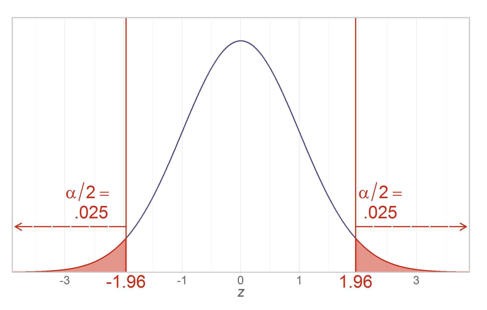
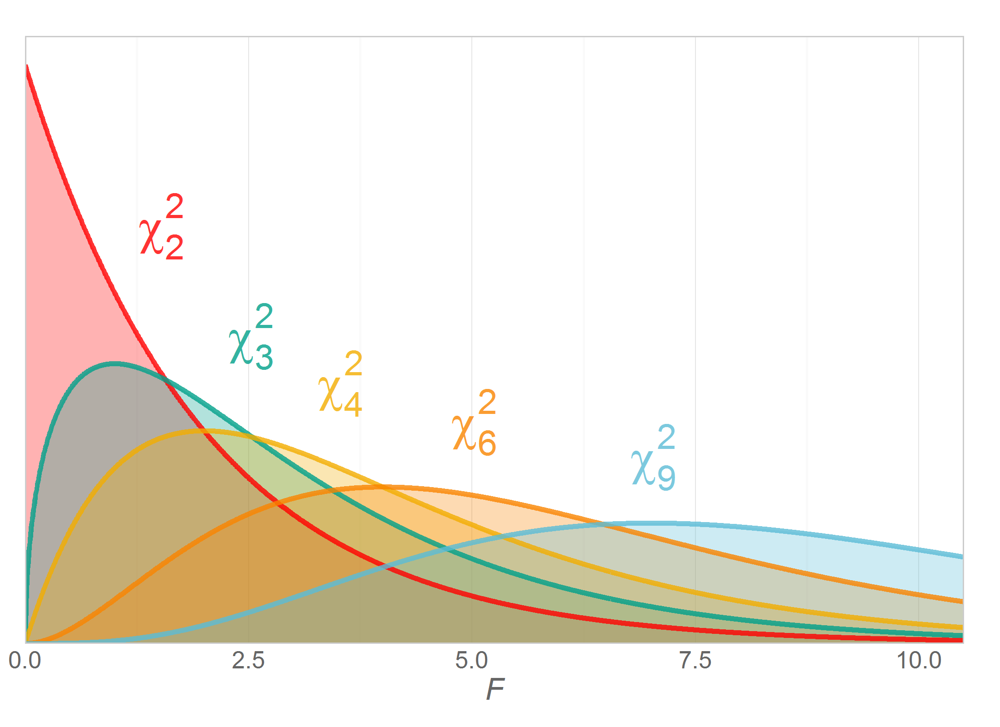
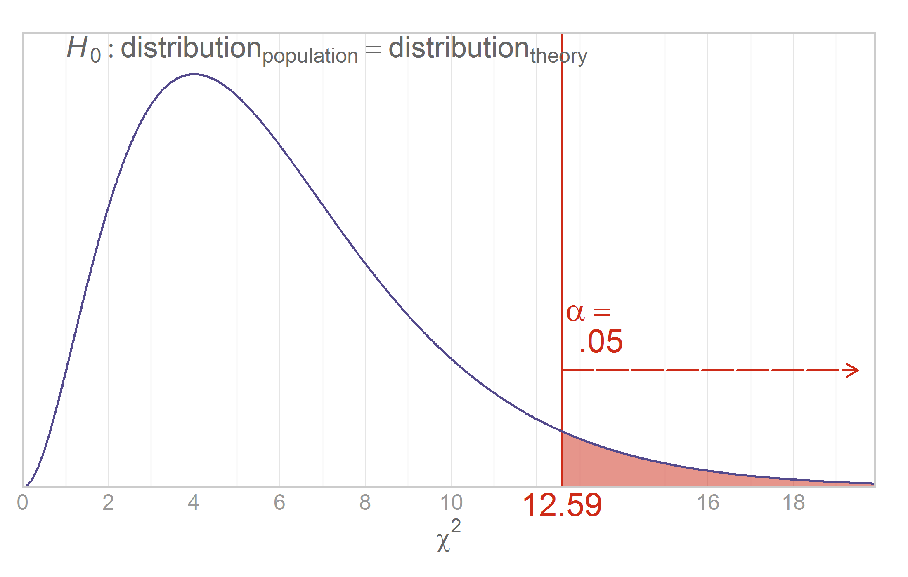
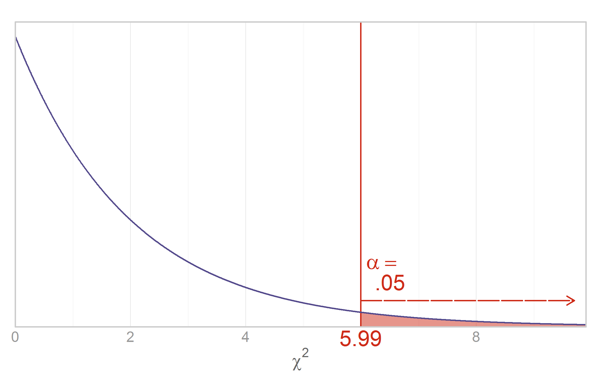
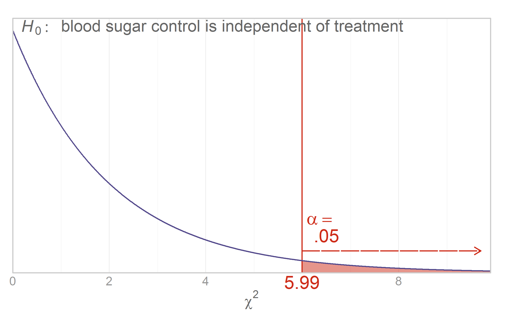

Chapter 14 Graphs
=================================================
This report creates the chapter graphs.

<!--  Set the working directory to the repository's base directory; this assumes the report is nested inside of only one directory.-->

```r
opts_knit$set(root.dir = "../")  #Don't combine this call with any other chunk -especially one that uses file paths.
```


<!-- Set the report-wide options, and point to the external code file. -->

```r
require(knitr)
opts_chunk$set(
  results = 'show', 
  message = TRUE,
  comment = NA, 
  tidy = FALSE,
  fig.width = 5.5, 
  fig.height = 3.5, 
  out.width = "400px", #This affects only the markdown, not the underlying png file.  The height will be scaled appropriately.
  fig.path = 'figure_rmd/',     
  dpi = 400,
  dev = "png"
  # dev = "pdf"
)

echoChunks <- FALSE
options(width=120) #So the output is 50% wider than the default.
read_chunk("./Chapter14/Chapter14.R") 
```

<!-- Load the packages.  Suppress the output when loading packages. --> 


<!-- Load any Global functions and variables declared in the R file.  Suppress the output. --> 


<!-- Declare any global functions specific to a Rmd output.  Suppress the output. --> 


<!-- Load the datasets. -->


<!-- Tweak the datasets. -->


## Figure 14-1



## Figure 14-2
[Steve Zissou](https://www.google.com/search?q=Steve+Zissou&espv=210&es_sm=93&tbm=isch&imgil=2g2Hl0Xn1uLPnM%253A%253Bhttps%253A%252F%252Fencrypted-tbn3.gstatic.com%252Fimages%253Fq%253Dtbn%253AANd9GcSs7l-wrHy3iVFP-U3qGDXiVc4UuWY2AIJo0WbGRJ9tnpUINC-I%253B1024%253B768%253BpIGucwvka7NrpM%253Bhttp%25253A%25252F%25252Ffuckyeahstevezissou.tumblr.com%25252Fpost%25252F11494722427%25252Fgood-moms-dress-their-children-as-steve-zissou&source=iu&usg=__NDOX2CzOV_P7y2LbbNYt2oaZ4aE%3D&sa=X&ei=Y6FEU7PfAo-S2AWn_YDICg&ved=0CLUBEP4dMA0#facrc=_&imgdii=_&imgrc=2g2Hl0Xn1uLPnM%253A%3BpIGucwvka7NrpM%3Bhttp%253A%252F%252Fwww.movies-wallpapers.net%252FMovies%252FThe%252520Life%252520Aquatic%252520With%252520Steve%252520Zissou%252FThe%252520Life%252520Aquatic%252520With%252520Steve%252520Zissou-10.jpg%3Bhttp%253A%252F%252Ffuckyeahstevezissou.tumblr.com%252Fpost%252F11494722427%252Fgood-moms-dress-their-children-as-steve-zissou%3B1024%3B768)



## Figure 14-3



## Figure 14-5



## Figure 14-6



## Session Info
For the sake of documentation and reproducibility, the current report was build on a system using the following software.


```
Report created by Will at 2014-04-14, 21:32 -0500
```

```
R version 3.1.0 Patched (2014-04-10 r65396)
Platform: x86_64-w64-mingw32/x64 (64-bit)

locale:
[1] LC_COLLATE=English_United States.1252  LC_CTYPE=English_United States.1252    LC_MONETARY=English_United States.1252
[4] LC_NUMERIC=C                           LC_TIME=English_United States.1252    

attached base packages:
[1] grid      stats     graphics  grDevices utils     datasets  methods   base     

other attached packages:
[1] RColorBrewer_1.0-5 dichromat_2.0-0    extrafont_0.16     wesanderson_0.3.2  ggplot2_0.9.3.1    scales_0.2.3      
[7] plyr_1.8.1         knitr_1.5         

loaded via a namespace (and not attached):
 [1] colorspace_1.2-4 digest_0.6.4     evaluate_0.5.3   extrafontdb_1.0  formatR_0.10     gtable_0.1.2    
 [7] labeling_0.2     MASS_7.3-31      munsell_0.4.2    proto_0.3-10     Rcpp_0.11.1      reshape2_1.2.2  
[13] Rttf2pt1_1.3     stringr_0.6.2    tools_3.1.0     
```


## License

<a rel="license" href="http://creativecommons.org/licenses/by/3.0/"></a><br />This work is licensed under a <a rel="license" href="http://creativecommons.org/licenses/by/3.0/">Creative Commons Attribution 3.0 Unported License</a>.
