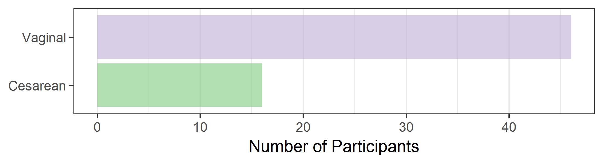
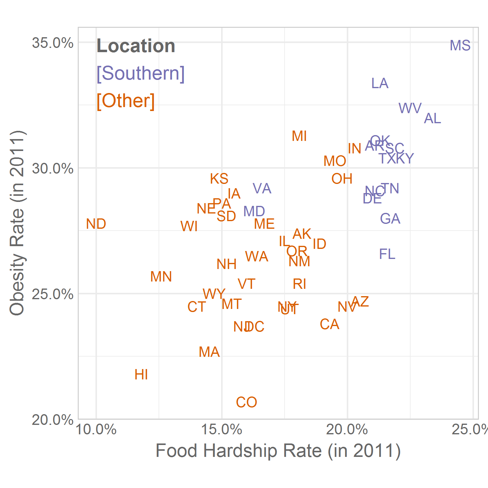
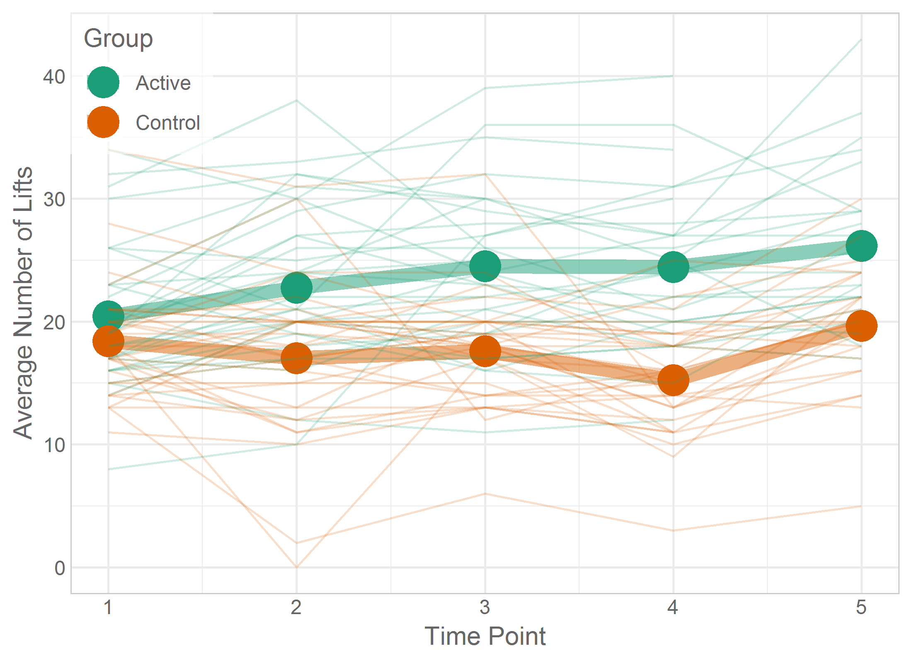

Chapter 03 Graphs
=================================================
This report creates the chapter graphs.

<!--  Set the working directory to the repository's base directory; this assumes the report is nested inside of only one directory.-->

```r
library(knitr)
opts_knit$set(root.dir='../')  #Don't combine this call with any other chunk -especially one that uses file paths.
```

<!-- Set the report-wide options, and point to the external code file. -->

```r
opts_chunk$set(
  results='show',
  message = TRUE,
  comment = NA,
  tidy = FALSE,
  fig.height = 4,
  fig.width = 5.5,
  out.width = "550px",
  fig.path = 'figure-png/',
  dev = "png",
  dpi = 400
  # fig.path = 'figure-pdf/',
  # dev = "pdf"#,
  # dev.args=list(pdf = list(colormodel = 'cmyk'))
)
echoChunks <- FALSE
options(width=120) #So the output is 50% wider than the default.
read_chunk("./chapter-03/chapter-03.R")
```
<!-- Load the packages.  Suppress the output when loading packages. -->


<!-- Load any Global functions and variables declared in the R file.  Suppress the output. -->


<!-- Declare any global functions specific to a Rmd output.  Suppress the output. -->


<!-- Load the datasets.   -->


<!-- Tweak the datasets.   -->


## Figure 3-1


## Figure 3-2


## Figure 3-3


## Figure 3-4


## Figure 3-5


## Figure 3-6


## Figure 3-7


## Figure 3-8


## Figure 3-9


## Figure 3-10


## Figure 3-11


## Figure 3-12


## Figure 3-13


## Figure 3-14


## Figure 3-15


## Figure 3-16


## Figure 3-17


## Figure 3-18


## Figure 3-19


## Figure 3-20


## Figure 3-21


## Figure 3-22


## Figure 3-23


## Session Info
For the sake of documentation and reproducibility, the current report was build on a system using the following software.


```
Report created by wibeasley at 2016-01-16, 13:54 -0600
```

```
R version 3.2.3 (2015-12-10)
Platform: x86_64-pc-linux-gnu (64-bit)
Running under: Ubuntu 14.04.3 LTS

locale:
 [1] LC_CTYPE=en_US.UTF-8       LC_NUMERIC=C               LC_TIME=en_US.UTF-8        LC_COLLATE=en_US.UTF-8    
 [5] LC_MONETARY=en_US.UTF-8    LC_MESSAGES=en_US.UTF-8    LC_PAPER=en_US.UTF-8       LC_NAME=C                 
 [9] LC_ADDRESS=C               LC_TELEPHONE=C             LC_MEASUREMENT=en_US.UTF-8 LC_IDENTIFICATION=C       

attached base packages:
[1] grid      stats     graphics  grDevices utils     datasets  methods   base     

other attached packages:
 [1] dichromat_2.0-0    extrafont_0.17     epade_0.3.8        plotrix_3.6-1      reshape2_1.4.1     ggplot2_2.0.0     
 [7] scales_0.3.0       plyr_1.8.3         RColorBrewer_1.1-2 knitr_1.12        

loaded via a namespace (and not attached):
 [1] Rcpp_0.12.3        Rttf2pt1_1.3.3     magrittr_1.5       munsell_0.4.2      colorspace_1.2-6   stringr_1.0.0.9000
 [7] tools_3.2.3        gtable_0.1.2       extrafontdb_1.0    htmltools_0.3      yaml_2.1.13        digest_0.6.9      
[13] formatR_1.2.1      evaluate_0.8       rmarkdown_0.9.2    labeling_0.3       stringi_1.0-1     
```

## License

<a rel="license" href="http://creativecommons.org/licenses/by/3.0/"></a><br />This work is licensed under a <a rel="license" href="http://creativecommons.org/licenses/by/3.0/">Creative Commons Attribution 3.0 Unported License</a>.
