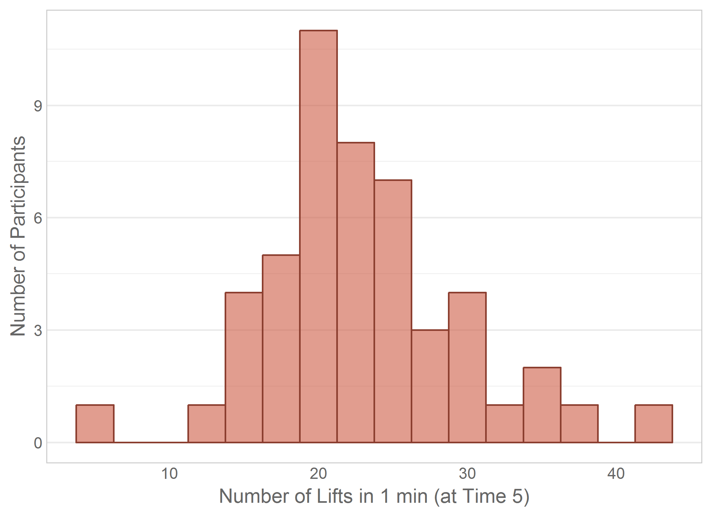
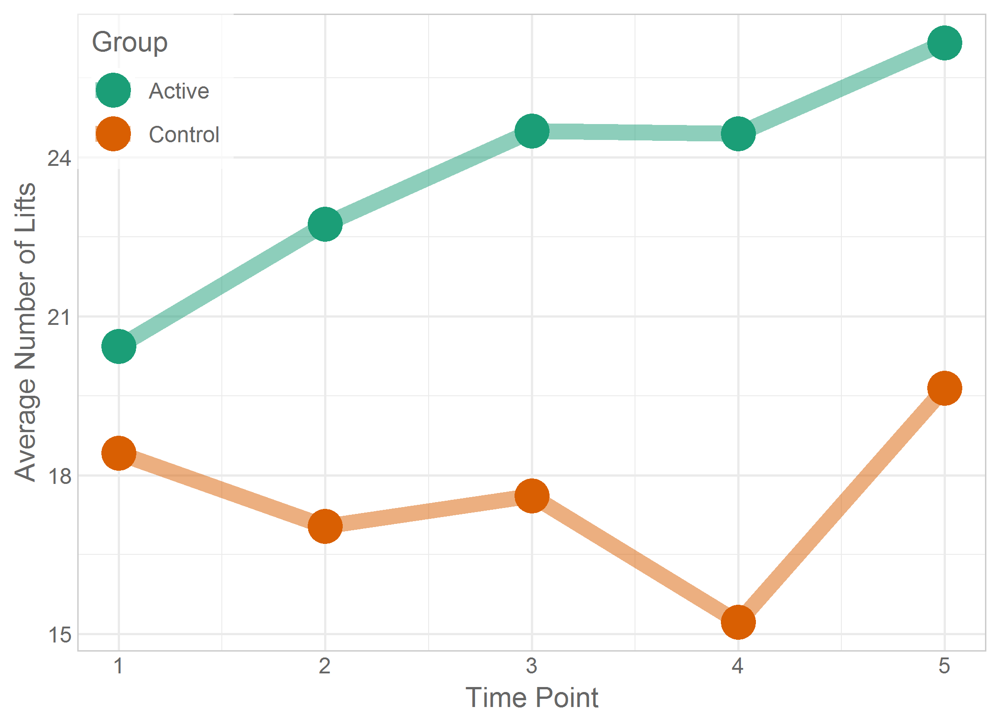
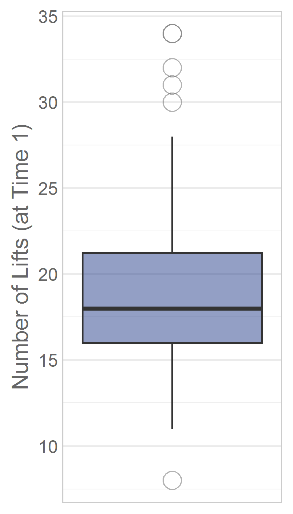
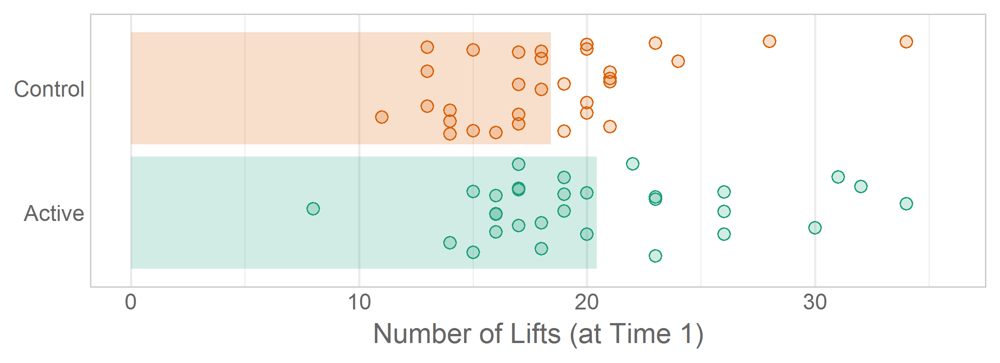

---
output:
  html_document:
    keep_md: yes
    code_folding: hide
---
Chapter 03 Graphs
=================================================
This report creates the chapter graphs.

<!--  Set the working directory to the repository's base directory; this assumes the report is nested inside of only one directory.-->


<!-- Set the report-wide options, and point to the external code file. -->

<!-- Load the packages.  Suppress the output when loading packages. -->

```r
library(magrittr) #Pipes
library(ggplot2) #For graphing
requireNamespace("dplyr")
requireNamespace("scales")
requireNamespace("readr")

requireNamespace("plotrix") #For the 3D pie chart (Please notice that this package includes much more than this feature.)
requireNamespace("epade") #For the 3D bar chart (Please notice that this package includes more than this feature.)
```

<!-- Load any Global functions and variables declared in the R file.  Suppress the output. -->

```r
source("./common-code/book-theme.R")

theme_chapter <- theme_book
```

<!-- Declare any global functions specific to a Rmd output.  Suppress the output. -->


<!-- Load the datasets.   -->

```r
# 'ds' stands for 'datasets'
dsPregnancy <- readr::read_csv("./data/exercise-pregnancy.csv"    )
dsObesity   <- readr::read_csv("./data/food-hardship-obesity.csv" )
dsSmoking   <- readr::read_csv("./data/smoking-tax.csv"           )
```

<!-- Tweak the datasets.   -->

```r
dsPregnancy$BabyWeightInKG <- dsPregnancy$BabyWeightInG / 1000

dsPregnancySummarized     <- dsPregnancy %>%
  dplyr::group_by(DeliveryMethod) %>%
  dplyr::summarize(
    Count       = length(SubjectID)
  ) %>%
  dplyr::ungroup() %>%
  dplyr::mutate(
    Proportion          = Count/sum(Count),
    Percentage          = paste0(round(Proportion*100), "%"),
    Dummy               = 1L
  )

dsPregnancyLong     <- dsPregnancy %>%
  dplyr::select(SubjectID, Group, T1Lifts, T2Lifts, T3Lifts, T4Lifts, T5Lifts) %>%
  tidyr::gather(key=TimePoint, value=LiftCount, -SubjectID, -Group) %>%
  dplyr::mutate(
    TimePoint   = as.integer(gsub(pattern="T(\\d)Lifts", "\\1", TimePoint, perl=T))
  )

dsPregnancyLongSummarized <- dsPregnancyLong %>%
  dplyr::group_by(TimePoint, Group) %>%
  dplyr::summarize(
    CountMean     = mean(LiftCount, na.rm=T)
  ) %>%
  dplyr::ungroup()

matPregnancy <- as.matrix((table(dsPregnancy$DeliveryMethod)))
# dsPregnancyMatrix <- cbind(dsPregnancyMatrix, c(1, 2), c(1,1))[, c(2,3,1)]
# matPregnancy
```

## Figure 3-1

```r
# cat("The two rotations demonstrate that the nonzero angle favors some slices more than others.")
# oldPar <- par(mfrow=c(1, 2)) #par(mfrow=c(1, 1))
#Left Panel
plotrix::pie3D(x=dsPregnancySummarized$Count, labels=dsPregnancySummarized$DeliveryMethod, height=.5,
      edges=1000, start=pi*1/5, theta=pi/10, mar=c(0, 0, 0, 0))
```


```r
# #Right Panel
# plotrix::pie3D(x=dsPregnancySummarized$Count, labels=NULL, height=.5,
#       edges=1000, start=pi*5/5, theta=pi/10, mar=c(0, 0, 0, 0))
# par(oldPar)

# cat("To demonstrate the weaknesses a pie chart, we shouldn't use a dataset that has an angle at 90, 180, or 270 degrees.  Something like this is almost impossible to tell the ratio between the slices.")
# pieval <- c(2,4,6,8)
# pielabels <- c("We hate\n pies","We oppose\n  pies","We don't\n  care","We just love pies")
# pie3D(pieval, radius=0.9, labels=pielabels, explode=0.1, main="3D PIE OPINIONS") #Documentation example of pie3D
```

## Figure 3-2

```r
oldPar <- par(mar=c(0,0,0,0))
graphics::pie(x=dsPregnancySummarized$Count, labels=dsPregnancySummarized$DeliveryMethod, col=PalettePregancyDelivery, clockwise=TRUE)
```


```r
par(oldPar)
```

## Figure 3-3

```r
dsPregnancy$Dummy <- factor(1, levels=c(1,2))
epade::bar3d.ade(x=factor(dsPregnancy$DeliveryMethod), y=dsPregnancy$Dummy,
                 xlab="", zticks=c("", ""), zlab="",
                 col=c("red", NA, "cyan", NA), wall=2)
```


```r
dsPregnancy$Dummy <- NULL
```

## Figure 3-4

```r
ggplot(dsPregnancySummarized, aes(x=DeliveryMethod, y=Count, fill=DeliveryMethod, label=Percentage)) +
  geom_bar(stat="identity", alpha=.6) +
  scale_fill_manual(values=PalettePregancyDelivery) +
  coord_flip() +
  theme_bw() +
  theme(legend.position = "none") +
  theme(panel.grid.major.y = element_blank()) +
  labs(x=NULL, y="Number of Participants")
```


## Figure 3-5

```r
ggplot(dsPregnancySummarized, aes(x=DeliveryMethod, y=Count, fill=DeliveryMethod, label=Percentage)) +
  geom_bar(stat="identity", alpha=.6) +
  geom_text(stat="identity", size=6, hjust=1.1)  +
  scale_fill_manual(values=PalettePregancyDelivery) +
  coord_flip(ylim = c(0, 1.05*max(dsPregnancySummarized$Count, na.rm=T))) +
  theme_chapter +
  theme(legend.position = "none") +
  theme(axis.text.y=element_text(size=14)) +
  theme(panel.grid.major.y = element_blank()) +
  labs(x=NULL, y="Number of Participants")
```


## Figure 3-6


## Figure 3-7

```r
#Refer to Recipe 3.10 ("Making a Cleveland Dot Plot") in Winston Chang's *R Graphics Cookbook* (2013).
stateOrder <- dsObesity$State[order(dsObesity$ObesityRate)]
dsObesity$State <- factor(dsObesity$State, levels=stateOrder)

ggplot(dsObesity[dsObesity$Location=="South", ], aes(x=ObesityRate, y=State)) +
  geom_segment(aes(yend=State, xend=min(ObesityRate)), color=adjustcolor(PaletteObesityState[2], .5)) +
  geom_point(size=3, shape=21, color=PaletteObesityState[2], fill=adjustcolor(PaletteObesityState[2], alpha.f=.5)) +
  scale_x_continuous(label=scales::percent) +
  theme_chapter +
  theme(panel.grid.major.y = element_blank()) +
  labs(title="Obesity Rate in 2011", x="Percent of Residents in a State", y=NULL)
```


## Figure 3-8

```r
ggplot(dsObesity, aes(x=FoodHardshipRate, y=ObesityRate)) +
  geom_point(shape=21, size=3, color=PaletteObesityState[2], fill=adjustcolor(PaletteObesityState[2], alpha.f=.25)) + #This color should match the obesity Cleveland dot plot
  scale_x_continuous(label=scales::percent) +
  scale_y_continuous(label=scales::percent) +
  coord_fixed() +
  theme_chapter +
  labs(x="Food Hardship Rate (in 2011)", y="Obesity Rate (in 2011)")
```


## Figure 3-9

```r
# ggplot(dsObesity, aes(x=FoodHardshipRate, y=ObesityRate, label=State, color=Location)) +
#   geom_text(size=3, alpha=1) +
#   scale_x_continuous(label=scales::percent) +
#   scale_y_continuous(label=scales::percent) +
#   scale_color_manual(values=PaletteObesityState) +
#   coord_fixed() +
#   theme_chapter +
#   theme(legend.position=c(0, 1), legend.justification=c(0, 1)) +
#   labs(x="Food Hardship Rate (in 2011)", y="Obesity Rate (in 2011)") +
#     theme(legend.title=element_text(colour="gray40"), legend.text=element_text(colour="gray40"))

hardshipRange <- range(dsObesity$FoodHardshipRate)
obesityRange <- range(dsObesity$ObesityRate)
# obesityDiff <- diff(obesityRange)
ggplot(dsObesity, aes(x=FoodHardshipRate, y=ObesityRate, label=State, color=Location)) +
  geom_text(size=3, alpha=1) +
  scale_x_continuous(label=scales::percent) +
  scale_y_continuous(label=scales::percent) +
  scale_color_manual(values=PaletteObesityState) +
  coord_fixed() +
  theme_chapter +
  theme(legend.position="none") +
  labs(x="Food Hardship Rate (in 2011)", y="Obesity Rate (in 2011)") +
  annotate("text", x=hardshipRange[1], y= obesityRange[2], label="Location", hjust=0, colour="gray40", fontface=2, size=4) +
  annotate("text", x=hardshipRange[1], y=obesityRange[2], label="\n\n[Southern]", hjust=0, colour=PaletteObesityState[2], size=4) +
  annotate("text", x=hardshipRange[1], y=obesityRange[2], label="\n\n\n\n[Other]", hjust=0, colour=PaletteObesityState[1], size=4)
```


## Figure 3-10

```r
ggplot(dsPregnancy, aes(x=T5Lifts)) +
  geom_histogram(binwidth=2.5, fill="coral3", color="coral4", alpha=.6, na.rm=T) + #Be a little darker than the previous boxplot
  theme_chapter +
  theme(panel.grid.major.x = element_blank()) +
  theme(panel.grid.minor.x = element_blank()) +
  labs(x="Number of Lifts in 1 min (at Time 5)", y="Number of Participants")
```



## Figure 3-11

```r
ggplot(dsObesity, aes(x=ObesityRate)) +
  geom_histogram(binwidth=.01, fill="salmon2", color="salmon3", alpha=.6) + #Be a little darker than the previous boxplot
  scale_x_continuous(label=scales::percent) +
  theme_chapter +
  theme(panel.grid.major.x = element_blank()) +
  theme(panel.grid.minor.x = element_blank()) +
  labs(x="Obesity Rate (in 2011)", y="Number of States")
```


## Figure 3-12

```r
dsPregnancyLongSummarizedFakeTable <- dsPregnancyLongSummarized %>%
  dplyr::do(
    tibble::tibble(
      TimePoint = rep(.$TimePoint, times=.$CountMean),
      Group     = rep(.$Group    , times=.$CountMean)
    )
  )

oldPar <- par(mar=c(2,2,0,0))
epade::bar.plot.ade(x="TimePoint", y="Group", data=dsPregnancyLongSummarizedFakeTable, form="c", b2=3, alpha=.5, legendon="top", ylim=c(0, 30))
```


```r
par(oldPar)
```

## Figure 3-13

```r
gLongitudinalLifts <- ggplot(dsPregnancyLongSummarized, aes(x=TimePoint, y=CountMean, color=Group)) +
  geom_line(size=3, alpha=.5) +
  geom_point(size=6) +
  scale_color_manual(values=PalettePregancyGroup) +
  theme_chapter +
  theme(legend.position=c(0, 1), legend.justification=c(0, 1)) +
  theme(legend.background=element_rect(fill="#FFFFFF99")) +
  theme(legend.title=element_text(color="gray40")) +
  theme(legend.text=element_text(color="gray40")) +
  labs(x="Time Point", y="Average Number of Lifts")

gLongitudinalLifts
```



## Figure 3-14

```r
gLongitudinalLifts + geom_line(data=dsPregnancyLong, mapping=aes(x=TimePoint, y=LiftCount,  group=SubjectID), alpha=.2, na.rm=T)
```


## Figure 3-15

```r
#Note the approach to labeling outliers will fail if there are duplicated values. See http://stackoverflow.com/questions/15181086/labeling-outliers-on-boxplot-in-r
#See Chang (2013), Recipe 6.6.  We added (arbitrary) x-axis limits to force the box narrower.
outlierPrevelances <- graphics::boxplot(dsSmoking$AdultCigaretteUse, plot=F)$out
outlierLabels <- dsSmoking$State[which( dsSmoking$AdultCigaretteUse == outlierPrevelances, arr.ind=TRUE)]

ggplot(dsSmoking, aes(x=1, y=AdultCigaretteUse)) +
#   geom_boxplot(width=.5, fill="royalblue1", outlier.shape=1, outlier.size=4, outlier.colour="gray40", alpha=.5) +
  stat_summary(fun.data=TukeyBoxplot, geom='boxplot', fill="royalblue1", outlier.shape=1, outlier.size=4, outlier.colour="gray40", alpha=.5) +
  scale_x_continuous(breaks=NULL, limits=c(.5, 1.5)) +
  scale_y_continuous(label=scales::percent) +
  annotate(geom="text", x=1L, y=outlierPrevelances, label=outlierLabels, hjust=-.6, color="gray40") +
  theme_chapter +
  theme(legend.position=c(0, 1), legend.justification=c(0, 1)) +
  labs(x=NULL, y="Adult Smoking Prevalence (in 2009)")
```


## Figure 3-16

```r
ggplot(dsPregnancy, aes(x=1, y=T1Lifts)) +
#   geom_boxplot(width=.5,fill="royalblue4", outlier.shape=1, outlier.size=4, outlier.colour="gray40", alpha=.5, na.rm=T) +
  stat_summary(fun.data=TukeyBoxplot, geom='boxplot',  fill="royalblue4", outlier.shape=1, outlier.size=4, outlier.colour="gray40", alpha=.5, na.rm=T) +
  scale_x_continuous(breaks=NULL, limits=c(.5, 1.5)) +
  theme_chapter +
  theme(legend.position=c(0, 1), legend.justification=c(0, 1)) +
  labs(x=NULL, y="Number of Lifts (at Time 1)")
```



## Figure 3-17

```r
ggplot(dsPregnancy, aes(x=Group, y=BabyWeightInKG, fill=Group)) +
  stat_summary(fun.data=TukeyBoxplot, geom='boxplot', outlier.shape=1, outlier.size=4, outlier.colour="gray40", alpha=.5) +
  scale_fill_manual(values=PalettePregancyGroup) +
  theme_chapter +
  theme(legend.position="none") +
  theme(panel.grid.major.x = element_blank()) +
  labs(x=NULL, y="Baby Birth Weight (in kg)")
```


## Figure 3-18

```r
g <- ggplot(dsPregnancy, aes(x=DeliveryMethod, y=BabyWeightInKG, fill=DeliveryMethod)) +
#   geom_boxplot(outlier.shape=1, outlier.size=4,  alpha=.5, type=1) +
  stat_summary(fun.data=TukeyBoxplot, geom='boxplot', outlier.shape=1, outlier.size=4, alpha=.5) +
  scale_fill_manual(values=PalettePregancyDelivery) +
  theme_chapter +
  theme(panel.grid.major.x = element_blank()) +
  theme(legend.position="none") + labs(x=NULL, y="Baby Birth Weight (in kg)")
g
```


```r
#
# greenScores <- sort(dsPregnancy[dsPregnancy$DeliveryMethod=="Cesarean", "BabyWeightInKG"])
# greenScores
# (approach1 <- quantile(greenScores))
# (approach2 <- fivenum(greenScores))
#
# quantile(greenScores, type=3)
# (approach3 <- quantile(greenScores, type=5))
# (approach4 <- quantile(greenScores, type=6))
#
# #This graph is just for our exploration.
# g + annotate(geom="text", x=1, y=approach1, label=round(approach1, 3), hjust=-.1, color="tomato")
#
# This graph is just for our exploration.
# g + annotate(geom="text", x=1, y=approach2, label=round(approach2, 3), hjust=-.1, color="tomato")
#
# rm(g)
#
```

## Figure 3-19

```r
g03_19 <- ggplot(dsPregnancy, aes(x=Group, y=T1Lifts, fill=Group)) +
  geom_bar(stat="summary", fun.y="mean", na.rm=T, alpha=.7 ) +
#   scale_y_continuous(limits = c(18, 21)) +
  scale_fill_manual(values=PalettePregancyGroup) +
  theme_chapter +
  theme(legend.position="none") +
  theme(panel.grid.major.y = element_blank()) +
  labs(x=NULL, y="Mean Number of Lifts (at Time 1)")

g03_19 + coord_flip(ylim = c(18, 21))
```


## Figure 3-20

```r
g03_19 + coord_flip(ylim = c(0, 21))
```


## Figure 3-21

```r
### Possible Narration:
### Add observed data to the existing statistical summary (ie, the bar of means).
### This makes it obvious how the variability dwarfs the difference.
### This could be a possible callback in a later chapter: the t's denominator dwarfs the numerator.

set.seed(seed=789) #Set a seed so the jittered graphs are consistent across renders.
ggplot(dsPregnancy, aes(x=Group, y=T1Lifts, fill=Group, color=Group)) +
  geom_bar(stat="summary", fun.y="mean", na.rm=T, color=NA) +
  geom_point(position=position_jitter(w = 0.4, h = 0), na.rm=T, size=2, shape=21) +
  scale_color_manual(values=PalettePregancyGroup) +
  scale_fill_manual(values=PalettePregancyGroupLight) +
  coord_flip(ylim = c(0, 1.05*max(dsPregnancy$T1Lifts, na.rm=T))) +
  theme_chapter +
  theme(legend.position="none") +
  theme(panel.grid.major.y = element_blank()) +
  labs(x=NULL, y="Number of Lifts (at Time 1)")
```



## Figure 3-22

```r
### Possible Narration:
### The number of summary layers doesn't need to stop at two.
### A diamond below represent the group's mean.

set.seed(seed=789) #Set a seed so the jittered graphs are consistent across renders.
gBox <- ggplot(dsPregnancy, aes(x=Group, y=T1Lifts, fill=Group, color=Group)) +
#   stat_summary(fun.y="mean", geom="point", shape=23, size=5, fill="white", alpha=.5, na.rm=T) + #See Chang (2013), Recipe 6.8.
#   geom_boxplot(na.rm=T, alpha=.2, outlier.shape=NULL, outlier.colour=NA) +
  stat_summary(fun.data=TukeyBoxplot, geom='boxplot', na.rm=T, outlier.shape=NULL, outlier.colour=NA) +
  geom_point(position=position_jitter(w = 0.4, h = 0), size=2, shape=21, na.rm=T) +
  scale_color_manual(values=PalettePregancyGroup) +
  scale_fill_manual(values=PalettePregancyGroupLight) +
  coord_flip(ylim = c(0, 1.05*max(dsPregnancy$T1Lifts, na.rm=T))) +
  theme_chapter +
  theme(legend.position="none") +
  theme(panel.grid.major.y = element_blank()) +
  labs(x=NULL, y="Number of Lifts (at Time 1)")
gBox
```


## Figure 3-23

```r
set.seed(seed=789) #Set a seed so the jittered graphs are consistent across renders.
gBox +   stat_summary(fun.y="mean", geom="point", shape=23, size=5, fill="white", alpha=.5, na.rm=T) #See Chang (2013), Recipe 6.8.
```


```r
#
# ### Possible Narration:
# ### Compare this with Fig 3-13 (ie the second bar chart in this section).  These two small diamonds represent *every piece of information* in the bar chart.
# ### Consider all the rich information missing from the graph below.
# ### If the graph is constructed sensibly, your brain can manage a more complexity that two summary points.  And so can your audience.
# ### Both you and your audience will be benefit from a more complete representation of your study's results.
#
# ggplot(dsPregnancy, aes(x=Group, y=T1Lifts, fill=Group, color=Group)) +
#   geom_bar(stat="summary", fun.y="mean", na.rm=T, alpha=.2, color=NA ) +
#   stat_summary(fun.y="mean", geom="point", shape=23, size=5, fill="white", alpha=1, na.rm=T) +
#   scale_color_manual(values=PalettePregancyGroup) +
#   scale_fill_manual(values=PalettePregancyGroup) +
#   coord_flip(ylim = c(0, 1.05*max(dsPregnancy$T1Lifts, na.rm=T))) +
#   theme_chapter +
#   theme(legend.position="none") +
#   labs(x=NULL, y="Number of Lifts (at Time 1)")
#
# ### Possible Narration:
# ### Consider your audience's starting point.  DOn't just throw a bunch of layers and expect they'll understand the conventions you've chosen.
# ### Clearly identify the elements containedin each layer, and what concept/summary/observation each layer is representing.
#
# ### Possible Narration:
# ### We expect that interactive graphics will become more common in the health sciences, and that the tools will become
# ### easier for more people to use.  We don't think they tools are ready for intro stat students yet.
# ### Once you're more comfortable with the statistical concepts and programming required of this course, we
# ### encourage you to investigate if interactive graphics would contribute towards communicating your research results.
#
# ### Possible Narration:
# ### Choose colors consistently for the same variable *sets*, and contrastingly for different variables.
# ### Think of the cognitive distance between variable *sets* (which is different that between factor levels, or between variables).
```

<!-- The footer that's common to all reports. -->

## Session Information

For the sake of documentation and reproducibility, the current report was rendered in the following environment.  Click the line below to expand.

<details>
  <summary>Environment <span class="glyphicon glyphicon-plus-sign"></span></summary>

```
- Session info ---------------------------------------------------------------
 setting  value                                      
 version  R version 3.5.1 Patched (2018-09-10 r75281)
 os       Windows >= 8 x64                           
 system   x86_64, mingw32                            
 ui       RStudio                                    
 language (EN)                                       
 collate  English_United States.1252                 
 ctype    English_United States.1252                 
 tz       America/Chicago                            
 date     2018-10-25                                 

- Packages -------------------------------------------------------------------
 package      * version    date       lib source                          
 assertthat     0.2.0      2017-04-11 [1] CRAN (R 3.5.0)                  
 backports      1.1.2      2017-12-13 [1] CRAN (R 3.5.0)                  
 base64enc      0.1-3      2015-07-28 [1] CRAN (R 3.5.0)                  
 bindr          0.1.1      2018-03-13 [1] CRAN (R 3.5.0)                  
 bindrcpp       0.2.2      2018-03-29 [1] CRAN (R 3.5.0)                  
 callr          3.0.0      2018-08-24 [1] CRAN (R 3.5.1)                  
 cli            1.0.1      2018-09-25 [1] CRAN (R 3.5.1)                  
 colorspace     1.3-2      2016-12-14 [1] CRAN (R 3.5.0)                  
 crayon         1.3.4      2017-09-16 [1] CRAN (R 3.5.0)                  
 debugme        1.1.0      2017-10-22 [1] CRAN (R 3.5.0)                  
 desc           1.2.0      2018-05-01 [1] CRAN (R 3.5.0)                  
 devtools       2.0.0      2018-10-19 [1] CRAN (R 3.5.1)                  
 dichromat      2.0-0      2013-01-24 [1] CRAN (R 3.5.0)                  
 digest         0.6.18     2018-10-10 [1] CRAN (R 3.5.1)                  
 dplyr          0.7.7      2018-10-16 [1] CRAN (R 3.5.1)                  
 epade          0.3.8      2013-02-22 [1] CRAN (R 3.5.1)                  
 evaluate       0.12       2018-10-09 [1] CRAN (R 3.5.1)                  
 extrafont      0.17       2014-12-08 [1] CRAN (R 3.5.0)                  
 extrafontdb    1.0        2012-06-11 [1] CRAN (R 3.5.0)                  
 fs             1.2.6      2018-08-23 [1] CRAN (R 3.5.1)                  
 ggplot2      * 3.0.0      2018-07-03 [1] CRAN (R 3.5.1)                  
 glue           1.3.0      2018-07-17 [1] CRAN (R 3.5.1)                  
 gtable         0.2.0      2016-02-26 [1] CRAN (R 3.5.0)                  
 hms            0.4.2.9001 2018-08-09 [1] Github (tidyverse/hms@979286f)  
 htmltools      0.3.6      2017-04-28 [1] CRAN (R 3.5.0)                  
 knitr        * 1.20       2018-02-20 [1] CRAN (R 3.5.0)                  
 labeling       0.3        2014-08-23 [1] CRAN (R 3.5.0)                  
 lazyeval       0.2.1      2017-10-29 [1] CRAN (R 3.5.0)                  
 magrittr     * 1.5        2014-11-22 [1] CRAN (R 3.5.0)                  
 memoise        1.1.0      2017-04-21 [1] CRAN (R 3.5.0)                  
 munsell        0.5.0      2018-06-12 [1] CRAN (R 3.5.0)                  
 packrat        0.4.9-3    2018-06-01 [1] CRAN (R 3.5.0)                  
 pacman         0.5.0      2018-10-22 [1] CRAN (R 3.5.1)                  
 pillar         1.3.0      2018-07-14 [1] CRAN (R 3.5.1)                  
 pkgbuild       1.0.2      2018-10-16 [1] CRAN (R 3.5.1)                  
 pkgconfig      2.0.2      2018-08-16 [1] CRAN (R 3.5.1)                  
 pkgload        1.0.1      2018-10-11 [1] CRAN (R 3.5.1)                  
 plotrix        3.7-4      2018-10-03 [1] CRAN (R 3.5.1)                  
 plyr           1.8.4      2016-06-08 [1] CRAN (R 3.5.0)                  
 prettyunits    1.0.2      2015-07-13 [1] CRAN (R 3.5.0)                  
 processx       3.2.0      2018-08-16 [1] CRAN (R 3.5.1)                  
 ps             1.2.0      2018-10-16 [1] CRAN (R 3.5.1)                  
 purrr          0.2.5      2018-05-29 [1] CRAN (R 3.5.0)                  
 R6             2.3.0      2018-10-04 [1] CRAN (R 3.5.1)                  
 RColorBrewer   1.1-2      2014-12-07 [1] CRAN (R 3.5.0)                  
 Rcpp           0.12.19    2018-10-01 [1] CRAN (R 3.5.1)                  
 readr          1.2.0      2018-10-25 [1] Github (tidyverse/readr@69c9fd3)
 remotes        2.0.1      2018-10-19 [1] CRAN (R 3.5.1)                  
 rlang          0.3.0.1    2018-10-25 [1] CRAN (R 3.5.1)                  
 rmarkdown      1.10       2018-06-11 [1] CRAN (R 3.5.0)                  
 rprojroot      1.3-2      2018-01-03 [1] CRAN (R 3.5.0)                  
 Rttf2pt1       1.3.7      2018-06-29 [1] CRAN (R 3.5.0)                  
 scales         1.0.0      2018-08-09 [1] CRAN (R 3.5.1)                  
 sessioninfo    1.1.0      2018-09-25 [1] CRAN (R 3.5.1)                  
 stringi        1.2.4      2018-07-20 [1] CRAN (R 3.5.1)                  
 stringr        1.3.1      2018-05-10 [1] CRAN (R 3.5.0)                  
 testthat       2.0.1      2018-10-13 [1] CRAN (R 3.5.1)                  
 tibble         1.4.2      2018-01-22 [1] CRAN (R 3.5.0)                  
 tidyr          0.8.1      2018-05-18 [1] CRAN (R 3.5.0)                  
 tidyselect     0.2.5      2018-10-11 [1] CRAN (R 3.5.1)                  
 usethis        1.4.0      2018-08-14 [1] CRAN (R 3.5.1)                  
 wesanderson    0.3.6      2018-04-20 [1] CRAN (R 3.5.1)                  
 withr          2.1.2      2018-03-15 [1] CRAN (R 3.5.0)                  
 yaml           2.2.0      2018-07-25 [1] CRAN (R 3.5.1)                  

[1] D:/Projects/RLibraries
[2] D:/Users/Will/Documents/R/win-library/3.5
[3] C:/Program Files/R/R-3.5.1patched/library
```
</details>


Report rendered by Will at 2018-10-25, 13:02 -0500 in 12 seconds.


## License

<a rel="license" href="http://creativecommons.org/licenses/by/3.0/"></a><br />This work is licensed under a <a rel="license" href="http://creativecommons.org/licenses/by/3.0/">Creative Commons Attribution 3.0 Unported License</a>.
