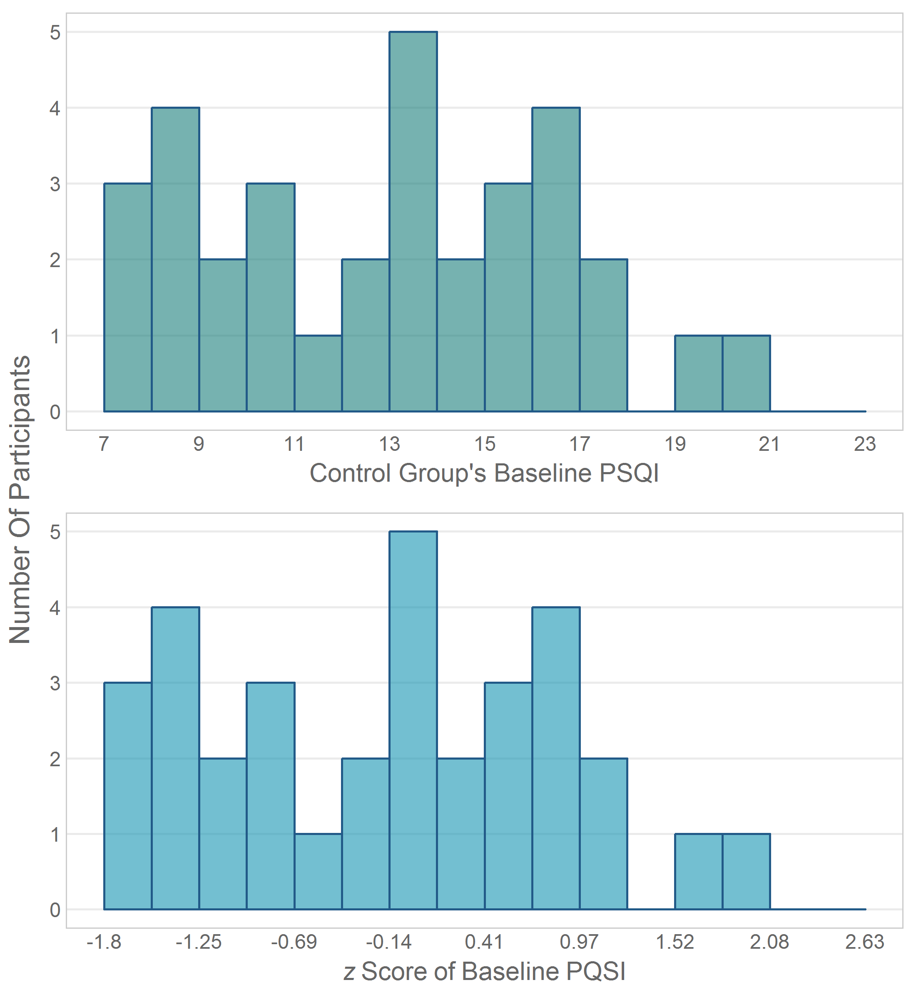
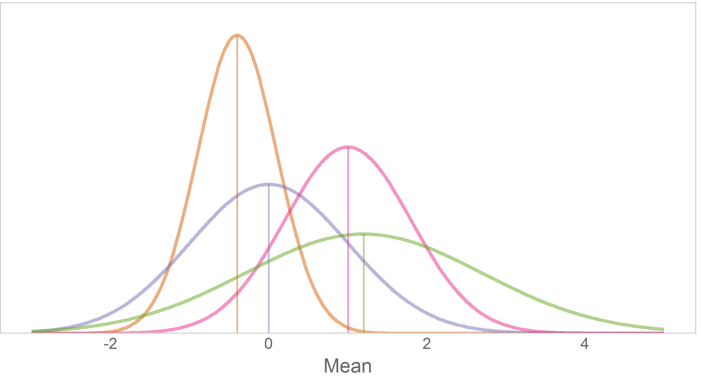
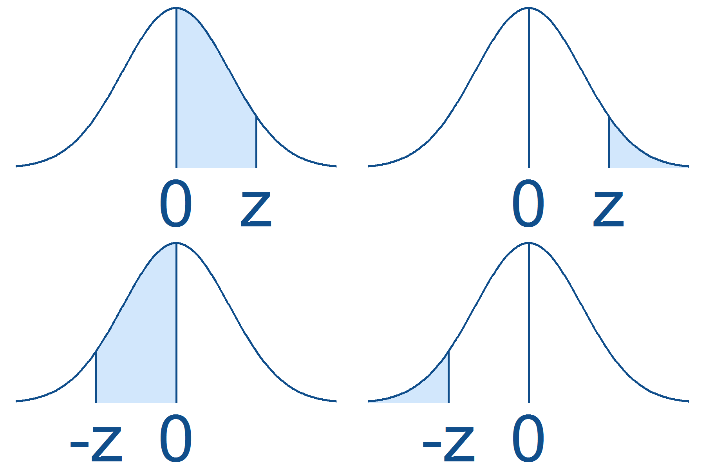
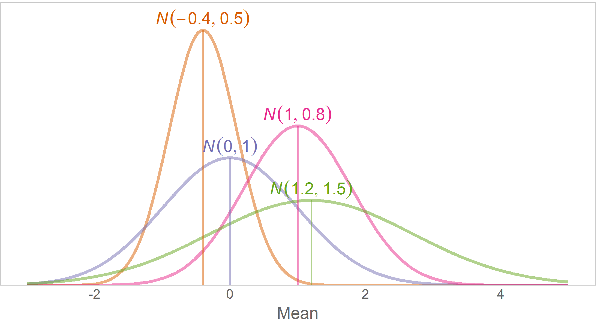
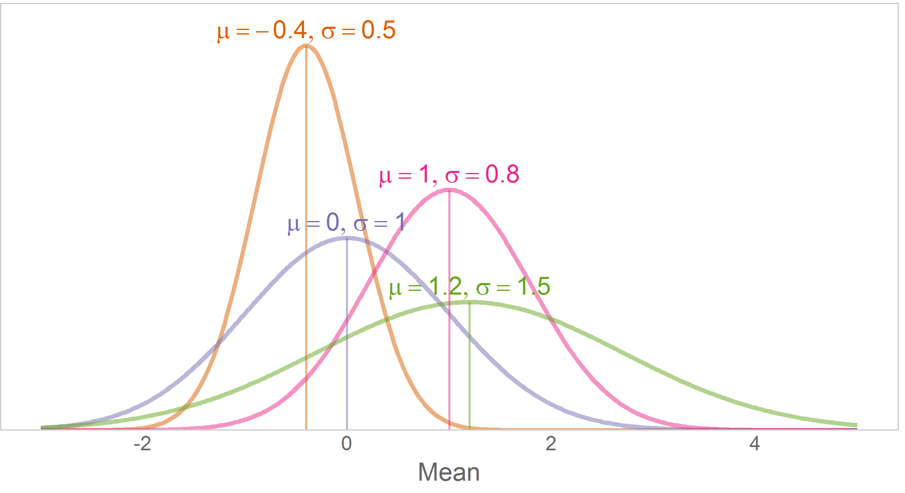
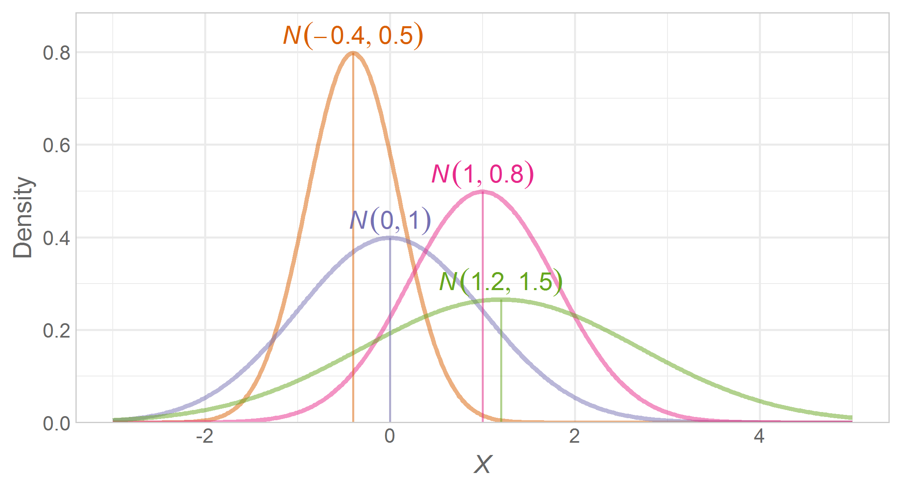
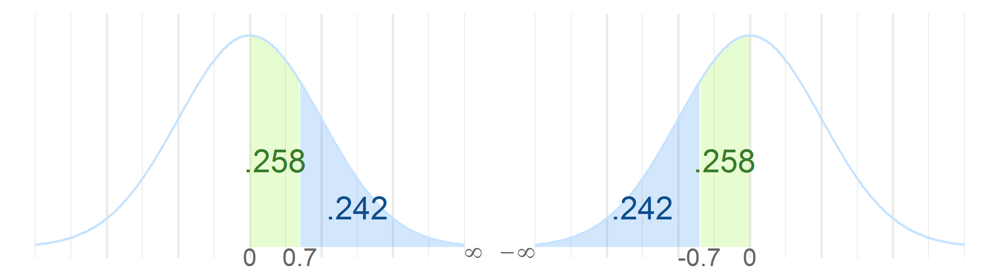

---
output:
  html_document:
    keep_md: yes
    code_folding: hide
---
Chapter 04 Graphs
=================================================
This report creates the chapter graphs.

<!--  Set the working directory to the repository's base directory; this assumes the report is nested inside of only one directory.-->


<!-- Set the report-wide options, and point to the external code file. -->

<!-- Load the packages.  Suppress the output when loading packages. -->

```r
library(magrittr) #Pipes
library(ggplot2) #For graphing
requireNamespace("readr")
requireNamespace("RColorBrewer")
requireNamespace("gridExtra")
```

<!-- Load any Global functions and variables declared in the R file.  Suppress the output. -->

```r
source("./common-code/book-theme.R")

calculatedPointCount <- 401

theme_chapter <- theme_book

theme_empty <- theme_minimal() +
  theme(axis.text = element_blank()) +
  theme(axis.title = element_blank()) +
  theme(panel.grid = element_blank()) +
  theme(panel.border = element_blank()) +
  theme(axis.ticks = element_blank())
```

<!-- Declare any global functions specific to a Rmd output.  Suppress the output. -->


<!-- Load the datasets.   -->

```r
# 'ds' stands for 'datasets'
dsFibromyalgia <- readr::read_csv("./data/fibromyalgia-tai-chi.csv")
```

<!-- Tweak the datasets.   -->

```r
dsFibromyalgiaT1Control <- dsFibromyalgia %>%
  dplyr::filter(dsFibromyalgia$Group=="Control") %>%
  dplyr::select(X=PsqiT1) %>%
  dplyr::mutate(
    biasedSDPsqiT1  = sd(X) * sqrt((n()-1) / n()),
    Z               = scale(x=.data$X, center=0, scale=min(.data$biasedSDPsqiT1))
  ) %>%
  dplyr::arrange(X)
```

## Figure 4-1

```r
breaksX <- seq(from=7, to=23, by=1)
histogramX <- ggplot(dsFibromyalgiaT1Control, aes(x=X)) +
  geom_histogram(breaks=breaksX, fill=PaletteControlPsqiLight[1], color=PaletteControlPsqiDark[2], alpha=.6) +
  theme_chapter +
  theme(panel.grid.minor=element_blank()) +
  theme(panel.grid.major.x=element_blank()) +
  labs(x="Control Group's Baseline PSQI", y="Number of Participants")

histogramX
```


## Figure 4-2

```r
tickRadius <- .05
yZ <- -.5 #the height of the z line
groupMean <- 13.45
singleScore <- 17
singleZ <- 0.98
scaleSD <- (singleScore - groupMean) / singleZ
arrowHeight <- tickRadius * 4
zTicks <- c(0, .25, .5, .75, 1)
colorMeanDark <- "#a6611a" #Tanish
colorMeanLight <- "#dfc27d" #Tanish
colorSingleDark <- "#018571" #Greenish
colorSingleLight <- "#80cdc1" #Greenish
grayDark <- "gray40"
grayLight <- "gray70"

dsPsqi <- data.frame(X=13:17, XEnd=13:17, Y=+tickRadius, YEnd=-tickRadius, Label=13:17)
dsZ <- data.frame(X=groupMean + zTicks* scaleSD, Y=yZ-tickRadius, YEnd=yZ+tickRadius, Label=zTicks)
dsZ$XEnd <- dsZ$X

ggplot(dsPsqi, aes(x=X, xend=XEnd, y=Y, yend=YEnd,label=Label, group=1)) +
  annotate("segment", x=groupMean, xend=groupMean, y=arrowHeight, yend=tickRadius*.1,
           arrow = grid::arrow(length = unit(.4,"cm")), color=colorMeanLight, size=2, lineend="round") +
  annotate("segment", x=singleScore, xend=singleScore, y=arrowHeight, yend=tickRadius*.1,
           arrow = grid::arrow(length = unit(.4,"cm"), type="open"), color=colorSingleLight, size=2, lineend="round") +

  annotate("segment", x=groupMean, xend=groupMean, y=0, yend=yZ, color=colorMeanLight, linetype=2, size=1) +
  annotate("segment", x=singleScore, xend=singleScore, y=0, yend=yZ, color=colorSingleLight, linetype=2, size=1) +

  geom_segment(aes(x=12, xend=17.5, y=0, yend=0), color=grayLight) + #The PSQI line
  geom_segment(color=grayLight) + #The tick marks on PSQI
  geom_text(vjust=-1.0, color=grayDark) + #The labels for PSQI
  annotate("text", x=-Inf, y=0, label="PSQI", hjust=0, vjust=-.3, color=grayDark) +
  annotate("text", x=-Inf, y=0, label="Scores", hjust=0, vjust=1.3, color=grayDark) +

  geom_segment(aes(x=12, xend=17.5, y=yZ, yend=yZ), color=grayLight) + #The Z line
  geom_segment(data=dsZ, color=grayLight) + #The tick marks on Z
  geom_text(data=dsZ, vjust=2.0, color=grayDark) + #The labels for Z
  annotate("text", x=-Inf, y=yZ, label="italic(z)", hjust=0, vjust=-.3, color=grayDark, parse=TRUE) +
  annotate("text", x=-Inf, y=yZ, label="Scores", hjust=0, vjust=1.3, color=grayDark, parse=TRUE) +

  #annotate("text", x=groupMean, y=arrowHeight, vjust=-1, label=as.character(expression(bar(italic(X))==13.45)), color=colorMeanDark, parse=TRUE) +
  #annotate("text", x=singleScore, y=arrowHeight, vjust=-.38, label="A person's\nscore = 17", color=colorSingleDark) +

  annotate("text", x=groupMean, y=arrowHeight, vjust=-.7, label="Group mean", color=colorMeanDark) +
  annotate("text", x=groupMean, y=-tickRadius, vjust=1, hjust=0, label=as.character(expression(phantom(2)*italic(M)==13.45)), color=colorMeanDark, parse=TRUE) +
#   annotate("text", x=groupMean, y=yZ+tickRadius, vjust=0, hjust=0, label=as.character(expression(phantom(2)*bar(italic(Z))==0)), color=colorMeanDark, parse=TRUE) +

  annotate("text", x=singleScore, y=arrowHeight, vjust=-.7, label="A person's score", color=colorSingleDark) +
#   annotate("text", x=singleScore, y=-tickRadius, vjust=1, hjust=0, label=as.character(expression(phantom(2)*italic(x[1])==17)), color=colorSingleDark, parse=TRUE) +
  annotate("text", x=singleScore, y=yZ+tickRadius, vjust=0, hjust=-0, label=as.character(expression(phantom(2)*italic(z)==.98)), color=colorSingleDark, parse=TRUE) +

  scale_x_continuous(expand=c(0,0), limits=c(12, 18.1)) +
  scale_y_continuous(limits=c((yZ -tickRadius)*1.15, arrowHeight*1.3)) +
  theme_empty
```


```r
rm(tickRadius, yZ, groupMean, singleScore, singleZ, scaleSD, arrowHeight, zTicks,
   colorMeanDark, colorMeanLight, colorSingleDark, colorSingleLight, grayDark, grayLight)
```

## Figure 4-3

```r
#The real way gets the two versions a little bit different, because of the scores sitting on a histogram bin boundary.
#breaksXSparse <- breaksX[c(2,4,6,8,10,12,14,16)]
breaksXSparse <- breaksX[c(1,3,5,7,9,11,13,15,17)]
breaksZ <- as.numeric(scale(breaksX-.01, center=mean(dsFibromyalgiaT1Control$X), scale=min(dsFibromyalgiaT1Control$biasedSDPsqiT1)))
breaksZSparse <- as.numeric(scale(breaksXSparse-.05, center=mean(dsFibromyalgiaT1Control$X), scale=min(dsFibromyalgiaT1Control$biasedSDPsqiT1)))
histogramXInset <- histogramX + scale_x_continuous(breaks=breaksXSparse) + labs(x="Control Group's Baseline PSQI", y=NULL)
# histogramZInset %+% aes(x=Z)

# histogramZInset <- ggplot(dsFibromyalgiaT1Control, aes(x=Z)) +
#   geom_histogram(breaks=breaksZ, fill=PaletteControlPsqiLight[2], color="gray95", alpha=.6) +
#   labs(x="Z", y=NULL) +
#   theme_chapter +
#   theme(panel.grid.minor=element_blank()) +
#   theme(panel.grid.major.x=element_blank()) +
#   labs(x="Z Score for Baseline PSQI", y=NULL)

# ggplot(dsFibromyalgiaT1Control, aes(x=X)) +
#   #   geom_histogram(breaks=breaksX, fill="#037995", color="gray95", alpha=.6) +
#   geom_histogram(breaks=breaksX-.01, fill=PaletteControlPsqiLight[2], color="gray95", alpha=.6) +
# #   scale_x_continuous(breaks=breaksXSparse, labels=round(breaksZSparse, 2)) +
#   labs(x="Z", y=NULL) +
#   theme_chapter +
#   theme(panel.grid.minor=element_blank()) +
#   theme(panel.grid.major.x=element_blank()) +
#   labs(x="Z Score for Baseline PSQI", y=NULL)

histogramZInset <- ggplot(dsFibromyalgiaT1Control, aes(x=X)) +
  #   geom_histogram(breaks=breaksX, fill="#037995", color="gray95", alpha=.6) +
  geom_histogram(breaks=breaksX, fill=PaletteControlPsqiLight[2], color=PaletteControlPsqiDark[2], alpha=.6) +
  scale_x_continuous(breaks=breaksXSparse, labels=round(breaksZSparse, 2)) +
  theme_chapter +
  theme(panel.grid.minor=element_blank()) +
  theme(panel.grid.major.x=element_blank()) +
  labs(x=expression(italic(z)~Score~of~Baseline~PQSI), y=NULL)

gridExtra::grid.arrange(
  histogramXInset,
  histogramZInset,
  left = grid::textGrob(label="Number Of Participants", rot=90, gp=grid::gpar(col="gray40")) #Sync this color with theme_book
)
```



```r
rm(breaksX, breaksZ, histogramX, histogramXInset, histogramZInset)
```

## Figure 4-4

```r
#For using stat_function to draw theoretical curves, see Recipes 13.2 & 13.3 in Chang (2013)
#For using equations in a plot, see Recipes 5.9 & 7.2 in Chang (2013)
lineSizeCurve <- 1
lineAlpha <- .5
dsNorm <- data.frame(
  Mean = c(-.4, 0, 1, 1.2),
  SD = c(.5, 1, .8, 1.5),
  Color = RColorBrewer::brewer.pal(n=5, name="Dark2")[2:5],
  Label1 = NA_character_,
  Label2 = NA_character_,
  stringsAsFactors = FALSE
)
dsNorm$Mode <- dnorm(x=dsNorm$Mean, mean=dsNorm$Mean, sd=dsNorm$SD)
for( i in seq_len(nrow(dsNorm)) ) {
  dsNorm$Label1[i] <- as.character(as.expression(substitute(italic(N)(mu,sigma), list(mu=dsNorm$Mean[i], sigma=dsNorm$SD[i]))))
  dsNorm$Label2[i] <- as.character(as.expression(substitute(list(mu==mu2,sigma==sigma2), list(mu2=dsNorm$Mean[i], sigma2=dsNorm$SD[i]))))
}

g4 <- ggplot(dsNorm, aes(x=Mean, xend=Mean, y=Mode, yend=0, color=Color)) +
  stat_function(fun=dnorm, args=list(mean=dsNorm[1, "Mean"], sd=dsNorm[1, "SD"]), color=dsNorm[1, "Color"], size=lineSizeCurve, n=calculatedPointCount, alpha=lineAlpha) +
  stat_function(fun=dnorm, args=list(mean=dsNorm[2, "Mean"], sd=dsNorm[2, "SD"]), color=dsNorm[2, "Color"], size=lineSizeCurve, n=calculatedPointCount, alpha=lineAlpha) +
  stat_function(fun=dnorm, args=list(mean=dsNorm[3, "Mean"], sd=dsNorm[3, "SD"]), color=dsNorm[3, "Color"], size=lineSizeCurve, n=calculatedPointCount, alpha=lineAlpha) +
  stat_function(fun=dnorm, args=list(mean=dsNorm[4, "Mean"], sd=dsNorm[4, "SD"]), color=dsNorm[4, "Color"], size=lineSizeCurve, n=calculatedPointCount, alpha=lineAlpha) +
  geom_segment(alpha=lineAlpha) +
  scale_x_continuous(limits=c(-3, 5)) +
  scale_color_identity() +
  scale_y_continuous(limits=c(0, max(dsNorm$Mode)*1.11), expand=c(0,0)) +
  theme_no_grid_or_y_labels +
  theme(axis.title.y=element_blank()) +
  theme(axis.text.y=element_blank())
g4
```



```r
rm(lineSizeCurve, lineAlpha, dsNorm)
```

## Figure 4-5

```r
#For using stat_function to draw theoretical curves, see Recipes 13.2 & 13.3 in Chang (2013)
#paletteZ <- c("#1595B2", "#554466") #From http://colrd.com/palette/22521/
paletteZ <- c("#6CE6C6", "#F04B8D") #From http://colrd.com/palette/24356/
mu <- 69; sigma <- 3
g1SD <- ggplot(data.frame(z=-3:3), aes(x=z)) +
  stat_function(fun=LimitRange(dnorm, -1, 1), geom="area", fill=paletteZ[1], alpha=.3, n=calculatedPointCount, na.rm=T) +
  stat_function(fun=dnorm, n=calculatedPointCount, color=paletteZ[1], na.rm=T) +
  annotate(geom="text", x=0, y=.2, label="About 68%\nof the\ndistribution") +
  scale_x_continuous(breaks=-2:2, labels=-2:2*sigma+mu) +
  scale_y_continuous(breaks=NULL, expand=c(0,0)) +
  expand_limits(y=dnorm(0) * 1.05) +
  theme_chapter +
  labs(x="Height (in inches)", y=NULL)

g2SD <- ggplot(data.frame(z=-3:3), aes(x=z)) +
  stat_function(fun=LimitRange(dnorm, -1, 1), geom="area", fill=paletteZ[1], alpha=.3, n=calculatedPointCount, na.rm=T) +
  stat_function(fun=LimitRange(dnorm, -2, 2), geom="area", fill=paletteZ[2], alpha=.2, n=calculatedPointCount, na.rm=T) +
  stat_function(fun=dnorm, n=calculatedPointCount, color=paletteZ[2], na.rm=T) +
  annotate(geom="text", x=0, y=.2, label="About 95%\nof the distribution") +
  scale_x_continuous(breaks=-2:2, labels=-2:2*sigma+mu) +
  scale_y_continuous(breaks=NULL, expand=c(0,0)) +
  expand_limits(y=dnorm(0) * 1.05) +
  theme_chapter +
  labs(x="Height (in inches)", y=NULL)

#Position the two graphs side by side in the same plot
gridExtra::grid.arrange(g1SD, g2SD, ncol=2)
```


```r
rm(paletteZ, g1SD, g2SD)
```

## Figure 4-6
See Table A: Standard normal distribution.

## Figures 4-7

```r
them_z_table <- theme_minimal() +
  theme(panel.grid = element_blank()) +
  theme(axis.text.x = element_text(size=30, color="dodgerblue4")) +
  theme(panel.border = element_blank()) +
  theme(plot.margin = grid::unit( c(0,0,.1,0), "lines")) +
  theme(axis.ticks = element_blank())

ConstructTableHeader <- function( leftBoundary, rightBoundary, singleZ, label ) {
#   singleZ <- ifelse(abs(leftBoundary)==Inf, rightBoundary, leftBoundary)
  ggplot(data.frame(z=-3:3), aes(x=z)) +
    stat_function(fun=LimitRange(dnorm, leftBoundary, rightBoundary), geom="area", fill="dodgerblue2", alpha=.2, n=calculatedPointCount, na.rm=T) +
    stat_function(fun=dnorm, n=calculatedPointCount, color="dodgerblue4", na.rm=T) +
    annotate("segment", x=singleZ, xend=singleZ, y=0, yend=dnorm(singleZ), color="dodgerblue4", size=.5) +
    annotate("segment", x=0, xend=0, y=0, yend=dnorm(0), color="dodgerblue4", size=.5) +
    scale_x_continuous(breaks=c(0, singleZ), labels=c(0, label)) +
    scale_y_continuous(breaks=NULL, expand=c(0,0)) +
    expand_limits(y=dnorm(0) * 1.05) +
    them_z_table +
    labs(x=NULL, y=NULL)
}

gridExtra::grid.arrange(
#   heights = unit(c(1.5,.5), "null"),
  ConstructTableHeader(0, 1.5, 1.5, "z"),
  ConstructTableHeader(1.5, Inf, 1.5, "z"),
  ConstructTableHeader(-1.5, 0, -1.5, "-z"),
  ConstructTableHeader(-Inf, -1.5, -1.5, "-z"),
  ncol=2
)
```



## Figure 4-8

```r
#Figure 4.8 is described in the text as a standard normal distribution showing two areas:
#   between z = 0 and z = 0.15, there is an area = .0596.  And from z = 0.15 and beyond, there is an area = .4404.
#   This might be a good figure for using contrasting colors for the two areas and a legend explaining the two areas.
# http://colrd.com/palette/27206/
# paletteYoga <- c("#99EE99", "#77DDEE", "#DDAAEE") #Light purple; turquoise; bright green
# Slight adaptation of http://colrd.com/palette/28919/
# paletteVss <- c("#387C2B", "#8CF219", "#C6E3FF", "#1E90FF", "#004B99") #Dark green merged to dark blue
paletteVss <- c("#387C2B", "#8CF219", "#C6E3FF", "dodgerblue2", "dodgerblue4") #Dark green merged to dark blue
sizeTextArea <- 4.5; sizeTextLocation <- 3.5
z1 <- 0; z2 <- .7; z3 <- Inf; z3Position <- 3
z1PrettyPositive <- z1; z2PrettyPositive <- z2; z3PrettyPositive <- "infinity";
z1PrettyNegative <- -z1; z2PrettyNegative <- -z2; z3PrettyNegative <- "-infinity";
g8Right <- ggplot(data.frame(z=-3:3), aes(x=z)) +
  stat_function(fun=LimitRange(dnorm, z1, z2), geom="area", fill=paletteVss[2], alpha=.2, n=calculatedPointCount, na.rm=T) +
  stat_function(fun=LimitRange(dnorm, z2, z3), geom="area", fill=paletteVss[4], alpha=.2, n=calculatedPointCount, na.rm=T) +
  stat_function(fun=dnorm, n=calculatedPointCount, color=paletteVss[3], na.rm=T) +
  annotate("text", x=(z1+z2)/2, y=dnorm(0)*.3, label=RemoveLeadingZero(round(pnorm(z2)-pnorm(z1), 3)), vjust=-.5, color=paletteVss[1], size=sizeTextArea) +
  annotate("text", x=1.5, y=dnorm(0)*.3, label=RemoveLeadingZero(round(pnorm(z3)-pnorm(z2), 3)), vjust=1.5, color=paletteVss[5], size=sizeTextArea) +
  annotate("text", x=z1, y=0, label=z1PrettyPositive, hjust=.5, vjust=1, color="gray40", size=sizeTextLocation) +
  annotate("text", x=z2, y=0, label=z2PrettyPositive, hjust=.5, vjust=1, color="gray40", size=sizeTextLocation) +
  annotate("text", x=z3Position, y=0, label=z3PrettyPositive, hjust=0, vjust=1, color="gray40", size=sizeTextLocation, parse=TRUE) +
  scale_x_continuous(breaks=-2:2) +
  scale_y_continuous(breaks=NULL, expand=c(.05,0)) +
  expand_limits(y=dnorm(0) * 1.05) +
  theme_chapter +
  theme(axis.text.x=element_blank()) +
  theme(panel.border = element_blank()) +
  labs(x=NULL, y=NULL)

g8Left <- ggplot(data.frame(z=-3:3), aes(x=z)) +
  stat_function(fun=LimitRange(dnorm, -z2, -z1), geom="area", fill=paletteVss[2], alpha=.2, n=calculatedPointCount, na.rm=T) +
  stat_function(fun=LimitRange(dnorm, -z3, -z2), geom="area", fill=paletteVss[4], alpha=.2, n=calculatedPointCount, na.rm=T) +
  stat_function(fun=dnorm, n=calculatedPointCount, color=paletteVss[3], na.rm=T) +
  annotate("text", x=(-z1-z2)/2, y=dnorm(0)*.3, label=RemoveLeadingZero(round(pnorm(z2)-pnorm(z1), 3)), vjust=-.5, color=paletteVss[1], size=sizeTextArea) +
  annotate("text", x=-1.5, y=dnorm(0)*.3, label=RemoveLeadingZero(round(pnorm(z3)-pnorm(z2), 3)), vjust=1.5, color=paletteVss[5], size=sizeTextArea) +
  annotate("text", x=-z1, y=0, label=z1PrettyNegative, hjust=.5, vjust=1, color="gray40", size=sizeTextLocation) +
  annotate("text", x=-z2, y=0, label=z2PrettyNegative, hjust=.5, vjust=1, color="gray40", size=sizeTextLocation) +
  annotate("text", x=-z3Position, y=0, label=z3PrettyNegative, hjust=1, vjust=1, color="gray40", size=sizeTextLocation, parse=TRUE) +
  scale_x_continuous(breaks=-2:2) +
  scale_y_continuous(breaks=NULL, expand=c(.05,0)) +
  expand_limits(y=dnorm(0) * 1.05) +
  theme_chapter +
  theme(axis.text.x=element_blank()) +
  theme(panel.border = element_blank()) +
#   theme(plot.margin=unit(c(.1,.2,.4,0), "lines")) +
  labs(x=NULL, y=NULL)

gt8Right <- ggplot_gtable(ggplot_build(g8Right))
gt8Left <- ggplot_gtable(ggplot_build(g8Left))

gt8Right$layout$clip[gt8Right$layout$name == "panel"] <- "off"
gt8Left$layout$clip[gt8Left$layout$name == "panel"] <- "off"
grid::grid.newpage()
grid::grid.draw(gt8Right)
```


```r
grid::grid.newpage()
grid::grid.draw(gt8Left)
```


## Figure 4-9

```r
#For using stat_function to draw theoretical curves, see Recipes 13.2 & 13.3 in Chang (2013)
#To turn off clipping, see http://stackoverflow.com/questions/12409960/ggplot2-annotate-outside-of-plot.
singleZ <- 1.48
area <- pnorm(singleZ)
gSingle <- ggplot(data.frame(z=-3:3), aes(x=z)) +
  stat_function(fun=LimitRange(dnorm, -Inf, singleZ), geom="area", fill="dodgerblue2", alpha=.2, n=calculatedPointCount, na.rm=T) +
  stat_function(fun=dnorm, n=calculatedPointCount, color="dodgerblue2", na.rm=T) +
  annotate("text", x=-.5, y=dnorm(0)*.3, label=RemoveLeadingZero(round(pnorm(singleZ), 4)), vjust=1.5, color=paletteVss[5], size=6) +
  annotate("segment", x=singleZ, xend=singleZ, y=0, yend=Inf, color="dodgerblue4", size=1.5) +
  annotate("text", x=singleZ, y=0, label=singleZ, vjust=1.2, color="dodgerblue4", size=8) +
  scale_x_continuous(breaks=-2:2) +
  scale_y_continuous(breaks=NULL, expand=c(0,0)) +
  expand_limits(y=dnorm(0) * 1.05) +
  theme_chapter +
  labs(x=expression(italic(z)), y=NULL)

gt <- ggplot_gtable(ggplot_build(gSingle))

gt$layout$clip[gt$layout$name == "panel"] <- "off"
grid::grid.draw(gt)
```


```r
rm(singleZ, gSingle, gt)
```

## Unused Graphics

```r
g4 %+%
  aes(label=Label1) +
  geom_text(parse=TRUE, vjust=-.1)
```



```r
g4 %+%
  aes(label=Label2) +
  geom_text(parse=TRUE, vjust=-.1)
```



```r
g4 %+%
  aes(label=Label1) +
  geom_text(parse=TRUE, vjust=-.1) +
  theme_chapter +
  labs(x=expression(italic(X)), y="Density")
```



```r
gridExtra::grid.arrange(
  gt8Right,
  gt8Left,
  ncol=2
)
```



<!-- The footer that's common to all reports. -->

## Session Information

For the sake of documentation and reproducibility, the current report was rendered in the following environment.  Click the line below to expand.

<details>
  <summary>Environment <span class="glyphicon glyphicon-plus-sign"></span></summary>

```
- Session info ---------------------------------------------------------------
 setting  value                                      
 version  R version 3.5.1 Patched (2018-09-10 r75281)
 os       Windows >= 8 x64                           
 system   x86_64, mingw32                            
 ui       RStudio                                    
 language (EN)                                       
 collate  English_United States.1252                 
 ctype    English_United States.1252                 
 tz       America/Chicago                            
 date     2018-10-25                                 

- Packages -------------------------------------------------------------------
 package      * version    date       lib source                          
 assertthat     0.2.0      2017-04-11 [1] CRAN (R 3.5.0)                  
 backports      1.1.2      2017-12-13 [1] CRAN (R 3.5.0)                  
 base64enc      0.1-3      2015-07-28 [1] CRAN (R 3.5.0)                  
 bindr          0.1.1      2018-03-13 [1] CRAN (R 3.5.0)                  
 bindrcpp       0.2.2      2018-03-29 [1] CRAN (R 3.5.0)                  
 callr          3.0.0      2018-08-24 [1] CRAN (R 3.5.1)                  
 cli            1.0.1      2018-09-25 [1] CRAN (R 3.5.1)                  
 colorspace     1.3-2      2016-12-14 [1] CRAN (R 3.5.0)                  
 crayon         1.3.4      2017-09-16 [1] CRAN (R 3.5.0)                  
 debugme        1.1.0      2017-10-22 [1] CRAN (R 3.5.0)                  
 desc           1.2.0      2018-05-01 [1] CRAN (R 3.5.0)                  
 devtools       2.0.0      2018-10-19 [1] CRAN (R 3.5.1)                  
 dichromat      2.0-0      2013-01-24 [1] CRAN (R 3.5.0)                  
 digest         0.6.18     2018-10-10 [1] CRAN (R 3.5.1)                  
 dplyr          0.7.7      2018-10-16 [1] CRAN (R 3.5.1)                  
 epade          0.3.8      2013-02-22 [1] CRAN (R 3.5.1)                  
 evaluate       0.12       2018-10-09 [1] CRAN (R 3.5.1)                  
 extrafont      0.17       2014-12-08 [1] CRAN (R 3.5.0)                  
 extrafontdb    1.0        2012-06-11 [1] CRAN (R 3.5.0)                  
 fs             1.2.6      2018-08-23 [1] CRAN (R 3.5.1)                  
 ggplot2      * 3.0.0      2018-07-03 [1] CRAN (R 3.5.1)                  
 glue           1.3.0      2018-07-17 [1] CRAN (R 3.5.1)                  
 gridExtra      2.3        2017-09-09 [1] CRAN (R 3.5.0)                  
 gtable         0.2.0      2016-02-26 [1] CRAN (R 3.5.0)                  
 hms            0.4.2.9001 2018-08-09 [1] Github (tidyverse/hms@979286f)  
 htmltools      0.3.6      2017-04-28 [1] CRAN (R 3.5.0)                  
 knitr        * 1.20       2018-02-20 [1] CRAN (R 3.5.0)                  
 labeling       0.3        2014-08-23 [1] CRAN (R 3.5.0)                  
 lazyeval       0.2.1      2017-10-29 [1] CRAN (R 3.5.0)                  
 magrittr     * 1.5        2014-11-22 [1] CRAN (R 3.5.0)                  
 memoise        1.1.0      2017-04-21 [1] CRAN (R 3.5.0)                  
 munsell        0.5.0      2018-06-12 [1] CRAN (R 3.5.0)                  
 packrat        0.4.9-3    2018-06-01 [1] CRAN (R 3.5.0)                  
 pacman         0.5.0      2018-10-22 [1] CRAN (R 3.5.1)                  
 pillar         1.3.0      2018-07-14 [1] CRAN (R 3.5.1)                  
 pkgbuild       1.0.2      2018-10-16 [1] CRAN (R 3.5.1)                  
 pkgconfig      2.0.2      2018-08-16 [1] CRAN (R 3.5.1)                  
 pkgload        1.0.1      2018-10-11 [1] CRAN (R 3.5.1)                  
 plotrix        3.7-4      2018-10-03 [1] CRAN (R 3.5.1)                  
 plyr           1.8.4      2016-06-08 [1] CRAN (R 3.5.0)                  
 prettyunits    1.0.2      2015-07-13 [1] CRAN (R 3.5.0)                  
 processx       3.2.0      2018-08-16 [1] CRAN (R 3.5.1)                  
 ps             1.2.0      2018-10-16 [1] CRAN (R 3.5.1)                  
 purrr          0.2.5      2018-05-29 [1] CRAN (R 3.5.0)                  
 R6             2.3.0      2018-10-04 [1] CRAN (R 3.5.1)                  
 RColorBrewer   1.1-2      2014-12-07 [1] CRAN (R 3.5.0)                  
 Rcpp           0.12.19    2018-10-01 [1] CRAN (R 3.5.1)                  
 readr          1.2.0      2018-10-25 [1] Github (tidyverse/readr@69c9fd3)
 remotes        2.0.1      2018-10-19 [1] CRAN (R 3.5.1)                  
 rlang          0.3.0.1    2018-10-25 [1] CRAN (R 3.5.1)                  
 rmarkdown      1.10       2018-06-11 [1] CRAN (R 3.5.0)                  
 rprojroot      1.3-2      2018-01-03 [1] CRAN (R 3.5.0)                  
 Rttf2pt1       1.3.7      2018-06-29 [1] CRAN (R 3.5.0)                  
 scales         1.0.0      2018-08-09 [1] CRAN (R 3.5.1)                  
 sessioninfo    1.1.0      2018-09-25 [1] CRAN (R 3.5.1)                  
 stringi        1.2.4      2018-07-20 [1] CRAN (R 3.5.1)                  
 stringr        1.3.1      2018-05-10 [1] CRAN (R 3.5.0)                  
 testthat       2.0.1      2018-10-13 [1] CRAN (R 3.5.1)                  
 tibble         1.4.2      2018-01-22 [1] CRAN (R 3.5.0)                  
 tidyr          0.8.1      2018-05-18 [1] CRAN (R 3.5.0)                  
 tidyselect     0.2.5      2018-10-11 [1] CRAN (R 3.5.1)                  
 usethis        1.4.0      2018-08-14 [1] CRAN (R 3.5.1)                  
 wesanderson    0.3.6      2018-04-20 [1] CRAN (R 3.5.1)                  
 withr          2.1.2      2018-03-15 [1] CRAN (R 3.5.0)                  
 yaml           2.2.0      2018-07-25 [1] CRAN (R 3.5.1)                  

[1] D:/Projects/RLibraries
[2] D:/Users/Will/Documents/R/win-library/3.5
[3] C:/Program Files/R/R-3.5.1patched/library
```
</details>


Report rendered by Will at 2018-10-25, 13:03 -0500 in 9 seconds.


## License

<a rel="license" href="http://creativecommons.org/licenses/by/3.0/"></a><br />This work is licensed under a <a rel="license" href="http://creativecommons.org/licenses/by/3.0/">Creative Commons Attribution 3.0 Unported License</a>.
