Chapter 05 Graphs
=================================================
This report creates the chapter graphs.

<!--  Set the working directory to the repository's base directory; this assumes the report is nested inside of only one directory.-->

```r
knitr::opts_knit$set(root.dir='../')  #Don't combine this call with any other chunk -especially one that uses file paths.
```

<!-- Set the report-wide options, and point to the external code file. -->

```r
library(knitr)
opts_chunk$set(
  results = 'show', 
  message = TRUE,
  comment = NA, 
  tidy = FALSE,
  fig.width = 5.5, 
  fig.height = 4, 
  out.width = "550px", #This affects only the markdown, not the underlying png file.  The height will be scaled appropriately.
  fig.path = 'figure_rmd/',     
  dev = "png",
  dpi = 400
  # fig.path = 'figure_pdf/',     
  # dev = "pdf"
)
echoChunks <- FALSE
options(width=120) #So the output is 50% wider than the default.
read_chunk("./Chapter05/Chapter05.R") 
```
<!-- Load the packages.  Suppress the output when loading packages. --> 


<!-- Load any Global functions and variables declared in the R file.  Suppress the output. --> 


<!-- Declare any global functions specific to a Rmd output.  Suppress the output. --> 


<!-- Load the datasets.   -->


<!-- Tweak the datasets.   -->


## Figure 5-1
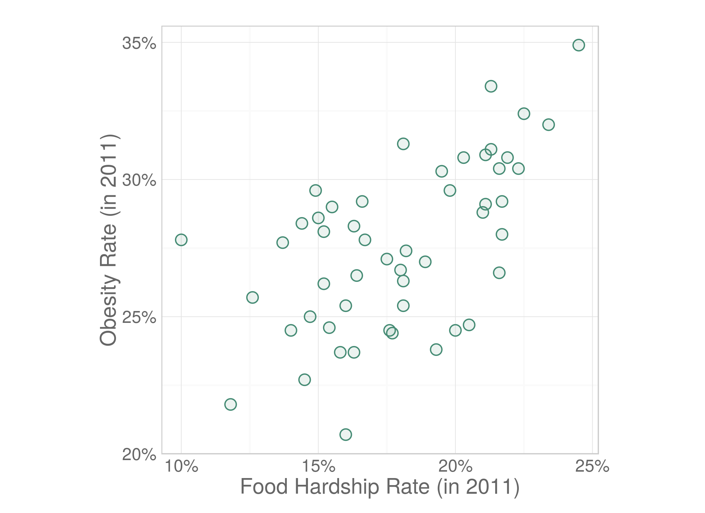

## Figure 5-2
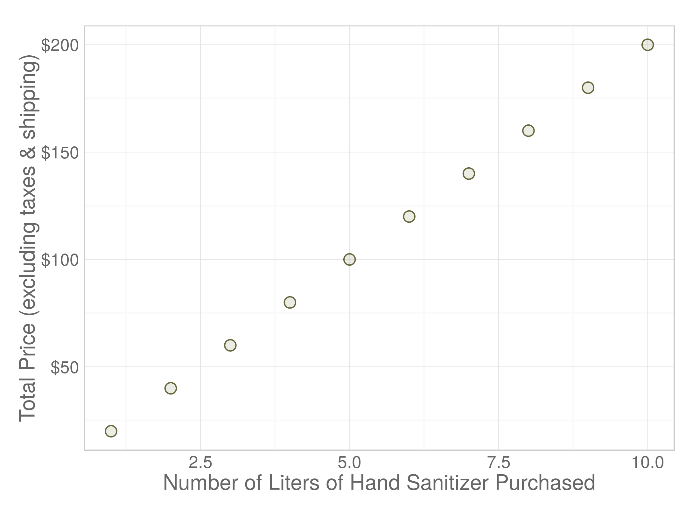

## Figure 5-3
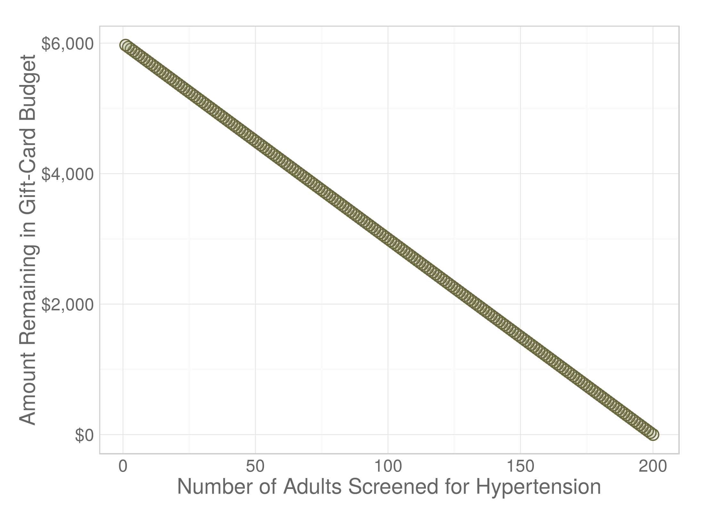

## Figure 5-4
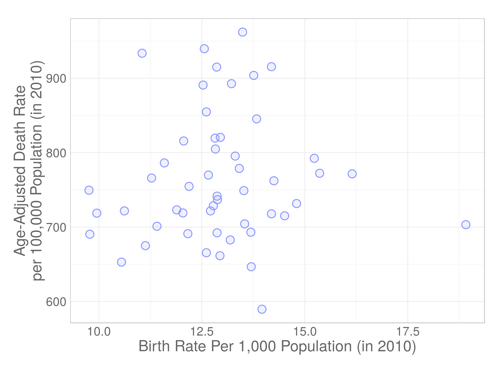

## Figure 5-5
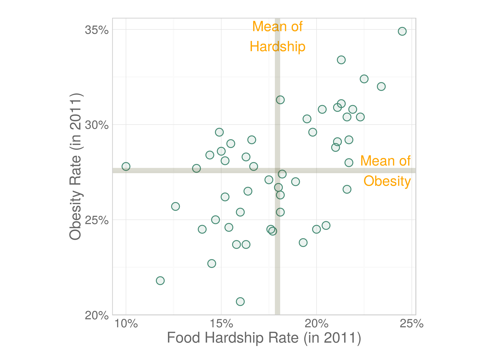

## Figure 5-6
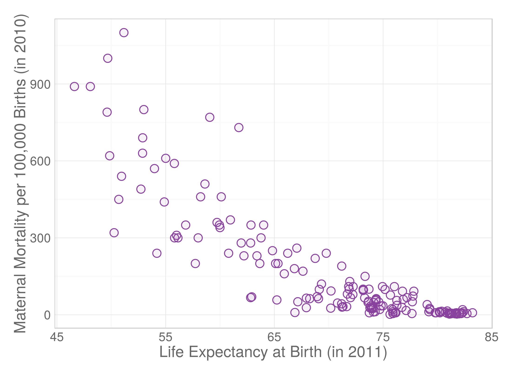

## Figure 5-7
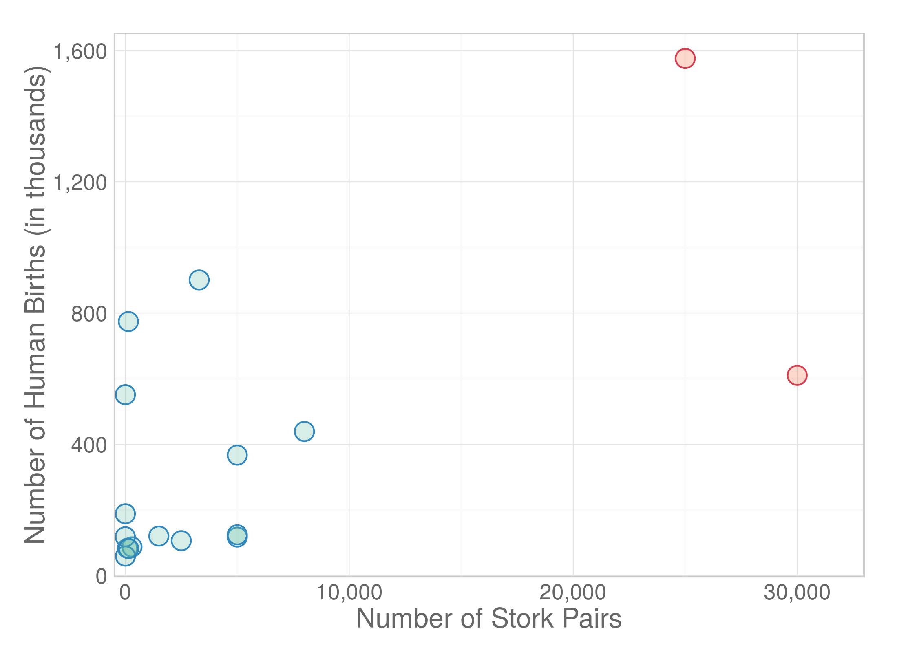

## Figure 5-8
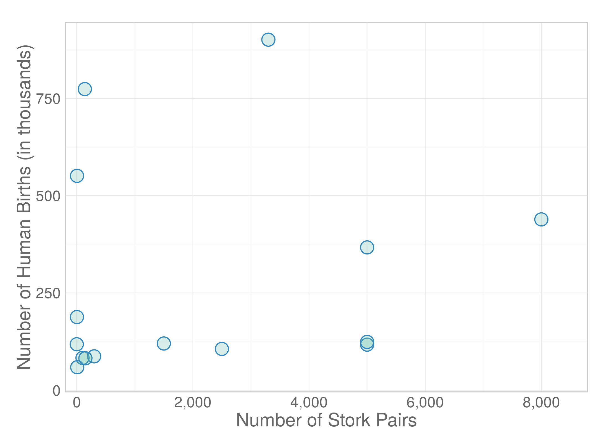

## Figure 5-9
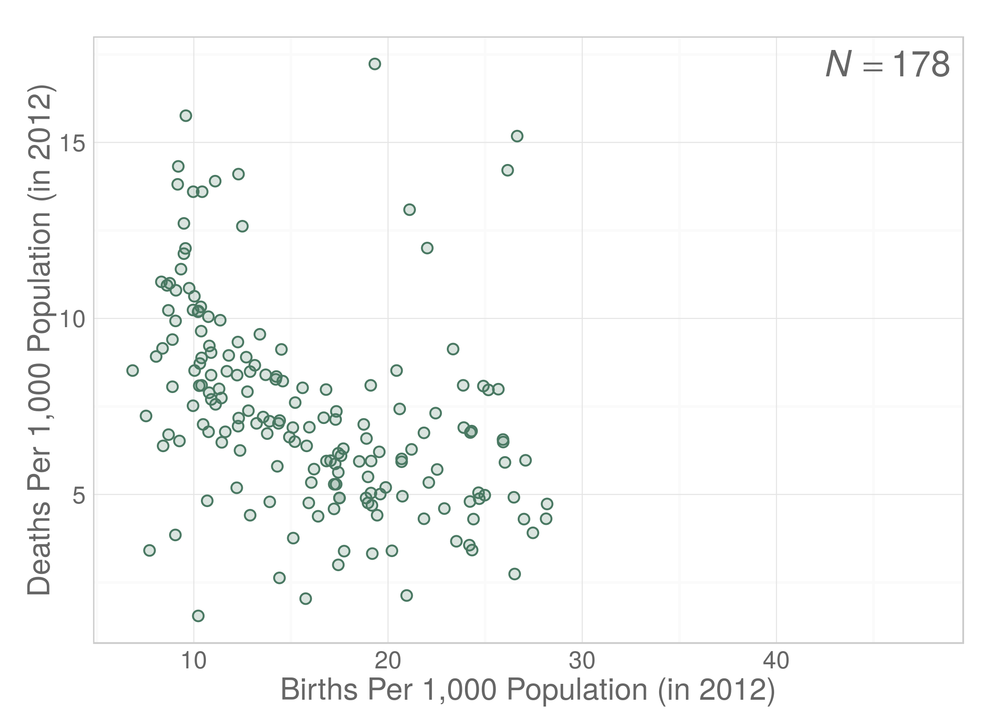

## Figure 5-10
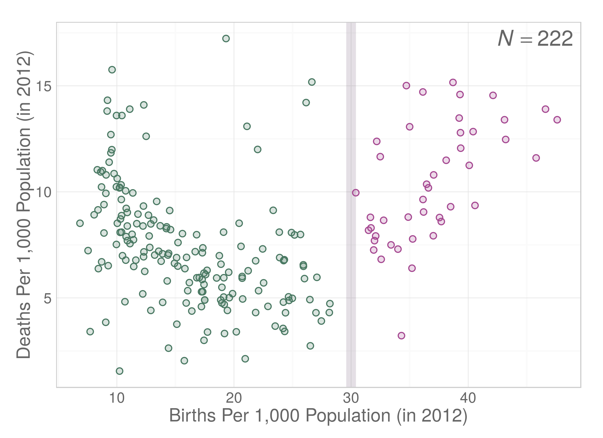

## Figure 5-11
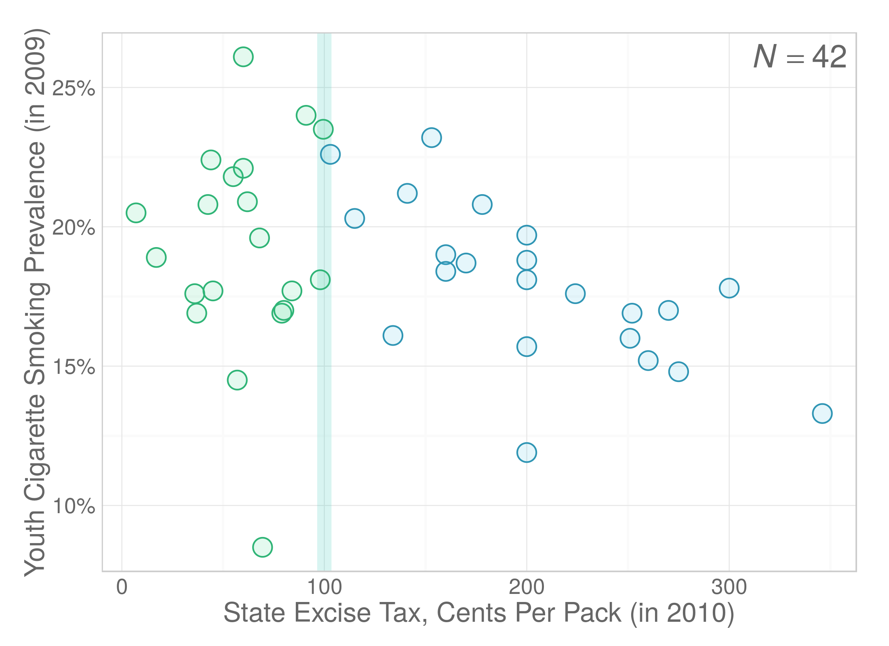

## Figure 5-12
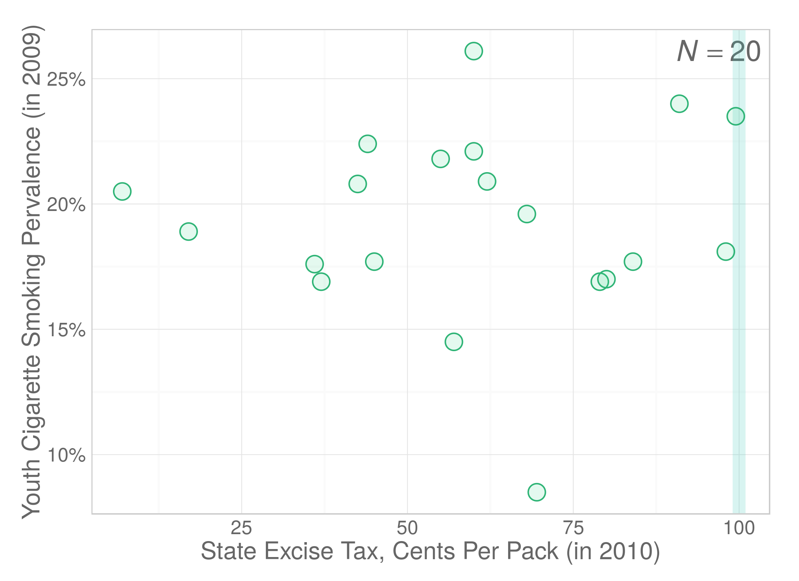

## Figure 5-13
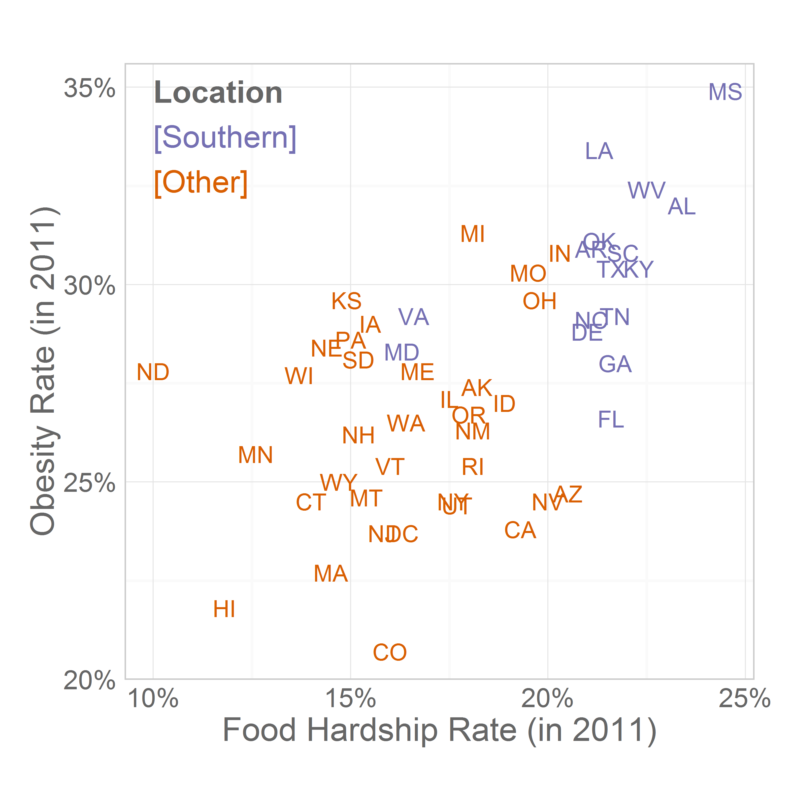

## Session Info
For the sake of documentation and reproducibility, the current report was build on a system using the following software.


```
Report created by wibeasley at 2014-12-07, 23:31 -0600
```

```
R version 3.1.2 (2014-10-31)
Platform: x86_64-pc-linux-gnu (64-bit)

locale:
 [1] LC_CTYPE=en_US.UTF-8       LC_NUMERIC=C               LC_TIME=en_US.UTF-8        LC_COLLATE=en_US.UTF-8    
 [5] LC_MONETARY=en_US.UTF-8    LC_MESSAGES=en_US.UTF-8    LC_PAPER=en_US.UTF-8       LC_NAME=C                 
 [9] LC_ADDRESS=C               LC_TELEPHONE=C             LC_MEASUREMENT=en_US.UTF-8 LC_IDENTIFICATION=C       

attached base packages:
[1] grid      stats     graphics  grDevices utils     datasets  methods   base     

other attached packages:
 [1] rgl_0.95.1158      mnormt_1.5-1       MASS_7.3-35        ggthemes_1.7.0     gridExtra_0.9.1    epade_0.3.8       
 [7] plotrix_3.5-10     reshape2_1.4       scales_0.2.4       plyr_1.8.1         RColorBrewer_1.0-5 dichromat_2.0-0   
[13] extrafont_0.16     wesanderson_0.3    ggplot2_1.0.0      knitr_1.8         

loaded via a namespace (and not attached):
 [1] colorspace_1.2-4 digest_0.6.4     evaluate_0.5.5   extrafontdb_1.0  formatR_1.0      gtable_0.1.2    
 [7] htmltools_0.2.6  labeling_0.3     munsell_0.4.2    proto_0.3-10     Rcpp_0.11.3      rmarkdown_0.3.10
[13] Rttf2pt1_1.3.2   stringr_0.6.2    tools_3.1.2      yaml_2.1.13     
```

## License

<a rel="license" href="http://creativecommons.org/licenses/by/3.0/"></a><br />This work is licensed under a <a rel="license" href="http://creativecommons.org/licenses/by/3.0/">Creative Commons Attribution 3.0 Unported License</a>.
