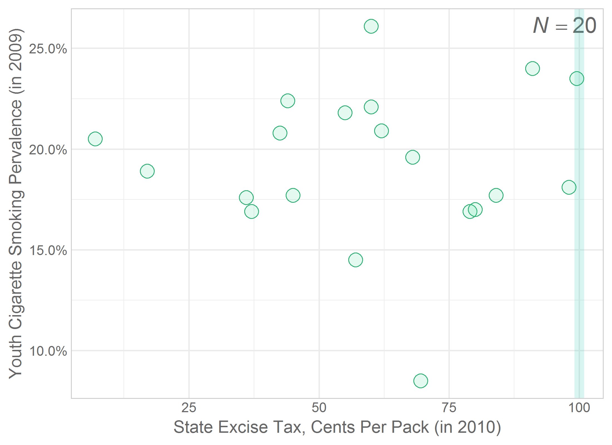

---
output:
  html_document:
    keep_md: yes
    code_folding: hide
---
Chapter 05 Graphs
=================================================
This report creates the chapter graphs.

<!--  Set the working directory to the repository's base directory; this assumes the report is nested inside of only one directory.-->


<!-- Set the report-wide options, and point to the external code file. -->

<!-- Load the packages.  Suppress the output when loading packages. -->

```r
library(magrittr) #Pipes
library(ggplot2) #For graphing
requireNamespace("dplyr")
requireNamespace("scales")
requireNamespace("readr")
```

<!-- Load any Global functions and variables declared in the R file.  Suppress the output. -->

```r
source("./common-code/book-theme.R")

theme_chapter <- theme_book
```

<!-- Declare any global functions specific to a Rmd output.  Suppress the output. -->


<!-- Load the datasets.   -->

```r
dsObesity                  <- readr::read_csv("./data/food-hardship-obesity.csv"          )
dsPerfectPositive          <- readr::read_csv("./data/chapter-05-perfect-positive.csv"    )
dsPerfectNegative          <- readr::read_csv("./data/chapter-05-perfect-negative.csv"    )
dsStateBirthDeathRates     <- readr::read_csv("./data/state-birth-death-rates.csv"        )
dsWorldMaternalMortality   <- readr::read_csv("./data/world-maternal-mortality.csv"       )
dsStork                    <- readr::read_csv("./data/stork-birth.csv"                    )
dsWorldBirthDeathRates     <- readr::read_csv("./data/world-crude-births-deaths-cia.csv"  )
dsSmoking                  <- readr::read_csv("./data/smoking-tax.csv"                    )
```

<!-- Tweak the datasets.   -->

```r
dsWorldBirthDeathRates <- dsWorldBirthDeathRates %>% 
  tidyr::drop_na(BirthsPer1000Pop) %>% 
  tidyr::drop_na(DeathsPer1000Pop) %>% 
  dplyr::mutate(
    Omitted   = (BirthsPer1000Pop >= 30)
  )

dsSmoking$Omitted <- (dsSmoking$TaxCentsPerPack >= 100)
```

## Figure 5-1

```r
## Figure05_01 is linked to the first scatterplot in Chapter 03.
gObesity <- ggplot(dsObesity, aes(x=FoodHardshipRate, y=ObesityRate)) +
  geom_point(shape=21, size=3, color="aquamarine4", fill=adjustcolor("aquamarine4", alpha.f=.1)) + #This color should match the obesity Cleveland dot plot
  scale_x_continuous(label=scales::percent) +
  scale_y_continuous(label=scales::percent) +
  coord_fixed() +
  theme_chapter +
  labs(x="Food Hardship Rate (in 2011)", y="Obesity Rate (in 2011)")

gObesity
```


## Figure 5-2

```r
ggplot(dsPerfectPositive, aes(x=NumberOfLitersBought, y=Price)) +
  geom_point(shape=21, size=3, color="#68663D", fill="#9BA47533") + #http://colrd.com/palette/17498/
  scale_y_continuous(label=scales::dollar) +
  theme_chapter +
  labs(x="Number of Liters of Hand Sanitizer Purchased", y="Total Price (excluding taxes & shipping)")
```


## Figure 5-3

```r
ggplot(dsPerfectNegative, aes(x=NumberScreened, y=GiftCardBudgetRemaining)) +
  geom_point(shape=21, size=3, color="#68663D", fill="#9BA47533") + #http://colrd.com/palette/17498/
  scale_y_continuous(label=scales::dollar) +
  theme_chapter +
  labs(x="Number of Adults Screened for Hypertension", y="Amount Remaining in Gift-Card Budget")
```


## Figure 5-4

```r
ggplot(dsStateBirthDeathRates, aes(x=BirthRate2010, y=DeathRateAgeAdjusted2010)) +
  geom_point(shape=21, size=3, color="#8C96FF", fill="#8C96FF22") + #Adapted from http://colrd.com/palette/18974/
  theme_chapter +
  labs(x="Birth Rate Per 1,000 Population (in 2010)", y="Age-Adjusted Death Rate\nper 100,000 Population (in 2010)")
```


## Figure 5-5

```r
#See Recipe 5.9 in Chang, 2013 for writing the lm equations in the graph.
dsPlot <- dsObesity
xName <- "FoodHardshipRate"
yName <- "ObesityRate"
# m <- lm(as.formula("ObesityRate ~ FoodHardshipRate"), dsPlot)
# m <- lm(as.formula(paste(yName, "~", xName)), dsPlot)
# eqn <- as.character(as.expression(
#   #substitute(italic(y)==a + b * italic(x) * ", " ~ ~italic(r)^2 ~ "=" ~ r2,
#   substitute(italic(y)==a + b * italic(x),
#              list(a=format(coef(m)[1], digits=2),#The intercept
#                   b=format(coef(m)[2], digits=2), #The slope
#                   r2=round(summary(m)$r.squared, digits=3)))
# ))
gObesity +
#   annotate("text", label=eqn, x=-Inf, y=Inf, hjust=-.1, vjust=1.5, parse=TRUE, size=5, color="orange") +
  annotate("text", label="Mean of\nHardship", x=mean(dsPlot[[xName]], na.rm=T), y=Inf, hjust=.5, vjust=1.1, parse=F, size=4, color="orange") +
  annotate("text", label="Mean of\nObesity", x=Inf, y=mean(dsPlot[[yName]], na.rm=T), hjust=1.1, vjust=.5, parse=F, size=4, color="orange") +
  geom_vline(xintercept=mean(dsPlot[[xName]], na.rm=T), color=rgb(.3, .3, .1, .2), size=2) +
  geom_hline(yintercept=mean(dsPlot[[yName]], na.rm=T), color=rgb(.3, .3, .1, .2), size=2) #+
```


```r
#   geom_smooth(method="lm", color="orange", fill="orange", alpha=.2, na.rm=T)

rm(gObesity, xName, yName)
```

## Figure 5-6

```r
#Set seed so the jittering is consistent across versions
set.seed(789)
dsPlot <- dsWorldMaternalMortality
xName <- "LifeExpectancyAtBirth2011"
yName <- "MaternalMortper100KBirths2010"
m <- lm(as.formula(paste(yName, "~", xName)), dsPlot)
eqn <- as.character(as.expression(
  substitute(italic(y)==a + b * italic(x) * ", " ~ ~italic(r) ~ "=" ~ rV,
             list(a=format(coef(m)[1], digits=2),#The intercept
                  b=format(coef(m)[2], digits=2), #The slope
                  rV=round(cor(dsPlot[[xName]], dsPlot[[yName]]), digits=3)))
))
ggplot(dsPlot,  aes_string(x=xName, y=yName)) +
#   annotate("text", label=eqn, x=Inf, y=Inf, hjust=1.1, vjust=1.5, parse=TRUE, size=5, color="orange") +
#   annotate("text", label="Should predictions\ndrop below this line?", x=-Inf, y=0, hjust=-0, vjust=.5, parse=F, size=5, color="tomato") +
#   geom_hline(y=0, color="tomato", size=1) +
#   geom_smooth(method="lm", color="orange", fill="orange", alpha=.2, na.rm=T) +
#   geom_smooth(method="loess", color="purple", fill="purple", alpha=.2, na.rm=T) +
  geom_point(shape=21, size=3, na.rm=T, color="#88419D", fill="#88419D11", position=position_jitter(w=.4, h=0)) +
  scale_x_continuous() +
  scale_y_continuous(label=scales::comma) +
  theme_chapter +
  labs(x="Life Expectancy at Birth (in 2011)", y="Maternal Mortality per 100,000 Births (in 2010)")
```


```r
rm(m, eqn, xName, yName)
```

## Figure 5-7

```r
#TODO: Lise, if you like these next two graphs, some of the text's description will need to change.  For instance, there are two linear models overlayed.

dsPlot <- dsStork
xName <- "StorkPairCount"
yName <- "BirthRate"
colorName <- "Extreme"
colorExtreme <- c("FALSE"="#3288BD", "TRUE"="#D53E4F") #Darker; http://colrd.com/palette/18893/
fillExtreme <- c("FALSE"="#66C2A544", "TRUE"="#F46D4344") #Green http://colrd.com/palette/18893/

mWithOutlier <- lm(as.formula(paste(yName, "~", xName)), dsPlot)
eqn <- as.character(as.expression(
  substitute(italic(y)==a + b * italic(x) * ", " ~ ~italic(r) ~ "=" ~ rV,
             list(a=format(coef(mWithOutlier)[1], digits=2),#The intercept
                  b=format(coef(mWithOutlier)[2], digits=2), #The slope
                  rV=round(cor(dsPlot[[xName]], dsPlot[[yName]]), digits=3)))
))
ggplot(dsPlot,  aes_string(x=xName, y=yName, color=colorName, fill=colorName)) +
#   annotate("text", label=eqn, x=-Inf, y=Inf, hjust=-.1, vjust=1.5, parse=TRUE, size=5, color=colorExtreme[2]) +
#   geom_smooth(method="lm", color=colorExtreme[2], fill=NA, size=2) +
  geom_point(shape=21, size=4) +
  scale_x_continuous(label=scales::comma) +
  scale_y_continuous(label=scales::comma) +
  scale_color_manual(guide=FALSE, values=colorExtreme) +
  scale_fill_manual(guide=FALSE, values=fillExtreme) +
  coord_cartesian(xlim=c(-500, 1.1*max(dsPlot[, xName])), ylim=c(-5, 1.05*max(dsPlot[, yName]))) +

  theme_chapter +
  labs(x="Number of Stork Pairs", y="Number of Human Births (in thousands)")
```


```r
rm(eqn)
```

## Figure 5-8

```r
dsPlotWithoutOutliers <- dsStork[!dsStork$Extreme, ]
mWithoutOutlier <- lm(as.formula(paste(yName, "~", xName)), dsPlotWithoutOutliers)
eqn <- as.character(as.expression(
  substitute(italic(y)==a + b * italic(x) * ", " ~ ~italic(r) ~ "=" ~ rV,
             list(a=format(coef(mWithoutOutlier)[1], digits=2),#The intercept
                  b=format(coef(mWithoutOutlier)[2], digits=2), #The slope
                  rV=round(cor(dsPlot[[xName]], dsPlot[[yName]]), digits=3)))
))
ggplot(dsPlotWithoutOutliers,  aes_string(x=xName, y=yName, color=colorName, fill=colorName)) +
#   annotate("text", label=eqn, x=-Inf, y=Inf, hjust=-.1, vjust=1.5, parse=TRUE, size=5, color="orange") +
  #geom_smooth(data=dsStork, method="lm", color=adjustcolor(fillExtreme[2], alpha.f=.5), fill=NA, size=1) +
#   geom_smooth(data=dsStork, method="lm", color=colorExtreme[2], fill=NA, size=1) +
#   geom_smooth(method="lm", color="orange", fill=NA, size=2) +
  geom_point(shape=21, size=4) +
  scale_x_continuous(label=scales::comma, expand=c(50, 50)) +
  scale_y_continuous(label=scales::comma) +
  scale_color_manual(guide=FALSE, values=colorExtreme) +
  scale_fill_manual(guide=FALSE, values=fillExtreme) +
  coord_cartesian(xlim=c(-200, 1.1*max(dsPlotWithoutOutliers[[xName]])), ylim=c(-5, 1.05*max(dsPlotWithoutOutliers[[yName]]))) +
  theme_chapter +
  labs(x="Number of Stork Pairs", y="Number of Human Births (in thousands)")
```


```r
rm(mWithOutlier, mWithoutOutlier, eqn, xName, yName, colorName, colorExtreme, fillExtreme)
```

## Figure 5-9

```r
dsWorldRestricted <- dsWorldBirthDeathRates[!dsWorldBirthDeathRates$Omitted, ]
eqn <- as.character(as.expression(substitute(italic(N)==sampleSize, list(sampleSize=nrow(dsWorldRestricted)))))

ggplot(dsWorldRestricted, aes(x=BirthsPer1000Pop, y=DeathsPer1000Pop, color=Omitted, fill=Omitted)) +
  annotate("text", label=eqn, x=Inf, y=Inf, hjust=1.1, vjust=1.5, parse=TRUE, size=5, color="gray40") +
  geom_point(shape=21, na.rm=T) +
  scale_x_continuous(limits=range(dsWorldBirthDeathRates$BirthsPer1000Pop, na.rm=T)) +
  scale_colour_manual(values=PaletteWorldDeathsRestricted, guide=FALSE) +
  scale_fill_manual(values=PaletteWorldDeathsRestrictedFaint, guide=FALSE) +
  theme_chapter +
  labs(x="Births Per 1,000 Population (in 2012)", y="Deaths Per 1,000 Population (in 2012)")
```


```r
rm(dsWorldRestricted, eqn)
```

## Figure 5-10

```r
eqn <- as.character(as.expression(substitute(italic(N)==sampleSize, list(sampleSize=nrow(dsWorldBirthDeathRates)))))
ggplot(dsWorldBirthDeathRates, aes(x=BirthsPer1000Pop, y=DeathsPer1000Pop, color=Omitted, fill=Omitted)) +
  annotate("text", label=eqn, x=Inf, y=Inf, hjust=1.1, vjust=1.5, parse=TRUE, size=5, color="gray40") +
  geom_vline(xintercept=30, color=PaletteWorldDeathsRestricted[1], size=3, alpha=.1) +
  geom_vline(xintercept=30, color=PaletteWorldDeathsRestricted[2], size=3, alpha=.1) +
  geom_point(shape=21, na.rm=T) +
  scale_x_continuous(limits=range(dsWorldBirthDeathRates$BirthsPer1000Pop, na.rm=T)) +
  scale_colour_manual(values=PaletteWorldDeathsRestricted, guide=FALSE) +
  scale_fill_manual(values=PaletteWorldDeathsRestrictedFaint, guide=FALSE) +
  theme_chapter +
  labs(x="Births Per 1,000 Population (in 2012)", y="Deaths Per 1,000 Population (in 2012)")
```


```r
rm(eqn)
```

## Figure 5-11

```r
paletteSmokingRestrictedLight <- c("#38D88D22", "#3CBEE622") #Hand-picked
paletteSmokingRestrictedDark <- c("#2FB476", "#2F95B4") #Hand-picked

#eqn <- as.character(as.expression(substitute(italic(N)==sampleSize, list(sampleSize=nrow(dsSmoking)))))
eqn <- as.character(as.expression(substitute(italic(N)==sampleSize, list(sampleSize=sum(!is.na(dsSmoking$TaxCentsPerPack) & !is.na(dsSmoking$YouthCigaretteUse))))))
ggplot(dsSmoking, aes(x=TaxCentsPerPack, y=YouthCigaretteUse, color=Omitted, fill=Omitted)) +
  annotate("text", label=eqn, x=Inf, y=Inf, hjust=1.1, vjust=1.5, parse=TRUE, size=5, color="gray40") +
  geom_vline(xintercept=100, color=paletteSmokingRestrictedLight[1], size=3, alpha=.1) +
  geom_vline(xintercept=100, color=paletteSmokingRestrictedLight[2], size=3, alpha=.1) +
  geom_point(shape=21, size=4, na.rm=T) +
  scale_x_continuous(limits=range(dsSmoking$TaxCentsPerPack, na.rm=T)) +
  scale_y_continuous(label=scales::percent) +
  scale_colour_manual(values=paletteSmokingRestrictedDark, guide=FALSE) +
  scale_fill_manual(values=paletteSmokingRestrictedLight, guide=FALSE) +
  theme_chapter +
  labs(x="State Excise Tax, Cents Per Pack (in 2010)", y="Youth Cigarette Smoking Prevalence (in 2009)")
```


```r
rm(eqn)
```

## Figure 5-12

```r
dsSmokingRestricted <- dsSmoking[!dsSmoking$Omitted, ]
eqn <- as.character(as.expression(substitute(italic(N)==sampleSize, list(sampleSize=sum(!is.na(dsSmokingRestricted$TaxCentsPerPack) & !is.na(dsSmokingRestricted$YouthCigaretteUse))))))
ggplot(dsSmokingRestricted, aes(x=TaxCentsPerPack, y=YouthCigaretteUse, color=Omitted, fill=Omitted)) +
  annotate("text", label=eqn, x=Inf, y=Inf, hjust=1.1, vjust=1.5, parse=TRUE, size=5, color="gray40") +
  geom_vline(xintercept=100, color=paletteSmokingRestrictedLight[1], size=3, alpha=.1) +
  geom_vline(xintercept=100, color=paletteSmokingRestrictedLight[2], size=3, alpha=.1) +
  geom_point(shape=21,  size=4, na.rm=T) +
  scale_y_continuous(label=scales::percent) +
  scale_colour_manual(values=paletteSmokingRestrictedDark, guide=FALSE) +
  scale_fill_manual(values=paletteSmokingRestrictedLight, guide=FALSE) +
  theme_chapter +
  labs(x="State Excise Tax, Cents Per Pack (in 2010)", y="Youth Cigarette Smoking Pervalence (in 2009)")
```



```r
rm(eqn)
```

## Figure 5-13


<!-- The footer that's common to all reports. -->

## Session Information

For the sake of documentation and reproducibility, the current report was rendered in the following environment.  Click the line below to expand.

<details>
  <summary>Environment <span class="glyphicon glyphicon-plus-sign"></span></summary>

```
- Session info ---------------------------------------------------------------
 setting  value                                      
 version  R version 3.5.1 Patched (2018-09-10 r75281)
 os       Windows >= 8 x64                           
 system   x86_64, mingw32                            
 ui       RStudio                                    
 language (EN)                                       
 collate  English_United States.1252                 
 ctype    English_United States.1252                 
 tz       America/Chicago                            
 date     2018-10-25                                 

- Packages -------------------------------------------------------------------
 package      * version    date       lib source                          
 assertthat     0.2.0      2017-04-11 [1] CRAN (R 3.5.0)                  
 backports      1.1.2      2017-12-13 [1] CRAN (R 3.5.0)                  
 base64enc      0.1-3      2015-07-28 [1] CRAN (R 3.5.0)                  
 bindr          0.1.1      2018-03-13 [1] CRAN (R 3.5.0)                  
 bindrcpp       0.2.2      2018-03-29 [1] CRAN (R 3.5.0)                  
 callr          3.0.0      2018-08-24 [1] CRAN (R 3.5.1)                  
 cli            1.0.1      2018-09-25 [1] CRAN (R 3.5.1)                  
 colorspace     1.3-2      2016-12-14 [1] CRAN (R 3.5.0)                  
 crayon         1.3.4      2017-09-16 [1] CRAN (R 3.5.0)                  
 debugme        1.1.0      2017-10-22 [1] CRAN (R 3.5.0)                  
 desc           1.2.0      2018-05-01 [1] CRAN (R 3.5.0)                  
 devtools       2.0.0      2018-10-19 [1] CRAN (R 3.5.1)                  
 dichromat      2.0-0      2013-01-24 [1] CRAN (R 3.5.0)                  
 digest         0.6.18     2018-10-10 [1] CRAN (R 3.5.1)                  
 dplyr          0.7.7      2018-10-16 [1] CRAN (R 3.5.1)                  
 epade          0.3.8      2013-02-22 [1] CRAN (R 3.5.1)                  
 evaluate       0.12       2018-10-09 [1] CRAN (R 3.5.1)                  
 extrafont      0.17       2014-12-08 [1] CRAN (R 3.5.0)                  
 extrafontdb    1.0        2012-06-11 [1] CRAN (R 3.5.0)                  
 fs             1.2.6      2018-08-23 [1] CRAN (R 3.5.1)                  
 ggplot2      * 3.0.0      2018-07-03 [1] CRAN (R 3.5.1)                  
 glue           1.3.0      2018-07-17 [1] CRAN (R 3.5.1)                  
 gridExtra      2.3        2017-09-09 [1] CRAN (R 3.5.0)                  
 gtable         0.2.0      2016-02-26 [1] CRAN (R 3.5.0)                  
 hms            0.4.2.9001 2018-08-09 [1] Github (tidyverse/hms@979286f)  
 htmltools      0.3.6      2017-04-28 [1] CRAN (R 3.5.0)                  
 knitr        * 1.20       2018-02-20 [1] CRAN (R 3.5.0)                  
 labeling       0.3        2014-08-23 [1] CRAN (R 3.5.0)                  
 lazyeval       0.2.1      2017-10-29 [1] CRAN (R 3.5.0)                  
 magrittr     * 1.5        2014-11-22 [1] CRAN (R 3.5.0)                  
 memoise        1.1.0      2017-04-21 [1] CRAN (R 3.5.0)                  
 munsell        0.5.0      2018-06-12 [1] CRAN (R 3.5.0)                  
 packrat        0.4.9-3    2018-06-01 [1] CRAN (R 3.5.0)                  
 pacman         0.5.0      2018-10-22 [1] CRAN (R 3.5.1)                  
 pillar         1.3.0      2018-07-14 [1] CRAN (R 3.5.1)                  
 pkgbuild       1.0.2      2018-10-16 [1] CRAN (R 3.5.1)                  
 pkgconfig      2.0.2      2018-08-16 [1] CRAN (R 3.5.1)                  
 pkgload        1.0.1      2018-10-11 [1] CRAN (R 3.5.1)                  
 plotrix        3.7-4      2018-10-03 [1] CRAN (R 3.5.1)                  
 plyr           1.8.4      2016-06-08 [1] CRAN (R 3.5.0)                  
 prettyunits    1.0.2      2015-07-13 [1] CRAN (R 3.5.0)                  
 processx       3.2.0      2018-08-16 [1] CRAN (R 3.5.1)                  
 ps             1.2.0      2018-10-16 [1] CRAN (R 3.5.1)                  
 purrr          0.2.5      2018-05-29 [1] CRAN (R 3.5.0)                  
 R6             2.3.0      2018-10-04 [1] CRAN (R 3.5.1)                  
 RColorBrewer   1.1-2      2014-12-07 [1] CRAN (R 3.5.0)                  
 Rcpp           0.12.19    2018-10-01 [1] CRAN (R 3.5.1)                  
 readr          1.2.0      2018-10-25 [1] Github (tidyverse/readr@69c9fd3)
 remotes        2.0.1      2018-10-19 [1] CRAN (R 3.5.1)                  
 rlang          0.3.0.1    2018-10-25 [1] CRAN (R 3.5.1)                  
 rmarkdown      1.10       2018-06-11 [1] CRAN (R 3.5.0)                  
 rprojroot      1.3-2      2018-01-03 [1] CRAN (R 3.5.0)                  
 Rttf2pt1       1.3.7      2018-06-29 [1] CRAN (R 3.5.0)                  
 scales         1.0.0      2018-08-09 [1] CRAN (R 3.5.1)                  
 sessioninfo    1.1.0      2018-09-25 [1] CRAN (R 3.5.1)                  
 stringi        1.2.4      2018-07-20 [1] CRAN (R 3.5.1)                  
 stringr        1.3.1      2018-05-10 [1] CRAN (R 3.5.0)                  
 testthat       2.0.1      2018-10-13 [1] CRAN (R 3.5.1)                  
 tibble         1.4.2      2018-01-22 [1] CRAN (R 3.5.0)                  
 tidyr          0.8.1      2018-05-18 [1] CRAN (R 3.5.0)                  
 tidyselect     0.2.5      2018-10-11 [1] CRAN (R 3.5.1)                  
 usethis        1.4.0      2018-08-14 [1] CRAN (R 3.5.1)                  
 wesanderson    0.3.6      2018-04-20 [1] CRAN (R 3.5.1)                  
 withr          2.1.2      2018-03-15 [1] CRAN (R 3.5.0)                  
 yaml           2.2.0      2018-07-25 [1] CRAN (R 3.5.1)                  

[1] D:/Projects/RLibraries
[2] D:/Users/Will/Documents/R/win-library/3.5
[3] C:/Program Files/R/R-3.5.1patched/library
```
</details>


Report rendered by Will at 2018-10-25, 13:03 -0500 in 7 seconds.


## License

<a rel="license" href="http://creativecommons.org/licenses/by/3.0/"></a><br />This work is licensed under a <a rel="license" href="http://creativecommons.org/licenses/by/3.0/">Creative Commons Attribution 3.0 Unported License</a>.
