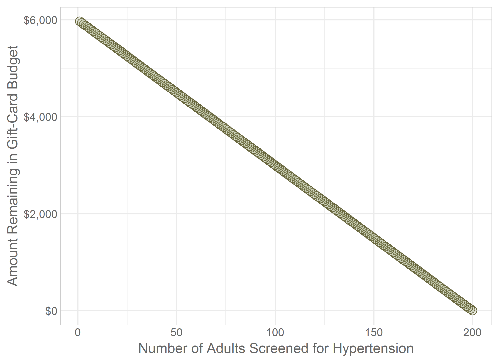
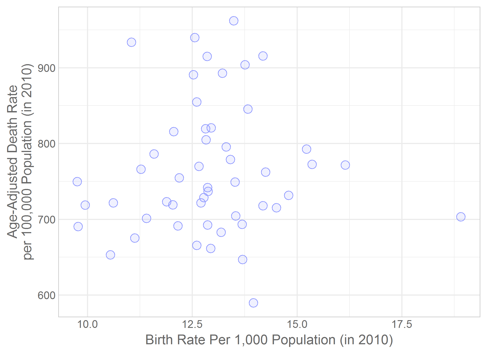
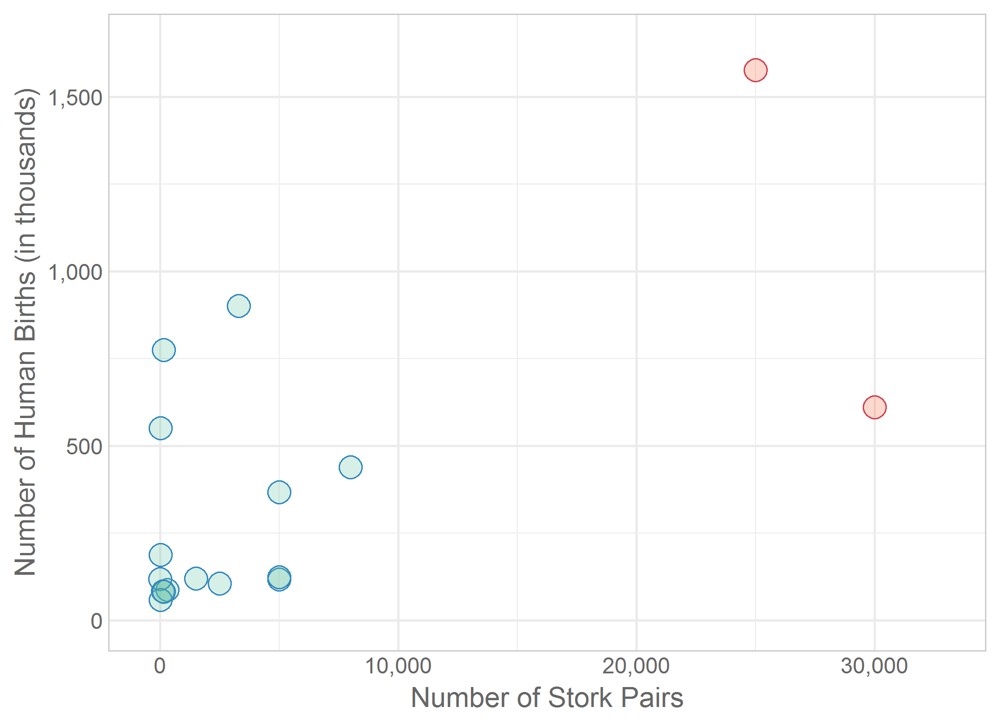
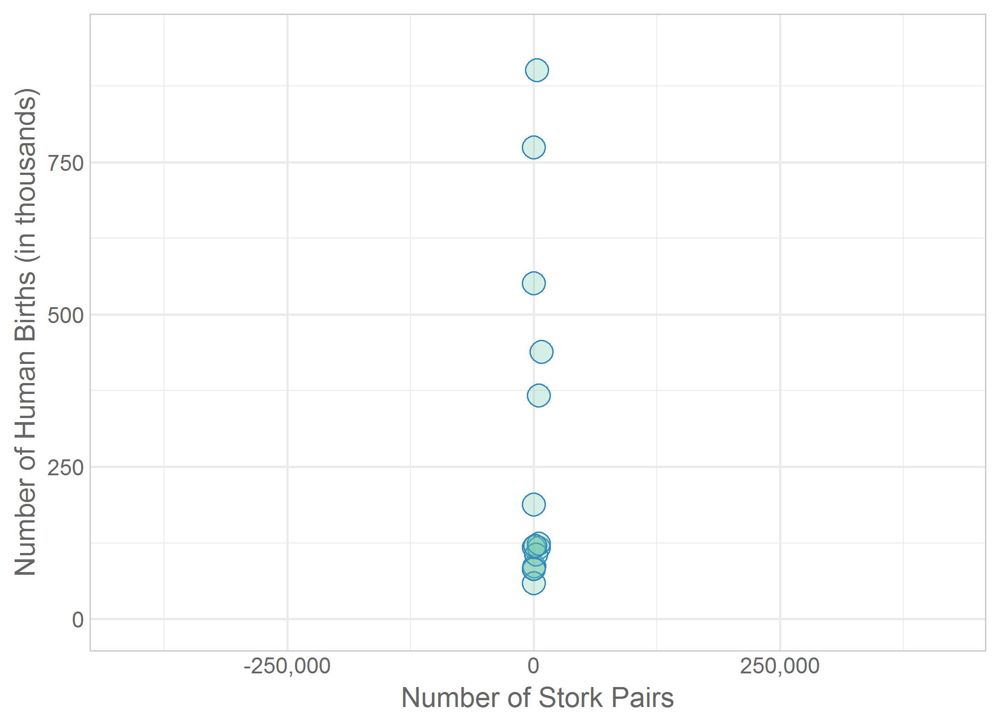
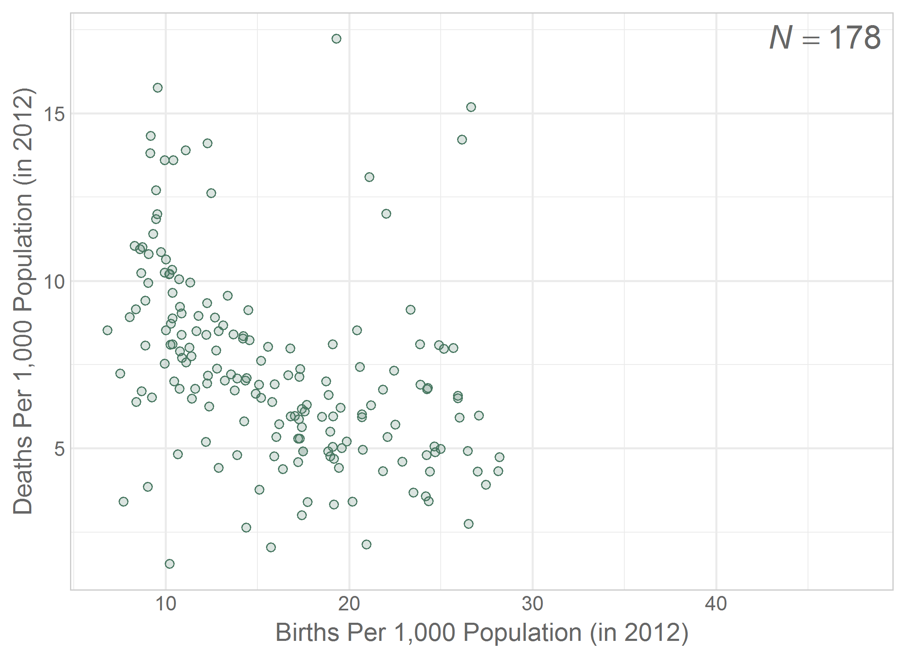

Chapter 05 Graphs
=================================================
This report creates the chapter graphs.

<!--  Set the working directory to the repository's base directory; this assumes the report is nested inside of only one directory.-->


<!-- Set the report-wide options, and point to the external code file. -->

<!-- Load the packages.  Suppress the output when loading packages. --> 


<!-- Load any Global functions and variables declared in the R file.  Suppress the output. --> 


<!-- Declare any global functions specific to a Rmd output.  Suppress the output. --> 


<!-- Load the datasets.   -->


<!-- Tweak the datasets.   -->


## Figure 5-1


## Figure 5-2


## Figure 5-3


## Figure 5-4


## Figure 5-5


## Figure 5-6


## Figure 5-7


## Figure 5-8


## Figure 5-9


## Figure 5-10


## Figure 5-11


## Figure 5-12


## Figure 5-13


## Session Info
For the sake of documentation and reproducibility, the current report was build on a system using the following software.


```
Report created by wibeasley at 2016-01-17, 01:35 -0600
```

```
R version 3.2.3 (2015-12-10)
Platform: x86_64-pc-linux-gnu (64-bit)
Running under: Ubuntu 14.04.3 LTS

locale:
 [1] LC_CTYPE=en_US.UTF-8       LC_NUMERIC=C               LC_TIME=en_US.UTF-8        LC_COLLATE=en_US.UTF-8    
 [5] LC_MONETARY=en_US.UTF-8    LC_MESSAGES=en_US.UTF-8    LC_PAPER=en_US.UTF-8       LC_NAME=C                 
 [9] LC_ADDRESS=C               LC_TELEPHONE=C             LC_MEASUREMENT=en_US.UTF-8 LC_IDENTIFICATION=C       

attached base packages:
[1] grid      stats     graphics  grDevices utils     datasets  methods   base     

other attached packages:
 [1] ggthemes_3.0.1     gridExtra_2.0.0    epade_0.3.8        plotrix_3.6-1      reshape2_1.4.1     scales_0.3.0      
 [7] plyr_1.8.3         RColorBrewer_1.1-2 dichromat_2.0-0    extrafont_0.17     wesanderson_0.3.2  ggplot2_2.0.0     
[13] knitr_1.12        

loaded via a namespace (and not attached):
 [1] Rcpp_0.12.3        Rttf2pt1_1.3.3     magrittr_1.5       munsell_0.4.2      colorspace_1.2-6   stringr_1.0.0.9000
 [7] tools_3.2.3        gtable_0.1.2       extrafontdb_1.0    htmltools_0.3      assertthat_0.1     yaml_2.1.13       
[13] digest_0.6.9       formatR_1.2.1      rsconnect_0.4.1.4  evaluate_0.8       rmarkdown_0.9.2    labeling_0.3      
[19] stringi_1.0-1     
```

## License

<a rel="license" href="http://creativecommons.org/licenses/by/3.0/"></a><br />This work is licensed under a <a rel="license" href="http://creativecommons.org/licenses/by/3.0/">Creative Commons Attribution 3.0 Unported License</a>.
