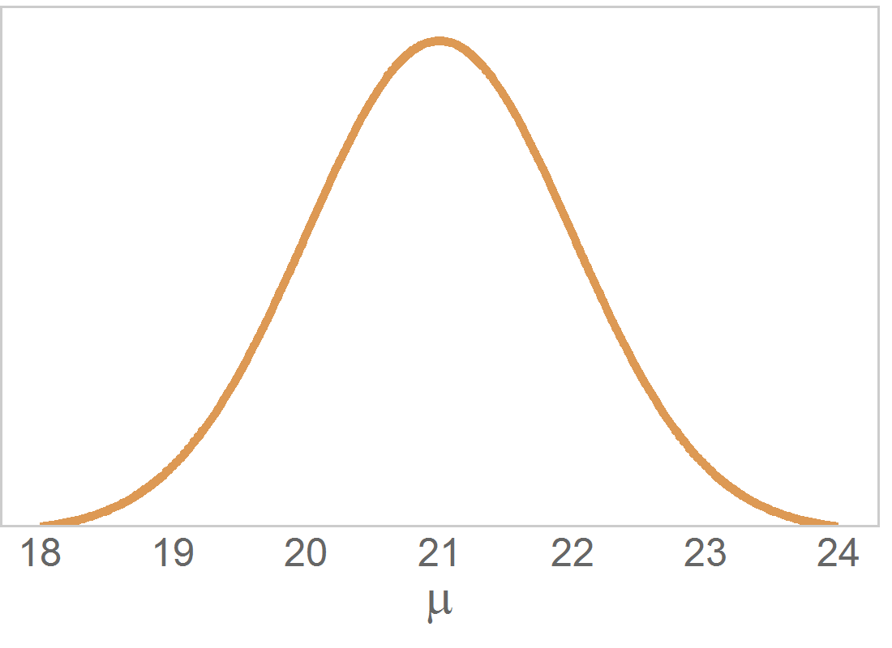
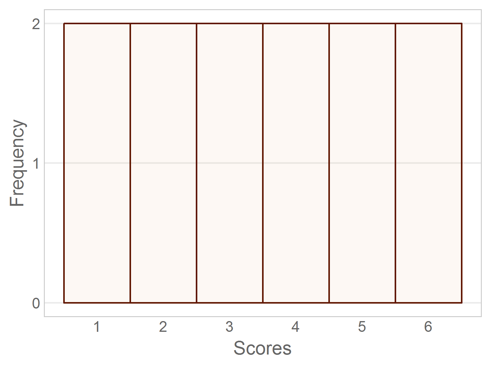
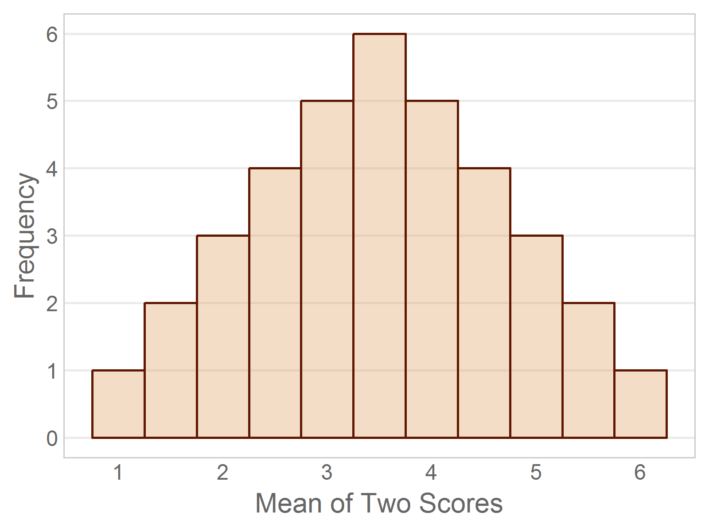

---
output:
  html_document:
    keep_md: yes
    code_folding: hide
---
Chapter 07 Graphs
=================================================
This report creates the chapter graphs.

<!--  Set the working directory to the repository's base directory; this assumes the report is nested inside of only one directory.-->


<!-- Set the report-wide options, and point to the external code file. -->

<!-- Load the packages.  Suppress the output when loading packages. -->

```r
library(magrittr) #Pipes
library(ggplot2) #For graphing
requireNamespace("dplyr")
requireNamespace("scales")
requireNamespace("readr")
requireNamespace("gridExtra")
```

<!-- Load any Global functions and variables declared in the R file.  Suppress the output. -->

```r
source("./common-code/book-theme.R")
calculatedPointCount <- 401

theme_chapter <- theme_book

theme_empty <- theme_minimal() +
  theme(axis.text = element_blank()) +
  theme(axis.title = element_blank()) +
  theme(panel.grid = element_blank()) +
  theme(panel.border = element_blank()) +
  theme(axis.ticks = element_blank())
```

<!-- Declare any global functions specific to a Rmd output.  Suppress the output. -->


<!-- Load the datasets. -->

```r
# 'ds' stands for 'datasets'
dsPregnancy <- read.csv("./data/exercise-pregnancy.csv", stringsAsFactors=FALSE)
```

<!-- Tweak the datasets. -->

```r
dsPregnancy$BabyWeightInKG <- dsPregnancy$BabyWeightInG / 1000
```

## Figure 7-1

```r
## No longer true: Figure07_01 is linked to the first histogram in Chapter 03.
xLimits <- c(0, 36)
gSample <- ggplot(dsPregnancy, aes(x=T1Lifts)) +
  coord_cartesian(xlim=xLimits, ylim=c(0, 17.5)) +
  labs(x="Number of Lifts in 1 min", y="Frequency")

gSample +
  geom_histogram(binwidth=2.5, fill="#94583CAA", color="#601600", na.rm=T) + #http://colrd.com/palette/23827/
  theme_chapter
```


## Figure 7-2

```r
gSampleShrunk <- gSample +
  geom_histogram(binwidth=2.5, fill="#94583CAA", color="#94583C", na.rm=T) +
  scale_y_continuous(labels=NULL) +
  labs(x=NULL, y=NULL) +
  theme_no_grid_or_y_labels

gMeanSample <- ggplot(data.frame(X=xLimits, Y=0:1), aes(x=X, y=Y)) +
  geom_blank() +
  scale_x_continuous(breaks=19.41) +
  scale_y_continuous(labels=NULL) +
  labs(x=NULL, y=NULL) +
  theme_no_grid_or_y_labels
# gMeanSample

gMeanPopulation <- ggplot(data.frame(X=xLimits, Y=0:1), aes(x=X, y=Y)) +
  geom_blank() +
  scale_x_continuous(breaks=21) +
  scale_y_continuous(labels=NULL) +
  labs(x=NULL, y=NULL) +
  theme_no_grid_or_y_labels
# gMeanPopulation

gridExtra::grid.arrange(
  gSampleShrunk,
  gMeanSample,
  gMeanPopulation,
  ncol = 3L,
  left = grid::textGrob(label="Frequency", rot=90, gp=grid::gpar(col="gray40")) #Sync this color with theme_book
)
```


```r
rm(gSample, gSampleShrunk, gMeanSample, gMeanPopulation)
```

## Figure 7-3

```r
dsNorm <- data.frame(X=21 + -3:3)
ggplot(dsNorm, aes(x=X)) +
  stat_function(fun=dnorm, args=list(mean=21, sd=1), color="#DD9954", size=1, n=calculatedPointCount) +
  scale_x_continuous(breaks=18:24) +
  scale_y_continuous(expand=c(0,0), labels=NULL) +
  expand_limits(y=max(dnorm(0)*1.07)) +
  labs(x=expression(mu), y=NULL) +
  theme_no_grid_or_y_labels
```



```r
rm(dsNorm)
```

## Figure 7-4

```r
cat("Reminder, the publisher needs to add the title `Population of 12 Scores`.")
```

```
Reminder, the publisher needs to add the title `Population of 12 Scores`.
```

```r
dsUniform <- data.frame(X=c(1,1,2,2,3,3,4,4,5,5,6,6))
ggplot(dsUniform, aes(x=X)) +##############################
  #geom_histogram(breaks=c(.5, 1.5, 2.5, 3.5, 4.5, 5.5, 6.5), color="#601600", fill="#7A7D5855") + #http://colrd.com/palette/23827/
  geom_histogram(breaks=c(.5, 1.5, 2.5, 3.5, 4.5, 5.5, 6.5), color="#601600", fill="#DD995411") + #http://colrd.com/palette/23827/
  scale_x_continuous(breaks=1:6) +
  scale_y_continuous(breaks=0:2) +
  labs(title=NULL, x="Scores", y="Frequency") +
  #labs(title="\nPopulation of 12 Scores", x="Scores", y="Frequency") +
  theme_chapter +
  theme(panel.grid.minor=element_blank()) +
  theme(panel.grid.major.x=element_blank())
```



## Figure 7-5

```r
cat("Reminder, the publisher needs to add the title `All Possible Means (N=2) from Limited Population`, where the `N` is italicized.")
```

```
Reminder, the publisher needs to add the title `All Possible Means (N=2) from Limited Population`, where the `N` is italicized.
```

```r
dsUniform <- data.frame(X=(2:12)/2, Y=c(1,2,3,4,5,6,5,4,3,2,1))
ggplot(dsUniform, aes(x=X, y=Y)) +
  geom_bar(stat="identity", width=.5, color="#601600", fill="#DD995455") + #http://colrd.com/palette/23827/
  scale_x_continuous(breaks=1:6) +
  scale_y_continuous(breaks=0:6) +
  labs(title=NULL, x="Mean of Two Scores", y="Frequency") +
  #labs(title="All Possible Means (N=2)\nfrom Limited Population", x="Sum of Two Scores", y="Frequency") +
  #labs(title=expression(atop(All*phantom(1)*Possible*phantom(1)*Means*phantom(1)*(italic(N)==2),from*phantom(1)*Limited*phantom(1)*Population)), x="Sum of Two Scores", y="Frequency") +
  theme_chapter +
  theme(panel.grid.minor=element_blank()) +
  theme(panel.grid.major.x=element_blank())
```



## Figure 7-6

```r
dsNorm <- data.frame(X=-3:3)
ggplot(dsNorm, aes(x=X)) +
  stat_function(fun=dnorm, args=list(mean=0, sd=1), color="#601600", size=1, n=calculatedPointCount) +
  #scale_x_continuous(breaks=-2:2, labels=rep("", 5)) +
  scale_x_continuous(breaks=-2:2, labels=c("", "", expression(italic(z)==0), "", "")) +
  scale_y_continuous(expand=c(0,0), labels=NULL) +
  expand_limits(y=max(dnorm(0)*1.07)) +
  labs(x=NULL, y=NULL) +
  theme_no_grid_or_y_labels +
  theme(axis.text.x=element_text(size=16))
```


```r
rm(dsNorm)
```

<!-- The footer that's common to all reports. -->

## Session Information

For the sake of documentation and reproducibility, the current report was rendered in the following environment.  Click the line below to expand.

<details>
  <summary>Environment <span class="glyphicon glyphicon-plus-sign"></span></summary>

```
- Session info ---------------------------------------------------------------
 setting  value                                      
 version  R version 3.5.1 Patched (2018-09-10 r75281)
 os       Windows >= 8 x64                           
 system   x86_64, mingw32                            
 ui       RStudio                                    
 language (EN)                                       
 collate  English_United States.1252                 
 ctype    English_United States.1252                 
 tz       America/Chicago                            
 date     2018-10-25                                 

- Packages -------------------------------------------------------------------
 package      * version    date       lib source                          
 assertthat     0.2.0      2017-04-11 [1] CRAN (R 3.5.0)                  
 backports      1.1.2      2017-12-13 [1] CRAN (R 3.5.0)                  
 base64enc      0.1-3      2015-07-28 [1] CRAN (R 3.5.0)                  
 bindr          0.1.1      2018-03-13 [1] CRAN (R 3.5.0)                  
 bindrcpp       0.2.2      2018-03-29 [1] CRAN (R 3.5.0)                  
 callr          3.0.0      2018-08-24 [1] CRAN (R 3.5.1)                  
 cli            1.0.1      2018-09-25 [1] CRAN (R 3.5.1)                  
 colorspace     1.3-2      2016-12-14 [1] CRAN (R 3.5.0)                  
 crayon         1.3.4      2017-09-16 [1] CRAN (R 3.5.0)                  
 debugme        1.1.0      2017-10-22 [1] CRAN (R 3.5.0)                  
 desc           1.2.0      2018-05-01 [1] CRAN (R 3.5.0)                  
 devtools       2.0.0      2018-10-19 [1] CRAN (R 3.5.1)                  
 dichromat      2.0-0      2013-01-24 [1] CRAN (R 3.5.0)                  
 digest         0.6.18     2018-10-10 [1] CRAN (R 3.5.1)                  
 dplyr          0.7.7      2018-10-16 [1] CRAN (R 3.5.1)                  
 epade          0.3.8      2013-02-22 [1] CRAN (R 3.5.1)                  
 evaluate       0.12       2018-10-09 [1] CRAN (R 3.5.1)                  
 extrafont      0.17       2014-12-08 [1] CRAN (R 3.5.0)                  
 extrafontdb    1.0        2012-06-11 [1] CRAN (R 3.5.0)                  
 fs             1.2.6      2018-08-23 [1] CRAN (R 3.5.1)                  
 ggplot2      * 3.0.0      2018-07-03 [1] CRAN (R 3.5.1)                  
 glue           1.3.0      2018-07-17 [1] CRAN (R 3.5.1)                  
 gridExtra      2.3        2017-09-09 [1] CRAN (R 3.5.0)                  
 gtable         0.2.0      2016-02-26 [1] CRAN (R 3.5.0)                  
 hms            0.4.2.9001 2018-08-09 [1] Github (tidyverse/hms@979286f)  
 htmltools      0.3.6      2017-04-28 [1] CRAN (R 3.5.0)                  
 knitr        * 1.20       2018-02-20 [1] CRAN (R 3.5.0)                  
 labeling       0.3        2014-08-23 [1] CRAN (R 3.5.0)                  
 lazyeval       0.2.1      2017-10-29 [1] CRAN (R 3.5.0)                  
 magrittr     * 1.5        2014-11-22 [1] CRAN (R 3.5.0)                  
 memoise        1.1.0      2017-04-21 [1] CRAN (R 3.5.0)                  
 munsell        0.5.0      2018-06-12 [1] CRAN (R 3.5.0)                  
 packrat        0.4.9-3    2018-06-01 [1] CRAN (R 3.5.0)                  
 pacman         0.5.0      2018-10-22 [1] CRAN (R 3.5.1)                  
 pillar         1.3.0      2018-07-14 [1] CRAN (R 3.5.1)                  
 pkgbuild       1.0.2      2018-10-16 [1] CRAN (R 3.5.1)                  
 pkgconfig      2.0.2      2018-08-16 [1] CRAN (R 3.5.1)                  
 pkgload        1.0.1      2018-10-11 [1] CRAN (R 3.5.1)                  
 plotrix        3.7-4      2018-10-03 [1] CRAN (R 3.5.1)                  
 plyr           1.8.4      2016-06-08 [1] CRAN (R 3.5.0)                  
 prettyunits    1.0.2      2015-07-13 [1] CRAN (R 3.5.0)                  
 processx       3.2.0      2018-08-16 [1] CRAN (R 3.5.1)                  
 ps             1.2.0      2018-10-16 [1] CRAN (R 3.5.1)                  
 purrr          0.2.5      2018-05-29 [1] CRAN (R 3.5.0)                  
 R6             2.3.0      2018-10-04 [1] CRAN (R 3.5.1)                  
 RColorBrewer   1.1-2      2014-12-07 [1] CRAN (R 3.5.0)                  
 Rcpp           0.12.19    2018-10-01 [1] CRAN (R 3.5.1)                  
 readr          1.2.0      2018-10-25 [1] Github (tidyverse/readr@69c9fd3)
 remotes        2.0.1      2018-10-19 [1] CRAN (R 3.5.1)                  
 rlang          0.3.0.1    2018-10-25 [1] CRAN (R 3.5.1)                  
 rmarkdown      1.10       2018-06-11 [1] CRAN (R 3.5.0)                  
 rprojroot      1.3-2      2018-01-03 [1] CRAN (R 3.5.0)                  
 Rttf2pt1       1.3.7      2018-06-29 [1] CRAN (R 3.5.0)                  
 scales         1.0.0      2018-08-09 [1] CRAN (R 3.5.1)                  
 sessioninfo    1.1.0      2018-09-25 [1] CRAN (R 3.5.1)                  
 stringi        1.2.4      2018-07-20 [1] CRAN (R 3.5.1)                  
 stringr        1.3.1      2018-05-10 [1] CRAN (R 3.5.0)                  
 testthat       2.0.1      2018-10-13 [1] CRAN (R 3.5.1)                  
 tibble         1.4.2      2018-01-22 [1] CRAN (R 3.5.0)                  
 tidyr          0.8.1      2018-05-18 [1] CRAN (R 3.5.0)                  
 tidyselect     0.2.5      2018-10-11 [1] CRAN (R 3.5.1)                  
 usethis        1.4.0      2018-08-14 [1] CRAN (R 3.5.1)                  
 wesanderson    0.3.6      2018-04-20 [1] CRAN (R 3.5.1)                  
 withr          2.1.2      2018-03-15 [1] CRAN (R 3.5.0)                  
 yaml           2.2.0      2018-07-25 [1] CRAN (R 3.5.1)                  

[1] D:/Projects/RLibraries
[2] D:/Users/Will/Documents/R/win-library/3.5
[3] C:/Program Files/R/R-3.5.1patched/library
```
</details>


Report rendered by Will at 2018-10-25, 13:03 -0500 in 3 seconds.


## License

<a rel="license" href="http://creativecommons.org/licenses/by/3.0/"></a><br />This work is licensed under a <a rel="license" href="http://creativecommons.org/licenses/by/3.0/">Creative Commons Attribution 3.0 Unported License</a>.
