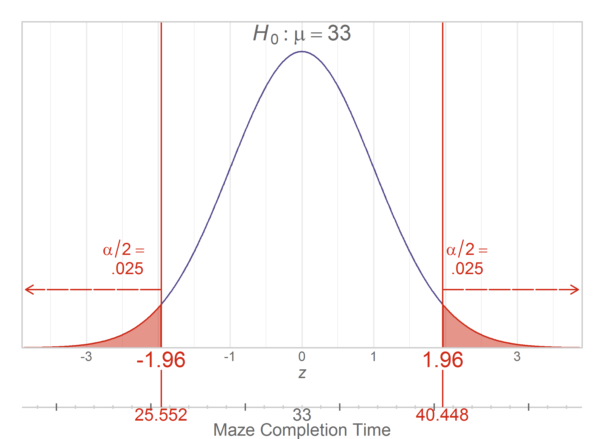

---
output:
  html_document:
    keep_md: yes
---
Chapter 09 Graphs
=================================================
This report creates the chapter graphs.

<!--  Set the working directory to the repository's base directory; this assumes the report is nested inside of only one directory.-->
```{r, echo=F, message=F}
library(knitr)
knitr::opts_knit$set(root.dir='../')  #Don't combine this call with any other chunk -especially one that uses file paths.
```

<!-- Set the report-wide options, and point to the external code file. -->
```{r set-options, echo=F}
report_render_start_time <- Sys.time()
opts_chunk$set(
  results = 'show',
  message = TRUE,
  comment = NA,
  tidy = FALSE,
  fig.height = 4,
  fig.width = 5.5,
  out.width = "550px", #This affects only the markdown, not the underlying png file.  The height will be scaled appropriately.
  fig.path = 'figure-png/',
  dev = "png",
  dpi = 400
  # fig.path = 'figure-pdf/',
  # dev = "pdf"
)
echo_chunks <- FALSE
options(width=80) # Default width
read_chunk("./chapter-09/chapter-09.R")
```
<!-- Load the packages.  Suppress the output when loading packages. -->
```{r load-packages, echo=echo_chunks, message=FALSE}
```

<!-- Load any Global functions and variables declared in the R file.  Suppress the output. -->
```{r declare-globals, echo=echo_chunks, message=FALSE}
```

<!-- Declare any global functions specific to a Rmd output.  Suppress the output. -->
```{r, echo=echo_chunks, message=FALSE}
```

<!-- Load the datasets. -->
```{r load-data, echo=echo_chunks, message=FALSE}
```

<!-- Tweak the datasets. -->
```{r tweak-data, echo=echo_chunks, message=FALSE}
```

## Figure 9-1
```{r figure-09-01, echo=echo_chunks}
```

## Figure 9-2
```{r figure-09-02, echo=echo_chunks}
```

## Figure 9-3
```{r figure-09-03, echo=echo_chunks}
```

## Figure 9-4
```{r figure-09-04, echo=echo_chunks}
```

## Figure 9-5
```{r figure-09-05, echo=echo_chunks}
```

## Figure 9-6
```{r figure-09-06, echo=echo_chunks}
```

## Figure 9-7


## Figure 9-8


## Figure 9-9
```{r figure-09-09, echo=echo_chunks, fig.height=2}
```

## Figure 9-10
```{r figure-09-10, echo=echo_chunks}
```

## Figure 9-11
```{r figure-09-11, echo=echo_chunks, fig.height=1.5}
```

<!-- The footer that's common to all reports. -->
```{r, child = "../common-code/footer.Rmd"}
```
