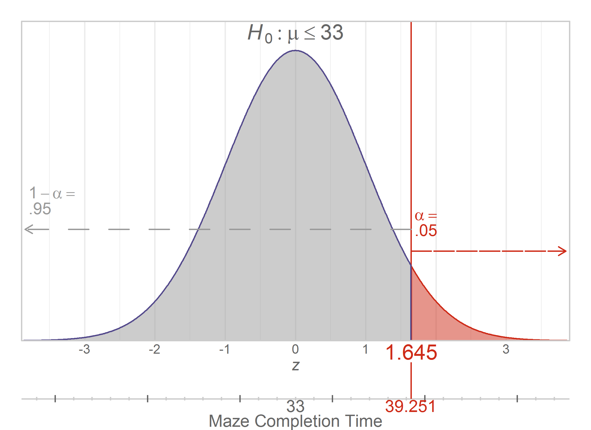
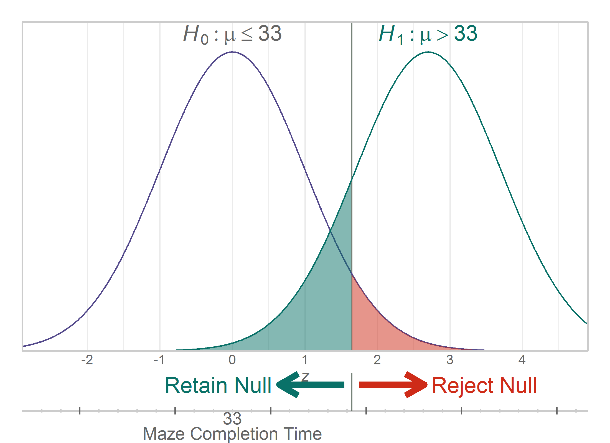
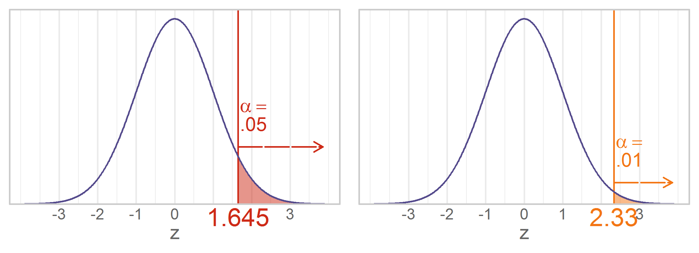

---
output:
  html_document:
    keep_md: yes
    code_folding: hide
---
Chapter 09 Graphs
=================================================
This report creates the chapter graphs.

<!--  Set the working directory to the repository's base directory; this assumes the report is nested inside of only one directory.-->


<!-- Set the report-wide options, and point to the external code file. -->

<!-- Load the packages.  Suppress the output when loading packages. -->

```r
library(ggplot2) #For graphing
```

<!-- Load any Global functions and variables declared in the R file.  Suppress the output. -->

```r
source("./common-code/book-theme.R")
calculatedPointCount <- 401 * 2

theme_chapter <- theme_book

theme_empty <- theme_minimal() +
  theme(axis.text = element_blank()) +
  theme(axis.title = element_blank()) +
  theme(panel.grid = element_blank()) +
  theme(panel.border = element_blank()) +
  theme(axis.ticks = element_blank())

mu <- 33
sigma <- 19
nObs <- 25
se <- sigma / sqrt(nObs)
ConvertFromZToM <- function( z, roundedDigits=2) {
  return( round(mu + (z * se), digits=roundedDigits) )
}
ConvertFromMToZ <- function( m) {
  return( (m - mu) / se )
}
ticksSmall <- 19:47
ticksBig <- seq(20, 45, by=5)
ticksSmallExtended <- 23:51
ticksBigExtended <- seq(25, 50, by=5)
tickHeightSmall <- .0025
tickHeightBig <- .005
```

<!-- Declare any global functions specific to a Rmd output.  Suppress the output. -->


<!-- Load the datasets. -->

```r
# 'ds' stands for 'datasets'
```

<!-- Tweak the datasets. -->


## Figure 9-1

```r
xLimits <- c(-3.9, 3.9)
xLimitBuffer <- 3.85
parallelLineHeight <- -.08

criticalZ05 <- 1.645 #qnorm(p=.95) --Use the slightly less accurate version (ie, 1.645) so that it matches their manual arithmetic
criticalM05Pretty <- ConvertFromZToM(criticalZ05, roundedDigits=3) #39.251

criticalZ01 <- 2.33 #qnorm(p=.99) --Use the slightly less accurate version (ie, 2.33) so that it matches their manual arithmetic
criticalM01Pretty <- ConvertFromZToM(criticalZ01, roundedDigits=3) #39.251

g1a <- ggplot(data.frame(f=xLimits), aes(x=f)) +
  annotate("segment", x=-Inf, xend=Inf, y=parallelLineHeight, yend=parallelLineHeight, color="gray80") +
  annotate("segment", x=ConvertFromMToZ(ticksSmall), xend=ConvertFromMToZ(ticksSmall), y=parallelLineHeight-tickHeightSmall, yend=parallelLineHeight+tickHeightSmall, color="gray80") +
  annotate("segment", x=ConvertFromMToZ(ticksBig), xend=ConvertFromMToZ(ticksBig), y=parallelLineHeight-tickHeightBig, yend=parallelLineHeight+tickHeightBig, color="gray40") +
  annotate("text", label="Maze Completion Time", x=0, y=parallelLineHeight, parse=F, vjust=2.25, size=4, color="gray40") +
  stat_function(fun=dnorm, n=calculatedPointCount, color=PaletteCritical[1], size=.5) +
  scale_y_continuous(breaks=NULL, expand=c(0,0)) +
  coord_cartesian(xlim=c(-3.9, 3.9), ylim=c(0, dnorm(0)*1.10)) +
  theme_chapter +
  theme(plot.margin=grid::unit(x=c(1,1,2.6,1), units="lines")) +
  #   theme(axis.text = element_text(colour="gray60")) + #Lighten so the critical values aren't interfered with
  labs(x=expression(italic(z)), y=NULL)

g1b <- g1a +
  annotate("segment", x=criticalZ05, xend=criticalZ05, y=0, yend=Inf, color=PaletteCritical[2]) +
  annotate("segment", x=criticalZ05, xend=criticalZ05, y=-.03, yend=parallelLineHeight, color=PaletteCritical[2]) +
  annotate("segment", x=criticalZ05, xend=xLimitBuffer, y=dnorm(criticalZ05)+.02, yend=dnorm(criticalZ05)+.02, color=PaletteCritical[2], arrow=arrow(length=grid::unit(0.2, "cm"), type="open"), lineend="round", linetype="F2") +

  annotate(geom="text", x=criticalZ05+.05, y=dnorm(criticalZ05)+.06, label="alpha==phantom(0)", hjust=0, vjust=-.15, parse=TRUE, color=PaletteCritical[2]) +
  annotate(geom="text", x=criticalZ05+.05, y=dnorm(criticalZ05)+.06, label=".05", hjust=0, vjust=1.15, parse=F, color=PaletteCritical[2]) +
  annotate(geom="text", x=criticalZ05, y=0, label=round(criticalZ05, 3), hjust=.5, vjust=1.2, color=PaletteCritical[2], size=5) +

  annotate("text", label=criticalM05Pretty, x=criticalZ05, y=parallelLineHeight, size=4, vjust=1.05, color=PaletteCritical[2]) +
  stat_function(fun=LimitRange(dnorm, criticalZ05, Inf), geom="area", color=PaletteCritical[2], fill=PaletteCriticalLight[2], n=calculatedPointCount, na.rm=T)

DrawWithoutPanelClipping(g1b +
                           scale_x_continuous(expand=c(0,0), breaks=-3:3, labels=c(-3, -2, -1, 0, 1, "", 3)) +
                           annotate("text", label=paste("italic(H)[0]:mu <=", mu), x=0, y=dnorm(0)*1.02, parse=T, size=5, vjust=-.05, color="gray40") +
                           annotate("text", label=mu, x=0, y=parallelLineHeight, size=4, vjust=1.05, color="gray40")
)
```


## Figure 9-2

```r
g2 <- g1b +
  stat_function(fun=LimitRange(dnorm, -Inf, criticalZ05 ), geom="area", color=PaletteCritical[1], fill=PaletteCriticalLight[6], n=calculatedPointCount, na.rm=T) +
  annotate("segment", x=criticalZ05, xend=-xLimitBuffer, y=dnorm(criticalZ05)+.02+.03, yend=dnorm(criticalZ05)+.02+.03, color=PaletteCritical[6], arrow=arrow(length=grid::unit(0.2, "cm"), type="open"), lineend="round", linetype="FF") +

  annotate(geom="text", x=-xLimitBuffer+.05, y=dnorm(criticalZ05)+.06+.03, label="1-alpha==phantom(0)", hjust=0, vjust=-.15, parse=TRUE, color=PaletteCritical[6]) +
  annotate(geom="text", x=-xLimitBuffer+.05, y=dnorm(criticalZ05)+.06+.03, label=".95", hjust=0, vjust=1.15, parse=F, color=PaletteCritical[6])

DrawWithoutPanelClipping(g2 +
                           scale_x_continuous(expand=c(0,0), breaks=-3:3, labels=c(-3, -2, -1, 0, 1, "", 3)) +
                           annotate("text", label=paste("italic(H)[0]:mu <=", mu), x=0, y=dnorm(0)*1.02, parse=T, size=5, vjust=-.05, color="gray40") +
                           annotate("text", label=mu, x=0, y=parallelLineHeight, size=4, vjust=1.05, color="gray40")
)
```



## Figure 9-3

```r
g3 <- g1a +
  stat_function(fun=LimitRange(dnorm, -Inf, criticalZ01 ), geom="area", color=PaletteCritical[1], fill=PaletteCriticalLight[6], n=calculatedPointCount, na.rm=T) +
  annotate("segment", x=criticalZ01, xend=-xLimitBuffer, y=dnorm(criticalZ01)+.02+.03, yend=dnorm(criticalZ01)+.02+.03, color=PaletteCritical[6], arrow=arrow(length=grid::unit(0.2, "cm"), type="open"), lineend="round", linetype="FF") +

  annotate(geom="text", x=-xLimitBuffer+.05, y=dnorm(criticalZ01)+.06+.03, label="1-alpha==phantom(0)", hjust=0, vjust=-.15, parse=TRUE, color=PaletteCritical[6]) +
  annotate(geom="text", x=-xLimitBuffer+.05, y=dnorm(criticalZ01)+.06+.03, label=".99", hjust=0, vjust=1.15, parse=F, color=PaletteCritical[6]) +

  annotate("segment", x=criticalZ01, xend=criticalZ01, y=0, yend=Inf, color=PaletteCritical[3]) +
  annotate("segment", x=criticalZ01, xend=criticalZ01, y=-.03, yend=parallelLineHeight, color=PaletteCritical[3]) +
  annotate("segment", x=criticalZ01, xend=xLimitBuffer, y=dnorm(criticalZ01)+.02, yend=dnorm(criticalZ01)+.02, color=PaletteCritical[3], arrow=arrow(length=grid::unit(0.2, "cm"), type="open"), lineend="round", linetype="F2") +

  annotate(geom="text", x=criticalZ01+.05, y=dnorm(criticalZ01)+.06, label="alpha==phantom(0)", hjust=0, vjust=-.15, parse=TRUE, color=PaletteCritical[3]) +
  annotate(geom="text", x=criticalZ01+.05, y=dnorm(criticalZ01)+.06, label=".01", hjust=0, vjust=1.15, parse=F, color=PaletteCritical[3]) +
  annotate(geom="text", x=criticalZ01, y=0, label=round(criticalZ01, 3), hjust=.5, vjust=1.2, color=PaletteCritical[3], size=5) +

  annotate("text", label=criticalM01Pretty, x=criticalZ01, y=parallelLineHeight, size=4, vjust=1.05, color=PaletteCritical[3]) +
  stat_function(fun=LimitRange(dnorm, criticalZ01, Inf), geom="area", color=PaletteCritical[3], fill=PaletteCriticalLight[3], n=calculatedPointCount, na.rm=T)

DrawWithoutPanelClipping(g3 +
                           scale_x_continuous(expand=c(0,0), breaks=-3:3, labels=c(-3, -2, -1, 0, 1, "", 3)) +
                           annotate("text", label=paste("italic(H)[0]:mu <=", mu), x=0, y=dnorm(0)*1.02, parse=T, size=5, vjust=-.05, color="gray40") +
                           annotate("text", label=mu, x=0, y=parallelLineHeight, size=4, vjust=1.05, color="gray40")
)
```


## Figure 9-4

```r
zObs <- 1.3
zAlt <- 1.9
dnorm19 <- function(x) dnorm(x, mean=zAlt)
# locationExplanation <- "One possible location of\nan alternative distribution if\nTrue State of the World is"

g4 <- g1a +
  annotate("segment", x=1.2, xend=zObs, y=.04, yend=0, color=PaletteCriticalLight[5], size=1) +
  annotate("text", x=1.1, y=.05, label=zObs, color=PaletteCritical[5], size=5) +
  annotate("point", x=zObs, y=0,color=PaletteCritical[5], fill=PaletteCriticalLight[5], size=5, shape=21) +
  annotate("segment", x=criticalZ05, xend=criticalZ05, y=0, yend=Inf, color=PaletteCritical[2]) +
  annotate("segment", x=criticalZ05, xend=criticalZ05, y=-.03, yend=parallelLineHeight, color=PaletteCritical[2]) +

#   annotate("text", x=zAlt, y=.3, label=locationExplanation, color=PaletteCritical[5], vjust=-.1, size=5, lineheight=.8) +
  annotate(geom="text", x=zAlt, y=dnorm19(zAlt)*1.02, label="italic(H)[1]: mu>33", parse=T, size=5, vjust=-.05, color=PaletteCritical[5]) +

  annotate(geom="text", x=criticalZ05, y=0, label=round(criticalZ05, 3), hjust=.5, vjust=1.2, color=PaletteCritical[2], size=5) +

  annotate("text", label=criticalM05Pretty, x=criticalZ05, y=parallelLineHeight, size=4, vjust=1.05, color=PaletteCritical[2]) +
  stat_function(fun=dnorm19, n=calculatedPointCount, color=PaletteCritical[5], size=.5, na.rm=T) +
  stat_function(fun=LimitRange(dnorm, criticalZ05, Inf), geom="area", color=PaletteCritical[2], fill=PaletteCriticalLight[2], n=calculatedPointCount, na.rm=T)

DrawWithoutPanelClipping(g4 +
                           scale_x_continuous(expand=c(0,0), breaks=-3:3, labels=c(-3, -2, -1, 0, 1, "", 3)) +
                           annotate("text", label=paste("italic(H)[0]:mu <=", mu), x=0, y=dnorm(0)*1.02, parse=T, size=5, vjust=-.05, color="gray40") +
                           annotate("text", label=mu, x=0, y=parallelLineHeight, size=4, vjust=1.05, color="gray40")
)
```


## Figure 9-5

```r
shadedExplanation <- "Green shaded area:\nprobability of\na Type II error"
g5 <- g4 +
  annotate("segment", x=-1.2, xend=1, y=.3, yend=.15, color=PaletteCriticalLight[5], size=1) +
  annotate("text", x=-2.2, y=.3, label=shadedExplanation, color=PaletteCritical[5], vjust=.5, size=5, lineheight=.8) +
  stat_function(fun=LimitRange(dnorm19, -Inf, criticalZ05), geom="area", color=NA, fill=PaletteCriticalLight[5], n=calculatedPointCount, na.rm=T)

DrawWithoutPanelClipping(g5 +
                           scale_x_continuous(expand=c(0,0), breaks=-3:3, labels=c(-3, -2, -1, 0, 1, "", 3)) +
                           annotate("text", label=paste("italic(H)[0]:mu <=", mu), x=0, y=dnorm(0)*1.02, parse=T, size=5, vjust=-.05, color="gray40") +
                           annotate("text", label=mu, x=0, y=parallelLineHeight, size=4, vjust=1.05, color="gray40")
)
```


## Figure 9-6

```r
zAlt <- 2.7
dnorm27 <- function(x) dnorm(x, mean=zAlt)
g6 <- ggplot(data.frame(f=c(-2.9, 4.9)), aes(x=f)) +
  annotate("segment", x=-Inf, xend=Inf, y=parallelLineHeight, yend=parallelLineHeight, color="gray80") +
  annotate("segment", x=ConvertFromMToZ(ticksSmallExtended), xend=ConvertFromMToZ(ticksSmallExtended), y=parallelLineHeight-tickHeightSmall, yend=parallelLineHeight+tickHeightSmall, color="gray80") +
  annotate("segment", x=ConvertFromMToZ(ticksBigExtended), xend=ConvertFromMToZ(ticksBigExtended), y=parallelLineHeight-tickHeightBig, yend=parallelLineHeight+tickHeightBig, color="gray40") +
  annotate("text", label="Maze Completion Time", x=0, y=parallelLineHeight, parse=F, vjust=2.25, size=4, color="gray40") +

  annotate("segment", x=criticalZ05, xend=criticalZ05, y=0, yend=Inf, color=PaletteCriticalLight[2]) +
  annotate("segment", x=criticalZ05, xend=criticalZ05, y=0, yend=Inf, color=PaletteCriticalLight[5]) +
  annotate("segment", x=criticalZ05, xend=criticalZ05, y=-.03, yend=parallelLineHeight, color=PaletteCriticalLight[2]) +
  annotate("segment", x=criticalZ05, xend=criticalZ05, y=-.03, yend=parallelLineHeight, color=PaletteCriticalLight[5]) +

  stat_function(fun=LimitRange(dnorm, -2.9, 4.9), geom="line", color=PaletteCritical[1], n=calculatedPointCount, na.rm=T) +
  stat_function(fun=LimitRange(dnorm, criticalZ05, Inf), geom="area", fill=PaletteCriticalLight[2], n=calculatedPointCount, na.rm=T) +

  stat_function(fun=LimitRange(dnorm27, -2.9, 4.9), n=calculatedPointCount, color=PaletteCritical[5], size=.5) +
  stat_function(fun=LimitRange(dnorm27, -2.9, criticalZ05), geom="area", fill=PaletteCriticalLight[5], n=calculatedPointCount, na.rm=T) +

  annotate("segment", x=criticalZ05+.1, xend=criticalZ05+1, y=-.045, yend=-.045, color=PaletteCritical[2], arrow=arrow(length=grid::unit(0.5, "cm")), size=2) +
  annotate("text", x=criticalZ05+1.1, y=-.045, label="Reject Null", hjust=0, color=PaletteCritical[2], size=5) +

  annotate("segment", x=criticalZ05-.1, xend=criticalZ05-1, y=-.045, yend=-.045, color=PaletteCritical[5], arrow=arrow(length=grid::unit(0.5, "cm")), size=2) +
  annotate("text", x=criticalZ05-1.1, y=-.045, label="Retain Null", hjust=1, color=PaletteCritical[5], size=5) +

  annotate(geom="text", x=zAlt, y=dnorm27(zAlt)*1.02, label="italic(H)[1]: mu>33", parse=T, size=5, vjust=-.05, color=PaletteCritical[5]) +

  scale_y_continuous(breaks=NULL, expand=c(0,0)) +
  coord_cartesian(xlim=c(-2.9, 4.9), ylim=c(0, dnorm(0)*1.10)) +
  theme_chapter +
  theme(plot.margin=grid::unit(x=c(1,1,2.6,1), units="lines")) +
  #   theme(axis.text = element_text(colour="gray60")) + #Lighten so the critical values aren't interfered with
  labs(x=expression(italic(z)), y=NULL)

DrawWithoutPanelClipping(g6 +
                           scale_x_continuous(expand=c(0,0), breaks=-3:5) +
                           annotate("text", label=paste("italic(H)[0]:mu <=", mu), x=0, y=dnorm(0)*1.02, parse=T, size=5, vjust=-.05, color="gray40") +
                           annotate("text", label=mu, x=0, y=parallelLineHeight, size=4, vjust=1.05, color="gray40")
)
```



## Figure 9-7


## Figure 9-8


## Figure 9-9

```r
g9A <- ggplot(data.frame(z=xLimits), aes(x=z)) +
  annotate("segment", x=criticalZ05, xend=criticalZ05, y=0, yend=Inf, color=PaletteCritical[2]) +
  annotate("segment", x=criticalZ05, xend=xLimitBuffer, y=dnorm(criticalZ05)+.02, yend=dnorm(criticalZ05)+.02, color=PaletteCritical[2], arrow=arrow(length=grid::unit(0.2, "cm"), type="open"), lineend="round", linetype="F2") +

  annotate(geom="text", x=criticalZ05+.05, y=dnorm(criticalZ05)+.09, label="alpha==phantom(0)", hjust=0, vjust=-.15, parse=TRUE, color=PaletteCritical[2]) +
  annotate(geom="text", x=criticalZ05+.05, y=dnorm(criticalZ05)+.09, label=".05", hjust=0, vjust=1.15, parse=F, color=PaletteCritical[2]) +
  annotate(geom="text", x=criticalZ05, y=0, label=round(criticalZ05, 3), hjust=.5, vjust=1.2, color=PaletteCritical[2], size=5) +

  stat_function(fun=LimitRange(dnorm, criticalZ05, Inf), geom="area", fill=PaletteCriticalLight[2], n=calculatedPointCount, na.rm=T) +
  stat_function(fun=dnorm, n=calculatedPointCount, color=PaletteCritical[1], na.rm=T) +
  scale_x_continuous(breaks=-3:3, labels=c(-3, -2, -1, 0, "", "", 3)) +
  scale_y_continuous(breaks=NULL, expand=c(0,0)) +
  expand_limits(y=dnorm(0) * 1.05) +
  theme_chapter +
  labs(x=expression(z), y=NULL)
gt9A <- ggplot_gtable(ggplot_build(g9A))
gt9A$layout$clip[gt9A$layout$name == "panel"] <- "off"

g9B <- ggplot(data.frame(z=xLimits), aes(x=z)) +
  annotate("segment", x=criticalZ01, xend=criticalZ01, y=0, yend=Inf, color=PaletteCritical[3]) +
  annotate("segment", x=criticalZ01, xend=xLimitBuffer, y=dnorm(criticalZ01)+.02, yend=dnorm(criticalZ01)+.02, color=PaletteCritical[3], arrow=arrow(length=grid::unit(0.2, "cm"), type="open"), lineend="round", linetype="F2") +

  annotate(geom="text", x=criticalZ01+.05, y=dnorm(criticalZ01)+.09, label="alpha==phantom(0)", hjust=0, vjust=-.15, parse=TRUE, color=PaletteCritical[3]) +
  annotate(geom="text", x=criticalZ01+.05, y=dnorm(criticalZ01)+.09, label=".01", hjust=0, vjust=1.15, parse=F, color=PaletteCritical[3]) +
  annotate(geom="text", x=criticalZ01, y=0, label=round(criticalZ01, 3), hjust=.5, vjust=1.2, color=PaletteCritical[3], size=5) +

  stat_function(fun=LimitRange(dnorm, criticalZ01, Inf), geom="area", fill=PaletteCriticalLight[3], n=calculatedPointCount, na.rm=T) +
  stat_function(fun=dnorm, n=calculatedPointCount, color=PaletteCritical[1], na.rm=T) +
  scale_x_continuous(breaks=-3:3, labels=c(-3, -2, -1, 0, 1, "", 3)) +
  scale_y_continuous(breaks=NULL, expand=c(0,0)) +
  expand_limits(y=dnorm(0) * 1.05) +
  theme_chapter +
  labs(x=expression(z), y=NULL)
gt9B <- ggplot_gtable(ggplot_build(g9B))
gt9B$layout$clip[gt9B$layout$name == "panel"] <- "off"

#Position the two graphs side by side in the same plot
gridExtra::grid.arrange(gt9A, gt9B, ncol=2)
```



## Figure 9-10

```r
zAlt <- 2.7
dnorm27 <- function(x) dnorm(x, mean=zAlt)
g10 <- ggplot(data.frame(f=c(-2.9, 4.9)), aes(x=f)) +
  annotate("segment", x=-Inf, xend=Inf, y=parallelLineHeight, yend=parallelLineHeight, color="gray80") +
  annotate("segment", x=ConvertFromMToZ(ticksSmallExtended), xend=ConvertFromMToZ(ticksSmallExtended), y=parallelLineHeight-tickHeightSmall, yend=parallelLineHeight+tickHeightSmall, color="gray80") +
  annotate("segment", x=ConvertFromMToZ(ticksBigExtended), xend=ConvertFromMToZ(ticksBigExtended), y=parallelLineHeight-tickHeightBig, yend=parallelLineHeight+tickHeightBig, color="gray40") +
  annotate("text", label="Maze Completion Time", x=0, y=parallelLineHeight, parse=F, vjust=2.25, size=4, color="gray40") +

  annotate("segment", x=criticalZ01, xend=criticalZ01, y=0, yend=Inf, color=PaletteCriticalLight[3]) +
  annotate("segment", x=criticalZ01, xend=criticalZ01, y=0, yend=Inf, color=PaletteCriticalLight[5]) +
  annotate("segment", x=criticalZ01, xend=criticalZ01, y=-.03, yend=parallelLineHeight, color=PaletteCriticalLight[3]) +
  annotate("segment", x=criticalZ01, xend=criticalZ01, y=-.03, yend=parallelLineHeight, color=PaletteCriticalLight[5]) +

  stat_function(fun=LimitRange(dnorm, -2.9, 4.9), geom="line", color=PaletteCritical[1], n=calculatedPointCount, na.rm=T) +
  stat_function(fun=LimitRange(dnorm, criticalZ01, Inf), geom="area", fill=PaletteCriticalLight[3], n=calculatedPointCount, na.rm=T) +

  stat_function(fun=LimitRange(dnorm27, -2.9, 4.9), n=calculatedPointCount, color=PaletteCritical[5], size=.5, na.rm=T) +
  stat_function(fun=LimitRange(dnorm27, -2.9, criticalZ01), geom="area", fill=PaletteCriticalLight[5], n=calculatedPointCount, na.rm=T) +

  annotate("segment", x=criticalZ01+.1, xend=criticalZ01+1, y=-.045, yend=-.045, color=PaletteCritical[3], arrow=arrow(length=grid::unit(0.5, "cm")), size=2) +
  annotate("text", x=criticalZ01+1.1, y=-.045, label="Reject Null", hjust=0, color=PaletteCritical[3], size=5) +

  annotate("segment", x=criticalZ01-.1, xend=criticalZ01-1, y=-.045, yend=-.045, color=PaletteCritical[5], arrow=arrow(length=grid::unit(0.5, "cm")), size=2) +
  annotate("text", x=criticalZ01-1.1, y=-.045, label="Retain Null", hjust=1, color=PaletteCritical[5], size=5) +

  annotate(geom="text", x=zAlt+.4, y=dnorm27(zAlt)*1.02, label="italic(H)[1]: mu>33", parse=T, size=5, vjust=-.05, color=PaletteCritical[5]) +

  scale_y_continuous(breaks=NULL, expand=c(0,0)) +
  coord_cartesian(xlim=c(-2.9, 4.9), ylim=c(0, dnorm(0)*1.10)) +
  theme_chapter +
  theme(plot.margin=grid::unit(x=c(1,1,2.6,1), units="lines")) +
  #   theme(axis.text = element_text(colour="gray60")) + #Lighten so the critical values aren't interfered with
  labs(x=expression(italic(z)), y=NULL)

DrawWithoutPanelClipping(g10 +
                           scale_x_continuous(expand=c(0,0), breaks=-3:5) +
                           annotate("text", label=paste("italic(H)[0]:mu <=", mu), x=0, y=dnorm(0)*1.02, parse=T, size=5, vjust=-.05, color="gray40") +
                           annotate("text", label=mu, x=0, y=parallelLineHeight, size=4, vjust=1.05, color="gray40")
)
```


## Figure 9-11

```r
# ci <- c(36.952, 51.848)
# obs <- 44.4
# xLimits <- c(29.5, 55.5)


obs1 <- 44.4
ci1=c(36.952, 51.848)
obs2 <- 68
ci2=c(60.552, 75.448)
xLimits <- c(28, 82)
dsNumberLine <- data.frame(Mu=mu, Obs=obs1, CILower=ci1[1], CIUpper=ci2[2])
bandHeight <- .18
yText <- -.3
ticksSmall <- 6:90
ticksBig <- seq(10, 90, by=5)
tickHeightSmall <- .025
tickHeightBig <- .05

ggplot(dsNumberLine, aes(x=Mu)) +
  geom_hline(yintercept=0, color="gray40") +
  annotate("segment", x=ticksSmall, xend=ticksSmall, y=-tickHeightSmall, yend=tickHeightSmall, color="gray80") +
  annotate("segment", x=ticksBig, xend=ticksBig, y=-tickHeightBig, yend=tickHeightBig, color="gray40") +
  #   annotate("segment", x=zObs0184, xend=zObs0184, y=0, yend=Inf, color=PaletteCritical[4])  +

  annotate("rect", xmin=ci1[1], xmax=ci1[2], ymin=-bandHeight, ymax=bandHeight, fill=PaletteCritical[3], alpha=.2) +
  annotate("segment", x=ci1[1], xend=ci1[1], y=-bandHeight, yend=bandHeight, color=PaletteCritical[3]) +
  annotate("segment", x=ci1[2], xend=ci1[2], y=-bandHeight, yend=bandHeight, color=PaletteCritical[3]) +
  annotate("text", x=ci1[1], y=yText, label=ci1[1], size=5 ,color=PaletteCritical[3])  +
  annotate("text", x=ci1[2], y=yText, label=ci1[2], size=5 ,color=PaletteCritical[3])  +
  annotate("point", x=obs1, y=0, shape=23, size=5,color=PaletteCritical[4], fill=PaletteCriticalLight[4])  +
  annotate("text", x=obs1, y=-yText, label=paste0("italic(M)==", obs1), parse=T, size=5, vjust=1.1, color=PaletteCritical[4])  +
  annotate("text", x=obs1, y=-yText, label="CI for Situation 1:", size=3, vjust=-.1, color=PaletteCritical[4])  +

  annotate("rect", xmin=ci2[1], xmax=ci2[2], ymin=-bandHeight, ymax=bandHeight, fill=PaletteCritical[3], alpha=.2) +
  annotate("segment", x=ci2[1], xend=ci2[1], y=-bandHeight, yend=bandHeight, color=PaletteCritical[3]) +
  annotate("segment", x=ci2[2], xend=ci2[2], y=-bandHeight, yend=bandHeight, color=PaletteCritical[3]) +
  annotate("text", x=ci2[1], y=yText, label=ci2[1], size=5 ,color=PaletteCritical[3])  +
  annotate("text", x=ci2[2], y=yText, label=ci2[2], size=5 ,color=PaletteCritical[3])  +
  annotate("point", x=obs2, y=0, shape=23, size=5,color=PaletteCritical[4], fill=PaletteCriticalLight[4])  +
  annotate("text", x=obs2, y=-yText, label=paste0("italic(M)==", obs2), parse=T, size=5, vjust=1.1, color=PaletteCritical[4])  +
  annotate("text", x=obs2, y=-yText, label="CI for Situation 2:", size=3, vjust=-.1, color=PaletteCritical[4])  +

  annotate("point", x=mu, y=0, shape=21, size=5,color=PaletteCritical[1], fill=PaletteCriticalLight[1])  +
  annotate("text", x=mu, y=-yText, label=paste0("italic(mu)==", mu), parse=T, size=5, vjust=1.05, color=PaletteCritical[1])  +
  scale_x_continuous(expand=c(0,0)) +
  scale_y_continuous(expand=c(0,0)) +
  coord_cartesian(ylim=c(-.4, .4), xlim=xLimits) +
  #   theme_chapter +
  theme_empty +
  labs(x=NULL, y=NULL)
```


<!-- The footer that's common to all reports. -->

## Session Information

For the sake of documentation and reproducibility, the current report was rendered in the following environment.  Click the line below to expand.

<details>
  <summary>Environment <span class="glyphicon glyphicon-plus-sign"></span></summary>

```
- Session info ---------------------------------------------------------------
 setting  value                                      
 version  R version 3.5.1 Patched (2018-09-10 r75281)
 os       Windows >= 8 x64                           
 system   x86_64, mingw32                            
 ui       RStudio                                    
 language (EN)                                       
 collate  English_United States.1252                 
 ctype    English_United States.1252                 
 tz       America/Chicago                            
 date     2018-10-25                                 

- Packages -------------------------------------------------------------------
 package      * version    date       lib source                          
 assertthat     0.2.0      2017-04-11 [1] CRAN (R 3.5.0)                  
 backports      1.1.2      2017-12-13 [1] CRAN (R 3.5.0)                  
 base64enc      0.1-3      2015-07-28 [1] CRAN (R 3.5.0)                  
 bindr          0.1.1      2018-03-13 [1] CRAN (R 3.5.0)                  
 bindrcpp       0.2.2      2018-03-29 [1] CRAN (R 3.5.0)                  
 callr          3.0.0      2018-08-24 [1] CRAN (R 3.5.1)                  
 cli            1.0.1      2018-09-25 [1] CRAN (R 3.5.1)                  
 colorspace     1.3-2      2016-12-14 [1] CRAN (R 3.5.0)                  
 crayon         1.3.4      2017-09-16 [1] CRAN (R 3.5.0)                  
 debugme        1.1.0      2017-10-22 [1] CRAN (R 3.5.0)                  
 desc           1.2.0      2018-05-01 [1] CRAN (R 3.5.0)                  
 devtools       2.0.0      2018-10-19 [1] CRAN (R 3.5.1)                  
 dichromat      2.0-0      2013-01-24 [1] CRAN (R 3.5.0)                  
 digest         0.6.18     2018-10-10 [1] CRAN (R 3.5.1)                  
 dplyr          0.7.7      2018-10-16 [1] CRAN (R 3.5.1)                  
 epade          0.3.8      2013-02-22 [1] CRAN (R 3.5.1)                  
 evaluate       0.12       2018-10-09 [1] CRAN (R 3.5.1)                  
 extrafont      0.17       2014-12-08 [1] CRAN (R 3.5.0)                  
 extrafontdb    1.0        2012-06-11 [1] CRAN (R 3.5.0)                  
 fs             1.2.6      2018-08-23 [1] CRAN (R 3.5.1)                  
 ggplot2      * 3.0.0      2018-07-03 [1] CRAN (R 3.5.1)                  
 glue           1.3.0      2018-07-17 [1] CRAN (R 3.5.1)                  
 gridExtra      2.3        2017-09-09 [1] CRAN (R 3.5.0)                  
 gtable         0.2.0      2016-02-26 [1] CRAN (R 3.5.0)                  
 hms            0.4.2.9001 2018-08-09 [1] Github (tidyverse/hms@979286f)  
 htmltools      0.3.6      2017-04-28 [1] CRAN (R 3.5.0)                  
 knitr        * 1.20       2018-02-20 [1] CRAN (R 3.5.0)                  
 labeling       0.3        2014-08-23 [1] CRAN (R 3.5.0)                  
 lazyeval       0.2.1      2017-10-29 [1] CRAN (R 3.5.0)                  
 magrittr       1.5        2014-11-22 [1] CRAN (R 3.5.0)                  
 memoise        1.1.0      2017-04-21 [1] CRAN (R 3.5.0)                  
 munsell        0.5.0      2018-06-12 [1] CRAN (R 3.5.0)                  
 packrat        0.4.9-3    2018-06-01 [1] CRAN (R 3.5.0)                  
 pacman         0.5.0      2018-10-22 [1] CRAN (R 3.5.1)                  
 pillar         1.3.0      2018-07-14 [1] CRAN (R 3.5.1)                  
 pkgbuild       1.0.2      2018-10-16 [1] CRAN (R 3.5.1)                  
 pkgconfig      2.0.2      2018-08-16 [1] CRAN (R 3.5.1)                  
 pkgload        1.0.1      2018-10-11 [1] CRAN (R 3.5.1)                  
 plotrix        3.7-4      2018-10-03 [1] CRAN (R 3.5.1)                  
 plyr           1.8.4      2016-06-08 [1] CRAN (R 3.5.0)                  
 prettyunits    1.0.2      2015-07-13 [1] CRAN (R 3.5.0)                  
 processx       3.2.0      2018-08-16 [1] CRAN (R 3.5.1)                  
 ps             1.2.0      2018-10-16 [1] CRAN (R 3.5.1)                  
 purrr          0.2.5      2018-05-29 [1] CRAN (R 3.5.0)                  
 R6             2.3.0      2018-10-04 [1] CRAN (R 3.5.1)                  
 RColorBrewer   1.1-2      2014-12-07 [1] CRAN (R 3.5.0)                  
 Rcpp           0.12.19    2018-10-01 [1] CRAN (R 3.5.1)                  
 readr          1.2.0      2018-10-25 [1] Github (tidyverse/readr@69c9fd3)
 remotes        2.0.1      2018-10-19 [1] CRAN (R 3.5.1)                  
 rlang          0.3.0.1    2018-10-25 [1] CRAN (R 3.5.1)                  
 rmarkdown      1.10       2018-06-11 [1] CRAN (R 3.5.0)                  
 rprojroot      1.3-2      2018-01-03 [1] CRAN (R 3.5.0)                  
 Rttf2pt1       1.3.7      2018-06-29 [1] CRAN (R 3.5.0)                  
 scales         1.0.0      2018-08-09 [1] CRAN (R 3.5.1)                  
 sessioninfo    1.1.0      2018-09-25 [1] CRAN (R 3.5.1)                  
 stringi        1.2.4      2018-07-20 [1] CRAN (R 3.5.1)                  
 stringr        1.3.1      2018-05-10 [1] CRAN (R 3.5.0)                  
 testthat       2.0.1      2018-10-13 [1] CRAN (R 3.5.1)                  
 tibble         1.4.2      2018-01-22 [1] CRAN (R 3.5.0)                  
 tidyr          0.8.1      2018-05-18 [1] CRAN (R 3.5.0)                  
 tidyselect     0.2.5      2018-10-11 [1] CRAN (R 3.5.1)                  
 usethis        1.4.0      2018-08-14 [1] CRAN (R 3.5.1)                  
 wesanderson    0.3.6      2018-04-20 [1] CRAN (R 3.5.1)                  
 withr          2.1.2      2018-03-15 [1] CRAN (R 3.5.0)                  
 yaml           2.2.0      2018-07-25 [1] CRAN (R 3.5.1)                  

[1] D:/Projects/RLibraries
[2] D:/Users/Will/Documents/R/win-library/3.5
[3] C:/Program Files/R/R-3.5.1patched/library
```
</details>


Report rendered by Will at 2018-10-25, 13:03 -0500 in 9 seconds.


## License

<a rel="license" href="http://creativecommons.org/licenses/by/3.0/"></a><br />This work is licensed under a <a rel="license" href="http://creativecommons.org/licenses/by/3.0/">Creative Commons Attribution 3.0 Unported License</a>.
