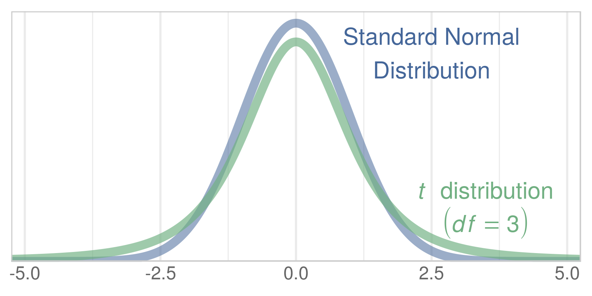
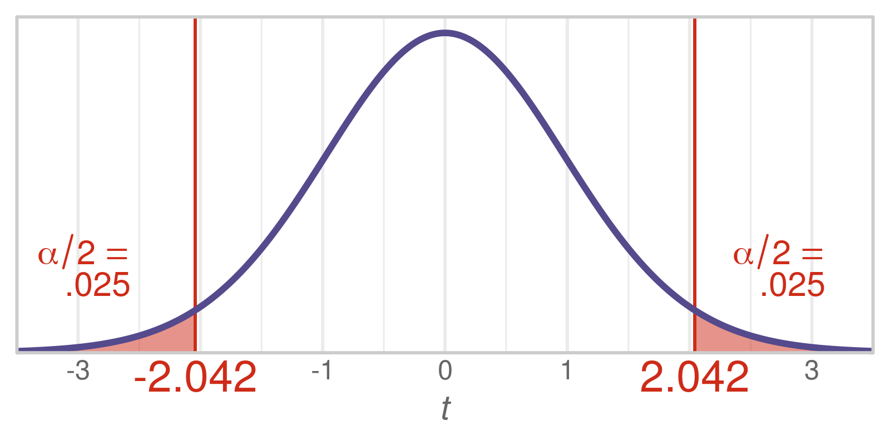
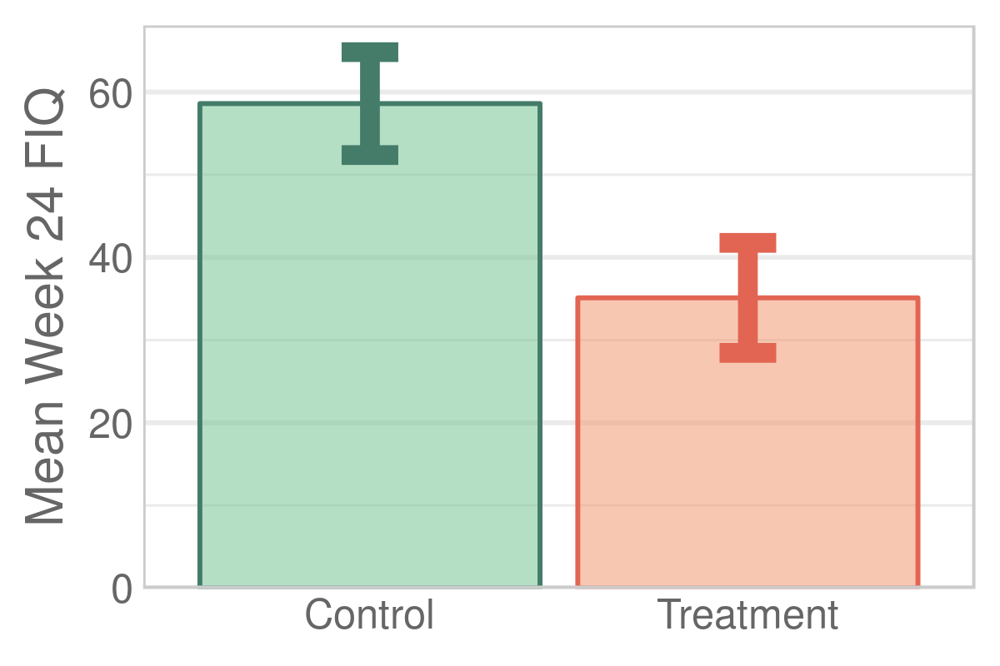

---
output:
  html_document:
    keep_md: yes
    code_folding: hide
---
Chapter 10 Graphs
=================================================
This report creates the chapter graphs.

<!--  Set the working directory to the repository's base directory; this assumes the report is nested inside of only one directory.-->


<!-- Set the report-wide options, and point to the external code file. -->

<!-- Load the packages.  Suppress the output when loading packages. -->

```r
library(magrittr) #Pipes
library(ggplot2) #For graphing
requireNamespace("dplyr")
requireNamespace("scales")
requireNamespace("readr")
```

<!-- Load any Global functions and variables declared in the R file.  Suppress the output. -->

```r
source("./common-code/book-theme.R")
calculatedPointCount <- 401*4

theme_chapter <- theme_book
```

<!-- Declare any global functions specific to a Rmd output.  Suppress the output. -->


<!-- Load the datasets. -->

```r
# 'ds' stands for 'datasets'
dsTaiChi <- readr::read_csv("./data/fibromyalgia-tai-chi.csv")
```

<!-- Tweak the datasets. -->


## Figure 10-1

```r
paletteZTDark <- c("#446699", "#70af81") #http://colrd.com/palette/28063/
paletteZTLight <- c("#44669988", "#70af81AA") #http://colrd.com/palette/28063/
ggplot(data.frame(z=-5:5), aes(x=z)) +
  stat_function(fun=dnorm, n=calculatedPointCount, color=paletteZTLight[1], size=2) +
  stat_function(fun=dt, args=list(df=3), n=calculatedPointCount, color=paletteZTLight[2], size=2) +
  annotate(geom="text", x=2.5, y=.4, label="Standard Normal\nDistribution", vjust=1.1, parse=F, color=paletteZTDark[1], size=4) +
  annotate(geom="text", x=3.5, y=.1, label="italic(t)*phantom(0)*distribution", vjust=-.15, parse=TRUE, color=paletteZTDark[2], size=4) +
  annotate(geom="text", x=3.5, y=.1, label="(italic(df)==3)", vjust=1.15, parse=TRUE, color=paletteZTDark[2], size=4) +
  scale_x_continuous(expand=c(0,0)) +
  scale_y_continuous(breaks=NULL, expand=c(0,0)) +
  expand_limits(x=c(-5, 5) * 1.05, y=dnorm(0) * 1.05) +
  theme_chapter +
  labs(x=NULL, y=NULL)
```



## Figure 10-3

```r
t30 <- function( t ) { return( dt(x=t, df=30) ) }
critT30 <- qt(p=.975, df=30) #The value in the right tail.

# critLabelLeft <- as.character(as.expression(substitute(italic(t)[crit]==tCritLeft, list(tCritLeft=round(critT30, 3)))))
# critLabelRight <- as.character(as.expression(substitute(tCritRight==italic(t)[crit], list(tCritRight=round(-critT30, 3)))))

gCritical <- ggplot(data.frame(t=-3.5:3.5), aes(x=t)) +
#   stat_function(fun=LimitRange(dnorm, criticalZ05, Inf), geom="area", color=PaletteCritical[2], fill=PaletteCriticalLight[2], n=calculatedPointCount)

  stat_function(fun=LimitRange(t30, -Inf, -critT30), geom="area", fill=PaletteCriticalLight[2], n=calculatedPointCount, na.rm=T) +
  stat_function(fun=LimitRange(t30, critT30, Inf), geom="area", fill=PaletteCriticalLight[2], n=calculatedPointCount, na.rm=T) +
  annotate("segment", x=c(-1,1)*critT30, xend=c(-1,1)*critT30, y=0, yend=Inf, color=PaletteCritical[2]) +
  stat_function(fun=t30, n=calculatedPointCount, color=PaletteCritical[1], size=1, na.rm=T) +
  annotate(geom="text", x=c(-1,1)*critT30+c(-1,1)*.8, y=t30(critT30)+.05, label="alpha/2==phantom(0)", hjust=.5, vjust=-.05, parse=TRUE, color=PaletteCritical[2]) +
  annotate(geom="text", x=c(-1,1)*critT30+c(-1,1)*.8, y=t30(critT30)+.05, label=".025", hjust=.5, vjust=1.05, parse=F, color=PaletteCritical[2]) +
  annotate(geom="text", x=c(-1,1)*critT30, y=0, label=round(c(-1,1)*critT30, 3), hjust=.5, vjust=1.2, parse=F, color=PaletteCritical[2], size=5) +
  scale_x_continuous(expand=c(0,0), breaks=-3:3, labels=c("-3", "", "-1", "0", "1", "", "3")) +
  scale_y_continuous(breaks=NULL, expand=c(0,0)) +
  expand_limits(y=t30(0) * 1.05) +
  theme_chapter +
  labs(x=expression(italic(t)), y=NULL)

DrawWithoutPanelClipping(gCritical)
```



## Figure 10-4

```r
dsTaiChiSummary     <- dsTaiChi %>% 
  dplyr::group_by(Group) %>% 
  dplyr::summarize(
    M         = mean(FiqT2), 
    SD        = sd(FiqT2), 
    Count     = sum(!is.na(FiqT2))
  ) %>% 
  dplyr::ungroup() %>% 
  dplyr::mutate(
    SE        = SD / sqrt(Count),
    Crit      = qt(p=.975, df=Count-1),
    Upper     = M + Crit * SE,
    Lower     = M - Crit * SE
  )

# dsTaiChiSummary <- plyr::ddply(dsTaiChi, .variables="Group", summarize, M=mean(FiqT2), SD=sd(FiqT2), Count=sum(!is.na(FiqT2)))
# dsTaiChiSummary$SE <- dsTaiChiSummary$SD / sqrt(dsTaiChiSummary$Count)
# dsTaiChiSummary$Crit <- qt(p=.975, df=dsTaiChiSummary$Count-1)
# dsTaiChiSummary$Upper <- dsTaiChiSummary$M + dsTaiChiSummary$Crit * dsTaiChiSummary$SE
# dsTaiChiSummary$Lower <- dsTaiChiSummary$M - dsTaiChiSummary$Crit * dsTaiChiSummary$SE

paletteTaiChiDark <- c(Control="#447c69", Treatment="#e16552") #http://colrd.com/palette/28063/
paletteTaiChiLight <- c(Control="#74c49388", Treatment="#f1967088") #http://colrd.com/palette/28063/
ggplot(dsTaiChiSummary, aes(x=Group, y=M, color=Group, fill=Group, ymin=Lower, ymax=Upper)) +
  geom_bar(stat="identity") +
  geom_errorbar(width=.15, size=2) +
  scale_y_continuous(expand=c(0,0)) +
  scale_color_manual(values=paletteTaiChiDark) +
  scale_fill_manual(values= paletteTaiChiLight) +
  coord_cartesian(ylim=c(0, max(dsTaiChiSummary$Upper) *1.05)) +
  theme_chapter +
  theme(legend.position="none") +
  theme(panel.grid.major.x = element_blank()) +
  labs(x=NULL, y="Mean Week 24 FIQ")
```



```r
m <- lm(FiqT2 ~ 1 + Group, data=dsTaiChi )
summary(m)
```

```

Call:
lm(formula = FiqT2 ~ 1 + Group, data = dsTaiChi)

Residuals:
    Min      1Q  Median      3Q     Max 
-36.656 -14.785   2.175  15.339  34.722 

Coefficients:
               Estimate Std. Error t value Pr(>|t|)    
(Intercept)      58.603      3.163  18.529  < 2e-16 ***
GroupTreatment  -23.499      4.473  -5.254 1.82e-06 ***
---
Signif. codes:  0 '***' 0.001 '**' 0.01 '*' 0.05 '.' 0.1 ' ' 1

Residual standard error: 18.17 on 64 degrees of freedom
Multiple R-squared:  0.3013,	Adjusted R-squared:  0.2904 
F-statistic:  27.6 on 1 and 64 DF,  p-value: 1.822e-06
```

```r
dsTaiChiSummary
```

```
# A tibble: 2 x 8
  Group         M    SD Count    SE  Crit Upper Lower
  <chr>     <dbl> <dbl> <int> <dbl> <dbl> <dbl> <dbl>
1 Control    58.6  17.6    33  3.06  2.04  64.8  52.4
2 Treatment  35.1  18.8    33  3.27  2.04  41.8  28.5
```

<!-- The footer that's common to all reports. -->

## Session Information

For the sake of documentation and reproducibility, the current report was rendered in the following environment.  Click the line below to expand.

<details>
  <summary>Environment <span class="glyphicon glyphicon-plus-sign"></span></summary>

```
- Session info ---------------------------------------------------------------
 setting  value                                      
 version  R version 3.5.1 Patched (2018-09-10 r75281)
 os       Windows >= 8 x64                           
 system   x86_64, mingw32                            
 ui       RStudio                                    
 language (EN)                                       
 collate  English_United States.1252                 
 ctype    English_United States.1252                 
 tz       America/Chicago                            
 date     2018-10-25                                 

- Packages -------------------------------------------------------------------
 package      * version    date       lib source                          
 assertthat     0.2.0      2017-04-11 [1] CRAN (R 3.5.0)                  
 backports      1.1.2      2017-12-13 [1] CRAN (R 3.5.0)                  
 base64enc      0.1-3      2015-07-28 [1] CRAN (R 3.5.0)                  
 bindr          0.1.1      2018-03-13 [1] CRAN (R 3.5.0)                  
 bindrcpp       0.2.2      2018-03-29 [1] CRAN (R 3.5.0)                  
 callr          3.0.0      2018-08-24 [1] CRAN (R 3.5.1)                  
 cli            1.0.1      2018-09-25 [1] CRAN (R 3.5.1)                  
 colorspace     1.3-2      2016-12-14 [1] CRAN (R 3.5.0)                  
 crayon         1.3.4      2017-09-16 [1] CRAN (R 3.5.0)                  
 debugme        1.1.0      2017-10-22 [1] CRAN (R 3.5.0)                  
 desc           1.2.0      2018-05-01 [1] CRAN (R 3.5.0)                  
 devtools       2.0.0      2018-10-19 [1] CRAN (R 3.5.1)                  
 dichromat      2.0-0      2013-01-24 [1] CRAN (R 3.5.0)                  
 digest         0.6.18     2018-10-10 [1] CRAN (R 3.5.1)                  
 dplyr          0.7.7      2018-10-16 [1] CRAN (R 3.5.1)                  
 epade          0.3.8      2013-02-22 [1] CRAN (R 3.5.1)                  
 evaluate       0.12       2018-10-09 [1] CRAN (R 3.5.1)                  
 extrafont      0.17       2014-12-08 [1] CRAN (R 3.5.0)                  
 extrafontdb    1.0        2012-06-11 [1] CRAN (R 3.5.0)                  
 fansi          0.4.0      2018-10-05 [1] CRAN (R 3.5.1)                  
 fs             1.2.6      2018-08-23 [1] CRAN (R 3.5.1)                  
 ggplot2      * 3.0.0      2018-07-03 [1] CRAN (R 3.5.1)                  
 glue           1.3.0      2018-07-17 [1] CRAN (R 3.5.1)                  
 gridExtra      2.3        2017-09-09 [1] CRAN (R 3.5.0)                  
 gtable         0.2.0      2016-02-26 [1] CRAN (R 3.5.0)                  
 hms            0.4.2.9001 2018-08-09 [1] Github (tidyverse/hms@979286f)  
 htmltools      0.3.6      2017-04-28 [1] CRAN (R 3.5.0)                  
 knitr        * 1.20       2018-02-20 [1] CRAN (R 3.5.0)                  
 labeling       0.3        2014-08-23 [1] CRAN (R 3.5.0)                  
 lazyeval       0.2.1      2017-10-29 [1] CRAN (R 3.5.0)                  
 magrittr     * 1.5        2014-11-22 [1] CRAN (R 3.5.0)                  
 memoise        1.1.0      2017-04-21 [1] CRAN (R 3.5.0)                  
 munsell        0.5.0      2018-06-12 [1] CRAN (R 3.5.0)                  
 packrat        0.4.9-3    2018-06-01 [1] CRAN (R 3.5.0)                  
 pacman         0.5.0      2018-10-22 [1] CRAN (R 3.5.1)                  
 pillar         1.3.0      2018-07-14 [1] CRAN (R 3.5.1)                  
 pkgbuild       1.0.2      2018-10-16 [1] CRAN (R 3.5.1)                  
 pkgconfig      2.0.2      2018-08-16 [1] CRAN (R 3.5.1)                  
 pkgload        1.0.1      2018-10-11 [1] CRAN (R 3.5.1)                  
 plotrix        3.7-4      2018-10-03 [1] CRAN (R 3.5.1)                  
 plyr           1.8.4      2016-06-08 [1] CRAN (R 3.5.0)                  
 prettyunits    1.0.2      2015-07-13 [1] CRAN (R 3.5.0)                  
 processx       3.2.0      2018-08-16 [1] CRAN (R 3.5.1)                  
 ps             1.2.0      2018-10-16 [1] CRAN (R 3.5.1)                  
 purrr          0.2.5      2018-05-29 [1] CRAN (R 3.5.0)                  
 R6             2.3.0      2018-10-04 [1] CRAN (R 3.5.1)                  
 RColorBrewer   1.1-2      2014-12-07 [1] CRAN (R 3.5.0)                  
 Rcpp           0.12.19    2018-10-01 [1] CRAN (R 3.5.1)                  
 readr          1.2.0      2018-10-25 [1] Github (tidyverse/readr@69c9fd3)
 remotes        2.0.1      2018-10-19 [1] CRAN (R 3.5.1)                  
 rlang          0.3.0.1    2018-10-25 [1] CRAN (R 3.5.1)                  
 rmarkdown      1.10       2018-06-11 [1] CRAN (R 3.5.0)                  
 rprojroot      1.3-2      2018-01-03 [1] CRAN (R 3.5.0)                  
 Rttf2pt1       1.3.7      2018-06-29 [1] CRAN (R 3.5.0)                  
 scales         1.0.0      2018-08-09 [1] CRAN (R 3.5.1)                  
 sessioninfo    1.1.0      2018-09-25 [1] CRAN (R 3.5.1)                  
 stringi        1.2.4      2018-07-20 [1] CRAN (R 3.5.1)                  
 stringr        1.3.1      2018-05-10 [1] CRAN (R 3.5.0)                  
 testthat       2.0.1      2018-10-13 [1] CRAN (R 3.5.1)                  
 tibble         1.4.2      2018-01-22 [1] CRAN (R 3.5.0)                  
 tidyr          0.8.1      2018-05-18 [1] CRAN (R 3.5.0)                  
 tidyselect     0.2.5      2018-10-11 [1] CRAN (R 3.5.1)                  
 usethis        1.4.0      2018-08-14 [1] CRAN (R 3.5.1)                  
 utf8           1.1.4      2018-05-24 [1] CRAN (R 3.5.0)                  
 wesanderson    0.3.6      2018-04-20 [1] CRAN (R 3.5.1)                  
 withr          2.1.2      2018-03-15 [1] CRAN (R 3.5.0)                  
 yaml           2.2.0      2018-07-25 [1] CRAN (R 3.5.1)                  

[1] D:/Projects/RLibraries
[2] D:/Users/Will/Documents/R/win-library/3.5
[3] C:/Program Files/R/R-3.5.1patched/library
```
</details>


Report rendered by Will at 2018-10-25, 13:03 -0500 in 2 seconds.


## License

<a rel="license" href="http://creativecommons.org/licenses/by/3.0/"></a><br />This work is licensed under a <a rel="license" href="http://creativecommons.org/licenses/by/3.0/">Creative Commons Attribution 3.0 Unported License</a>.
