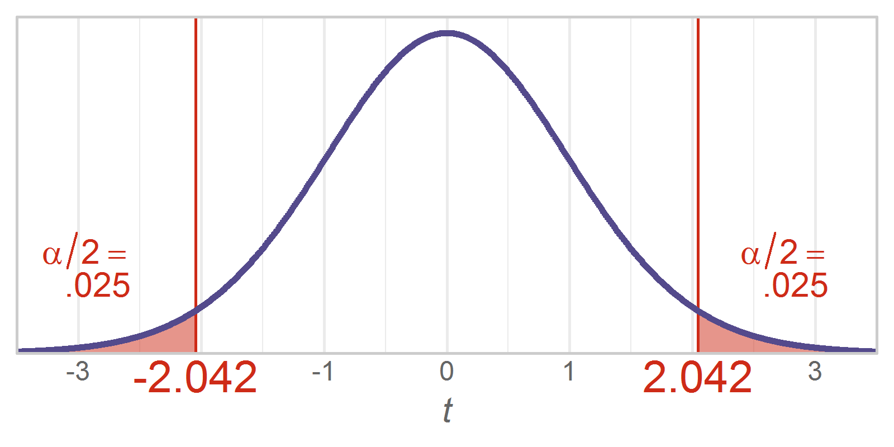

Chapter 10 Graphs
=================================================
This report creates the chapter graphs.

<!--  Set the working directory to the repository's base directory; this assumes the report is nested inside of only one directory.-->


<!-- Set the report-wide options, and point to the external code file. -->

<!-- Load the packages.  Suppress the output when loading packages. --> 


<!-- Load any Global functions and variables declared in the R file.  Suppress the output. --> 


<!-- Declare any global functions specific to a Rmd output.  Suppress the output. --> 


<!-- Load the datasets. -->


<!-- Tweak the datasets. -->


## Figure 10-1


## Figure 10-3


## Figure 10-4


```

Call:
lm(formula = FiqT2 ~ 1 + Group, data = dsTaiChi)

Residuals:
    Min      1Q  Median      3Q     Max 
-36.656 -14.785   2.175  15.339  34.722 

Coefficients:
               Estimate Std. Error t value Pr(>|t|)    
(Intercept)      58.603      3.163  18.529  < 2e-16 ***
GroupTreatment  -23.499      4.473  -5.254 1.82e-06 ***
---
Signif. codes:  0 '***' 0.001 '**' 0.01 '*' 0.05 '.' 0.1 ' ' 1

Residual standard error: 18.17 on 64 degrees of freedom
Multiple R-squared:  0.3013,	Adjusted R-squared:  0.2904 
F-statistic:  27.6 on 1 and 64 DF,  p-value: 1.822e-06
```

```
      Group        M       SD Count       SE     Crit    Upper    Lower
1   Control 58.60293 17.55669    33 3.056227 2.036933 64.82826 52.37760
2 Treatment 35.10441 18.76076    33 3.265830 2.036933 41.75669 28.45213
```

## Session Info
For the sake of documentation and reproducibility, the current report was build on a system using the following software.


```
Report created by wibeasley at 2017-04-01, 23:01 -0500
```

```
R version 3.3.3 (2017-03-06)
Platform: x86_64-pc-linux-gnu (64-bit)
Running under: Ubuntu 16.04.2 LTS

locale:
 [1] LC_CTYPE=en_US.UTF-8       LC_NUMERIC=C               LC_TIME=en_US.UTF-8        LC_COLLATE=en_US.UTF-8    
 [5] LC_MONETARY=en_US.UTF-8    LC_MESSAGES=en_US.UTF-8    LC_PAPER=en_US.UTF-8       LC_NAME=C                 
 [9] LC_ADDRESS=C               LC_TELEPHONE=C             LC_MEASUREMENT=en_US.UTF-8 LC_IDENTIFICATION=C       

attached base packages:
[1] grid      stats     graphics  grDevices utils     datasets  methods   base     

other attached packages:
[1] RColorBrewer_1.1-2 dichromat_2.0-0    extrafont_0.17     ggplot2_2.2.1      scales_0.4.1       plyr_1.8.4        
[7] knitr_1.15.1      

loaded via a namespace (and not attached):
 [1] Rcpp_0.12.10         Rttf2pt1_1.3.4       magrittr_1.5         munsell_0.4.3        colorspace_1.3-2    
 [6] stringr_1.2.0        tools_3.3.3          gtable_0.2.0         extrafontdb_1.0      htmltools_0.3.5     
[11] yaml_2.1.14          lazyeval_0.2.0       rprojroot_1.2        digest_0.6.12        tibble_1.3.0        
[16] evaluate_0.10        rmarkdown_1.4.0.9000 labeling_0.3         stringi_1.1.3        backports_1.0.5     
```

## License

<a rel="license" href="http://creativecommons.org/licenses/by/3.0/"></a><br />This work is licensed under a <a rel="license" href="http://creativecommons.org/licenses/by/3.0/">Creative Commons Attribution 3.0 Unported License</a>.
