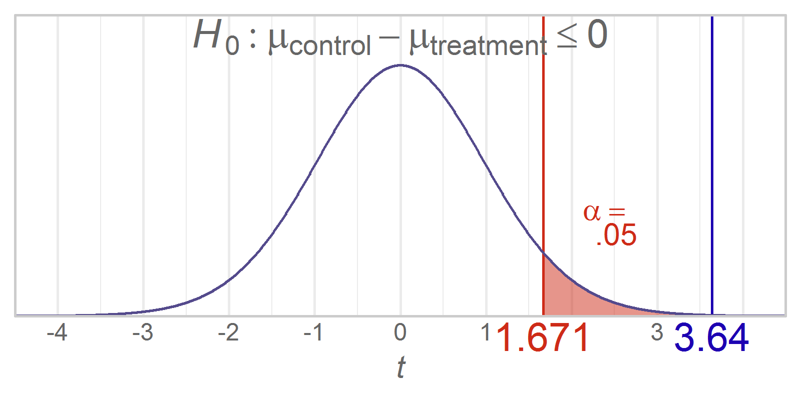

Chapter 11 Graphs
=================================================
This report creates the chapter graphs.

<!--  Set the working directory to the repository's base directory; this assumes the report is nested inside of only one directory.-->


<!-- Set the report-wide options, and point to the external code file. -->

<!-- Load the packages.  Suppress the output when loading packages. --> 


<!-- Load any Global functions and variables declared in the R file.  Suppress the output. --> 


<!-- Declare any global functions specific to a Rmd output.  Suppress the output. --> 


<!-- Load the datasets. -->


<!-- Tweak the datasets. -->


## Figure 11-1


## Figure 11-2


## Figure 11-3


## Session Info
For the sake of documentation and reproducibility, the current report was build on a system using the following software.


```
Report created by wibeasley at 2017-04-01, 21:32 -0500
```

```
R version 3.3.3 (2017-03-06)
Platform: x86_64-pc-linux-gnu (64-bit)
Running under: Ubuntu 16.04.2 LTS

locale:
 [1] LC_CTYPE=en_US.UTF-8       LC_NUMERIC=C               LC_TIME=en_US.UTF-8        LC_COLLATE=en_US.UTF-8    
 [5] LC_MONETARY=en_US.UTF-8    LC_MESSAGES=en_US.UTF-8    LC_PAPER=en_US.UTF-8       LC_NAME=C                 
 [9] LC_ADDRESS=C               LC_TELEPHONE=C             LC_MEASUREMENT=en_US.UTF-8 LC_IDENTIFICATION=C       

attached base packages:
[1] grid      stats     graphics  grDevices utils     datasets  methods   base     

other attached packages:
 [1] rgl_0.98.1         mnormt_1.5-5       MASS_7.3-45        ggthemes_3.4.0     gridExtra_2.2.1    wesanderson_0.3.2 
 [7] dichromat_2.0-0    extrafont_0.17     epade_0.3.8        plotrix_3.6-4      reshape2_1.4.2     ggplot2_2.2.1     
[13] scales_0.4.1       plyr_1.8.4         RColorBrewer_1.1-2 knitr_1.15.1      

loaded via a namespace (and not attached):
 [1] Rcpp_0.12.10         highr_0.6            tools_3.3.3          digest_0.6.12        jsonlite_1.3        
 [6] evaluate_0.10        tibble_1.3.0         gtable_0.2.0         shiny_1.0.1          yaml_2.1.14         
[11] Rttf2pt1_1.3.4       stringr_1.2.0        htmlwidgets_0.8      rprojroot_1.2        R6_2.2.0            
[16] rmarkdown_1.4.0.9000 extrafontdb_1.0      magrittr_1.5         backports_1.0.5      htmltools_0.3.5     
[21] rsconnect_0.7        assertthat_0.1       xtable_1.8-2         mime_0.5             colorspace_1.3-2    
[26] httpuv_1.3.3         labeling_0.3         stringi_1.1.3        lazyeval_0.2.0       munsell_0.4.3       
```

## License

<a rel="license" href="http://creativecommons.org/licenses/by/3.0/"></a><br />This work is licensed under a <a rel="license" href="http://creativecommons.org/licenses/by/3.0/">Creative Commons Attribution 3.0 Unported License</a>.
