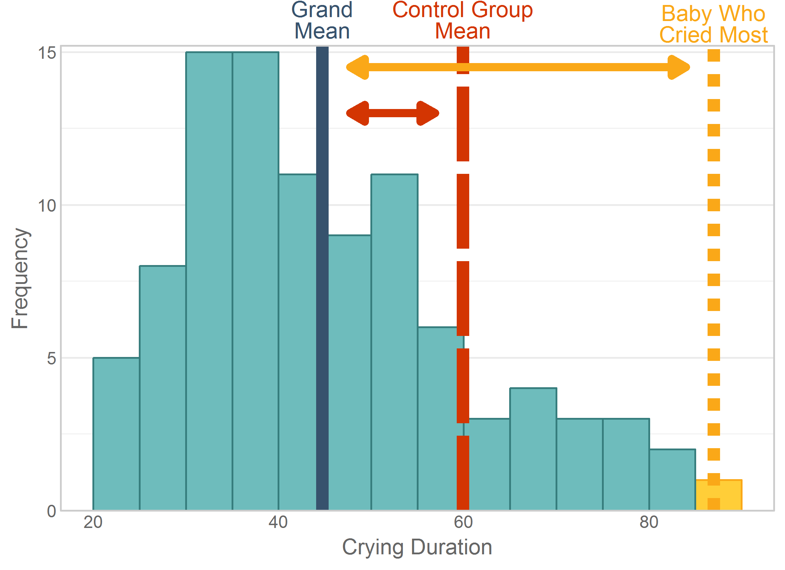
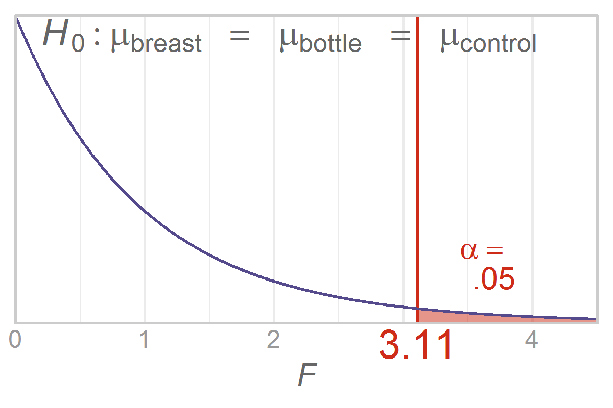

Chapter 12 Graphs
=================================================
This report creates the chapter graphs.

<!--  Set the working directory to the repository's base directory; this assumes the report is nested inside of only one directory.-->


<!-- Set the report-wide options, and point to the external code file. -->

<!-- Load the packages.  Suppress the output when loading packages. --> 


<!-- Load any Global functions and variables declared in the R file.  Suppress the output. --> 


<!-- Declare any global functions specific to a Rmd output.  Suppress the output. --> 


<!-- Load the datasets. -->


<!-- Tweak the datasets. -->

```
#####  ANOVAs for Feeding dataset #####
```

```

Call:
lm(formula = Sleep ~ 1 + Feeding, data = dsFeed[dsFeed$ScenarioID == 
    1, ])

Residuals:
    Min      1Q  Median      3Q     Max 
-32.952 -16.747  -1.703  10.159  37.141 

Coefficients:
                Estimate Std. Error t value Pr(>|t|)    
(Intercept)    3.000e+02  5.164e+00   58.09   <2e-16 ***
FeedingBottle -1.036e-13  7.303e+00    0.00        1    
FeedingBoth   -1.017e-13  7.303e+00    0.00        1    
---
Signif. codes:  0 '***' 0.001 '**' 0.01 '*' 0.05 '.' 0.1 ' ' 1

Residual standard error: 20 on 42 degrees of freedom
Multiple R-squared:  2.712e-29,	Adjusted R-squared:  -0.04762 
F-statistic: 5.695e-28 on 2 and 42 DF,  p-value: 1
```

```

Call:
lm(formula = Sleep ~ 1 + Feeding, data = dsFeed[dsFeed$ScenarioID == 
    2, ])

Residuals:
    Min      1Q  Median      3Q     Max 
-32.952 -16.747  -1.703  10.159  37.141 

Coefficients:
                Estimate Std. Error t value Pr(>|t|)    
(Intercept)    3.000e+02  5.164e+00   58.09   <2e-16 ***
FeedingBottle -1.348e-13  7.303e+00    0.00        1    
FeedingBoth    1.000e+02  7.303e+00   13.69   <2e-16 ***
---
Signif. codes:  0 '***' 0.001 '**' 0.01 '*' 0.05 '.' 0.1 ' ' 1

Residual standard error: 20 on 42 degrees of freedom
Multiple R-squared:  0.8562,	Adjusted R-squared:  0.8493 
F-statistic:   125 on 2 and 42 DF,  p-value: < 2.2e-16
```

```

Call:
lm(formula = Sleep ~ 1 + Feeding, data = dsFeed[dsFeed$ScenarioID == 
    3, ])

Residuals:
    Min      1Q  Median      3Q     Max 
-214.19 -108.86  -11.07   66.03  241.42 

Coefficients:
               Estimate Std. Error t value Pr(>|t|)    
(Intercept)   3.000e+02  3.357e+01   8.938 2.87e-11 ***
FeedingBottle 6.291e-14  4.747e+01   0.000   1.0000    
FeedingBoth   1.000e+02  4.747e+01   2.107   0.0412 *  
---
Signif. codes:  0 '***' 0.001 '**' 0.01 '*' 0.05 '.' 0.1 ' ' 1

Residual standard error: 130 on 42 degrees of freedom
Multiple R-squared:  0.1235,	Adjusted R-squared:  0.08175 
F-statistic: 2.959 on 2 and 42 DF,  p-value: 0.06279
```

```
##### ANOVAs for Crying dataset #####
```

```

Call:
lm(formula = CryingDuration ~ 1 + Group, data = dsCry)

Residuals:
     Min       1Q   Median       3Q      Max 
-23.9062  -8.9062  -0.4531   9.0938  27.0938 

Coefficients:
             Estimate Std. Error t value Pr(>|t|)    
(Intercept)    34.000      1.962  17.333  < 2e-16 ***
GroupBottle     6.281      2.774   2.264   0.0259 *  
GroupControl   25.906      2.774   9.339 5.13e-15 ***
---
Signif. codes:  0 '***' 0.001 '**' 0.01 '*' 0.05 '.' 0.1 ' ' 1

Residual standard error: 11.1 on 93 degrees of freedom
Multiple R-squared:  0.5051,	Adjusted R-squared:  0.4945 
F-statistic: 47.46 on 2 and 93 DF,  p-value: 6.231e-15
```

## Figure 12-1
This figure will be typeset by the publisher.

## Figure 12-2


## Figure 12-3


## Figure 12-4


## Figure 12-5


## Figure 12-6


## Figure 12-7
Table of Critical *F* values.  Will be produced by publisher.

## Figure 12-8


## Figure 12-9


## Figure 12-10


## Figure 12-11


## Figure 12-12


## Figure 12-13


## Session Information
For the sake of documentation and reproducibility, the current report was rendered in the following environment.  Click the line below to expand.

<details>
  <summary>Environment <span class="glyphicon glyphicon-plus-sign"></span></summary>

```
Session info -------------------------------------------------------------------
```

```
 setting  value                       
 version  R version 3.3.3 (2017-03-06)
 system   x86_64, linux-gnu           
 ui       RStudio (1.0.136)           
 language en_US                       
 collate  en_US.UTF-8                 
 tz       America/Chicago             
 date     2017-04-02                  
```

```
Packages -----------------------------------------------------------------------
```

```
 package      * version    date       source                            
 assertthat     0.1        2013-12-06 CRAN (R 3.3.0)                    
 backports      1.0.5      2017-01-18 CRAN (R 3.3.1)                    
 colorspace     1.3-2      2016-12-14 CRAN (R 3.3.1)                    
 DBI            0.6        2017-03-09 CRAN (R 3.3.1)                    
 devtools       1.12.0     2016-06-24 CRAN (R 3.3.1)                    
 dichromat      2.0-0      2013-01-24 CRAN (R 3.3.0)                    
 digest         0.6.12     2017-01-27 CRAN (R 3.3.1)                    
 dplyr          0.5.0      2016-06-24 CRAN (R 3.3.3)                    
 epade        * 0.3.8      2013-02-22 CRAN (R 3.3.3)                    
 evaluate       0.10       2016-10-11 CRAN (R 3.3.1)                    
 extrafont      0.17       2014-12-08 CRAN (R 3.3.0)                    
 extrafontdb    1.0        2012-06-11 CRAN (R 3.3.0)                    
 ggplot2      * 2.2.1      2016-12-30 CRAN (R 3.3.1)                    
 gridExtra      2.2.1      2016-02-29 CRAN (R 3.3.0)                    
 gtable         0.2.0      2016-02-26 CRAN (R 3.3.0)                    
 hms            0.3        2016-11-22 CRAN (R 3.3.1)                    
 htmltools      0.3.5      2016-03-21 CRAN (R 3.3.0)                    
 htmlwidgets    0.8        2016-11-09 CRAN (R 3.3.1)                    
 httpuv         1.3.3      2015-08-04 CRAN (R 3.3.0)                    
 jsonlite       1.3        2017-02-28 CRAN (R 3.3.1)                    
 knitr        * 1.15.1     2016-11-22 CRAN (R 3.3.1)                    
 labeling       0.3        2014-08-23 CRAN (R 3.3.0)                    
 lazyeval       0.2.0      2016-06-12 CRAN (R 3.3.0)                    
 magrittr     * 1.5        2014-11-22 CRAN (R 3.3.0)                    
 memoise        1.0.0      2016-01-29 CRAN (R 3.3.0)                    
 mime           0.5        2016-07-07 CRAN (R 3.3.1)                    
 mnormt         1.5-5      2016-10-15 CRAN (R 3.3.1)                    
 munsell        0.4.3      2016-02-13 CRAN (R 3.3.0)                    
 plotrix      * 3.6-4      2016-12-30 CRAN (R 3.3.3)                    
 plyr           1.8.4      2016-06-08 CRAN (R 3.3.0)                    
 R6             2.2.0      2016-10-05 CRAN (R 3.3.1)                    
 RColorBrewer * 1.1-2      2014-12-07 CRAN (R 3.3.0)                    
 Rcpp           0.12.10    2017-03-19 CRAN (R 3.3.1)                    
 readr          1.1.0      2017-03-22 CRAN (R 3.3.3)                    
 reshape2       1.4.2      2016-10-22 CRAN (R 3.3.1)                    
 rgl            0.98.1     2017-03-08 CRAN (R 3.3.1)                    
 rmarkdown      1.4.0.9000 2017-04-01 Github (rstudio/rmarkdown@5f7cd3c)
 rprojroot      1.2        2017-01-16 CRAN (R 3.3.1)                    
 rstudioapi     0.6        2016-06-27 CRAN (R 3.3.1)                    
 Rttf2pt1       1.3.4      2016-05-19 CRAN (R 3.3.0)                    
 scales         0.4.1      2016-11-09 CRAN (R 3.3.1)                    
 shiny          1.0.1      2017-04-01 CRAN (R 3.3.3)                    
 stringi        1.1.3      2017-03-21 CRAN (R 3.3.1)                    
 stringr        1.2.0      2017-02-18 CRAN (R 3.3.1)                    
 tibble         1.3.0      2017-04-01 CRAN (R 3.3.3)                    
 tidyr          0.6.1      2017-01-10 CRAN (R 3.3.1)                    
 wesanderson  * 0.3.2      2015-01-22 CRAN (R 3.3.3)                    
 withr          1.0.2      2016-06-20 CRAN (R 3.3.0)                    
 xtable         1.8-2      2016-02-05 CRAN (R 3.3.0)                    
 yaml           2.1.14     2016-11-12 CRAN (R 3.3.1)                    
```
</details>


Report rendered by wibeasley at 2017-04-02, 15:45 -0500 in 16 seconds.


## License

<a rel="license" href="http://creativecommons.org/licenses/by/3.0/"></a><br />This work is licensed under a <a rel="license" href="http://creativecommons.org/licenses/by/3.0/">Creative Commons Attribution 3.0 Unported License</a>.
