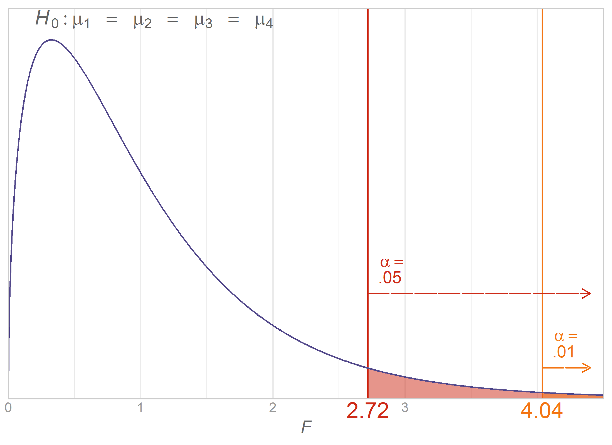
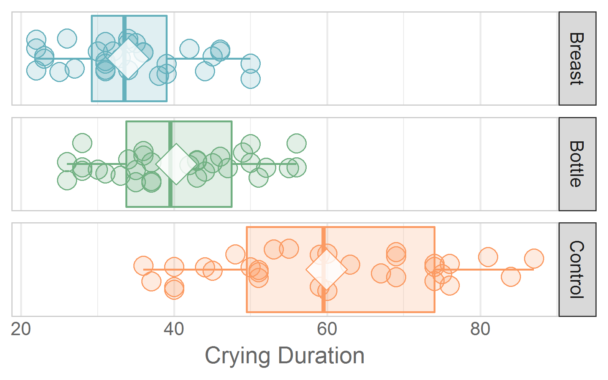

---
output:
  html_document:
    keep_md: yes
    code_folding: hide
---
Chapter 12 Graphs
=================================================
This report creates the chapter graphs.

<!--  Set the working directory to the repository's base directory; this assumes the report is nested inside of only one directory.-->


<!-- Set the report-wide options, and point to the external code file. -->

<!-- Load the packages.  Suppress the output when loading packages. -->

```r
library(magrittr) #Pipes
library(ggplot2) #For graphing
requireNamespace("dplyr")
requireNamespace("readr")
```

<!-- Load any Global functions and variables declared in the R file.  Suppress the output. -->

```r
source("./common-code/book-theme.R")
calculatedPointCount <- 401*4

theme_chapter <- theme_book
closed_boundary     <- "left"

feedingLevels <- c("Breast", "Bottle", "Both")
# paletteFeedingFull <- c("#ea573d", "#d292cd", "#fb9a62", "#fbc063", "#70af81", "#64b0bc", "#446699", "#615b70") #http://colrd.com/palette/28063/
# paletteFeeding <- paletteFeedingFull[c(6,5,3)]
paletteFeedingFull <- c("#dd0011","#f17217","#f0d214","#80da36","#2374fe","#d92bbb") #http://colrd.com/palette/22779/
paletteFeeding <- paletteFeedingFull[c(1,5,6)]
names(paletteFeeding) <- feedingLevels
paletteFeedingLight <- adjustcolor(paletteFeeding, alpha.f=.2)

cryGroupLevels <- c("Breast", "Bottle", "Control")
# paletteCryBoxFull <- c("#dd0011","#f17217","#f0d214","#80da36","#2374fe","#d92bbb") #http://colrd.com/palette/22779/
# paletteCryBox <- paletteCryBoxFull[c(1,5,6)]
paletteCryBoxFull <- c("#ea573d", "#d292cd", "#fb9a62", "#fbc063", "#70af81", "#64b0bc", "#446699", "#615b70") #http://colrd.com/palette/28063/
paletteCryBox <- paletteCryBoxFull[c(6,5,3)]
names(paletteCryBox) <- cryGroupLevels
paletteCryBoxLight <- adjustcolor(paletteCryBox, alpha.f=.2)

AnovaSingleScenario <- function( scenarioID, scenarioName, yLimit=4.8 ) {
  dsPlot <- dsFeed[dsFeed$ScenarioID==scenarioID, ]
  dsSummary <- dsScenarioFeeding[dsScenarioFeeding$ScenarioID==scenarioID, ]

  ggplot(dsPlot, aes(x=Sleep, color=Feeding, fill=Feeding)) +
    geom_histogram(binwidth=10)  +
    geom_vline(aes(xintercept=M), data=dsSummary, size=2, color="#55555544")  +
    geom_text(data=dsSummary, aes(x=M, y=Inf, label=LabelM), color="gray40", vjust=1.2, hjust=1.1, size=3, parse=TRUE) +
    geom_text(data=dsSummary, aes(x=M, y=Inf, label=LabelSD), color="gray40", vjust=1.2, hjust=-.1, size=3, parse=TRUE) +
    scale_x_continuous(expand=c(0, 0)) +
    scale_y_continuous(limits=c(0, yLimit), expand=c(0, 0)) +
    scale_color_manual(values=paletteFeeding) +
    scale_fill_manual(values=paletteFeedingLight) +
    coord_cartesian(xlim=rangeSleep) +
    facet_grid(Feeding ~ .) +
    theme_chapter +
    theme(legend.position="none") +
    labs(x="Minutes of sleep in 24 hours", y="Frequency", title=scenarioName)
}
```

<!-- Declare any global functions specific to a Rmd output.  Suppress the output. -->


<!-- Load the datasets. -->

```r
# 'ds' stands for 'datasets'
dsFeed    <- readr::read_csv("./data/breastfeeding-sleep-fake.csv"  )
dsCry     <- readr::read_csv("./data/infant-crying-fake.csv"        )
```

<!-- Tweak the datasets. -->

```r
dsFeed$Feeding <- factor(dsFeed$Feeding, levels=feedingLevels)
rangeSleep <- range(dsFeed$Sleep)
rangeSleep <- c(220, 580) - 50

dsCry$Group <- factor(dsCry$Group, levels=cryGroupLevels)

cat("#####  ANOVAs for Feeding dataset #####")
```

```
#####  ANOVAs for Feeding dataset #####
```

```r
mScenario1 <- lm(Sleep ~ 1 + Feeding, data=dsFeed[dsFeed$ScenarioID==1, ] )
mScenario2 <- lm(Sleep ~ 1 + Feeding, data=dsFeed[dsFeed$ScenarioID==2, ] )
mScenario3 <- lm(Sleep ~ 1 + Feeding, data=dsFeed[dsFeed$ScenarioID==3, ] )
summary(mScenario1)
```

```

Call:
lm(formula = Sleep ~ 1 + Feeding, data = dsFeed[dsFeed$ScenarioID == 
    1, ])

Residuals:
    Min      1Q  Median      3Q     Max 
-32.952 -16.747  -1.703  10.159  37.141 

Coefficients:
               Estimate Std. Error t value Pr(>|t|)    
(Intercept)   3.000e+02  5.164e+00   58.09   <2e-16 ***
FeedingBottle 4.853e-14  7.303e+00    0.00        1    
FeedingBoth   5.886e-14  7.303e+00    0.00        1    
---
Signif. codes:  0 '***' 0.001 '**' 0.01 '*' 0.05 '.' 0.1 ' ' 1

Residual standard error: 20 on 42 degrees of freedom
Multiple R-squared:  3.039e-29,	Adjusted R-squared:  -0.04762 
F-statistic: 6.382e-28 on 2 and 42 DF,  p-value: 1
```

```r
summary(mScenario2)
```

```

Call:
lm(formula = Sleep ~ 1 + Feeding, data = dsFeed[dsFeed$ScenarioID == 
    2, ])

Residuals:
    Min      1Q  Median      3Q     Max 
-32.952 -16.747  -1.703  10.159  37.141 

Coefficients:
               Estimate Std. Error t value Pr(>|t|)    
(Intercept)   3.000e+02  5.164e+00   58.09   <2e-16 ***
FeedingBottle 2.696e-14  7.303e+00    0.00        1    
FeedingBoth   1.000e+02  7.303e+00   13.69   <2e-16 ***
---
Signif. codes:  0 '***' 0.001 '**' 0.01 '*' 0.05 '.' 0.1 ' ' 1

Residual standard error: 20 on 42 degrees of freedom
Multiple R-squared:  0.8562,	Adjusted R-squared:  0.8493 
F-statistic:   125 on 2 and 42 DF,  p-value: < 2.2e-16
```

```r
summary(mScenario3)
```

```

Call:
lm(formula = Sleep ~ 1 + Feeding, data = dsFeed[dsFeed$ScenarioID == 
    3, ])

Residuals:
    Min      1Q  Median      3Q     Max 
-214.19 -108.86  -11.07   66.03  241.42 

Coefficients:
               Estimate Std. Error t value Pr(>|t|)    
(Intercept)   3.000e+02  3.357e+01   8.938 2.87e-11 ***
FeedingBottle 3.595e-14  4.747e+01   0.000   1.0000    
FeedingBoth   1.000e+02  4.747e+01   2.107   0.0412 *  
---
Signif. codes:  0 '***' 0.001 '**' 0.01 '*' 0.05 '.' 0.1 ' ' 1

Residual standard error: 130 on 42 degrees of freedom
Multiple R-squared:  0.1235,	Adjusted R-squared:  0.08175 
F-statistic: 2.959 on 2 and 42 DF,  p-value: 0.06279
```

```r
cat("##### ANOVAs for Crying dataset #####")
```

```
##### ANOVAs for Crying dataset #####
```

```r
mCry <- lm(CryingDuration ~ 1 + Group, data=dsCry )
summary(mCry)
```

```

Call:
lm(formula = CryingDuration ~ 1 + Group, data = dsCry)

Residuals:
     Min       1Q   Median       3Q      Max 
-23.9062  -8.9062  -0.4531   9.0938  27.0938 

Coefficients:
             Estimate Std. Error t value Pr(>|t|)    
(Intercept)    34.000      1.962  17.333  < 2e-16 ***
GroupBottle     6.281      2.774   2.264   0.0259 *  
GroupControl   25.906      2.774   9.339 5.13e-15 ***
---
Signif. codes:  0 '***' 0.001 '**' 0.01 '*' 0.05 '.' 0.1 ' ' 1

Residual standard error: 11.1 on 93 degrees of freedom
Multiple R-squared:  0.5051,	Adjusted R-squared:  0.4945 
F-statistic: 47.46 on 2 and 93 DF,  p-value: 6.231e-15
```

```r
mNoIntScenario1 <- lm(Sleep ~ 0 + Feeding, data=dsFeed[dsFeed$ScenarioID==1, ] )
mNoIntScenario2 <- lm(Sleep ~ 0 + Feeding, data=dsFeed[dsFeed$ScenarioID==2, ] )
# summary(mNoIntScenario1)
# summary(mNoIntScenario2)
# dsScenarioFeeding <- plyr::ddply(dsFeed, .variables=c("Scenario", "ScenarioID", "Feeding"), .fun=summarise, M=mean(Sleep), SD=sd(Sleep))
# dsScenarioFeeding$LabelM <- paste0("italic(M)==", round(dsScenarioFeeding$M))
# dsScenarioFeeding$LabelSD <- paste0("italic(SD)==", round(dsScenarioFeeding$SD))

dsScenarioFeeding <- dsFeed %>% 
  dplyr::group_by(Scenario, ScenarioID, Feeding) %>% 
  dplyr::summarize(
    M     = mean(Sleep),
    SD    = sd(Sleep)
  ) %>% 
  dplyr::ungroup() %>% 
  dplyr::mutate(
    LabelM    = paste0("italic(M)==", round(M)),
    LabelSD   = paste0("italic(SD)==", round(SD))
  )

dsCrySummary <- dsCry %>% 
  dplyr::group_by(Group, GroupID) %>% 
  dplyr::summarize(
    M     = mean(CryingDuration),
    SD    = sd(CryingDuration)
  ) %>% 
  dplyr::ungroup() %>% 
  dplyr::mutate(
    LabelM    = paste0("italic(M)==", round(M)),
    LabelSD   = paste0("italic(SD)==", round(SD))
  )
```

## Figure 12-1
This figure will be typeset by the publisher.

## Figure 12-2


```r
AnovaSingleScenario(scenarioID=1, scenarioName="Scenario 12-A")
```


## Figure 12-3


```r
AnovaSingleScenario(scenarioID=2, scenarioName="Scenario 12-B")
```


## Figure 12-4


```r
AnovaSingleScenario(scenarioID=3, scenarioName="Scenario 12-C")
```


## Figure 12-5

```r
ggplot(dsFeed, aes(x=Sleep, color=Feeding, fill=Feeding)) +
  geom_histogram(binwidth=10)  +
  geom_vline(aes(xintercept=M), data=dsScenarioFeeding, size=2, color="#55555544")  +
  geom_text(data=dsScenarioFeeding, aes(x=M, y=Inf, label=LabelM), color="gray40", vjust=1.2, hjust=1.1, size=3, parse=TRUE) +
  geom_text(data=dsScenarioFeeding, aes(x=M, y=Inf, label=LabelSD), color="gray40", vjust=1.2, hjust=-.1, size=3, parse=TRUE) +
  scale_x_continuous(expand=c(0, 0)) +
  scale_y_continuous(limits=c(0, 4.8), expand=c(0, 0)) + #Coordinate this y limit with the previous anova function.
  scale_color_manual(values=paletteFeeding) +
  scale_fill_manual(values=paletteFeedingLight) +
  coord_cartesian(xlim=rangeSleep) +
  facet_grid(Feeding ~ Scenario) +
  theme_chapter +
  theme(legend.position="none") +
  labs(x="Minutes of sleep in 24 hours", y="Frequency", title=NULL)
```


## Figure 12-6

```r
#bb5210    #eb6c1d    #fe8011
#fe9e4c    #ffffff    #e5e5e5
#c6c6c6    #919191    #97d2f6
#63bdf2    #1e96e0    #0c65bf

# fpaletteFeedingDark <- c("#bb5210", "#0c65bf")# http://colrd.com/palette/23379/
fPaletteDark <- c("#eb6c1daa", "#1e96e0aa")# http://colrd.com/palette/23379/
fPaletteLight <- c("#fe9e4c", "#97d2f6")# http://colrd.com/palette/23379/

f1DfModel <- 2; f1DfError <- 30
f2DfModel <- 5; f2DfError <- 96

f1 <- function( x ) { return( df(x, df1=f1DfModel, df2=f1DfError) ) }
f2 <- function( x ) { return( df(x, df1=f2DfModel, df2=f2DfError) ) }

ggplot(data.frame(f=c(0, 4.5)), aes(x=f)) +
  stat_function(fun=f1, geom="area", fill=fPaletteLight[1], alpha=.3, n=calculatedPointCount, na.rm=T) +
  stat_function(fun=f2, geom="area", fill=fPaletteLight[2], alpha=.3, n=calculatedPointCount, na.rm=T) +
  stat_function(fun=f1, n=calculatedPointCount, color=fPaletteDark[1], size=2, na.rm=T) +
  stat_function(fun=f2, n=calculatedPointCount, color=fPaletteDark[2], size=2, na.rm=T) +
  annotate(geom="text", x=.1, y=f1(.1), label=paste0("italic(F)(", f1DfModel, ", ", f1DfError,")"), hjust=-.15, parse=TRUE, color=fPaletteDark[1]) +
  annotate(geom="text", x=1, y=f2(1), label=paste0("italic(F)(", f2DfModel, ", ", f2DfError,")"), hjust=-.15, parse=TRUE, color=fPaletteDark[2]) +
  scale_x_continuous(expand=c(0,0)) +
  scale_y_continuous(breaks=NULL, expand=c(0,0)) +
  expand_limits(y=f1(0) * 1.05) +
  theme_chapter +
  labs(x=expression(italic(F)), y=NULL)
```


## Figure 12-7
Table of Critical *F* values.  Will be produced by publisher.

## Figure 12-8

```r
PaletteCritical <- c("#544A8C", "#ce2b18", "#F37615") #Adapted from http://colrd.com/palette/17511/ (I made the purple lighter and the orange darker)

f3DfModel <- 3; f3DfError <- 80
f3 <- function( x ) { return( df(x, df1=f3DfModel, df2=f3DfError) ) }
criticalF05 <- qf(p=.95, df1=f3DfModel, df2=f3DfError)
criticalF01 <- qf(p=.99, df1=f3DfModel, df2=f3DfError)

###
### Together
###
grid::grid.newpage()
gCritical <- ggplot(data.frame(f=c(0, 4.5)), aes(x=f)) +
  annotate("segment", x=criticalF05, xend=criticalF05, y=0, yend=Inf, color=PaletteCritical[2]) +
  annotate("segment", x=criticalF01, xend=criticalF01, y=0, yend=Inf, color=PaletteCritical[3]) +
  stat_function(fun=LimitRange(f3, criticalF05, Inf), geom="area", fill=PaletteCriticalLight[2], n=calculatedPointCount, na.rm=T) +
  stat_function(fun=LimitRange(f3, criticalF01, Inf), geom="area", fill=PaletteCriticalLight[3], n=calculatedPointCount, na.rm=T) +
  stat_function(fun=f3, n=calculatedPointCount, color=PaletteCritical[1], size=.5) +
  annotate(geom="text", x=criticalF05+.05, y=f3(criticalF05)+.20, label="alpha==phantom(0)", hjust=-.15, vjust=-.15, parse=TRUE, color=PaletteCritical[2]) +
  annotate(geom="text", x=criticalF05+.05, y=f3(criticalF05)+.20, label=".05", hjust=-.15, vjust=1.15, parse=F, color=PaletteCritical[2]) +

  annotate(geom="text", x=criticalF01+.05, y=f3(criticalF01)+.10, label="alpha==phantom(0)", hjust=-.15, vjust=-.15, parse=TRUE, color=PaletteCritical[3]) +
  annotate(geom="text", x=criticalF01+.05, y=f3(criticalF01)+.10, label=".01", hjust=-.15, vjust=1.15, parse=F, color=PaletteCritical[3]) +

  annotate("segment", x=criticalF05, xend=4.4, y=f3(criticalF05)+.15, yend=f3(criticalF05)+.15, color=PaletteCritical[2], arrow=arrow(length=grid::unit(0.2, "cm"), type="open"), lineend="round", linetype="F2") +
  annotate("segment", x=criticalF01, xend=4.4, y=f3(criticalF01)+.05, yend=f3(criticalF01)+.05, color=PaletteCritical[3], arrow=arrow(length=grid::unit(0.2, "cm"), type="open"), lineend="round", linetype="F2") +

  annotate(geom="text", x=criticalF05, y=0, label=round(criticalF05, 2), hjust=.5, vjust=1.2, color=PaletteCritical[2], size=5) +
  annotate(geom="text", x=criticalF01, y=0, label=round(criticalF01, 2), hjust=.5, vjust=1.2, color=PaletteCritical[3], size=5) +

#   annotate("text", label="italic(H)[0]: no*phantom(0)*difference*phantom(0)*between*phantom(0)*mu*phantom(0)*values", x=.2, y=Inf, parse=T, size=5, hjust = 0, vjust=1.08, color="gray40") +
  annotate("text", label="italic(H)[0]: paste(mu[1]*phantom(0)==phantom(0),mu[2]*phantom(0)==phantom(0),mu[3]*phantom(0)==phantom(0)*mu[4])", x=.2, y=Inf, parse=T, size=4.5, hjust = 0, vjust=1.08, color="gray40") +


  scale_x_continuous(expand=c(0,0), breaks=0:4, labels=c(0, 1, 2, 3, "")) +
  scale_y_continuous(breaks=NULL, expand=c(0,0)) +
  expand_limits(y=f3(.4) * 1.1) +
  theme_chapter +
  theme(axis.text = element_text(colour="gray60")) + #Lighten so the critical values aren't interfered with
  labs(x=expression(italic(F)), y=NULL)

DrawWithoutPanelClipping(gCritical)
```



```r
# ###
# ### Just .05
# ###
# grid::grid.newpage()
# gCritical <- ggplot(data.frame(f=c(0, 4.5)), aes(x=f)) +
#   annotate("segment", x=criticalF05, xend=criticalF05, y=0, yend=Inf, color=PaletteCritical[2]) +
#   stat_function(fun=LimitRange(f3, criticalF05, Inf), geom="area", fill=PaletteCritical[2], n=calculatedPointCount) +
#   stat_function(fun=f3, n=calculatedPointCount, color=PaletteCritical[1], size=.5) +
#   annotate(geom="text", x=3, y=f3(criticalF05)+.05, label="alpha==phantom(0)", hjust=-.15, vjust=-.15, parse=TRUE, color=PaletteCritical[2]) +
#   annotate(geom="text", x=3, y=f3(criticalF05)+.05, label=".05", hjust=-.15, vjust=1.15, parse=F, color=PaletteCritical[2]) +
#   annotate(geom="text", x=criticalF05, y=0, label=round(criticalF05, 2), hjust=.5, vjust=1.2, color=PaletteCritical[2], size=5) +
#   scale_x_continuous(expand=c(0,0), breaks=0:4, labels=c(0, 1, 2, 3, "")) +
#   scale_y_continuous(breaks=NULL, expand=c(0,0)) +
#   expand_limits(y=f3(.4) * 1.05) +
#   theme_chapter +
#   theme(axis.text = element_text(colour="gray60")) + #Lighten so the critical values aren't interfered with
#   labs(x=expression(italic(F)), y=NULL)
#
# DrawWithoutPanelClipping(gCritical)
#
# ###
# ### Just .01
# ###
# grid::grid.newpage()
# gCritical <- ggplot(data.frame(f=c(0, 4.5)), aes(x=f)) +
#   annotate("segment", x=criticalF01, xend=criticalF01, y=0, yend=Inf, color=PaletteCritical[3]) +
#   stat_function(fun=LimitRange(f3, criticalF01, Inf), geom="area", fill=PaletteCritical[3],n=calculatedPointCount) +
#   stat_function(fun=f3, n=calculatedPointCount, color=PaletteCritical[1], size=.5) +
#   annotate(geom="text", x=4.1, y=f3(criticalF01)+.05, label="alpha==phantom(0)", hjust=-.15, vjust=-.15, parse=TRUE, color=PaletteCritical[3]) +
#   annotate(geom="text", x=4.1, y=f3(criticalF01)+.05, label=".01", hjust=-.15, vjust=1.15, parse=F, color=PaletteCritical[3]) +
#   annotate(geom="text", x=criticalF01, y=0, label=round(criticalF01, 2), hjust=.5, vjust=1.2, color=PaletteCritical[3], size=5) +
#   scale_x_continuous(expand=c(0,0), breaks=0:4, labels=c(0, 1, 2, 3, "")) +
#   scale_y_continuous(breaks=NULL, expand=c(0,0)) +
#   expand_limits(y=f3(.4) * 1.05) +
#   theme_chapter +
#   theme(axis.text = element_text(colour="gray60")) + #Lighten so the critical values aren't interfered with
#   labs(x=expression(italic(F)), y=NULL)
#
# DrawWithoutPanelClipping(gCritical)
```

## Figure 12-9

```r
set.seed(891) #Set the random number generator seed so the jitters are consistent
ggplot(dsCry, aes(x=1, y=CryingDuration, color=Group, fill=Group)) +
  geom_boxplot(width=.8, outlier.colour=NA) +
  geom_point(position=position_jitter(w=0.2, h=0), size=4, shape=21) +
  stat_summary(fun.y="mean", geom="point", shape=23, size=7, fill="#FFFFFFCC",  na.rm=T) + #See Chang (2013), Recipe 6.8.
#   geom_text(aes(x=Inf, y=M, label=LabelM), color="gray40", vjust=1.2, hjust=1.1, size=3, parse=TRUE) +
  #   geom_text(data=dsScenarioFeeding[dsScenarioFeeding$ScenarioID==2, ], aes(x=Inf, y=M, label=LabelM), color="gray40", vjust=1.2, hjust=1.1, size=3, parse=TRUE) +
  #   geom_text(data=dsScenarioFeeding[dsScenarioFeeding$ScenarioID==2, ], aes(x=Inf, y=M, label=LabelSD), color="gray40", vjust=1.2, hjust=-.1, size=3, parse=TRUE) +
  #   geom_hline(aes(yintercept=M), data=dsScenarioFeeding) +
  scale_x_continuous(breaks=10) +
  scale_color_manual(values=paletteCryBox) +
  scale_fill_manual(values=paletteCryBoxLight) +
  facet_grid(Group ~ .) +
  coord_flip() + #xlim=c(.65, 1.4)) + #ylim=rangeSleep
  theme_chapter +
  theme(legend.position="none") +
  labs(x=NULL, y="Crying Duration")
```



## Figure 12-10

```r
cryMeanOverall <- mean(dsCry$CryingDuration)
cryMeanControl <- mean(dsCry$CryingDuration[dsCry$GroupID==3])
cryMax <- max(dsCry$CryingDuration)

dsCryCeiling <- dsCry[dsCry$CryingDuration == cryMax, ]
dsCryNotCeiling <- dsCry[dsCry$CryingDuration != cryMax, ]
paletteCryHistogram <- c("#faa818", "#41a30d", "#ffce38", "#367d7d", "#d33502", "#6ebcbc", "#37526d") #http://colrd.com/image-dna/23521/
purplish <- "#544A8C"

cushion <- 3
height1 <- 14.5
height2 <- 13
breaks_crying    <- seq.int(20, 90, by=5) 

gCrying1 <- ggplot(dsCryNotCeiling, aes(x=CryingDuration)) +
  geom_histogram(data=dsCryCeiling, breaks=breaks_crying, closed=closed_boundary, fill=paletteCryHistogram[3], color=paletteCryHistogram[1]) +
  geom_histogram(breaks=breaks_crying, closed=closed_boundary, fill=paletteCryHistogram[6], color=paletteCryHistogram[4]) +
  annotate("segment", x=cryMeanOverall, xend=cryMeanOverall, y=0, yend=Inf, color=paletteCryHistogram[7], size=3, alpha=1) +
  annotate("segment", x=cryMeanControl, xend=cryMeanControl, y=0, yend=Inf, color=paletteCryHistogram[5], size=3, alpha=1, linetype="61") +
#   annotate("segment", x=cryMax, xend=cryMax, y=0, yend=Inf, color=paletteCryHistogram[1], size=3, alpha=1, linetype="11") +
#   geom_segment(aes(x=cryMeanOverall + cushion, y=height1, xend=cryMax - cushion, yend=height1), color=paletteCryHistogram[1], size=2, arrow=arrow(length=grid::unit(0.3, "cm"), type="closed"), lineend="round") +
#   geom_segment(aes(x=cryMax - cushion, y=height1, xend=cryMeanOverall + cushion, yend=height1), color=paletteCryHistogram[1], size=2, arrow=arrow(length=grid::unit(0.3, "cm"), type="closed"), lineend="round") +
#   geom_segment(aes(x=cryMeanOverall + cushion, y=height2, xend=cryMeanControl - cushion, yend=height2), color=paletteCryHistogram[5], size=2, arrow=arrow(length=grid::unit(0.3, "cm"), type="closed"), lineend="round") +
#   geom_segment(aes(x=cryMeanControl - cushion, y=height2, xend=cryMeanOverall + cushion, yend=height2), color=paletteCryHistogram[5], size=2, arrow=arrow(length=grid::unit(0.3, "cm"), type="closed"), lineend="round") +
#   geom_segment(aes(x=cryMeanControl + cushion, y=height2, xend=cryMax - cushion, yend=height2), color=purplish, size=2, arrow=arrow(length=grid::unit(0.3, "cm"), type="closed"), lineend="round") +
#   geom_segment(aes(x=cryMax - cushion, y=height2, xend=cryMeanControl + cushion, yend=height2), color=purplish, size=2, arrow=arrow(length=grid::unit(0.3, "cm"), type="closed"), lineend="round") +
  annotate(geom="text", x=cryMeanOverall, y=Inf, label="Grand\nMean", hjust=.5, vjust=-.2, color=paletteCryHistogram[7], size=4, lineheight=.8) +
  annotate(geom="text", x=cryMeanControl, y=Inf, label="Control Group\nMean", hjust=.5, vjust=-.2, color=paletteCryHistogram[5], size=4, lineheight=.8) +
#   annotate(geom="text", x=cryMax, y=Inf, label="Baby Who\nCried Most", hjust=.5, vjust=-.1, color=paletteCryHistogram[1], size=4, lineheight=.8) +
  scale_y_continuous(limits=c(0, 15.2), expand=c(0,0)) +
  theme_chapter +
  theme(panel.grid.major.x = element_blank()) +
  theme(panel.grid.minor.x = element_blank()) +
  labs(x="Crying Duration", y="Frequency", title="")

#This used to be figure 12_10 (but was deleted)
# DrawWithoutPanelClipping(gCrying1)

#This used to be figure 12_11
gCrying2 <- gCrying1 +
  annotate("segment", x=cryMax, xend=cryMax, y=0, yend=Inf, color=paletteCryHistogram[1], size=3, alpha=1, linetype="11") +
  geom_segment(aes(x=cryMeanOverall + cushion, y=height1, xend=cryMax - cushion, yend=height1), color=paletteCryHistogram[1], size=2, arrow=arrow(length=grid::unit(0.3, "cm"), type="closed"), lineend="round") +
  geom_segment(aes(x=cryMax - cushion, y=height1, xend=cryMeanOverall + cushion, yend=height1), color=paletteCryHistogram[1], size=2, arrow=arrow(length=grid::unit(0.3, "cm"), type="closed"), lineend="round") +
#     geom_segment(aes(x=cryMeanOverall + cushion, y=height2, xend=cryMeanControl - cushion, yend=height2), color=paletteCryHistogram[5], size=2, arrow=arrow(length=grid::unit(0.3, "cm"), type="closed"), lineend="round") +
#     geom_segment(aes(x=cryMeanControl - cushion, y=height2, xend=cryMeanOverall + cushion, yend=height2), color=paletteCryHistogram[5], size=2, arrow=arrow(length=grid::unit(0.3, "cm"), type="closed"), lineend="round") +
#     geom_segment(aes(x=cryMeanControl + cushion, y=height2, xend=cryMax - cushion, yend=height2), color=purplish, size=2, arrow=arrow(length=grid::unit(0.3, "cm"), type="closed"), lineend="round") +
#     geom_segment(aes(x=cryMax - cushion, y=height2, xend=cryMeanControl + cushion, yend=height2), color=purplish, size=2, arrow=arrow(length=grid::unit(0.3, "cm"), type="closed"), lineend="round")
  annotate(geom="text", x=cryMax, y=Inf, label="Baby Who\nCried Most", hjust=.5, vjust=-.1, color=paletteCryHistogram[1], size=4, lineheight=.8)

DrawWithoutPanelClipping(gCrying2)
```


## Figure 12-11

```r
gCrying3 <- gCrying2 +
  geom_segment(aes(x=cryMeanOverall + cushion, y=height2, xend=cryMeanControl - cushion, yend=height2), color=paletteCryHistogram[5], size=2, arrow=arrow(length=grid::unit(0.3, "cm"), type="closed"), lineend="round") +
  geom_segment(aes(x=cryMeanControl - cushion, y=height2, xend=cryMeanOverall + cushion, yend=height2), color=paletteCryHistogram[5], size=2, arrow=arrow(length=grid::unit(0.3, "cm"), type="closed"), lineend="round")
#     geom_segment(aes(x=cryMeanControl + cushion, y=height2, xend=cryMax - cushion, yend=height2), color=purplish, size=2, arrow=arrow(length=grid::unit(0.3, "cm"), type="closed"), lineend="round") +
#     geom_segment(aes(x=cryMax - cushion, y=height2, xend=cryMeanControl + cushion, yend=height2), color=purplish, size=2, arrow=arrow(length=grid::unit(0.3, "cm"), type="closed"), lineend="round")

DrawWithoutPanelClipping(gCrying3)
```


## Figure 12-12

```r
gCrying4 <- gCrying3 +
    geom_segment(aes(x=cryMeanControl + cushion, y=height2, xend=cryMax - cushion, yend=height2), color=purplish, size=2, arrow=arrow(length=grid::unit(0.3, "cm"), type="closed"), lineend="round") +
    geom_segment(aes(x=cryMax - cushion, y=height2, xend=cryMeanControl + cushion, yend=height2), color=purplish, size=2, arrow=arrow(length=grid::unit(0.3, "cm"), type="closed"), lineend="round")

DrawWithoutPanelClipping(gCrying4)
```


## Figure 12-13

```r
f2_80 <- function( x ) { return( df(x, df1=2, df2=80) ) }
criticalF05 <- qf(p=.95, df1=2, df2=80)

grid::grid.newpage()
gCritical <- ggplot(data.frame(f=c(0, 4.5)), aes(x=f)) +
  annotate("segment", x=criticalF05, xend=criticalF05, y=0, yend=Inf, color=PaletteCritical[2]) +
  stat_function(fun=LimitRange(f2_80, criticalF05, Inf), geom="area", fill=PaletteCriticalLight[2], n=calculatedPointCount, na.rm=T) +
  stat_function(fun=f2_80, n=calculatedPointCount, color=PaletteCritical[1], size=.5) +
  annotate(geom="text", x=3.7, y=f2_80(criticalF05)+.15, label="alpha==phantom(0)", hjust=.5, vjust=-.15, parse=TRUE, color=PaletteCritical[2]) +
  annotate(geom="text", x=3.7, y=f2_80(criticalF05)+.15, label=".05", hjust=.5, vjust=1.15, parse=F, color=PaletteCritical[2]) +
  annotate(geom="text", x=criticalF05, y=0, label=round(criticalF05, 2), hjust=.5, vjust=1.2, color=PaletteCritical[2], size=5) +
  annotate("text", label="italic(H)[0]: paste(mu[breast]*phantom(0)==phantom(0),mu[bottle]*phantom(0)==phantom(0)*mu[control])", x=.2, y=Inf, parse=T, size=4.5, hjust = 0, vjust=1.08, color="gray40") +

  scale_x_continuous(expand=c(0,0), breaks=0:4, labels=c(0, 1, 2, "", 4)) +
  scale_y_continuous(breaks=NULL, expand=c(0,0)) +
  expand_limits(y=f2_80(.5) * 1.05) +
  theme_chapter +
  theme(axis.text = element_text(colour="gray60")) + #Lighten so the critical values aren't interfered with
  labs(x=expression(italic(F)), y=NULL)

DrawWithoutPanelClipping(gCritical)
```


<!-- The footer that's common to all reports. -->

## Session Information

For the sake of documentation and reproducibility, the current report was rendered in the following environment.  Click the line below to expand.

<details>
  <summary>Environment <span class="glyphicon glyphicon-plus-sign"></span></summary>

```
- Session info ---------------------------------------------------------------
 setting  value                                      
 version  R version 3.5.1 Patched (2018-09-10 r75281)
 os       Windows >= 8 x64                           
 system   x86_64, mingw32                            
 ui       RStudio                                    
 language (EN)                                       
 collate  English_United States.1252                 
 ctype    English_United States.1252                 
 tz       America/Chicago                            
 date     2018-10-25                                 

- Packages -------------------------------------------------------------------
 package      * version    date       lib source                          
 assertthat     0.2.0      2017-04-11 [1] CRAN (R 3.5.0)                  
 backports      1.1.2      2017-12-13 [1] CRAN (R 3.5.0)                  
 base64enc      0.1-3      2015-07-28 [1] CRAN (R 3.5.0)                  
 bindr          0.1.1      2018-03-13 [1] CRAN (R 3.5.0)                  
 bindrcpp       0.2.2      2018-03-29 [1] CRAN (R 3.5.0)                  
 callr          3.0.0      2018-08-24 [1] CRAN (R 3.5.1)                  
 cli            1.0.1      2018-09-25 [1] CRAN (R 3.5.1)                  
 colorspace     1.3-2      2016-12-14 [1] CRAN (R 3.5.0)                  
 crayon         1.3.4      2017-09-16 [1] CRAN (R 3.5.0)                  
 debugme        1.1.0      2017-10-22 [1] CRAN (R 3.5.0)                  
 desc           1.2.0      2018-05-01 [1] CRAN (R 3.5.0)                  
 devtools       2.0.0      2018-10-19 [1] CRAN (R 3.5.1)                  
 dichromat      2.0-0      2013-01-24 [1] CRAN (R 3.5.0)                  
 digest         0.6.18     2018-10-10 [1] CRAN (R 3.5.1)                  
 dplyr          0.7.7      2018-10-16 [1] CRAN (R 3.5.1)                  
 epade          0.3.8      2013-02-22 [1] CRAN (R 3.5.1)                  
 evaluate       0.12       2018-10-09 [1] CRAN (R 3.5.1)                  
 extrafont      0.17       2014-12-08 [1] CRAN (R 3.5.0)                  
 extrafontdb    1.0        2012-06-11 [1] CRAN (R 3.5.0)                  
 fansi          0.4.0      2018-10-05 [1] CRAN (R 3.5.1)                  
 fs             1.2.6      2018-08-23 [1] CRAN (R 3.5.1)                  
 ggplot2      * 3.0.0      2018-07-03 [1] CRAN (R 3.5.1)                  
 glue           1.3.0      2018-07-17 [1] CRAN (R 3.5.1)                  
 gridExtra      2.3        2017-09-09 [1] CRAN (R 3.5.0)                  
 gtable         0.2.0      2016-02-26 [1] CRAN (R 3.5.0)                  
 hms            0.4.2.9001 2018-08-09 [1] Github (tidyverse/hms@979286f)  
 htmltools      0.3.6      2017-04-28 [1] CRAN (R 3.5.0)                  
 knitr        * 1.20       2018-02-20 [1] CRAN (R 3.5.0)                  
 labeling       0.3        2014-08-23 [1] CRAN (R 3.5.0)                  
 lazyeval       0.2.1      2017-10-29 [1] CRAN (R 3.5.0)                  
 magrittr     * 1.5        2014-11-22 [1] CRAN (R 3.5.0)                  
 memoise        1.1.0      2017-04-21 [1] CRAN (R 3.5.0)                  
 munsell        0.5.0      2018-06-12 [1] CRAN (R 3.5.0)                  
 packrat        0.4.9-3    2018-06-01 [1] CRAN (R 3.5.0)                  
 pacman         0.5.0      2018-10-22 [1] CRAN (R 3.5.1)                  
 pillar         1.3.0      2018-07-14 [1] CRAN (R 3.5.1)                  
 pkgbuild       1.0.2      2018-10-16 [1] CRAN (R 3.5.1)                  
 pkgconfig      2.0.2      2018-08-16 [1] CRAN (R 3.5.1)                  
 pkgload        1.0.1      2018-10-11 [1] CRAN (R 3.5.1)                  
 plotrix        3.7-4      2018-10-03 [1] CRAN (R 3.5.1)                  
 plyr           1.8.4      2016-06-08 [1] CRAN (R 3.5.0)                  
 prettyunits    1.0.2      2015-07-13 [1] CRAN (R 3.5.0)                  
 processx       3.2.0      2018-08-16 [1] CRAN (R 3.5.1)                  
 ps             1.2.0      2018-10-16 [1] CRAN (R 3.5.1)                  
 purrr          0.2.5      2018-05-29 [1] CRAN (R 3.5.0)                  
 R6             2.3.0      2018-10-04 [1] CRAN (R 3.5.1)                  
 RColorBrewer   1.1-2      2014-12-07 [1] CRAN (R 3.5.0)                  
 Rcpp           0.12.19    2018-10-01 [1] CRAN (R 3.5.1)                  
 readr          1.2.0      2018-10-25 [1] Github (tidyverse/readr@69c9fd3)
 remotes        2.0.1      2018-10-19 [1] CRAN (R 3.5.1)                  
 reshape2       1.4.3      2017-12-11 [1] CRAN (R 3.5.0)                  
 rlang          0.3.0.1    2018-10-25 [1] CRAN (R 3.5.1)                  
 rmarkdown      1.10       2018-06-11 [1] CRAN (R 3.5.0)                  
 rprojroot      1.3-2      2018-01-03 [1] CRAN (R 3.5.0)                  
 Rttf2pt1       1.3.7      2018-06-29 [1] CRAN (R 3.5.0)                  
 scales         1.0.0      2018-08-09 [1] CRAN (R 3.5.1)                  
 sessioninfo    1.1.0      2018-09-25 [1] CRAN (R 3.5.1)                  
 stringi        1.2.4      2018-07-20 [1] CRAN (R 3.5.1)                  
 stringr        1.3.1      2018-05-10 [1] CRAN (R 3.5.0)                  
 testthat       2.0.1      2018-10-13 [1] CRAN (R 3.5.1)                  
 tibble         1.4.2      2018-01-22 [1] CRAN (R 3.5.0)                  
 tidyr          0.8.1      2018-05-18 [1] CRAN (R 3.5.0)                  
 tidyselect     0.2.5      2018-10-11 [1] CRAN (R 3.5.1)                  
 usethis        1.4.0      2018-08-14 [1] CRAN (R 3.5.1)                  
 utf8           1.1.4      2018-05-24 [1] CRAN (R 3.5.0)                  
 wesanderson    0.3.6      2018-04-20 [1] CRAN (R 3.5.1)                  
 withr          2.1.2      2018-03-15 [1] CRAN (R 3.5.0)                  
 yaml           2.2.0      2018-07-25 [1] CRAN (R 3.5.1)                  

[1] D:/Projects/RLibraries
[2] D:/Users/Will/Documents/R/win-library/3.5
[3] C:/Program Files/R/R-3.5.1patched/library
```
</details>


Report rendered by Will at 2018-10-25, 13:03 -0500 in 10 seconds.


## License

<a rel="license" href="http://creativecommons.org/licenses/by/3.0/"></a><br />This work is licensed under a <a rel="license" href="http://creativecommons.org/licenses/by/3.0/">Creative Commons Attribution 3.0 Unported License</a>.
