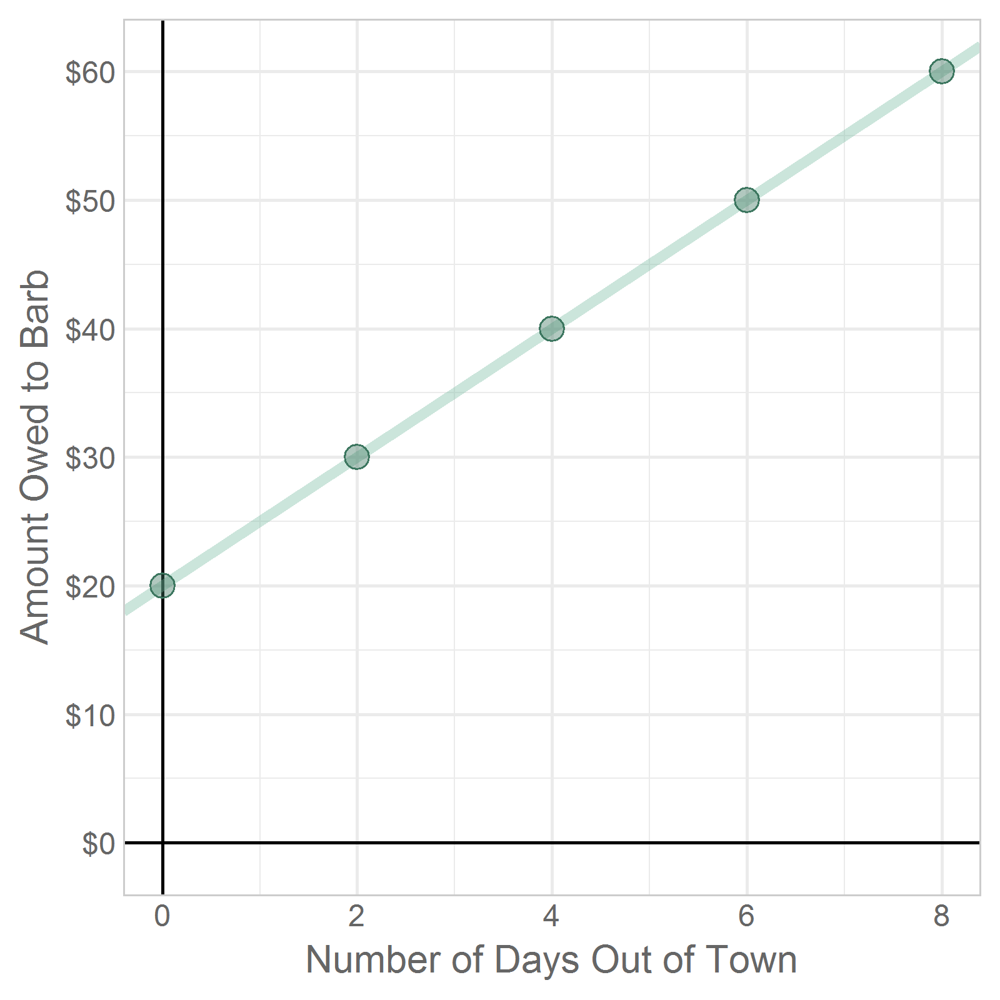

---
output:
  html_document:
    keep_md: yes
---
Chapter 13 Graphs
=================================================
This report creates the chapter graphs.

<!--  Set the working directory to the repository's base directory; this assumes the report is nested inside of only one directory.-->


<!-- Set the report-wide options, and point to the external code file. -->

<!-- Load the packages.  Suppress the output when loading packages. -->


<!-- Load any Global functions and variables declared in the R file.  Suppress the output. -->


<!-- Declare any global functions specific to a Rmd output.  Suppress the output. -->


<!-- Load the datasets. -->


<!-- Tweak the datasets. -->


## Figure 13-1


## Figure 13-2


## Figure 13-3


## Figure 13-4


## Figure 13-5


## Figure 13-6


## Figure 13-7


## Figure 13-8


## Figure 13-09


## Figure 13-10


## Figure 13-11


## Figure 13-12


## Figure 13-13


## Figure 13-14


## Not used #1


## Not used #2


<!-- The footer that's common to all reports. -->

## Session Information

For the sake of documentation and reproducibility, the current report was rendered in the following environment.  Click the line below to expand.

<details>
  <summary>Environment <span class="glyphicon glyphicon-plus-sign"></span></summary>

```
Session info ------------------------------------------------------------------
```

```
 setting  value                       
 version  R version 3.5.1 (2018-07-02)
 system   x86_64, linux-gnu           
 ui       RStudio (1.2.830)           
 language (EN)                        
 collate  en_US.UTF-8                 
 tz       America/Chicago             
 date     2018-08-25                  
```

```
Packages ----------------------------------------------------------------------
```

```
 package          * version    date       source                          
 assertthat         0.2.0      2017-04-11 CRAN (R 3.5.1)                  
 backports          1.1.2      2017-12-13 CRAN (R 3.5.1)                  
 base             * 3.5.1      2018-07-03 local                           
 bindr              0.1.1      2018-03-13 CRAN (R 3.5.1)                  
 bindrcpp           0.2.2      2018-03-29 CRAN (R 3.5.1)                  
 cli                1.0.0      2017-11-05 CRAN (R 3.5.1)                  
 colorspace         1.3-2      2016-12-14 CRAN (R 3.5.1)                  
 compiler           3.5.1      2018-07-03 local                           
 crayon             1.3.4      2017-09-16 CRAN (R 3.5.1)                  
 crosstalk          1.0.0      2016-12-21 CRAN (R 3.5.1)                  
 datasets         * 3.5.1      2018-07-03 local                           
 devtools           1.13.6     2018-06-27 CRAN (R 3.5.1)                  
 dichromat          2.0-0      2013-01-24 CRAN (R 3.5.1)                  
 digest             0.6.16     2018-08-22 CRAN (R 3.5.1)                  
 dplyr              0.7.6      2018-06-29 CRAN (R 3.5.1)                  
 epade              0.3.8      2013-02-22 CRAN (R 3.5.1)                  
 evaluate           0.11       2018-07-17 CRAN (R 3.5.1)                  
 extrafont          0.17       2014-12-08 CRAN (R 3.5.1)                  
 extrafontdb        1.0        2012-06-11 CRAN (R 3.5.1)                  
 fansi              0.3.0      2018-08-13 CRAN (R 3.5.1)                  
 ggplot2          * 3.0.0      2018-07-03 CRAN (R 3.5.1)                  
 glue               1.3.0      2018-07-17 CRAN (R 3.5.1)                  
 graphics         * 3.5.1      2018-07-03 local                           
 grDevices        * 3.5.1      2018-07-03 local                           
 grid               3.5.1      2018-07-03 local                           
 gridExtra          2.3        2017-09-09 CRAN (R 3.5.1)                  
 gtable             0.2.0      2016-02-26 CRAN (R 3.5.1)                  
 hms                0.4.2.9001 2018-08-18 Github (tidyverse/hms@979286f)  
 htmltools          0.3.6      2017-04-28 CRAN (R 3.5.1)                  
 htmlwidgets        1.2        2018-04-19 CRAN (R 3.5.1)                  
 httpuv             1.4.5      2018-07-19 CRAN (R 3.5.1)                  
 jsonlite           1.5        2017-06-01 CRAN (R 3.5.1)                  
 knitr            * 1.20       2018-02-20 CRAN (R 3.5.1)                  
 labeling           0.3        2014-08-23 CRAN (R 3.5.1)                  
 later              0.7.3      2018-06-08 CRAN (R 3.5.1)                  
 lazyeval           0.2.1      2017-10-29 CRAN (R 3.5.1)                  
 magrittr         * 1.5        2014-11-22 CRAN (R 3.5.1)                  
 manipulateWidget   0.10.0     2018-06-11 cran (@0.10.0)                  
 memoise            1.1.0      2017-04-21 CRAN (R 3.5.1)                  
 methods          * 3.5.1      2018-07-03 local                           
 mime               0.5        2016-07-07 CRAN (R 3.5.1)                  
 miniUI             0.1.1.1    2018-05-18 CRAN (R 3.5.1)                  
 munsell            0.5.0      2018-06-12 CRAN (R 3.5.1)                  
 packrat            0.4.9-3    2018-06-01 CRAN (R 3.5.1)                  
 pacman             0.4.6      2017-05-14 CRAN (R 3.5.1)                  
 pillar             1.3.0      2018-07-14 CRAN (R 3.5.1)                  
 pkgconfig          2.0.2      2018-08-16 CRAN (R 3.5.1)                  
 plotrix            3.7-2      2018-05-27 CRAN (R 3.5.1)                  
 plyr               1.8.4      2016-06-08 CRAN (R 3.5.1)                  
 promises           1.0.1      2018-04-13 CRAN (R 3.5.1)                  
 purrr              0.2.5      2018-05-29 CRAN (R 3.5.1)                  
 R6                 2.2.2      2017-06-17 CRAN (R 3.5.1)                  
 RColorBrewer       1.1-2      2014-12-07 CRAN (R 3.5.1)                  
 Rcpp               0.12.18    2018-07-23 CRAN (R 3.5.1)                  
 readr              1.2.0      2018-08-18 Github (tidyverse/readr@4b2e93a)
 reshape2           1.4.3      2017-12-11 CRAN (R 3.5.1)                  
 rgl                0.99.16    2018-03-28 cran (@0.99.16)                 
 rlang              0.2.2      2018-08-16 CRAN (R 3.5.1)                  
 rmarkdown          1.10       2018-06-11 CRAN (R 3.5.1)                  
 rprojroot          1.3-2      2018-01-03 CRAN (R 3.5.1)                  
 rstudioapi         0.7        2017-09-07 CRAN (R 3.5.1)                  
 Rttf2pt1           1.3.7      2018-06-29 CRAN (R 3.5.1)                  
 scales             1.0.0      2018-08-09 CRAN (R 3.5.1)                  
 shiny              1.1.0      2018-05-17 CRAN (R 3.5.1)                  
 stats            * 3.5.1      2018-07-03 local                           
 stringi            1.2.4      2018-07-20 CRAN (R 3.5.1)                  
 stringr            1.3.1      2018-05-10 CRAN (R 3.5.1)                  
 tibble             1.4.2      2018-01-22 CRAN (R 3.5.1)                  
 tidyr              0.8.1      2018-05-18 CRAN (R 3.5.1)                  
 tidyselect         0.2.4      2018-02-26 CRAN (R 3.5.1)                  
 tools              3.5.1      2018-07-03 local                           
 utf8               1.1.4      2018-05-24 CRAN (R 3.5.1)                  
 utils            * 3.5.1      2018-07-03 local                           
 webshot            0.5.0      2017-11-29 cran (@0.5.0)                   
 wesanderson        0.3.6      2018-04-20 CRAN (R 3.5.1)                  
 withr              2.1.2      2018-03-15 CRAN (R 3.5.1)                  
 xtable             1.8-2      2016-02-05 CRAN (R 3.5.1)                  
 yaml               2.2.0      2018-07-25 CRAN (R 3.5.1)                  
```
</details>


Report rendered by wibeasley at 2018-08-25, 19:57 -0500 in 21 seconds.


## License

<a rel="license" href="http://creativecommons.org/licenses/by/3.0/"></a><br />This work is licensed under a <a rel="license" href="http://creativecommons.org/licenses/by/3.0/">Creative Commons Attribution 3.0 Unported License</a>.
