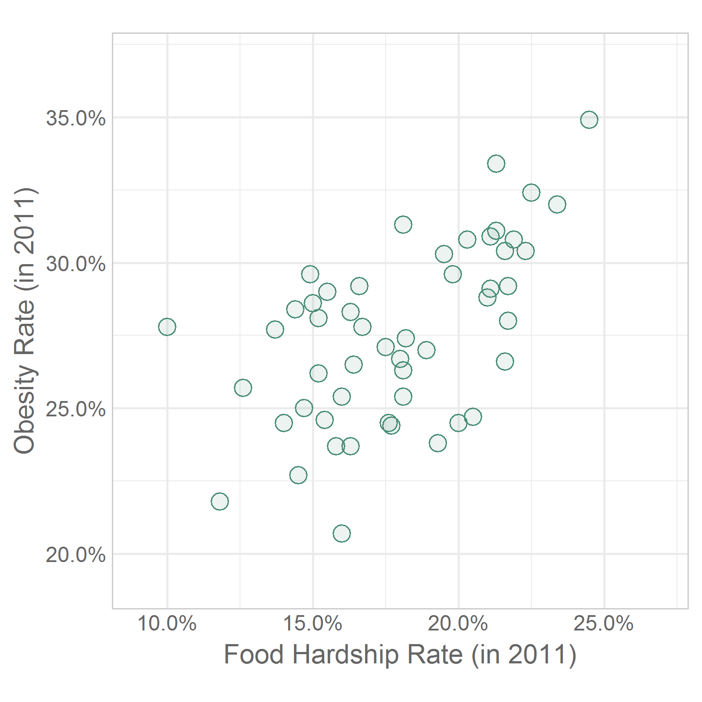
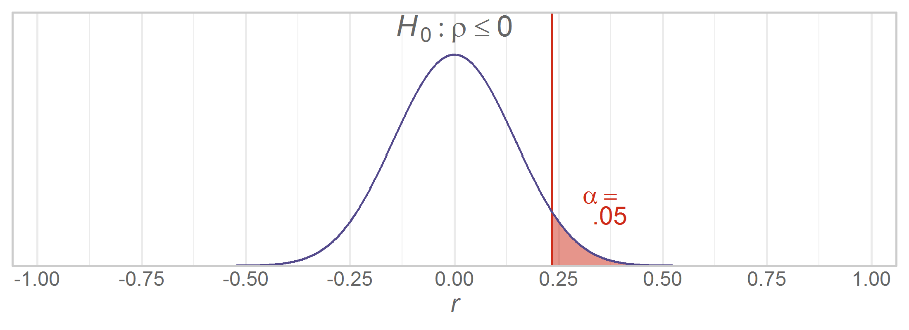
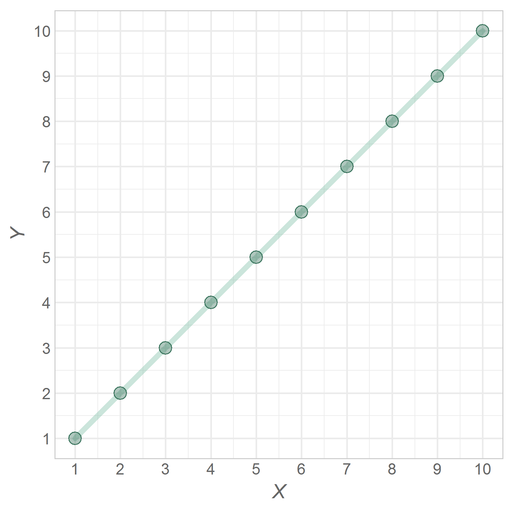
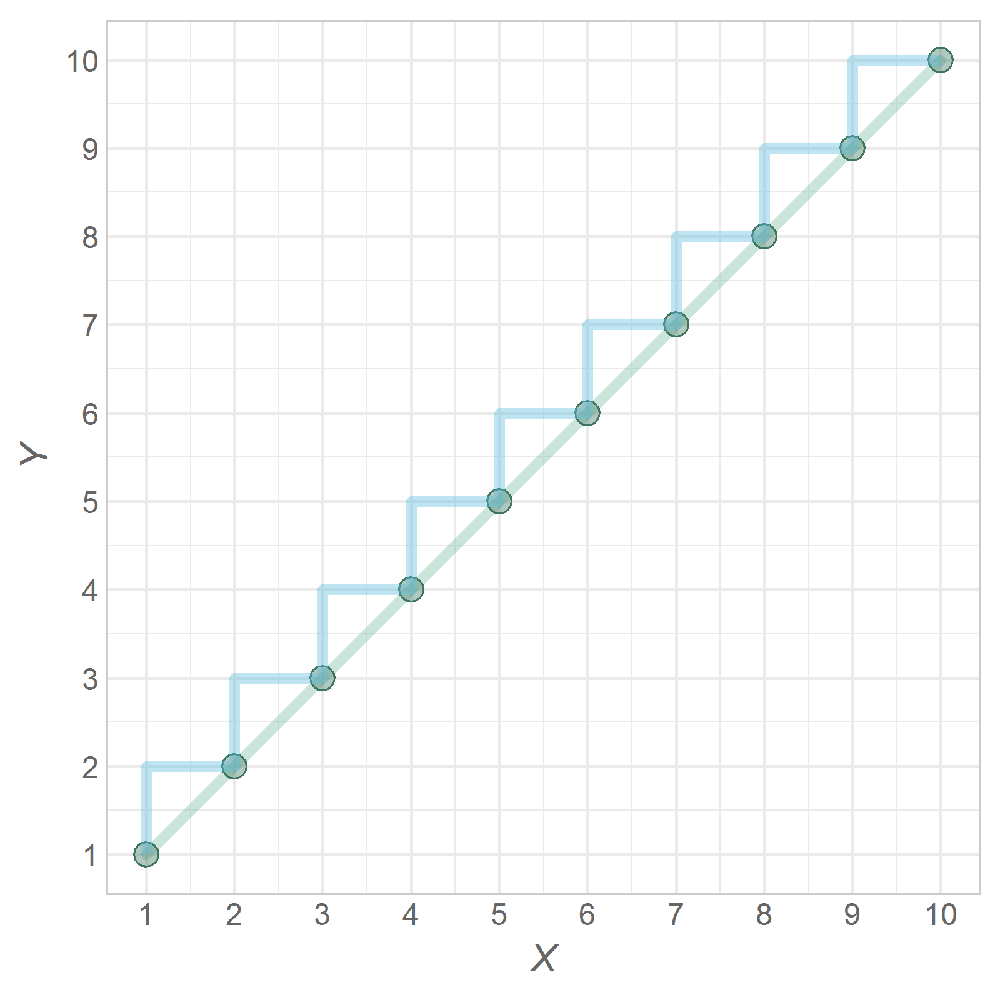
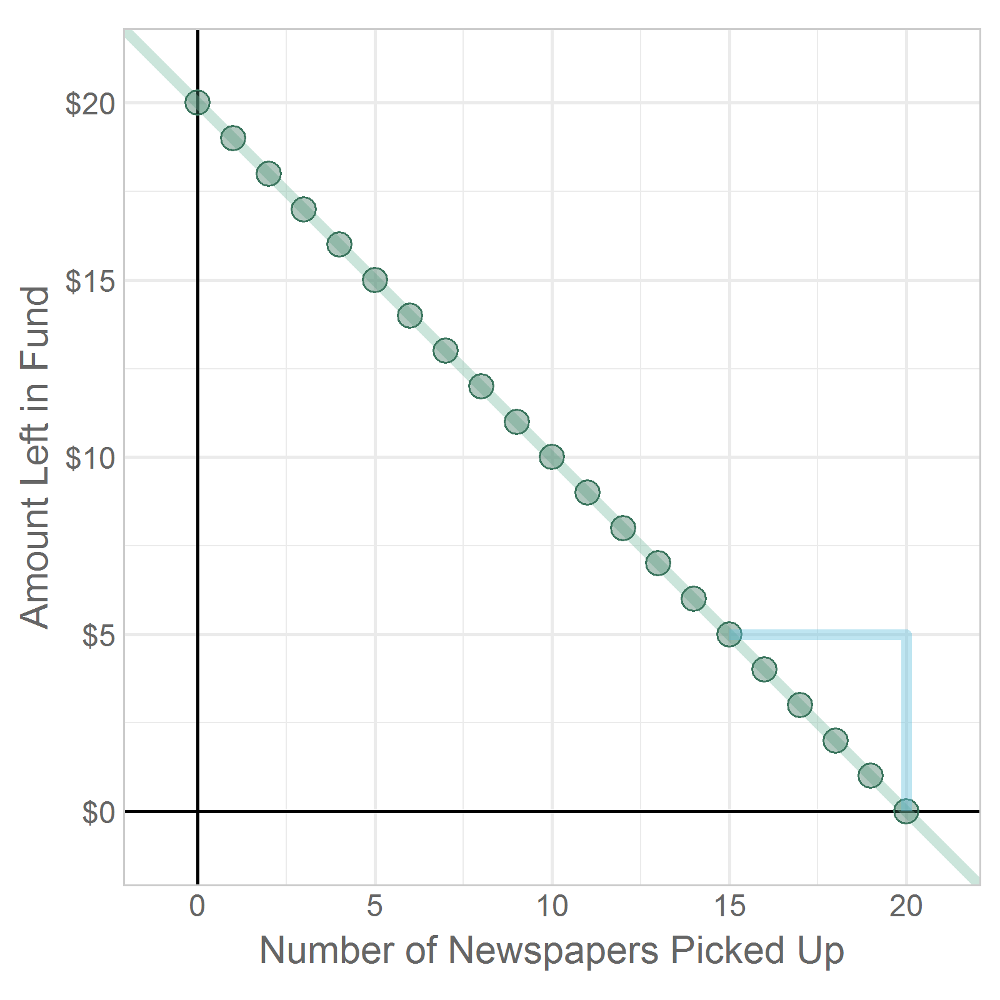
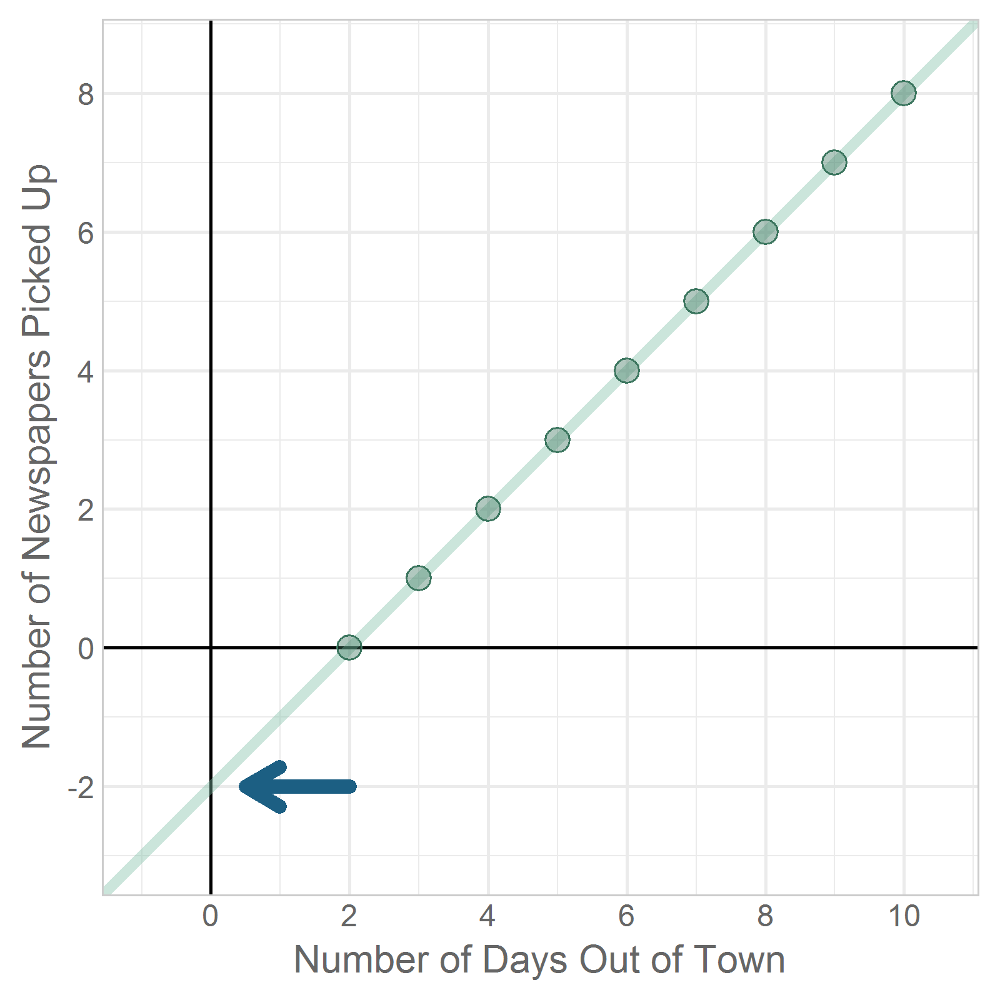
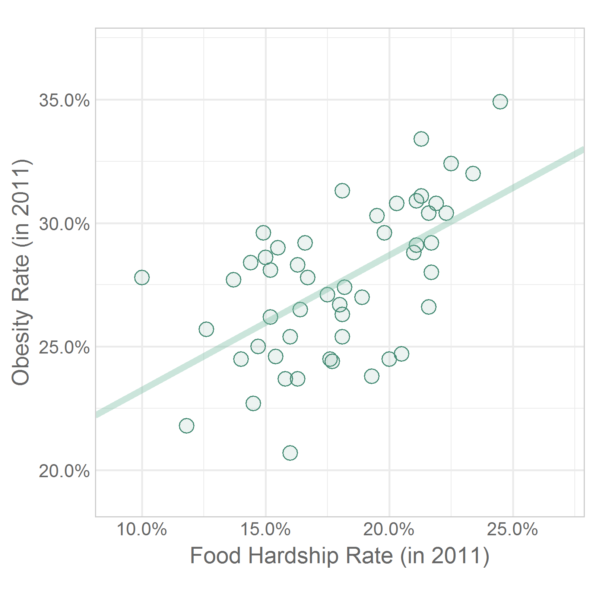
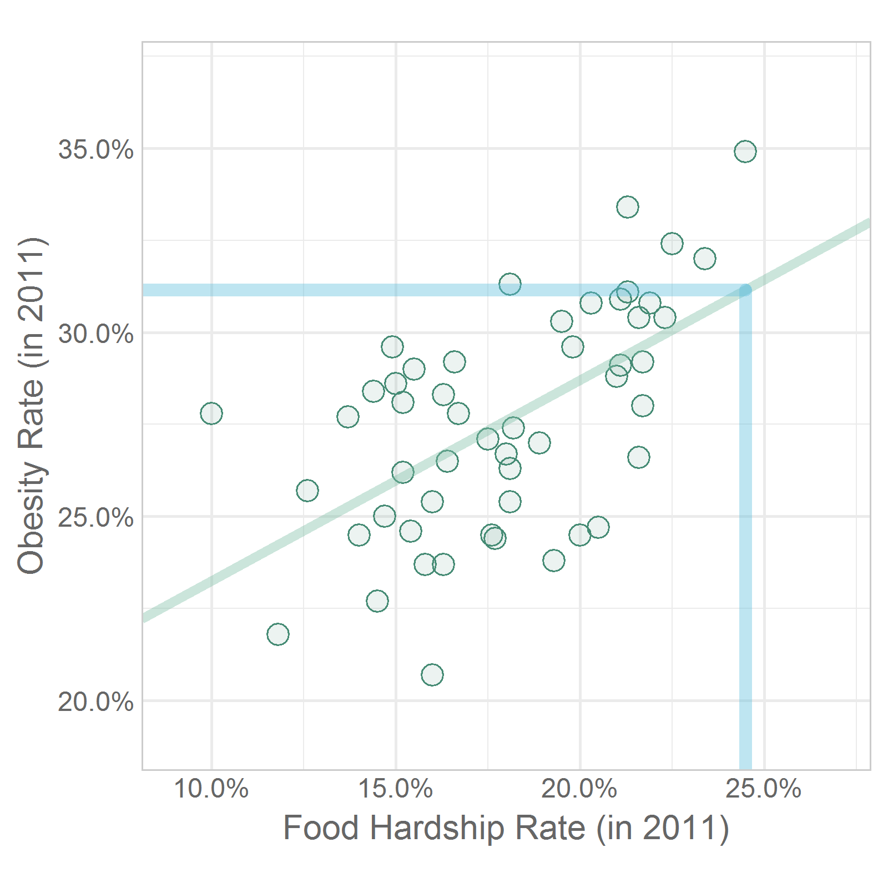
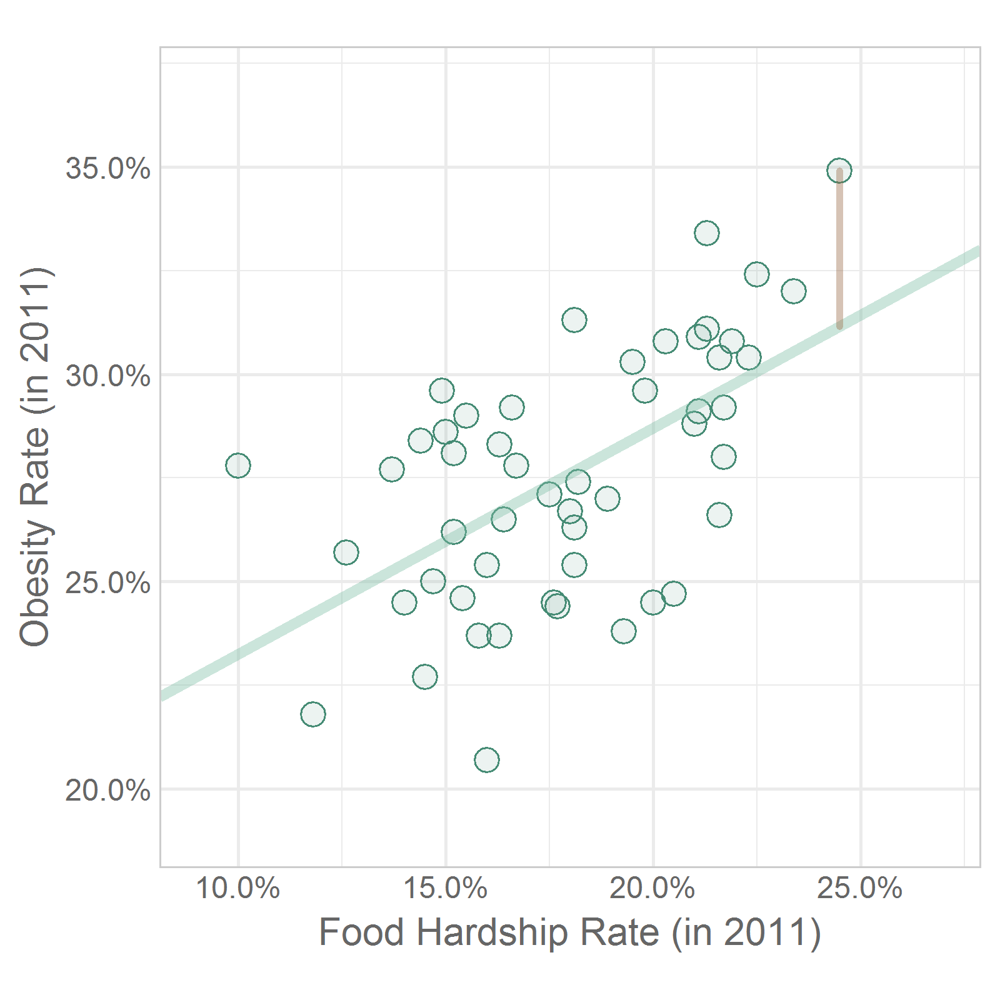

---
output:
  html_document:
    keep_md: yes
    code_folding: hide
---
Chapter 13 Graphs
=================================================
This report creates the chapter graphs.

<!--  Set the working directory to the repository's base directory; this assumes the report is nested inside of only one directory.-->


<!-- Set the report-wide options, and point to the external code file. -->

<!-- Load the packages.  Suppress the output when loading packages. -->

```r
library(magrittr) #Pipes
library(ggplot2) #For graphing
# requireNamespace("dplyr")
requireNamespace("scales")
requireNamespace("readr")
requireNamespace("rgl")
```

<!-- Load any Global functions and variables declared in the R file.  Suppress the output. -->

```r
source("./common-code/book-theme.R")
calculatedPointCount <- 401*4

theme_chapter <- theme_book

feedingLevels <- c("Breast", "Bottle", "Both")
# paletteFeedingFull <- c("#ea573d", "#d292cd", "#fb9a62", "#fbc063", "#70af81", "#64b0bc", "#446699", "#615b70") #http://colrd.com/palette/28063/
# paletteFeeding <- paletteFeedingFull[c(6,5,3)]
paletteFeedingFull <- c("#dd0011","#f17217","#f0d214","#80da36","#2374fe","#d92bbb") #http://colrd.com/palette/22779/
paletteFeeding <- paletteFeedingFull[c(1,5,6)]
names(paletteFeeding) <- feedingLevels
paletteFeedingLight <- adjustcolor(paletteFeeding, alpha.f=.2)

cryGroupLevels <- c("Breast", "Bottle", "Control")
# paletteCryBoxFull <- c("#dd0011","#f17217","#f0d214","#80da36","#2374fe","#d92bbb") #http://colrd.com/palette/22779/
# paletteCryBox <- paletteCryBoxFull[c(1,5,6)]
paletteCryBoxFull <- c("#ea573d", "#d292cd", "#fb9a62", "#fbc063", "#70af81", "#64b0bc", "#446699", "#615b70") #http://colrd.com/palette/28063/
paletteCryBox <- paletteCryBoxFull[c(6,5,3)]
names(paletteCryBox) <- cryGroupLevels
paletteCryBoxLight <- adjustcolor(paletteCryBox, alpha.f=.2)

palettePlacidSeas <- c("#fefefe","#1c5f83","#7ebea5","#f3d6a8","#3c765f","#5cbddd","#986a46") #http://colrd.com/image-dna/23557/
palettePlacidSeasMedium <- grDevices::adjustcolor(palettePlacidSeas, alpha.f=.4)
palettePlacidSeasLight <- grDevices::adjustcolor(palettePlacidSeas, alpha.f=.1)
theme_color <- "gray40"
colorAxes <- "black"
```

<!-- Declare any global functions specific to a Rmd output.  Suppress the output. -->


<!-- Load the datasets. -->

```r
# 'ds' stands for 'datasets'
dsObesity <- readr::read_csv("./data/food-hardship-obesity.csv")
# dsFeed <- readr::read_csv("./data/breastfeeding-sleep-fake.csv")
# dsCry <- readr::read_csv("./data/infant-crying-fake.csv")
```

<!-- Tweak the datasets. -->


## Figure 13-1

```r
gObesity <- ggplot(dsObesity, aes(x=FoodHardshipRate, y=ObesityRate)) +
  geom_point(shape=21, size=3, color="aquamarine4", fill=adjustcolor("aquamarine4", alpha.f=.1)) + #This color should match the obesity Cleveland dot plot
  scale_x_continuous(label=scales::percent) +
  scale_y_continuous(label=scales::percent) +
  coord_fixed(xlim=c(.09, .27), ylim=c(.19, .37)) +
  theme_chapter +
  labs(x="Food Hardship Rate (in 2011)", y="Obesity Rate (in 2011)")

gObesity
```



## Figure 13-2

```r
intervalWidth <- .001
rPrior <- 0
nPrior <- 51
precPrior <- nPrior - 3
zPrior <- atanh(rPrior)
#zCrit <- qnorm(p=c(.025, .975), mean=zPrior, sd=1/sqrt(precPrior))
zCrit <- qnorm(p=c(.95), mean=zPrior, sd=1/sqrt(precPrior))
rCrit <- tanh(zCrit)

Gauss <- function( fixed, rho, n ) {
  zObs <- atanh(fixed)
  zHyp <- atanh(rho)
  standardError <- 1/sqrt(n - 3)
  return( dnorm(x=zObs, mean=zHyp, sd=standardError) )
}

dsRho <- data.frame(ZPossible = seq(from=-3+intervalWidth, to=3-intervalWidth, by=intervalWidth))
dsRho$RhoPossible <- tanh(dsRho$ZPossible)
dsRho$PriorR <- Gauss(fixed=rPrior, rho=dsRho$RhoPossible, n=nPrior)
# dsRho$TailLower <- (dsRho$RhoPossible <= rCrit[1])
# dsRho$TailUpper <- (rCrit[2] <= dsRho$RhoPossible)
dsRho$TailUpper <- (rCrit[1] <= dsRho$RhoPossible)

gCriticalR <- ggplot(dsRho, aes(x=RhoPossible, y=PriorR)) + #, fill=TailLower
  annotate("segment", x=rCrit, xend=rCrit, y=0, yend=Inf, color=PaletteCritical[2]) +
  geom_area(data=dsRho[dsRho$TailLower, ], aes(x=RhoPossible, y=PriorR), fill=PaletteCriticalLight[2]) +
  geom_area(data=dsRho[dsRho$TailUpper, ], aes(x=RhoPossible, y=PriorR), fill=PaletteCriticalLight[2]) +
  geom_line(color=PaletteCritical[1]) +

  annotate(geom="text", x=rCrit[1]+.14, y=.8, label="alpha==phantom(0)", hjust=.5, vjust=-.05, parse=TRUE, color=PaletteCritical[2]) +
  annotate(geom="text", x=rCrit[1]+.14, y=.8, label=".05", hjust=.5, vjust=1.05, parse=F, color=PaletteCritical[2]) +

  annotate("text", label="italic(H)[0]: rho<=0", x=0, y=Inf, parse=T, size=4.5, vjust=1.08, color="gray40") +

  scale_x_continuous(expand=c(0,.01), breaks=c(-1, -.75, -.5, -.25, 0, .25, .5, .75, 1)) + #, labels=c(-1, -.75, -.5, "", 0, "", .5, .75, 1)) +
  scale_y_continuous(breaks=NULL, expand=c(0,0)) +
  expand_limits(x=c(-1, 1) * 1.05, y=max(dsRho$PriorR) * 1.2) +

  theme_chapter +
  labs(x=expression(italic(r)), y=NULL)

DrawWithoutPanelClipping(gCriticalR)
```



## Figure 13-3

```r
dsStairsUp <- data.frame(X=1:10, Y=1:10)

gStraightUp <- ggplot(dsStairsUp, aes(x=X, y=Y)) +
  geom_path(color=palettePlacidSeasMedium[3], size=1.5, lineend="round") +
  geom_point(shape=21, size=3, color=palettePlacidSeas[5], fill=palettePlacidSeasMedium[5]) +
  scale_x_continuous(breaks=dsStairsUp$X) +
  scale_y_continuous(breaks=dsStairsUp$Y) +
  coord_equal() +
  theme_chapter +
  labs(x=expression(italic(X)), y=expression(italic(Y)), parse=T)
gStraightUp
```



## Figure 13-4

```r
gStraightUp +
  geom_step(direction="vh", size=1.5, color=palettePlacidSeasMedium[6])
```



## Figure 13-5

```r
gStraightUp +
  geom_step(data=data.frame(X=c(1,10),Y=c(1,10)), direction="vh", size=1.5, color=palettePlacidSeasMedium[6])
```


## Figure 13-6

```r
dsStairsDown <- data.frame(X=0:20, Y=20:0)

gStraightDown <- ggplot(dsStairsDown, aes(x=X, y=Y)) +
  geom_hline(yintercept=0, color=colorAxes) +
  geom_vline(xintercept=0, color=colorAxes) +
  geom_abline(intercept=20, slope=-1, color=palettePlacidSeasMedium[3], size=1.5) +
  geom_point(shape=21, size=3, color=palettePlacidSeas[5], fill=palettePlacidSeasMedium[5]) +
  scale_y_continuous(labels=scales::dollar) +
  coord_equal(xlim=c(-1, 21), ylim=c(-1, 21)) +
  theme_chapter +
  labs(x="Number of Newspapers Picked Up", y="Amount Left in Fund")
gStraightDown
```


## Figure 13-7

```r
gStraightDown +
  geom_step(data=data.frame(X=c(15,20),Y=c(5,0)), direction="hv", size=1.5, color=palettePlacidSeasMedium[6])
```



## Figure 13-8

```r
gStraightDown +
  annotate("segment", x=4, xend=1, y=20, yend=20, arrow=grid::arrow(length=unit(.4,"cm")), color=palettePlacidSeas[2], size=2, lineend="round")
```


## Figure 13-09

```r
dsNewspaperDelay <- data.frame(X=2:10, Y=0:8)

ggplot(dsNewspaperDelay, aes(x=X, y=Y)) +
  geom_hline(yintercept=0, color=colorAxes) +
  geom_vline(xintercept=0, color=colorAxes) +
  geom_abline(intercept=-2, slope=1, color=palettePlacidSeasMedium[3], size=1.5) +
  geom_point(shape=21, size=3, color=palettePlacidSeas[5], fill=palettePlacidSeasMedium[5]) +
  annotate("segment", x=2, xend=.5, y=-2, yend=-2, arrow=grid::arrow(length=unit(.4,"cm")), color=palettePlacidSeas[2], size=2, lineend="round") +
  scale_x_continuous(breaks=seq(0, 10, by=2)) +
  scale_y_continuous(breaks=seq(-2, 8, by=2)) +
  coord_equal(xlim=c(-1, 10.5), ylim=c(-3, 8.5)) +
  theme_chapter +
  labs(x="Number of Days Out of Town", y="Number of Newspapers Picked Up")
```



## Figure 13-10

```r
dsBarb <- data.frame(X=seq(0, 8, by=2))
dsBarb$Y <- 20 + (5 * dsBarb$X)

ggplot(dsBarb, aes(x=X, y=Y)) +
  geom_hline(yintercept=0, color=colorAxes) +
  geom_vline(xintercept=0, color=colorAxes) +
  geom_abline(intercept=20, slope=5, color=palettePlacidSeasMedium[3], size=1.5) +
  geom_point(shape=21, size=3, color=palettePlacidSeas[5], fill=palettePlacidSeasMedium[5]) +
  scale_x_continuous(breaks=seq(0, 8, by=2)) +
  scale_y_continuous(breaks=seq(0, 60, by=10), labels=scales::dollar) +
  coord_cartesian(ylim=c(-1, 61)) +
  theme_chapter +
  labs(x="Number of Days Out of Town", y="Amount Owed to Barb")
```


## Figure 13-11

```r
fit <- lm(ObesityRate ~ 1 + FoodHardshipRate, data=dsObesity)
xNew <- max(dsObesity$FoodHardshipRate) #.245
yObs <- max(dsObesity$ObesityRate) #0.349
yHat <- predict.lm(fit, data.frame(FoodHardshipRate=xNew))
residual <- (yObs - yHat)

gObesityWithLine <- gObesity +
  geom_abline(intercept=coef(fit)["(Intercept)"], slope=coef(fit)["FoodHardshipRate"], color=palettePlacidSeasMedium[3], size=1.5)
#   geom_smooth(method="lm", color=palettePlacidSeasMedium[3], size=1.5, se=F)
gObesityWithLine
```



## Figure 13-12

```r
gObesityWithLine +
  annotate("segment", x=xNew, xend=xNew, y=yHat, yend=-Inf, color=palettePlacidSeasMedium[6], size=2, lineend="round") +
  annotate("segment", x=-Inf, xend=xNew, y=yHat, yend=yHat, color=palettePlacidSeasMedium[6], size=2, lineend="round")
```



## Figure 13-13

```r
gObesityWithLine +
  annotate("segment", x=xNew, xend=xNew, y=yHat, yend=yObs, color=palettePlacidSeasMedium[7], size=1, lineend="round")
```



## Figure 13-14

```r
gObesityWithLine +
  annotate("rect", xmin=xNew-residual, xmax=xNew, ymin=yHat, ymax=yObs, color=palettePlacidSeasMedium[7], fill=palettePlacidSeasLight[7])
```


## Not used #1


## Not used #2


<!-- The footer that's common to all reports. -->

## Session Information

For the sake of documentation and reproducibility, the current report was rendered in the following environment.  Click the line below to expand.

<details>
  <summary>Environment <span class="glyphicon glyphicon-plus-sign"></span></summary>

```
- Session info ---------------------------------------------------------------
 setting  value                                      
 version  R version 3.5.1 Patched (2018-09-10 r75281)
 os       Windows >= 8 x64                           
 system   x86_64, mingw32                            
 ui       RStudio                                    
 language (EN)                                       
 collate  English_United States.1252                 
 ctype    English_United States.1252                 
 tz       America/Chicago                            
 date     2018-10-25                                 

- Packages -------------------------------------------------------------------
 package          * version    date       lib source                          
 assertthat         0.2.0      2017-04-11 [1] CRAN (R 3.5.0)                  
 backports          1.1.2      2017-12-13 [1] CRAN (R 3.5.0)                  
 base64enc          0.1-3      2015-07-28 [1] CRAN (R 3.5.0)                  
 bindr              0.1.1      2018-03-13 [1] CRAN (R 3.5.0)                  
 bindrcpp           0.2.2      2018-03-29 [1] CRAN (R 3.5.0)                  
 callr              3.0.0      2018-08-24 [1] CRAN (R 3.5.1)                  
 cli                1.0.1      2018-09-25 [1] CRAN (R 3.5.1)                  
 colorspace         1.3-2      2016-12-14 [1] CRAN (R 3.5.0)                  
 crayon             1.3.4      2017-09-16 [1] CRAN (R 3.5.0)                  
 crosstalk          1.0.0      2016-12-21 [1] CRAN (R 3.5.0)                  
 debugme            1.1.0      2017-10-22 [1] CRAN (R 3.5.0)                  
 desc               1.2.0      2018-05-01 [1] CRAN (R 3.5.0)                  
 devtools           2.0.0      2018-10-19 [1] CRAN (R 3.5.1)                  
 dichromat          2.0-0      2013-01-24 [1] CRAN (R 3.5.0)                  
 digest             0.6.18     2018-10-10 [1] CRAN (R 3.5.1)                  
 dplyr              0.7.7      2018-10-16 [1] CRAN (R 3.5.1)                  
 epade              0.3.8      2013-02-22 [1] CRAN (R 3.5.1)                  
 evaluate           0.12       2018-10-09 [1] CRAN (R 3.5.1)                  
 extrafont          0.17       2014-12-08 [1] CRAN (R 3.5.0)                  
 extrafontdb        1.0        2012-06-11 [1] CRAN (R 3.5.0)                  
 fansi              0.4.0      2018-10-05 [1] CRAN (R 3.5.1)                  
 fs                 1.2.6      2018-08-23 [1] CRAN (R 3.5.1)                  
 ggplot2          * 3.0.0      2018-07-03 [1] CRAN (R 3.5.1)                  
 glue               1.3.0      2018-07-17 [1] CRAN (R 3.5.1)                  
 gridExtra          2.3        2017-09-09 [1] CRAN (R 3.5.0)                  
 gtable             0.2.0      2016-02-26 [1] CRAN (R 3.5.0)                  
 hms                0.4.2.9001 2018-08-09 [1] Github (tidyverse/hms@979286f)  
 htmltools          0.3.6      2017-04-28 [1] CRAN (R 3.5.0)                  
 htmlwidgets        1.3        2018-09-30 [1] CRAN (R 3.5.1)                  
 httpuv             1.4.5      2018-07-19 [1] CRAN (R 3.5.1)                  
 jsonlite           1.5        2017-06-01 [1] CRAN (R 3.5.0)                  
 knitr            * 1.20       2018-02-20 [1] CRAN (R 3.5.0)                  
 labeling           0.3        2014-08-23 [1] CRAN (R 3.5.0)                  
 later              0.7.5      2018-09-18 [1] CRAN (R 3.5.1)                  
 lazyeval           0.2.1      2017-10-29 [1] CRAN (R 3.5.0)                  
 magrittr         * 1.5        2014-11-22 [1] CRAN (R 3.5.0)                  
 manipulateWidget   0.10.0     2018-06-11 [1] CRAN (R 3.5.0)                  
 memoise            1.1.0      2017-04-21 [1] CRAN (R 3.5.0)                  
 mime               0.6        2018-10-05 [1] CRAN (R 3.5.1)                  
 miniUI             0.1.1.1    2018-05-18 [1] CRAN (R 3.5.0)                  
 munsell            0.5.0      2018-06-12 [1] CRAN (R 3.5.0)                  
 packrat            0.4.9-3    2018-06-01 [1] CRAN (R 3.5.0)                  
 pacman             0.5.0      2018-10-22 [1] CRAN (R 3.5.1)                  
 pillar             1.3.0      2018-07-14 [1] CRAN (R 3.5.1)                  
 pkgbuild           1.0.2      2018-10-16 [1] CRAN (R 3.5.1)                  
 pkgconfig          2.0.2      2018-08-16 [1] CRAN (R 3.5.1)                  
 pkgload            1.0.1      2018-10-11 [1] CRAN (R 3.5.1)                  
 plotrix            3.7-4      2018-10-03 [1] CRAN (R 3.5.1)                  
 plyr               1.8.4      2016-06-08 [1] CRAN (R 3.5.0)                  
 prettyunits        1.0.2      2015-07-13 [1] CRAN (R 3.5.0)                  
 processx           3.2.0      2018-08-16 [1] CRAN (R 3.5.1)                  
 promises           1.0.1      2018-04-13 [1] CRAN (R 3.5.0)                  
 ps                 1.2.0      2018-10-16 [1] CRAN (R 3.5.1)                  
 purrr              0.2.5      2018-05-29 [1] CRAN (R 3.5.0)                  
 R6                 2.3.0      2018-10-04 [1] CRAN (R 3.5.1)                  
 RColorBrewer       1.1-2      2014-12-07 [1] CRAN (R 3.5.0)                  
 Rcpp               0.12.19    2018-10-01 [1] CRAN (R 3.5.1)                  
 readr              1.2.0      2018-10-25 [1] Github (tidyverse/readr@69c9fd3)
 remotes            2.0.1      2018-10-19 [1] CRAN (R 3.5.1)                  
 reshape2           1.4.3      2017-12-11 [1] CRAN (R 3.5.0)                  
 rgl                0.99.16    2018-03-28 [1] CRAN (R 3.5.0)                  
 rlang              0.3.0.1    2018-10-25 [1] CRAN (R 3.5.1)                  
 rmarkdown          1.10       2018-06-11 [1] CRAN (R 3.5.0)                  
 rprojroot          1.3-2      2018-01-03 [1] CRAN (R 3.5.0)                  
 Rttf2pt1           1.3.7      2018-06-29 [1] CRAN (R 3.5.0)                  
 scales             1.0.0      2018-08-09 [1] CRAN (R 3.5.1)                  
 sessioninfo        1.1.0      2018-09-25 [1] CRAN (R 3.5.1)                  
 shiny              1.1.0      2018-05-17 [1] CRAN (R 3.5.0)                  
 stringi            1.2.4      2018-07-20 [1] CRAN (R 3.5.1)                  
 stringr            1.3.1      2018-05-10 [1] CRAN (R 3.5.0)                  
 testthat           2.0.1      2018-10-13 [1] CRAN (R 3.5.1)                  
 tibble             1.4.2      2018-01-22 [1] CRAN (R 3.5.0)                  
 tidyr              0.8.1      2018-05-18 [1] CRAN (R 3.5.0)                  
 tidyselect         0.2.5      2018-10-11 [1] CRAN (R 3.5.1)                  
 usethis            1.4.0      2018-08-14 [1] CRAN (R 3.5.1)                  
 utf8               1.1.4      2018-05-24 [1] CRAN (R 3.5.0)                  
 webshot            0.5.1      2018-09-28 [1] CRAN (R 3.5.1)                  
 wesanderson        0.3.6      2018-04-20 [1] CRAN (R 3.5.1)                  
 withr              2.1.2      2018-03-15 [1] CRAN (R 3.5.0)                  
 xtable             1.8-3      2018-08-29 [1] CRAN (R 3.5.1)                  
 yaml               2.2.0      2018-07-25 [1] CRAN (R 3.5.1)                  

[1] D:/Projects/RLibraries
[2] D:/Users/Will/Documents/R/win-library/3.5
[3] C:/Program Files/R/R-3.5.1patched/library
```
</details>


Report rendered by Will at 2018-10-25, 13:04 -0500 in 9 seconds.


## License

<a rel="license" href="http://creativecommons.org/licenses/by/3.0/"></a><br />This work is licensed under a <a rel="license" href="http://creativecommons.org/licenses/by/3.0/">Creative Commons Attribution 3.0 Unported License</a>.
