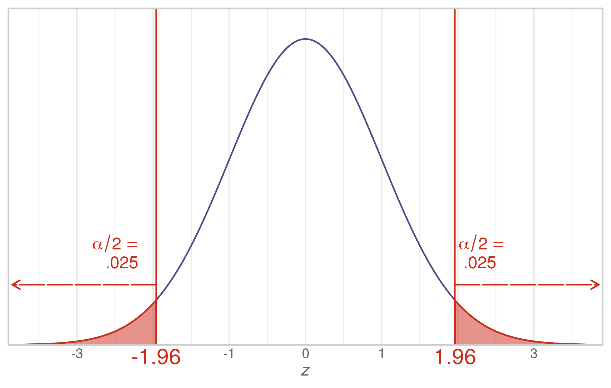
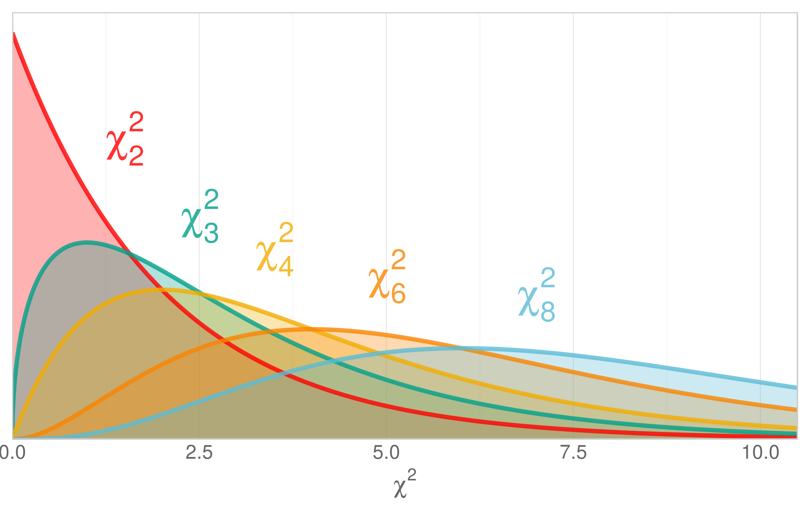
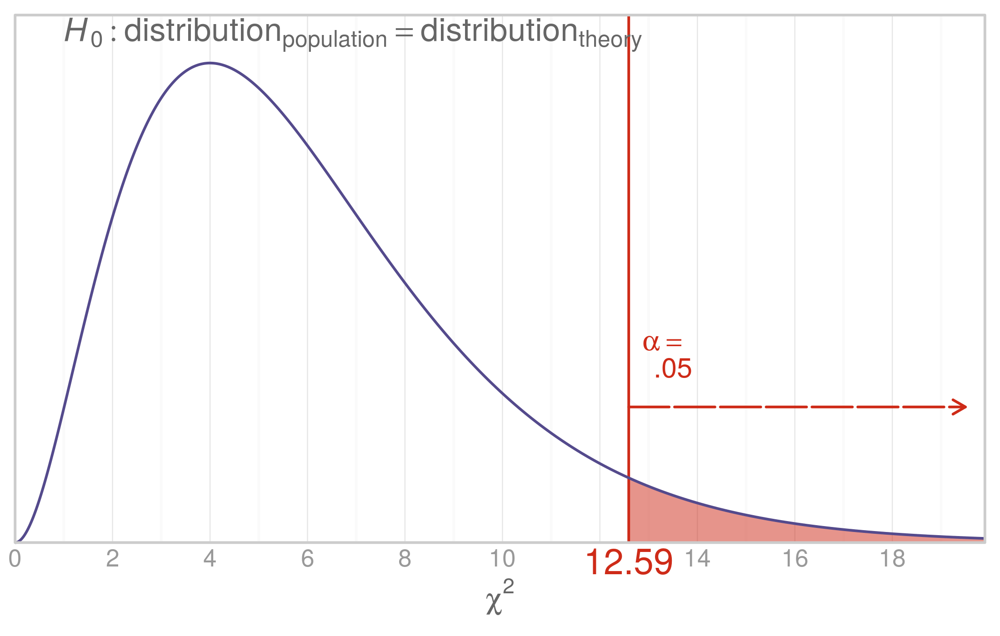
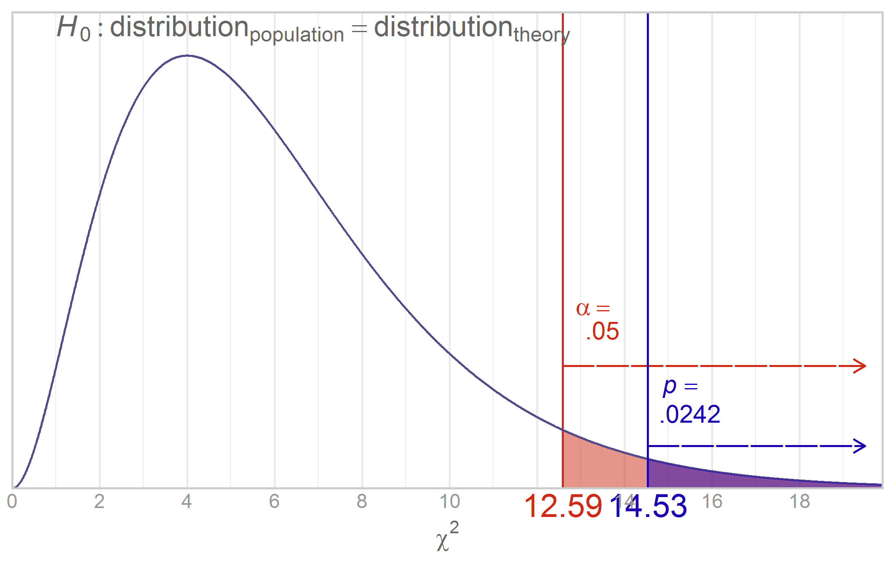
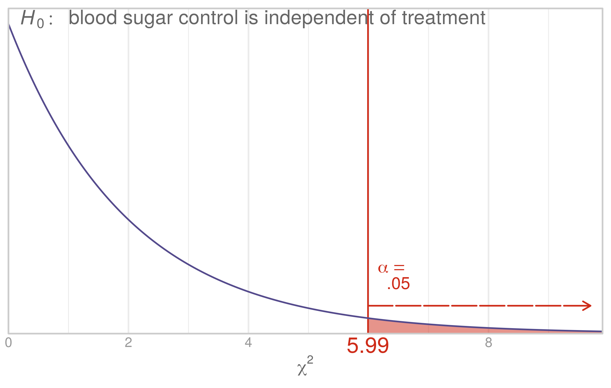

Chapter 14 Graphs
=================================================
This report creates the chapter graphs.

<!--  Set the working directory to the repository's base directory; this assumes the report is nested inside of only one directory.-->


<!-- Set the report-wide options, and point to the external code file. -->

<!-- Load the packages.  Suppress the output when loading packages. --> 


<!-- Load any Global functions and variables declared in the R file.  Suppress the output. --> 


<!-- Declare any global functions specific to a Rmd output.  Suppress the output. --> 


<!-- Load the datasets. -->


<!-- Tweak the datasets. -->


## Figure 14-2


## Figure 14-3
[Steve Zissou](https://www.google.com/search?q=Steve+Zissou&espv=210&es_sm=93&tbm=isch&imgil=2g2Hl0Xn1uLPnM%253A%253Bhttps%253A%252F%252Fencrypted-tbn3.gstatic.com%252Fimages%253Fq%253Dtbn%253AANd9GcSs7l-wrHy3iVFP-U3qGDXiVc4UuWY2AIJo0WbGRJ9tnpUINC-I%253B1024%253B768%253BpIGucwvka7NrpM%253Bhttp%25253A%25252F%25252Ffuckyeahstevezissou.tumblr.com%25252Fpost%25252F11494722427%25252Fgood-moms-dress-their-children-as-steve-zissou&source=iu&usg=__NDOX2CzOV_P7y2LbbNYt2oaZ4aE%3D&sa=X&ei=Y6FEU7PfAo-S2AWn_YDICg&ved=0CLUBEP4dMA0#facrc=_&imgdii=_&imgrc=2g2Hl0Xn1uLPnM%253A%3BpIGucwvka7NrpM%3Bhttp%253A%252F%252Fwww.movies-wallpapers.net%252FMovies%252FThe%252520Life%252520Aquatic%252520With%252520Steve%252520Zissou%252FThe%252520Life%252520Aquatic%252520With%252520Steve%252520Zissou-10.jpg%3Bhttp%253A%252F%252Ffuckyeahstevezissou.tumblr.com%252Fpost%252F11494722427%252Fgood-moms-dress-their-children-as-steve-zissou%3B1024%3B768)



## Figure 14-4


## Figure 14-6


## Figure 14-10


## Session Info
For the sake of documentation and reproducibility, the current report was build on a system using the following software.


```
Report created by wibeasley at 2017-04-01, 23:34 -0500
```

```
R version 3.3.3 (2017-03-06)
Platform: x86_64-pc-linux-gnu (64-bit)
Running under: Ubuntu 16.04.2 LTS

locale:
 [1] LC_CTYPE=en_US.UTF-8       LC_NUMERIC=C               LC_TIME=en_US.UTF-8        LC_COLLATE=en_US.UTF-8    
 [5] LC_MONETARY=en_US.UTF-8    LC_MESSAGES=en_US.UTF-8    LC_PAPER=en_US.UTF-8       LC_NAME=C                 
 [9] LC_ADDRESS=C               LC_TELEPHONE=C             LC_MEASUREMENT=en_US.UTF-8 LC_IDENTIFICATION=C       

attached base packages:
[1] grid      stats     graphics  grDevices utils     datasets  methods   base     

other attached packages:
[1] RColorBrewer_1.1-2 dichromat_2.0-0    extrafont_0.17     wesanderson_0.3.2  ggplot2_2.2.1      scales_0.4.1      
[7] plyr_1.8.4         knitr_1.15.1      

loaded via a namespace (and not attached):
 [1] Rcpp_0.12.10         Rttf2pt1_1.3.4       magrittr_1.5         munsell_0.4.3        colorspace_1.3-2    
 [6] stringr_1.2.0        tools_3.3.3          gtable_0.2.0         extrafontdb_1.0      htmltools_0.3.5     
[11] yaml_2.1.14          lazyeval_0.2.0       rprojroot_1.2        digest_0.6.12        tibble_1.3.0        
[16] evaluate_0.10        rmarkdown_1.4.0.9000 labeling_0.3         stringi_1.1.3        backports_1.0.5     
```

## License

<a rel="license" href="http://creativecommons.org/licenses/by/3.0/"></a><br />This work is licensed under a <a rel="license" href="http://creativecommons.org/licenses/by/3.0/">Creative Commons Attribution 3.0 Unported License</a>.
