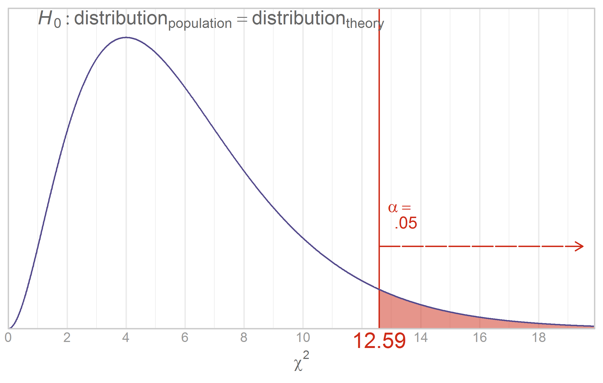
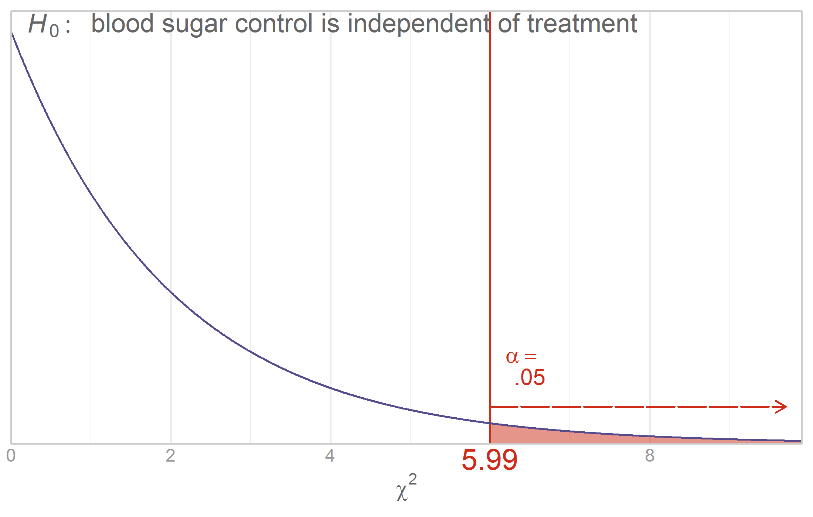

Chapter 14 Graphs
=================================================
This report creates the chapter graphs.

<!--  Set the working directory to the repository's base directory; this assumes the report is nested inside of only one directory.-->


<!-- Set the report-wide options, and point to the external code file. -->

<!-- Load the packages.  Suppress the output when loading packages. -->


<!-- Load any Global functions and variables declared in the R file.  Suppress the output. -->


<!-- Declare any global functions specific to a Rmd output.  Suppress the output. -->


<!-- Load the datasets. -->


<!-- Tweak the datasets. -->


## Figure 14-2


## Figure 14-3
[Steve Zissou](https://www.google.com/search?q=Steve+Zissou&espv=210&es_sm=93&tbm=isch&imgil=2g2Hl0Xn1uLPnM%253A%253Bhttps%253A%252F%252Fencrypted-tbn3.gstatic.com%252Fimages%253Fq%253Dtbn%253AANd9GcSs7l-wrHy3iVFP-U3qGDXiVc4UuWY2AIJo0WbGRJ9tnpUINC-I%253B1024%253B768%253BpIGucwvka7NrpM%253Bhttp%25253A%25252F%25252Ffuckyeahstevezissou.tumblr.com%25252Fpost%25252F11494722427%25252Fgood-moms-dress-their-children-as-steve-zissou&source=iu&usg=__NDOX2CzOV_P7y2LbbNYt2oaZ4aE%3D&sa=X&ei=Y6FEU7PfAo-S2AWn_YDICg&ved=0CLUBEP4dMA0#facrc=_&imgdii=_&imgrc=2g2Hl0Xn1uLPnM%253A%3BpIGucwvka7NrpM%3Bhttp%253A%252F%252Fwww.movies-wallpapers.net%252FMovies%252FThe%252520Life%252520Aquatic%252520With%252520Steve%252520Zissou%252FThe%252520Life%252520Aquatic%252520With%252520Steve%252520Zissou-10.jpg%3Bhttp%253A%252F%252Ffuckyeahstevezissou.tumblr.com%252Fpost%252F11494722427%252Fgood-moms-dress-their-children-as-steve-zissou%3B1024%3B768)


## Figure 14-4


## Figure 14-6


## Figure 14-10


<!-- The footer that's common to all reports. -->

## Session Information

For the sake of documentation and reproducibility, the current report was rendered in the following environment.  Click the line below to expand.

<details>
  <summary>Environment <span class="glyphicon glyphicon-plus-sign"></span></summary>

```
Session info -------------------------------------------------------------------
```

```
 setting  value                       
 version  R version 3.3.3 (2017-03-06)
 system   x86_64, linux-gnu           
 ui       RStudio (1.0.136)           
 language en_US                       
 collate  en_US.UTF-8                 
 tz       America/Chicago             
 date     2017-04-02                  
```

```
Packages -----------------------------------------------------------------------
```

```
 package      * version    date       source                            
 assertthat     0.1        2013-12-06 CRAN (R 3.3.0)                    
 backports      1.0.5      2017-01-18 CRAN (R 3.3.1)                    
 colorspace     1.3-2      2016-12-14 CRAN (R 3.3.1)                    
 DBI            0.6        2017-03-09 CRAN (R 3.3.1)                    
 devtools       1.12.0     2016-06-24 CRAN (R 3.3.1)                    
 dichromat      2.0-0      2013-01-24 CRAN (R 3.3.0)                    
 digest         0.6.12     2017-01-27 CRAN (R 3.3.1)                    
 dplyr          0.5.0      2016-06-24 CRAN (R 3.3.3)                    
 epade          0.3.8      2013-02-22 CRAN (R 3.3.3)                    
 evaluate       0.10       2016-10-11 CRAN (R 3.3.1)                    
 extrafont      0.17       2014-12-08 CRAN (R 3.3.0)                    
 extrafontdb    1.0        2012-06-11 CRAN (R 3.3.0)                    
 ggplot2      * 2.2.1      2016-12-30 CRAN (R 3.3.1)                    
 gridExtra      2.2.1      2016-02-29 CRAN (R 3.3.0)                    
 gtable         0.2.0      2016-02-26 CRAN (R 3.3.0)                    
 hms            0.3        2016-11-22 CRAN (R 3.3.1)                    
 htmltools      0.3.5      2016-03-21 CRAN (R 3.3.0)                    
 htmlwidgets    0.8        2016-11-09 CRAN (R 3.3.1)                    
 httpuv         1.3.3      2015-08-04 CRAN (R 3.3.0)                    
 jsonlite       1.3        2017-02-28 CRAN (R 3.3.1)                    
 knitr        * 1.15.1     2016-11-22 CRAN (R 3.3.1)                    
 labeling       0.3        2014-08-23 CRAN (R 3.3.0)                    
 lazyeval       0.2.0      2016-06-12 CRAN (R 3.3.0)                    
 magrittr     * 1.5        2014-11-22 CRAN (R 3.3.0)                    
 memoise        1.0.0      2016-01-29 CRAN (R 3.3.0)                    
 mime           0.5        2016-07-07 CRAN (R 3.3.1)                    
 munsell        0.4.3      2016-02-13 CRAN (R 3.3.0)                    
 plotrix        3.6-4      2016-12-30 CRAN (R 3.3.3)                    
 plyr           1.8.4      2016-06-08 CRAN (R 3.3.0)                    
 R6             2.2.0      2016-10-05 CRAN (R 3.3.1)                    
 RColorBrewer   1.1-2      2014-12-07 CRAN (R 3.3.0)                    
 Rcpp           0.12.10    2017-03-19 CRAN (R 3.3.1)                    
 readr          1.1.0      2017-03-22 CRAN (R 3.3.3)                    
 reshape2       1.4.2      2016-10-22 CRAN (R 3.3.1)                    
 rgl            0.98.1     2017-03-08 CRAN (R 3.3.1)                    
 rmarkdown      1.4.0.9000 2017-04-01 Github (rstudio/rmarkdown@5f7cd3c)
 rprojroot      1.2        2017-01-16 CRAN (R 3.3.1)                    
 rstudioapi     0.6        2016-06-27 CRAN (R 3.3.1)                    
 Rttf2pt1       1.3.4      2016-05-19 CRAN (R 3.3.0)                    
 scales         0.4.1      2016-11-09 CRAN (R 3.3.1)                    
 shiny          1.0.1      2017-04-01 CRAN (R 3.3.3)                    
 stringi        1.1.3      2017-03-21 CRAN (R 3.3.1)                    
 stringr        1.2.0      2017-02-18 CRAN (R 3.3.1)                    
 tibble         1.3.0      2017-04-01 CRAN (R 3.3.3)                    
 tidyr          0.6.1      2017-01-10 CRAN (R 3.3.1)                    
 wesanderson    0.3.2      2015-01-22 CRAN (R 3.3.3)                    
 withr          1.0.2      2016-06-20 CRAN (R 3.3.0)                    
 xtable         1.8-2      2016-02-05 CRAN (R 3.3.0)                    
 yaml           2.1.14     2016-11-12 CRAN (R 3.3.1)                    
```
</details>


Report rendered by wibeasley at 2017-04-02, 16:35 -0500 in 7 seconds.


## License

<a rel="license" href="http://creativecommons.org/licenses/by/3.0/"></a><br />This work is licensed under a <a rel="license" href="http://creativecommons.org/licenses/by/3.0/">Creative Commons Attribution 3.0 Unported License</a>.
