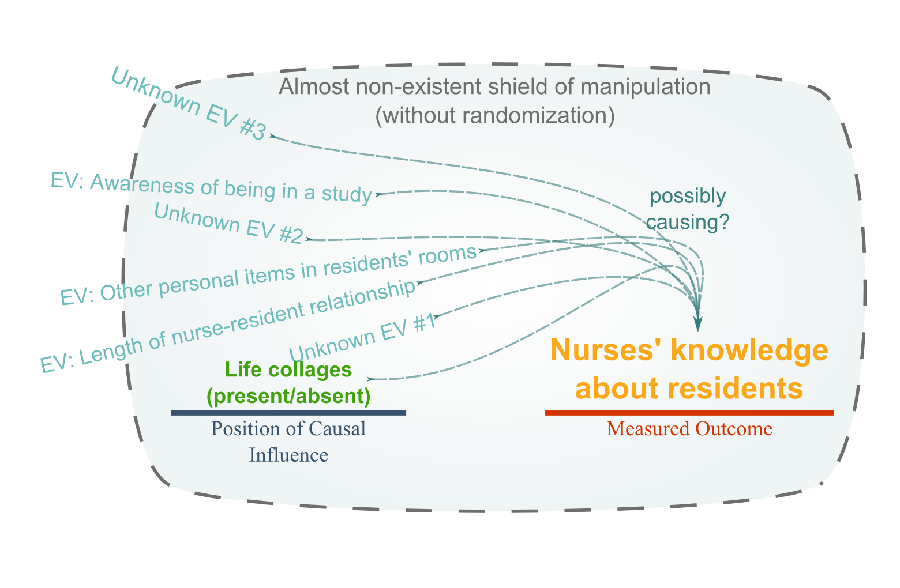
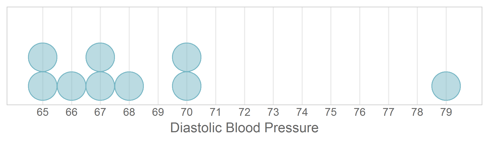
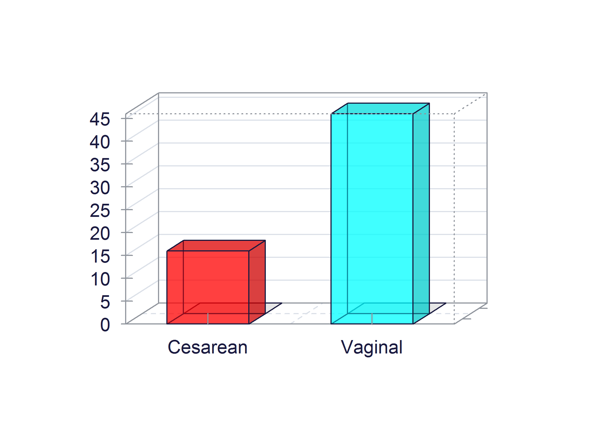
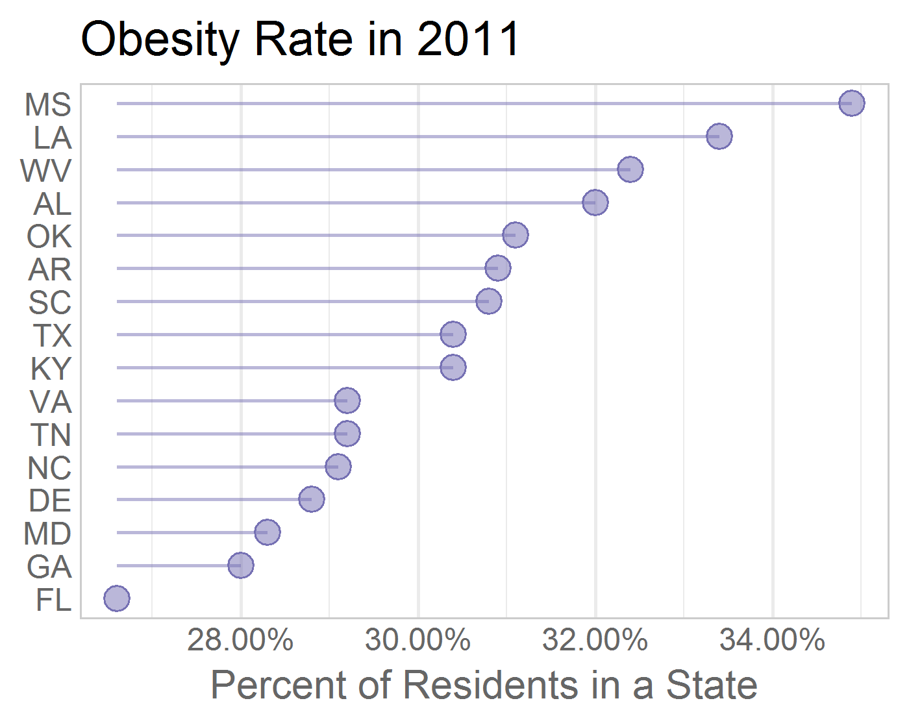

---
output:
  html_document:
    keep_md: yes
---

All Figures in Book
=================================================
This report displays all images in all chapters.

<!--  Set the working directory to the repository's base directory; this assumes the report is nested inside of only one directory.-->


<!-- Set the report-wide options, and point to the external code file. -->

<!-- Load the packages.  Suppress the output when loading packages. -->


<!-- Load any Global functions and variables declared in the R file.  Suppress the output. -->


<!-- Declare any global functions specific to a Rmd output.  Suppress the output. -->


<!-- Load the datasets.   -->

```
# A tibble: 20 x 5
   file        caption   path_local      path_remote           link            
   <chr>       <chr>     <chr>           <chr>                 <chr>           
 1 chapter-01… figure-0… ../chapter-01/… https://github.com/O… "<a href=\"http…
 2 chapter-01… figure-0… ../chapter-01/… https://github.com/O… "<a href=\"http…
 3 chapter-01… figure-0… ../chapter-01/… https://github.com/O… "<a href=\"http…
 4 chapter-01… figure-0… ../chapter-01/… https://github.com/O… "<a href=\"http…
 5 chapter-01… figure-0… ../chapter-01/… https://github.com/O… "<a href=\"http…
 6 chapter-02… figure-0… ../chapter-02/… https://github.com/O… "<a href=\"http…
 7 chapter-02… figure-0… ../chapter-02/… https://github.com/O… "<a href=\"http…
 8 chapter-02… figure-0… ../chapter-02/… https://github.com/O… "<a href=\"http…
 9 chapter-03… figure-0… ../chapter-03/… https://github.com/O… "<a href=\"http…
10 chapter-03… figure-0… ../chapter-03/… https://github.com/O… "<a href=\"http…
11 chapter-03… figure-0… ../chapter-03/… https://github.com/O… "<a href=\"http…
12 chapter-03… figure-0… ../chapter-03/… https://github.com/O… "<a href=\"http…
13 chapter-03… figure-0… ../chapter-03/… https://github.com/O… "<a href=\"http…
14 chapter-03… figure-0… ../chapter-03/… https://github.com/O… "<a href=\"http…
15 chapter-03… figure-0… ../chapter-03/… https://github.com/O… "<a href=\"http…
16 chapter-03… figure-0… ../chapter-03/… https://github.com/O… "<a href=\"http…
17 chapter-03… figure-0… ../chapter-03/… https://github.com/O… "<a href=\"http…
18 chapter-03… figure-0… ../chapter-03/… https://github.com/O… "<a href=\"http…
19 chapter-03… figure-0… ../chapter-03/… https://github.com/O… "<a href=\"http…
20 chapter-03… figure-0… ../chapter-03/… https://github.com/O… "<a href=\"http…
```

<!-- Tweak the datasets.   -->


<a href="https://github.com/OuhscBbmc/DeSheaToothakerIntroStats/blob/master/chapter-01/figure-01-01.png"></a>
<a href="https://github.com/OuhscBbmc/DeSheaToothakerIntroStats/blob/master/chapter-01/figure-01-02.png"></a>
<a href="https://github.com/OuhscBbmc/DeSheaToothakerIntroStats/blob/master/chapter-01/figure-01-03.png"></a>
<a href="https://github.com/OuhscBbmc/DeSheaToothakerIntroStats/blob/master/chapter-01/figure-01-04.png"></a>
<a href="https://github.com/OuhscBbmc/DeSheaToothakerIntroStats/blob/master/chapter-01/figure-01-05.png"></a>
<a href="https://github.com/OuhscBbmc/DeSheaToothakerIntroStats/blob/master/chapter-02/figure-png/figure-02-01-1.png"></a>
<a href="https://github.com/OuhscBbmc/DeSheaToothakerIntroStats/blob/master/chapter-02/figure-png/figure-02-02-1.png"></a>
<a href="https://github.com/OuhscBbmc/DeSheaToothakerIntroStats/blob/master/chapter-02/figure-png/figure-02-03-1.png"></a>
<a href="https://github.com/OuhscBbmc/DeSheaToothakerIntroStats/blob/master/chapter-03/figure-png/figure-03-01-1.png"></a>
<a href="https://github.com/OuhscBbmc/DeSheaToothakerIntroStats/blob/master/chapter-03/figure-png/figure-03-02-1.png"></a>
<a href="https://github.com/OuhscBbmc/DeSheaToothakerIntroStats/blob/master/chapter-03/figure-png/figure-03-03-1.png"></a>
<a href="https://github.com/OuhscBbmc/DeSheaToothakerIntroStats/blob/master/chapter-03/figure-png/figure-03-04-1.png"></a>
<a href="https://github.com/OuhscBbmc/DeSheaToothakerIntroStats/blob/master/chapter-03/figure-png/figure-03-05-1.png"></a>
<a href="https://github.com/OuhscBbmc/DeSheaToothakerIntroStats/blob/master/chapter-03/figure-png/figure-03-07-1.png"></a>
<a href="https://github.com/OuhscBbmc/DeSheaToothakerIntroStats/blob/master/chapter-03/figure-png/figure-03-08-1.png"></a>

<!-- The footer that's common to all reports. -->

## Session Information

For the sake of documentation and reproducibility, the current report was rendered in the following environment.  Click the line below to expand.

<details>
  <summary>Environment <span class="glyphicon glyphicon-plus-sign"></span></summary>

```
Session info ------------------------------------------------------------------
```

```
 setting  value                       
 version  R version 3.5.1 (2018-07-02)
 system   x86_64, linux-gnu           
 ui       X11                         
 language (EN)                        
 collate  en_US.UTF-8                 
 tz       America/Chicago             
 date     2018-08-24                  
```

```
Packages ----------------------------------------------------------------------
```

```
 package    * version date       source        
 assertthat   0.2.0   2017-04-11 CRAN (R 3.5.1)
 backports    1.1.2   2017-12-13 CRAN (R 3.5.1)
 base       * 3.5.1   2018-07-03 local         
 bindr        0.1.1   2018-03-13 CRAN (R 3.5.1)
 bindrcpp   * 0.2.2   2018-03-29 CRAN (R 3.5.1)
 cli          1.0.0   2017-11-05 CRAN (R 3.5.1)
 compiler     3.5.1   2018-07-03 local         
 crayon       1.3.4   2017-09-16 CRAN (R 3.5.1)
 datasets   * 3.5.1   2018-07-03 local         
 devtools     1.13.6  2018-06-27 CRAN (R 3.5.1)
 digest       0.6.16  2018-08-22 CRAN (R 3.5.1)
 dplyr        0.7.6   2018-06-29 CRAN (R 3.5.1)
 evaluate     0.11    2018-07-17 CRAN (R 3.5.1)
 fansi        0.3.0   2018-08-13 CRAN (R 3.5.1)
 glue         1.3.0   2018-07-17 CRAN (R 3.5.1)
 graphics   * 3.5.1   2018-07-03 local         
 grDevices  * 3.5.1   2018-07-03 local         
 htmltools    0.3.6   2017-04-28 CRAN (R 3.5.1)
 knitr      * 1.20    2018-02-20 CRAN (R 3.5.1)
 magrittr   * 1.5     2014-11-22 CRAN (R 3.5.1)
 memoise      1.1.0   2017-04-21 CRAN (R 3.5.1)
 methods    * 3.5.1   2018-07-03 local         
 pillar       1.3.0   2018-07-14 CRAN (R 3.5.1)
 pkgconfig    2.0.2   2018-08-16 CRAN (R 3.5.1)
 purrr        0.2.5   2018-05-29 CRAN (R 3.5.1)
 R6           2.2.2   2017-06-17 CRAN (R 3.5.1)
 Rcpp         0.12.18 2018-07-23 CRAN (R 3.5.1)
 rlang        0.2.2   2018-08-16 CRAN (R 3.5.1)
 rmarkdown    1.10    2018-06-11 CRAN (R 3.5.1)
 rprojroot    1.3-2   2018-01-03 CRAN (R 3.5.1)
 stats      * 3.5.1   2018-07-03 local         
 stringi      1.2.4   2018-07-20 CRAN (R 3.5.1)
 stringr      1.3.1   2018-05-10 CRAN (R 3.5.1)
 tibble       1.4.2   2018-01-22 CRAN (R 3.5.1)
 tidyselect   0.2.4   2018-02-26 CRAN (R 3.5.1)
 tools        3.5.1   2018-07-03 local         
 utf8         1.1.4   2018-05-24 CRAN (R 3.5.1)
 utils      * 3.5.1   2018-07-03 local         
 withr        2.1.2   2018-03-15 CRAN (R 3.5.1)
 yaml         2.2.0   2018-07-25 CRAN (R 3.5.1)
```
</details>


Report rendered by wibeasley at 2018-08-24, 21:36 -0500 in 2 seconds.


## License

<!--
<a rel="license" href="http://creativecommons.org/licenses/by/3.0/"></a><br />This work is licensed under a <a rel="license" href="http://creativecommons.org/licenses/by/3.0/">Creative Commons Attribution 3.0 Unported License</a>.
-->
