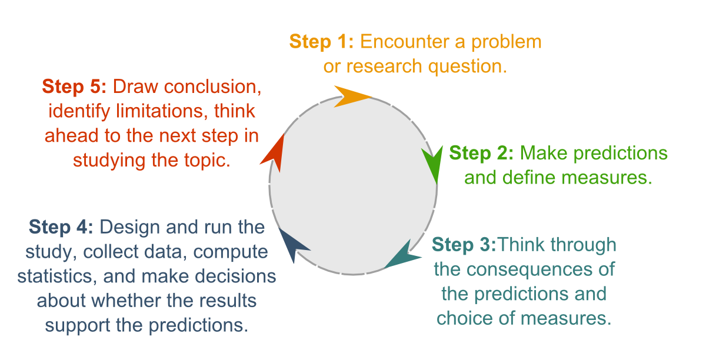
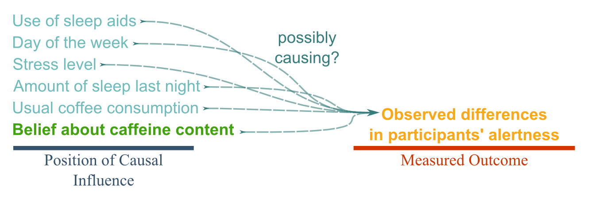
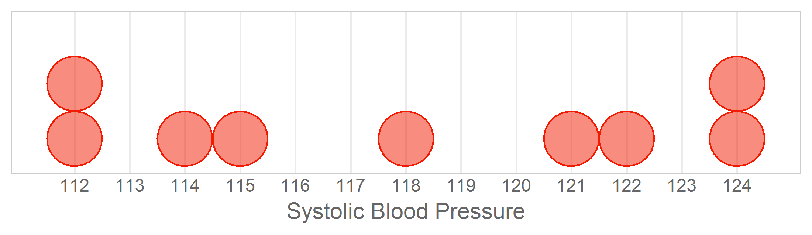
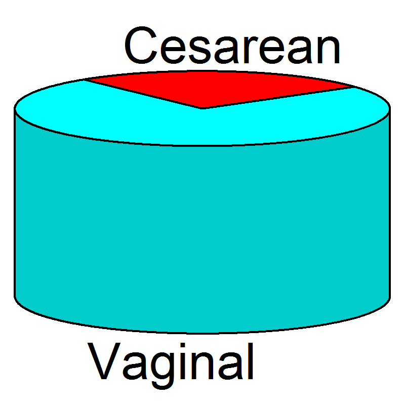

---
output:
  html_document:
    keep_md: yes
---

All Figures in Book
=================================================
This report displays all images in all chapters.

<!--  Set the working directory to the repository's base directory; this assumes the report is nested inside of only one directory.-->


<!-- Set the report-wide options, and point to the external code file. -->

<!-- Load the packages.  Suppress the output when loading packages. -->


<!-- Load any Global functions and variables declared in the R file.  Suppress the output. -->


<!-- Declare any global functions specific to a Rmd output.  Suppress the output. -->


<!-- Load the datasets.   -->


<!-- Tweak the datasets.   -->













<!-- The footer that's common to all reports. -->

## Session Information

For the sake of documentation and reproducibility, the current report was rendered in the following environment.  Click the line below to expand.

<details>
  <summary>Environment <span class="glyphicon glyphicon-plus-sign"></span></summary>

```
Session info ------------------------------------------------------------------
```

```
 setting  value                       
 version  R version 3.5.1 (2018-07-02)
 system   x86_64, linux-gnu           
 ui       X11                         
 language (EN)                        
 collate  en_US.UTF-8                 
 tz       America/Chicago             
 date     2018-08-23                  
```

```
Packages ----------------------------------------------------------------------
```

```
 package   * version date       source        
 backports   1.1.2   2017-12-13 CRAN (R 3.5.1)
 base      * 3.5.1   2018-07-03 local         
 compiler    3.5.1   2018-07-03 local         
 datasets  * 3.5.1   2018-07-03 local         
 devtools    1.13.6  2018-06-27 CRAN (R 3.5.1)
 digest      0.6.16  2018-08-22 CRAN (R 3.5.1)
 evaluate    0.11    2018-07-17 CRAN (R 3.5.1)
 graphics  * 3.5.1   2018-07-03 local         
 grDevices * 3.5.1   2018-07-03 local         
 htmltools   0.3.6   2017-04-28 CRAN (R 3.5.1)
 knitr     * 1.20    2018-02-20 CRAN (R 3.5.1)
 magrittr  * 1.5     2014-11-22 CRAN (R 3.5.1)
 memoise     1.1.0   2017-04-21 CRAN (R 3.5.1)
 methods   * 3.5.1   2018-07-03 local         
 purrr       0.2.5   2018-05-29 CRAN (R 3.5.1)
 Rcpp        0.12.18 2018-07-23 CRAN (R 3.5.1)
 rlang       0.2.2   2018-08-16 CRAN (R 3.5.1)
 rmarkdown   1.10    2018-06-11 CRAN (R 3.5.1)
 rprojroot   1.3-2   2018-01-03 CRAN (R 3.5.1)
 stats     * 3.5.1   2018-07-03 local         
 stringi     1.2.4   2018-07-20 CRAN (R 3.5.1)
 stringr     1.3.1   2018-05-10 CRAN (R 3.5.1)
 tools       3.5.1   2018-07-03 local         
 utils     * 3.5.1   2018-07-03 local         
 withr       2.1.2   2018-03-15 CRAN (R 3.5.1)
 yaml        2.2.0   2018-07-25 CRAN (R 3.5.1)
```
</details>


Report rendered by wibeasley at 2018-08-23, 22:08 -0500 in 1 seconds.


## License

<!--
<a rel="license" href="http://creativecommons.org/licenses/by/3.0/"></a><br />This work is licensed under a <a rel="license" href="http://creativecommons.org/licenses/by/3.0/">Creative Commons Attribution 3.0 Unported License</a>.
-->
